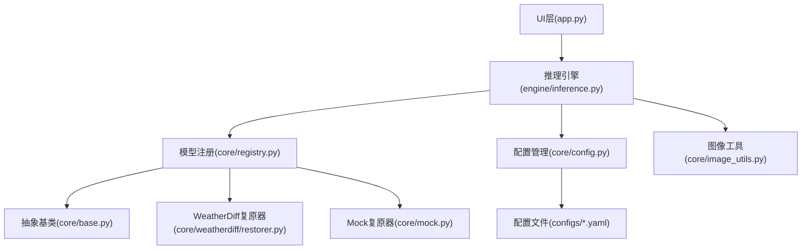
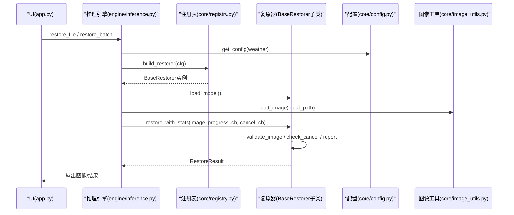
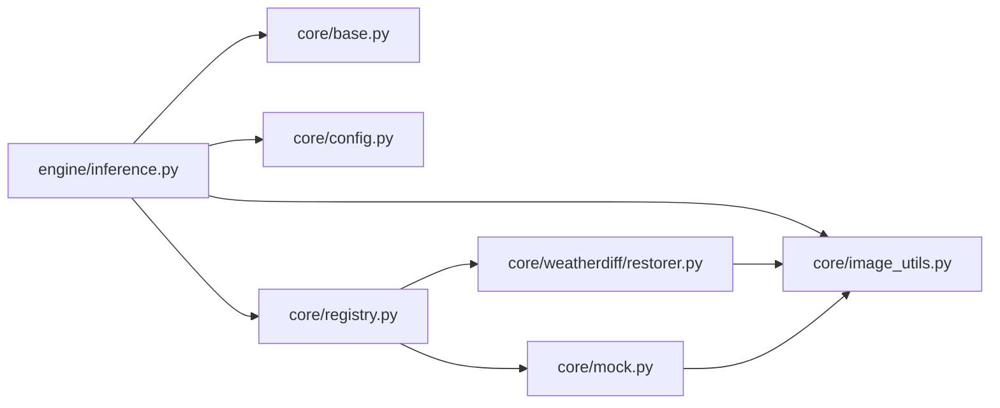

# API参考

<cite>
**本文引用的文件**
- [core/base.py](file://core/base.py)
- [core/config.py](file://core/config.py)
- [core/registry.py](file://core/registry.py)
- [engine/inference.py](file://engine/inference.py)
- [core/weatherdiff/restorer.py](file://core/weatherdiff/restorer.py)
- [core/mock.py](file://core/mock.py)
- [core/image_utils.py](file://core/image_utils.py)
- [configs/allweather.yaml](file://configs/allweather.yaml)
- [app.py](file://app.py)
</cite>

## 目录
1. [简介](#简介)
2. [项目结构](#项目结构)
3. [核心组件](#核心组件)
4. [架构总览](#架构总览)
5. [详细组件分析](#详细组件分析)
6. [依赖关系分析](#依赖关系分析)
7. [性能注意事项](#性能注意事项)
8. [故障排查指南](#故障排查指南)
9. [结论](#结论)
10. [附录：配置与迁移](#附录：配置与迁移)

## 简介
本API参考面向“基于扩散模型的恶劣天气复原”系统，覆盖以下公共能力：
- BaseRestorer抽象类接口契约（必需实现与可选重写）
- 模型注册机制（装饰器与自定义模型注册）
- 配置管理（加载、参数访问、环境检测）
- 推理引擎（单图、文件、批量处理；权重缓存）
- WeatherDiffusion与Mock复原器的具体实现要点
- 图像工具（IO、预处理/后处理、尺寸对齐）
- 版本兼容性与迁移建议

该文档以代码为依据，提供参数说明、返回值类型、异常处理与使用示例路径，帮助快速集成与扩展。

## 项目结构
- core：核心抽象与实现（BaseRestorer、配置、注册表、图像工具、WeatherDiffusion与Mock复原器）
- engine：推理编排（ModelCache、restore_array/file/batch）
- configs：各天气/统一模型的YAML配置
- ui：PyQt界面（通过app.py启动）
- scripts：权重下载、评测等脚本
- weights：模型权重存放目录

图表来源
- [app.py:19-32](file://app.py#L19-L32)
- [engine/inference.py:22-68](file://engine/inference.py#L22-L68)
- [core/registry.py:29-84](file://core/registry.py#L29-L84)
- [core/config.py:25-98](file://core/config.py#L25-L98)
- [core/base.py:61-185](file://core/base.py#L61-L185)
- [core/weatherdiff/restorer.py:32-167](file://core/weatherdiff/restorer.py#L32-L167)
- [core/mock.py:27-81](file://core/mock.py#L27-L81)
- [core/image_utils.py:22-167](file://core/image_utils.py#L22-L167)
- [configs/allweather.yaml:1-47](file://configs/allweather.yaml#L1-L47)

章节来源
- [app.py:19-32](file://app.py#L19-L32)
- [engine/inference.py:22-68](file://engine/inference.py#L22-L68)
- [core/registry.py:29-84](file://core/registry.py#L29-L84)
- [core/config.py:25-98](file://core/config.py#L25-L98)
- [core/base.py:61-185](file://core/base.py#L61-L185)
- [core/weatherdiff/restorer.py:32-167](file://core/weatherdiff/restorer.py#L32-L167)
- [core/mock.py:27-81](file://core/mock.py#L27-L81)
- [core/image_utils.py:22-167](file://core/image_utils.py#L22-L167)
- [configs/allweather.yaml:1-47](file://configs/allweather.yaml#L1-L47)

## 核心组件
- BaseRestorer：统一复原接口契约，定义load_model、restore及通用能力（计时、校验、进度上报、取消）。
- ModelCache：按配置名缓存已加载的复原器实例，避免重复加载权重。
- Registry：按restorer字段动态构造复原器，支持延迟导入与环境降级。
- Config：加载YAML配置，解析相对路径为绝对路径，提供显示名与权重路径查询。
- ImageUtils：图像IO、尺寸限制、对齐、填充、还原、简单滤波等。
- WeatherDiffRestorer：基于patch的条件扩散模型复原器，含设备选择、权重加载、采样、显存自适应。
- MockRestorer：无需torch/GPU的假模型，模拟逐步去噪过程，便于联调。

章节来源
- [core/base.py:61-185](file://core/base.py#L61-L185)
- [engine/inference.py:22-68](file://engine/inference.py#L22-L68)
- [core/registry.py:29-84](file://core/registry.py#L29-L84)
- [core/config.py:25-98](file://core/config.py#L25-L98)
- [core/image_utils.py:22-167](file://core/image_utils.py#L22-L167)
- [core/weatherdiff/restorer.py:32-167](file://core/weatherdiff/restorer.py#L32-L167)
- [core/mock.py:27-81](file://core/mock.py#L27-L81)

## 架构总览
下图展示从UI到推理再到模型实现的调用链与数据流。

图表来源
- [app.py:19-32](file://app.py#L19-L32)
- [engine/inference.py:70-132](file://engine/inference.py#L70-L132)
- [core/registry.py:68-84](file://core/registry.py#L68-L84)
- [core/config.py:77-98](file://core/config.py#L77-L98)
- [core/base.py:111-185](file://core/base.py#L111-L185)
- [core/image_utils.py:22-33](file://core/image_utils.py#L22-L33)

## 详细组件分析

### BaseRestorer抽象类（统一复原接口）
- 必需实现
  - load_model(): 加载权重并设置self.loaded=True；缺失权重抛WeightNotFoundError。
  - restore(image, progress_cb=None, cancel_cb=None): 对单张RGB uint8 (H,W,3)做复原，返回同尺寸RGB uint8；可能抛RestoreCancelled。
- 可选重写
  - unload(): 释放资源（默认仅置loaded=False）。
  - default_steps: 用于UI进度条预估步数（默认取自配置sampling.timesteps）。
- 通用能力
  - restore_with_stats(image, progress_cb=None, cancel_cb=None): 统一入口，自动计时、校验输入输出尺寸，返回RestoreResult。
  - validate_image(image, name="输入图像"): 校验numpy数组类型、通道、dtype。
  - check_cancel(cancel_cb): 循环中定期调用，若需取消则抛RestoreCancelled。
  - report(progress_cb, step, total, preview=None): 安全上报进度，回调异常不中断主流程。
- 数据结构
  - RestoreResult: image(复原图), elapsed(耗时), steps(采样步数), device(设备), restorer(模型标识), extra(额外信息)。

使用示例路径
- 直接调用：[engine/inference.py:70-77](file://engine/inference.py#L70-L77)
- 带统计封装：[core/base.py:111-138](file://core/base.py#L111-L138)

章节来源
- [core/base.py:37-185](file://core/base.py#L37-L185)

### 模型注册机制（装饰器与自定义注册）
- 内置实现
  - mock: core.mock.MockRestorer
  - weatherdiff: core.weatherdiff.restorer.WeatherDiffRestorer
  - dcp: core.baseline.dcp.DCPRestorer（由注册表声明，未在此处展开）
- 装饰器
  - @register_restorer(name): 将继承BaseRestorer的类登记到注册表，并设置cls.name=name。
- 构建器
  - build_restorer(config): 根据config["restorer"]动态加载对应模块并构造实例；支持AWR_MOCK=1强制降级为mock。
- 可用列表
  - available_restorers(): 返回已注册与可延迟加载的restorer名称集合。

使用示例路径
- 装饰器用法：[core/weatherdiff/restorer.py:32-33](file://core/weatherdiff/restorer.py#L32-L33)
- 构建器：[core/registry.py:68-84](file://core/registry.py#L68-L84)

章节来源
- [core/registry.py:18-84](file://core/registry.py#L18-L84)
- [core/weatherdiff/restorer.py:32-33](file://core/weatherdiff/restorer.py#L32-L33)

### 配置管理API
- 加载配置
  - load_config(path): 支持相对/绝对路径，自动解析weights.path为abs_path，注入_config_path。
  - get_config(weather): 快捷获取指定天气配置。
  - list_weather_configs(): 列出所有可用配置（按WEATHER_ORDER排序）。
- 参数访问
  - config_display_name(cfg): 取display_name或name。
  - weight_path(cfg): 取权重绝对路径（DCP等无权重场景返回None）。
- 环境检测
  - ensure_dir(path): 确保目录存在。
  - PROJECT_ROOT/CONFIG_DIR/WEIGHTS_DIR/DATA_DIR/OUTPUT_DIR：全局路径常量。
- 环境变量
  - AWR_DEVICE: 强制设备（如"cpu"/"cuda"）。
  - AWR_MOCK: 强制使用MockRestorer进行降级测试。

使用示例路径
- 加载与路径解析：[core/config.py:25-57](file://core/config.py#L25-L57)
- 快捷获取与显示名：[core/config.py:77-83](file://core/config.py#L77-L83)
- 权重路径：[core/config.py:86-91](file://core/config.py#L86-L91)

章节来源
- [core/config.py:14-98](file://core/config.py#L14-L98)

### 推理引擎API
- ModelCache
  - get(weather, overrides=None): 按配置名获取已加载复原器；支持运行时参数覆盖（如timesteps），不重新加载权重。
  - release_others(keep_weather=None): 释放其他缓存，控制显存。
  - clear(): 清空全部缓存。
- 单图/文件/批量
  - restore_array(restorer, image, ...): 内存图复原，返回RestoreResult。
  - restore_file(restorer, input_path, output_path=None, ...): 文件复原，返回(原始图, RestoreResult)，可选保存输出。
  - restore_batch(restorer, files, output_dir=None, on_item=None, cancel_cb=None, step_cb=None): 批量复原，逐图回调，失败不中断整批。
- 内部合并
  - _deep_update(base, patch): 递归合并配置字典。

使用示例路径
- 缓存与构建：[engine/inference.py:22-68](file://engine/inference.py#L22-L68)
- 单图/文件/批量：[engine/inference.py:70-132](file://engine/inference.py#L70-L132)

章节来源
- [engine/inference.py:22-143](file://engine/inference.py#L22-L143)

### WeatherDiffusion复原器API
- 关键方法
  - load_model(): 选择设备、加载权重、处理EMA、初始化betas。
  - restore(image, progress_cb=None, cancel_cb=None): 预处理→分块采样→后处理→还原尺寸。
  - unload(): 释放模型与显存。
- 配置项
  - data.image_size: 补丁大小（默认64）。
  - data.max_side: 长边限制（默认1024）。
  - data.size_multiple: 尺寸倍数（默认16）。
  - sampling.timesteps: 采样步数（默认25）。
  - sampling.grid_r: 网格分辨率（默认16）。
  - sampling.patch_batch_size: 补丁批次大小（默认32，显存不足自动减半重试）。
  - sampling.seed: 随机种子。
  - diffusion.*: beta调度相关。
  - model.ema: 是否应用EMA权重。
- 异常与健壮性
  - 权重缺失：抛WeightNotFoundError。
  - 显存不足：捕获RuntimeError并降低patch_batch_size重试。
  - 预览失败：不影响主流程。

使用示例路径
- 加载与采样：[core/weatherdiff/restorer.py:47-167](file://core/weatherdiff/restorer.py#L47-L167)

章节来源
- [core/weatherdiff/restorer.py:32-167](file://core/weatherdiff/restorer.py#L32-L167)

### Mock复原器API
- 行为
  - 无需torch/GPU，纯numpy模拟逐步去噪。
  - 支持step_delay与timesteps，每步上报预览，便于UI动画。
- 配置项
  - mock.load_delay: 模拟加载延迟。
  - mock.step_delay: 每步延迟。
  - sampling.timesteps: 模拟步数。

使用示例路径
- 模拟复原与进度：[core/mock.py:33-81](file://core/mock.py#L33-L81)

章节来源
- [core/mock.py:27-81](file://core/mock.py#L27-L81)

### 图像工具API
- IO
  - load_image(path): 读取为RGB uint8 (H,W,3)。
  - save_image(path, image): 保存并创建父目录。
  - list_images(dir, recursive=False): 列出图片。
  - match_pairs(input_dir, gt_dir=None, recursive=False): 配对退化图与GT。
- 类型与尺寸
  - to_uint8(image): 安全转uint8。
  - to_float01(image): 转float [0,1]。
  - resize(image, size): 缩放。
  - limit_long_side(image, max_side): 长边限制。
  - resize_to_multiple(image, multiple): 对齐到倍数（默认16）。
  - pad_to_min_size(image, min_size): 反射填充至最小尺寸。
  - preprocess_for_model(image, max_side=1024, size_multiple=16, min_size=0): 统一预处理，返回(处理后, 原始尺寸)。
  - postprocess_to_origin(image, orig_hw): 还原到原始尺寸。
- 简单滤波
  - box_filter(image, radius): 均值滤波。
  - unsharp_mask(image, radius=2, amount=0.6): USM锐化。
  - side_by_side(left, right, gap=8): 拼接对比图。
  - make_demo_image(size=(256,256), seed=0): 生成合成雨纹图。

使用示例路径
- 预处理/后处理：[core/image_utils.py:145-167](file://core/image_utils.py#L145-L167)
- 读写与配对：[core/image_utils.py:22-78](file://core/image_utils.py#L22-L78)

章节来源
- [core/image_utils.py:22-253](file://core/image_utils.py#L22-L253)

## 依赖关系分析
- 耦合关系
  - engine/inference.py 依赖 core.base、core.config、core.registry、core.image_utils。
  - core.weatherdiff.restorer 依赖 core.base、core.config、core.image_utils、core.registry、以及自身sampling/unet。
  - core.mock 依赖 core.base、core.image_utils、core.registry。
- 外部依赖
  - PyTorch（仅在weatherdiff需要时导入）。
  - Pillow（图像IO）。
  - PyYAML（配置加载）。
  - PyQt5（UI，可选）。

图表来源
- [engine/inference.py:14-19](file://engine/inference.py#L14-L19)
- [core/registry.py:16-26](file://core/registry.py#L16-L26)
- [core/weatherdiff/restorer.py:24-29](file://core/weatherdiff/restorer.py#L24-L29)
- [core/mock.py:22-24](file://core/mock.py#L22-L24)

章节来源
- [engine/inference.py:14-19](file://engine/inference.py#L14-L19)
- [core/registry.py:16-26](file://core/registry.py#L16-L26)
- [core/weatherdiff/restorer.py:24-29](file://core/weatherdiff/restorer.py#L24-L29)
- [core/mock.py:22-24](file://core/mock.py#L22-L24)

## 性能注意事项
- 显存自适应：WeatherDiffRestorer在显存不足时自动降低patch_batch_size并重试，避免崩溃。
- 权重缓存：ModelCache按配置名缓存实例，切换天气不重复加载权重，减少I/O与显存占用。
- 预处理优化：limit_long_side与resize_to_multiple控制输入尺寸，减少计算量。
- 进度与取消：progress_cb与cancel_cb保证长时间任务的可控性与响应性。
- 设备选择：AWR_DEVICE可强制CPU/CUDA；若无GPU则自动回退到CPU。

章节来源
- [core/weatherdiff/restorer.py:137-161](file://core/weatherdiff/restorer.py#L137-L161)
- [engine/inference.py:22-68](file://engine/inference.py#L22-L68)
- [core/image_utils.py:109-160](file://core/image_utils.py#L109-L160)
- [core/base.py:163-181](file://core/base.py#L163-L181)

## 故障排查指南
- 找不到权重
  - 现象：WeightNotFoundError。
  - 处理：执行scripts/download_weights.py或手动放置权重，检查configs中的weights.path。
  - 参考：[core/weatherdiff/restorer.py:50-56](file://core/weatherdiff/restorer.py#L50-L56)
- 缺少依赖
  - PyTorch缺失：提示安装或设置AWR_MOCK=1使用Mock。
  - PyYAML缺失：安装pyyaml。
  - PyQt5缺失：安装PyQt5以运行UI。
  - 参考：[core/weatherdiff/restorer.py:192-202](file://core/weatherdiff/restorer.py#L192-L202)、[core/config.py:9-12](file://core/config.py#L9-L12)、[app.py:21-24](file://app.py#L21-L24)
- 输出尺寸不一致
  - 现象：ValueError提示输出与输入尺寸不一致。
  - 处理：确保restore内部恢复到原始尺寸，或使用preprocess/postprocess成对调用。
  - 参考：[core/base.py:126-131](file://core/base.py#L126-L131)、[core/image_utils.py:145-167](file://core/image_utils.py#L145-L167)
- 用户取消
  - 现象：RestoreCancelled。
  - 处理：UI捕获后提示“已取消”，不视为错误。
  - 参考：[core/base.py:37-39](file://core/base.py#L37-L39)、[core/base.py:163-166](file://core/base.py#L163-L166)

章节来源
- [core/weatherdiff/restorer.py:50-56](file://core/weatherdiff/restorer.py#L50-L56)
- [core/weatherdiff/restorer.py:192-202](file://core/weatherdiff/restorer.py#L192-L202)
- [core/config.py:9-12](file://core/config.py#L9-L12)
- [app.py:21-24](file://app.py#L21-L24)
- [core/base.py:126-131](file://core/base.py#L126-L131)
- [core/base.py:37-39](file://core/base.py#L37-L39)
- [core/base.py:163-166](file://core/base.py#L163-L166)

## 结论
本API参考提供了统一的复原接口、灵活的模型注册、健壮的推理编排与完善的配置/图像工具。通过BaseRestorer契约，可无缝替换不同复原器；通过ModelCache与配置管理，提升性能与易用性；通过WeatherDiffRestorer与MockRestorer，兼顾真实效果与开发效率。建议在集成时优先使用engine/inference的高层API，并通过配置驱动模型行为。

## 附录：配置与迁移

### 配置概览（allweather示例）
- restorer: weatherdiff
- weights.path: 权重路径（相对或绝对）
- data.image_size/size_multiple/max_side: 控制补丁与输入尺寸
- sampling.timesteps/grid_r/eta/patch_batch_size/seed: 采样与控制参数
- model.ema: 是否应用EMA权重
- diffusion.*: beta调度参数

使用示例路径
- 配置结构：[configs/allweather.yaml:1-47](file://configs/allweather.yaml#L1-L47)
- 加载与路径解析：[core/config.py:25-57](file://core/config.py#L25-L57)

章节来源
- [configs/allweather.yaml:1-47](file://configs/allweather.yaml#L1-L47)
- [core/config.py:25-57](file://core/config.py#L25-L57)

### 版本兼容性与迁移指南
- 向后兼容
  - BaseRestorer签名保持稳定；修改需团队同步确认。
  - 权重格式兼容state_dict、model、net、params键，也兼容旧版list结构。
  - 支持module.前缀剥离，兼容DataParallel训练权重。
- 迁移建议
  - 新增自定义复原器：继承BaseRestorer，实现load_model与restore，并用@register_restorer("your_name")注册。
  - 切换模型：修改configs/*.yaml中的restorer字段，或通过build_restorer传入不同配置。
  - 降级测试：设置AWR_MOCK=1，无需权重/GPU即可验证UI与流程。
  - 设备切换：设置AWR_DEVICE=cpu或cuda，或在代码中通过device属性控制。
- 常见变更
  - 若升级采样或预处理参数，请确保postprocess_to_origin正确还原尺寸，避免输出尺寸不一致。
  - 若更换权重格式，请确认extract_state_dict能正确解析新结构。

使用示例路径
- 权重格式兼容：[core/weatherdiff/restorer.py:212-227](file://core/weatherdiff/restorer.py#L212-L227)
- 设备与环境：[core/weatherdiff/restorer.py:204-209](file://core/weatherdiff/restorer.py#L204-L209)
- 降级开关：[core/registry.py:74-77](file://core/registry.py#L74-L77)

章节来源
- [core/weatherdiff/restorer.py:212-227](file://core/weatherdiff/restorer.py#L212-L227)
- [core/weatherdiff/restorer.py:204-209](file://core/weatherdiff/restorer.py#L204-L209)
- [core/registry.py:74-77](file://core/registry.py#L74-L77)