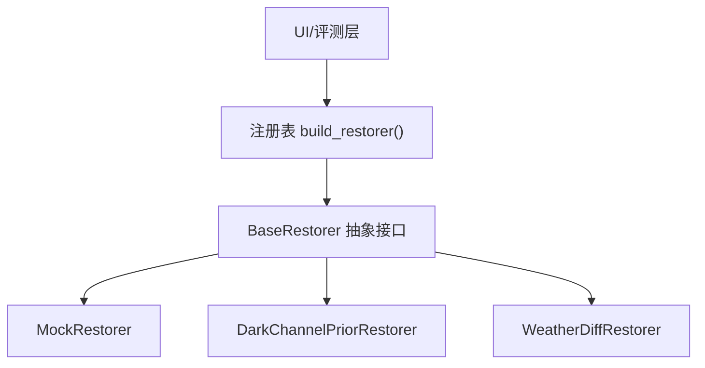
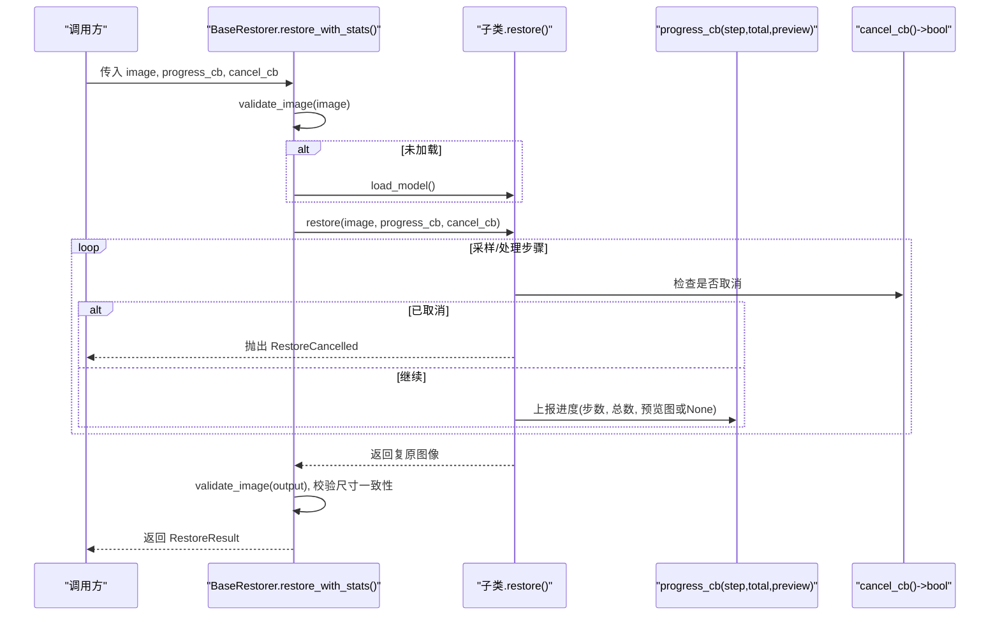
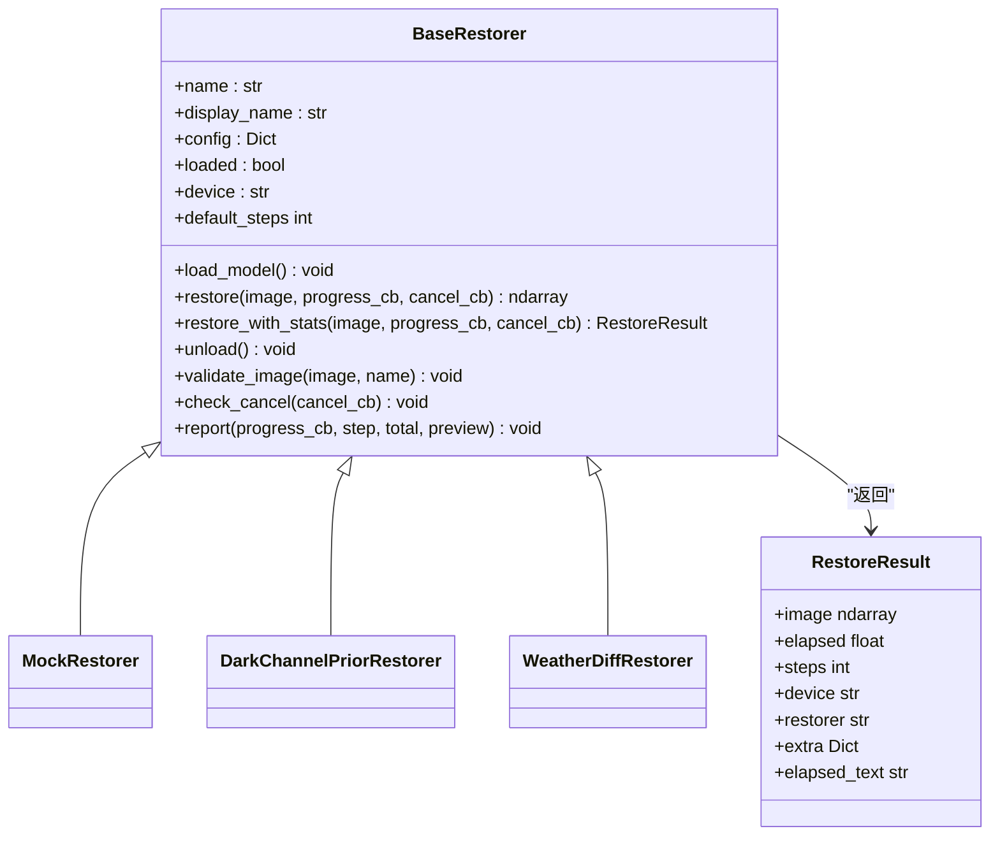

# BaseRestorer基础接口

<cite>
**本文引用的文件**
- [core/base.py](file://core/base.py)
- [core/weatherdiff/restorer.py](file://core/weatherdiff/restorer.py)
- [core/mock.py](file://core/mock.py)
- [core/baseline/dcp.py](file://core/baseline/dcp.py)
- [core/registry.py](file://core/registry.py)
- [core/__init__.py](file://core/__init__.py)
</cite>

## 目录
1. [简介](#简介)
2. [项目结构](#项目结构)
3. [核心组件](#核心组件)
4. [架构总览](#架构总览)
5. [详细组件分析](#详细组件分析)
6. [依赖关系分析](#依赖关系分析)
7. [性能考虑](#性能考虑)
8. [故障排查指南](#故障排查指南)
9. [结论](#结论)
10. [附录：实现示例与最佳实践](#附录实现示例与最佳实践)

## 简介
本文件为“BaseRestorer”抽象类的权威API文档，面向所有复原模型（扩散模型、传统算法、假模型）的统一契约。它定义了：
- 必须实现的接口：load_model()、restore()
- 可选重写的方法：unload()、default_steps
- 统一的数据类：RestoreResult
- 统一的回调与异常约定：ProgressCallback、CancelCallback、RestoreCancelled、WeightNotFoundError
- 图像格式验证、进度上报、取消机制等核心能力

该接口确保UI层与评测层无需关心底层模型实现，即可一致地调用、展示进度、处理取消与错误。

## 项目结构
本项目采用分层组织：
- core/base.py：定义统一接口契约（BaseRestorer、RestoreResult、回调类型、异常）
- core/weatherdiff/restorer.py：扩散模型实现 WeatherDiffRestorer
- core/mock.py：假模型实现 MockRestorer（便于联调）
- core/baseline/dcp.py：传统方法基线 DarkChannelPriorRestorer
- core/registry.py：按配置名动态构建复原器实例
- core/__init__.py：对外暴露统一入口

图表来源
- [core/registry.py:68-84](file://core/registry.py#L68-L84)
- [core/base.py:61-148](file://core/base.py#L61-L148)

章节来源
- [core/base.py:1-185](file://core/base.py#L1-L185)
- [core/registry.py:1-84](file://core/registry.py#L1-L84)
- [core/__init__.py:1-42](file://core/__init__.py#L1-L42)

## 核心组件
- BaseRestorer：抽象基类，定义统一接口与通用能力
- RestoreResult：一次复原的完整结果数据类
- ProgressCallback / CancelCallback：进度与取消回调类型
- RestoreCancelled / WeightNotFoundError：标准异常类型

章节来源
- [core/base.py:31-58](file://core/base.py#L31-L58)
- [core/base.py:61-148](file://core/base.py#L61-L148)

## 架构总览
下图展示了从上层到具体实现的调用链，以及进度与取消在其中的流转方式。

图表来源
- [core/base.py:111-138](file://core/base.py#L111-L138)
- [core/base.py:153-181](file://core/base.py#L153-L181)
- [core/mock.py:39-66](file://core/mock.py#L39-L66)
- [core/baseline/dcp.py:37-85](file://core/baseline/dcp.py#L37-L85)

## 详细组件分析

### BaseRestorer 抽象类
- 职责
  - 定义统一接口：load_model()、restore()
  - 提供通用能力：restore_with_stats()、validate_image()、check_cancel()、report()、unload()、default_steps
  - 统一类型与异常：ProgressCallback、CancelCallback、RestoreResult、RestoreCancelled、WeightNotFoundError

- 必需实现
  - load_model() -> None
    - 作用：加载权重并设置 self.loaded = True；若权重缺失应抛 WeightNotFoundError
    - 参数：无
    - 返回值：无
    - 异常：WeightNotFoundError（权重不存在）
  - restore(image: np.ndarray, progress_cb: Optional[ProgressCallback] = None, cancel_cb: Optional[CancelCallback] = None) -> np.ndarray
    - 输入：RGB uint8 图像，shape=(H, W, 3)
    - 输出：RGB uint8 图像，shape=(H, W, 3)，且尺寸必须与输入一致
    - 回调：
      - progress_cb(step: int, total: int, preview: Optional[np.ndarray]) -> None
      - cancel_cb() -> bool，返回True时应尽快抛出 RestoreCancelled
    - 异常：RestoreCancelled（用户取消）

- 可选重写
  - unload() -> None
    - 默认仅置 loaded=False；需要释放显存的子类请覆盖
  - default_steps -> int
    - 用于UI显示进度条总步数的预估值；默认读取配置中的 sampling.timesteps

- 通用工具
  - validate_image(image, name="输入图像") -> None
    - 校验：必须是 numpy.ndarray、ndim==3、shape[-1]==3、dtype==uint8
  - check_cancel(cancel_cb) -> None
    - 在耗时循环中定期调用；如取消则抛出 RestoreCancelled
  - report(progress_cb, step, total, preview=None) -> None
    - 安全上报进度；回调内部异常不会中断推理主流程
  - restore_with_stats(image, progress_cb=None, cancel_cb=None) -> RestoreResult
    - 统一入口：自动校验输入、按需加载模型、计时、校验输出与尺寸一致性，返回 RestoreResult

章节来源
- [core/base.py:61-148](file://core/base.py#L61-L148)
- [core/base.py:153-181](file://core/base.py#L153-L181)

### RestoreResult 数据类
- 字段
  - image: np.ndarray — 复原后图像，RGB uint8
  - elapsed: float — 耗时（秒）
  - steps: int — 实际采样步数（通常来自 default_steps）
  - device: str — 实际使用设备（如 "cpu"/"cuda"）
  - restorer: str — 模型标识（如 "weatherdiff"/"mock"/"dcp"）
  - extra: Dict[str, Any] — 其他信息（如显存占用等）
  - elapsed_text: property — 格式化耗时字符串

- 使用方式
  - UI/评测层通过 restore_with_stats() 获取该对象，直接读取 image、elapsed、steps、device、restorer、extra 进行展示与分析

章节来源
- [core/base.py:45-58](file://core/base.py#L45-L58)
- [core/base.py:111-138](file://core/base.py#L111-L138)

### 回调与异常约定
- ProgressCallback
  - 签名：(step: int, total: int, preview: Optional[np.ndarray]) -> None
  - 说明：step 为当前完成步数（1-based），total 为总步数，preview 为中间结果预览图（RGB uint8）或 None
- CancelCallback
  - 签名：() -> bool
  - 说明：返回 True 时，实现方应尽快抛出 RestoreCancelled
- RestoreCancelled
  - 语义：用户主动取消；UI捕获后提示“已取消”，不算错误
- WeightNotFoundError
  - 语义：权重文件缺失；UI捕获后提示用户放置权重

章节来源
- [core/base.py:31-43](file://core/base.py#L31-L43)
- [core/base.py:162-166](file://core/base.py#L162-L166)

### 图像格式验证
- 规则
  - 输入/输出必须为 numpy.ndarray
  - 通道顺序 RGB，形状 (H, W, 3)
  - dtype 必须为 uint8
- 行为
  - 不满足条件将抛出 TypeError 或 ValueError
  - 由 validate_image() 统一校验，restore_with_stats() 会在进入前与出队后分别校验

章节来源
- [core/base.py:153-161](file://core/base.py#L153-L161)
- [core/base.py:118-131](file://core/base.py#L118-L131)

### 进度回调与取消机制
- 进度上报
  - 使用 BaseRestorer.report() 安全上报，避免UI侧异常影响推理
  - 扩散模型实现会包装预览图转换，确保传给UI的是RGB uint8
- 取消机制
  - 在长循环中周期性调用 BaseRestorer.check_cancel()
  - 一旦取消，立即抛出 RestoreCancelled，上层可捕获并终止任务

章节来源
- [core/base.py:168-181](file://core/base.py#L168-L181)
- [core/mock.py:56-66](file://core/mock.py#L56-L66)
- [core/baseline/dcp.py:56-85](file://core/baseline/dcp.py#L56-L85)
- [core/weatherdiff/restorer.py:138-167](file://core/weatherdiff/restorer.py#L138-L167)

### 可选重写方法与属性
- unload()
  - 默认：仅置 loaded=False
  - 推荐：扩散模型实现应在卸载时释放显存（如清空CUDA缓存）
- default_steps
  - 默认：读取配置 sampling.timesteps
  - 建议：非扩散方法可按自身阶段数自定义（如DCP设为5）

章节来源
- [core/base.py:140-148](file://core/base.py#L140-L148)
- [core/weatherdiff/restorer.py:92-98](file://core/weatherdiff/restorer.py#L92-L98)
- [core/baseline/dcp.py:29-35](file://core/baseline/dcp.py#L29-L35)

## 依赖关系分析
- 模块耦合
  - base.py 是契约中心，被 weatherdiff、mock、baseline 共同依赖
  - registry.py 根据配置名延迟加载具体实现，避免启动即导入torch
  - __init__.py 对外暴露统一入口，屏蔽内部细节

图表来源
- [core/base.py:45-148](file://core/base.py#L45-L148)
- [core/mock.py:27-66](file://core/mock.py#L27-L66)
- [core/baseline/dcp.py:23-85](file://core/baseline/dcp.py#L23-L85)
- [core/weatherdiff/restorer.py:32-167](file://core/weatherdiff/restorer.py#L32-L167)

章节来源
- [core/registry.py:18-84](file://core/registry.py#L18-L84)
- [core/__init__.py:9-24](file://core/__init__.py#L9-L24)

## 性能考虑
- 设备选择
  - 扩散模型实现优先使用GPU（可通过环境变量强制指定设备）
- 显存自适应
  - 当出现显存不足时，自动降低 patch_batch_size 并重试
- 预处理与后处理
  - 长边限制、尺寸对齐16、小图反射填充，保证高效推理与正确还原
- 进度与预览
  - 预览图转换与裁剪仅在必要时执行，避免阻塞主流程

章节来源
- [core/weatherdiff/restorer.py:192-209](file://core/weatherdiff/restorer.py#L192-L209)
- [core/weatherdiff/restorer.py:138-167](file://core/weatherdiff/restorer.py#L138-L167)

## 故障排查指南
- 权重缺失
  - 现象：抛出 WeightNotFoundError
  - 处理：下载或放置权重至 weights/ 目录，并检查配置中的路径
- 图像格式错误
  - 现象：TypeError/ValueError
  - 处理：确保输入/输出为 RGB uint8，形状 (H, W, 3)
- 尺寸不一致
  - 现象：restore_with_stats() 抛出尺寸不一致错误
  - 处理：在模型内部恢复到原始尺寸后再返回
- 取消无效
  - 现象：长时间运行无法停止
  - 处理：在关键循环中调用 check_cancel()，并在检测到取消后立即抛出 RestoreCancelled
- 进度无响应
  - 现象：UI不更新
  - 处理：确保使用 report() 上报进度，避免UI侧异常影响推理

章节来源
- [core/base.py:41-43](file://core/base.py#L41-L43)
- [core/base.py:153-166](file://core/base.py#L153-L166)
- [core/base.py:118-131](file://core/base.py#L118-L131)
- [core/weatherdiff/restorer.py:50-56](file://core/weatherdiff/restorer.py#L50-L56)

## 结论
BaseRestorer 提供了稳定、一致的复原接口契约，使不同模型可以无缝替换，同时统一了图像格式、进度回调、取消机制与结果封装。遵循该契约可实现：
- 低耦合：UI/评测层不感知具体模型
- 高扩展：新增模型只需继承并实现必要接口
- 强健壮：统一校验、异常与资源管理

## 附录：实现示例与最佳实践
以下以“如何继承 BaseRestorer 实现自定义复原器”为主线，给出步骤与要点（不包含具体代码内容）。

- 步骤概览
  1) 新建类继承 BaseRestorer，并通过 @register_restorer("your_name") 注册
  2) 实现 load_model()：加载权重、设置 self.device 与 self.loaded
  3) 实现 restore()：接收图像、支持进度与取消、返回与原图同尺寸的RGB uint8
  4) 可选：覆盖 unload() 释放显存；覆盖 default_steps 设置进度条总步数
  5) 在耗时循环中调用 check_cancel() 与 report()，确保可取消与可观测
  6) 通过 restore_with_stats() 获取 RestoreResult，供UI/评测使用

- 参考实现
  - MockRestorer：纯numpy模拟逐步去噪，演示进度与取消
  - DarkChannelPriorRestorer：传统方法，展示多阶段进度与自定义 default_steps
  - WeatherDiffRestorer：扩散模型，展示设备选择、权重加载、显存自适应与预览转换

- 关键要点
  - 图像格式：始终使用 RGB uint8，形状 (H, W, 3)
  - 尺寸一致性：输出尺寸必须与输入一致
  - 进度与取消：使用 report() 与 check_cancel()，避免UI异常影响推理
  - 异常处理：权重缺失抛 WeightNotFoundError；取消抛 RestoreCancelled
  - 资源管理：在 unload() 中释放显存，避免内存泄漏

章节来源
- [core/mock.py:27-81](file://core/mock.py#L27-L81)
- [core/baseline/dcp.py:23-85](file://core/baseline/dcp.py#L23-L85)
- [core/weatherdiff/restorer.py:32-167](file://core/weatherdiff/restorer.py#L32-L167)
- [core/base.py:61-148](file://core/base.py#L61-L148)
- [core/registry.py:29-46](file://core/registry.py#L29-L46)