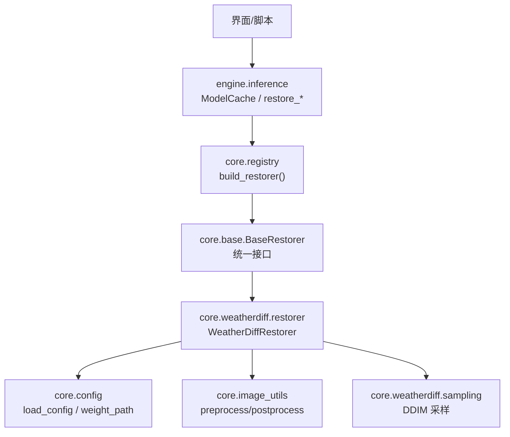
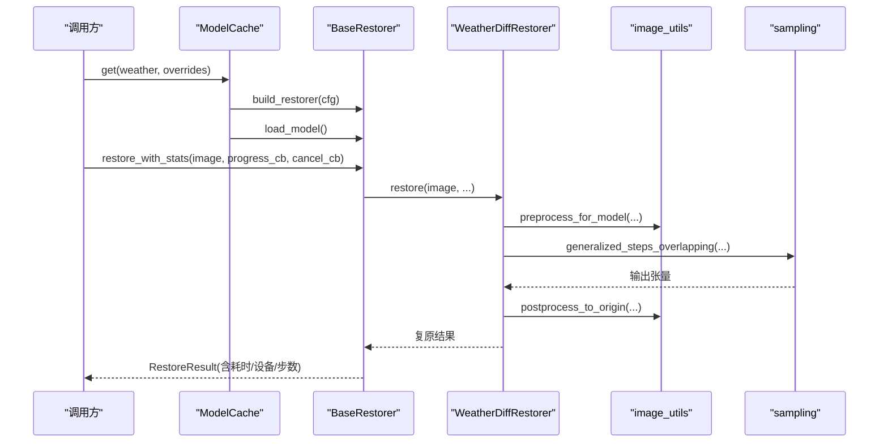
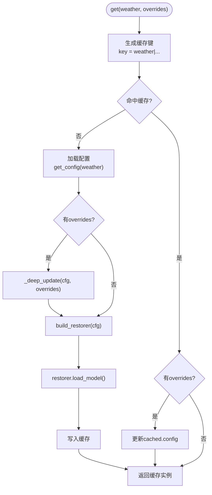
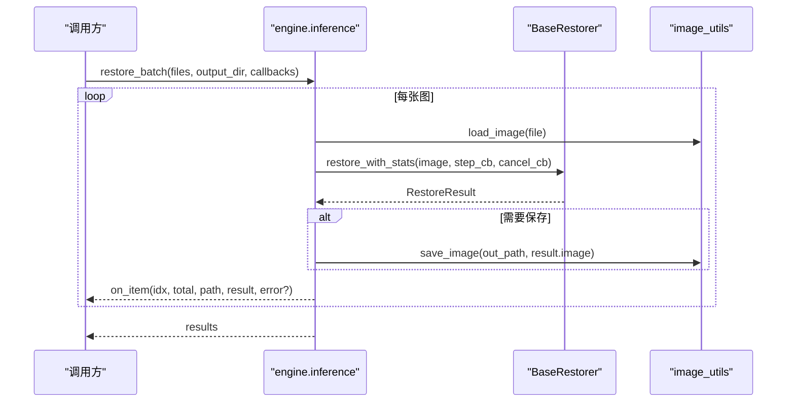
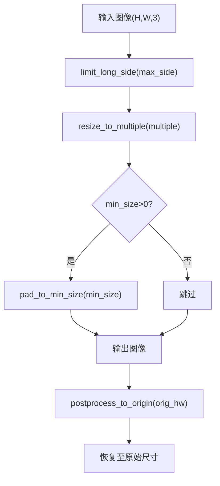
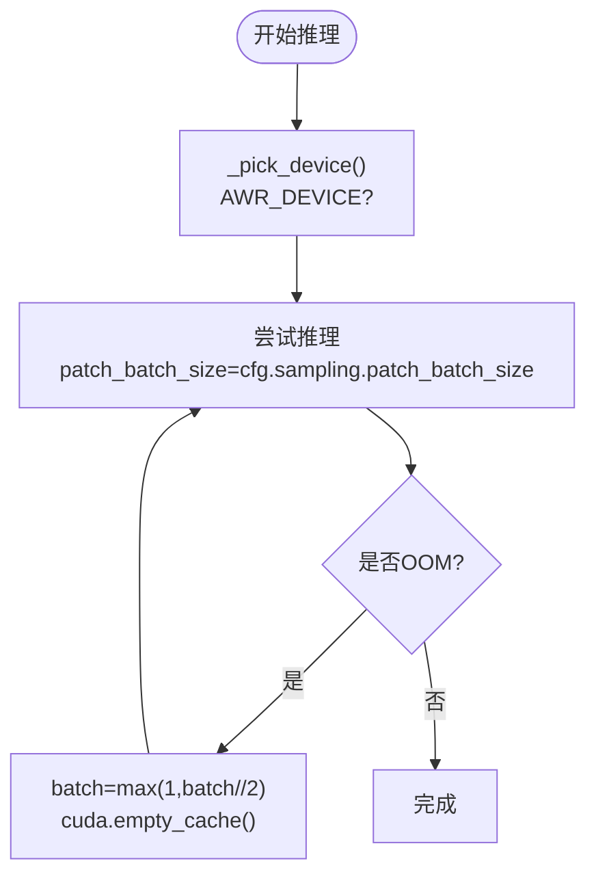
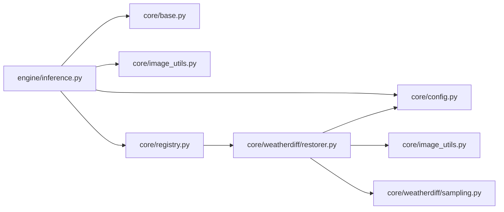

# 推理引擎API

<cite>
**本文引用的文件**
- [engine/inference.py](file://engine/inference.py)
- [core/base.py](file://core/base.py)
- [core/config.py](file://core/config.py)
- [core/image_utils.py](file://core/image_utils.py)
- [core/registry.py](file://core/registry.py)
- [core/weatherdiff/restorer.py](file://core/weatherdiff/restorer.py)
- [configs/rain.yaml](file://configs/rain.yaml)
- [configs/allweather.yaml](file://configs/allweather.yaml)
- [engine/evaluate.py](file://engine/evaluate.py)
- [scripts/smoke_test.py](file://scripts/smoke_test.py)
</cite>

## 目录
1. [简介](#简介)
2. [项目结构](#项目结构)
3. [核心组件](#核心组件)
4. [架构总览](#架构总览)
5. [详细组件分析](#详细组件分析)
6. [依赖关系分析](#依赖关系分析)
7. [性能与显存优化](#性能与显存优化)
8. [故障排查指南](#故障排查指南)
9. [结论](#结论)
10. [附录：完整使用示例](#附录完整使用示例)

## 简介
本文档面向使用该推理引擎进行图像复原的开发者，系统性说明 ModelCache 的设计与用法、批量推理接口、图像预处理与后处理流程、设备管理（CPU/GPU切换）、批大小优化与显存管理，并给出单图与批量处理的完整调用路径。同时提供错误处理、性能监控与资源清理的最佳实践。

## 项目结构
该工程采用“配置驱动 + 注册表构建 + 统一抽象基类”的分层设计：
- 配置层：通过 YAML 描述模型、权重、数据与采样参数。
- 抽象层：BaseRestorer 定义统一的加载、推理、卸载与统计接口。
- 实现层：WeatherDiffRestorer 等具体复原器按配置动态构建。
- 编排层：engine.inference 提供 ModelCache、restore_array/restore_file/restore_batch 等高层 API。
- 工具层：image_utils 提供图像 IO、预处理/后处理、尺寸对齐等通用能力。
- 评测层：engine.evaluate 提供批量评测与指标导出。

图表来源
- [engine/inference.py:22-68](file://engine/inference.py#L22-L68)
- [core/registry.py:68-84](file://core/registry.py#L68-L84)
- [core/base.py:61-148](file://core/base.py#L61-L148)
- [core/weatherdiff/restorer.py:32-90](file://core/weatherdiff/restorer.py#L32-L90)
- [core/config.py:25-57](file://core/config.py#L25-L57)
- [core/image_utils.py:145-167](file://core/image_utils.py#L145-L167)

章节来源
- [engine/inference.py:1-153](file://engine/inference.py#L1-L153)
- [core/base.py:1-185](file://core/base.py#L1-L185)
- [core/config.py:1-98](file://core/config.py#L1-L98)
- [core/image_utils.py:1-253](file://core/image_utils.py#L1-L253)
- [core/registry.py:1-85](file://core/registry.py#L1-L85)
- [core/weatherdiff/restorer.py:1-244](file://core/weatherdiff/restorer.py#L1-L244)

## 核心组件
- ModelCache：按配置名缓存已加载的 BaseRestorer 实例，避免重复加载权重与显存占用；支持 release_others/clear 控制生命周期。
- BaseRestorer：统一接口契约，包含 load_model、restore、unload、restore_with_stats、validate_image、check_cancel、report 等。
- WeatherDiffRestorer：基于 patch 的条件扩散模型实现，负责设备选择、权重加载、预处理、采样、后处理与显存自适应。
- image_utils：统一图像格式（RGB uint8），提供 preprocess_for_model、postprocess_to_origin、尺寸限制与对齐等。
- registry：根据配置中的 restorer 字段延迟加载并构建具体复原器。
- config：加载 YAML 配置，解析权重绝对路径，列出可用天气配置。

章节来源
- [engine/inference.py:22-68](file://engine/inference.py#L22-L68)
- [core/base.py:61-185](file://core/base.py#L61-L185)
- [core/weatherdiff/restorer.py:32-244](file://core/weatherdiff/restorer.py#L32-L244)
- [core/image_utils.py:22-167](file://core/image_utils.py#L22-L167)
- [core/registry.py:18-84](file://core/registry.py#L18-L84)
- [core/config.py:25-98](file://core/config.py#L25-L98)

## 架构总览
下图展示了从高层 API 到具体实现的调用链路与关键交互点。

图表来源
- [engine/inference.py:33-52](file://engine/inference.py#L33-L52)
- [core/base.py:111-138](file://core/base.py#L111-L138)
- [core/weatherdiff/restorer.py:102-167](file://core/weatherdiff/restorer.py#L102-L167)
- [core/image_utils.py:145-167](file://core/image_utils.py#L145-L167)

## 详细组件分析

### ModelCache：模型缓存策略、内存管理与生命周期控制
- 缓存键：仅以 weather 作为 key，忽略 sampling.timesteps/grid_r 等不影响权重的运行时参数，从而避免重复加载。
- 获取逻辑：若未命中则加载配置、可选 deep_update 覆盖、构建复原器并 load_model；若命中且存在覆盖参数，直接更新 cached.config。
- 释放策略：release_others(keep_weather) 可只保留指定天气的模型，其余 unload；clear 清空全部。
- 适用场景：UI 切换天气类型时不重复读盘与占显存；批量任务中复用同一模型实例。

图表来源
- [engine/inference.py:33-68](file://engine/inference.py#L33-L68)

章节来源
- [engine/inference.py:22-68](file://engine/inference.py#L22-L68)

### 批量推理接口与单图接口
- restore_array(restorer, image, ...): 对内存中的单张图做复原，返回 RestoreResult。
- restore_file(restorer, input_path, output_path=None, ...): 读取图片、复原、可选保存，返回 (原始图, RestoreResult)。
- restore_batch(restorer, files, output_dir=None, on_item=None, cancel_cb=None, step_cb=None): 遍历文件列表，逐张调用 restore_file，捕获异常不中断整批，支持每图回调与进度回调。

图表来源
- [engine/inference.py:70-132](file://engine/inference.py#L70-L132)
- [core/base.py:111-138](file://core/base.py#L111-L138)
- [core/image_utils.py:22-33](file://core/image_utils.py#L22-L33)

章节来源
- [engine/inference.py:70-132](file://engine/inference.py#L70-L132)

### 图像预处理与后处理流程
- 预处理 preprocess_for_model(image, max_side=1024, size_multiple=16, min_size=0):
  - limit_long_side: 长边超过阈值等比缩小，控制显存与耗时。
  - resize_to_multiple: 将宽高向上取整到倍数（默认16），满足网络输入要求。
  - pad_to_min_size: 小于最小尺寸时反射填充，保证 patch 滑窗稳定。
  - 返回 (处理后图像, 原始尺寸)，供后续还原。
- 后处理 postprocess_to_origin(image, orig_hw): 裁剪/缩放回原始尺寸，确保输出与输入一致。

图表来源
- [core/image_utils.py:109-167](file://core/image_utils.py#L109-L167)

章节来源
- [core/image_utils.py:109-167](file://core/image_utils.py#L109-L167)

### 设备管理（CPU/GPU切换）与显存管理
- 设备选择：
  - 环境变量 AWR_DEVICE 强制指定设备（如 cpu）。
  - 否则自动检测 CUDA 可用性，优先 cuda，否则 cpu。
- 显存管理：
  - 推理失败（out of memory）时，自动将 patch_batch_size 减半重试，直至成功或降至1。
  - 卸载模型时调用 torch.cuda.empty_cache() 释放显存。
- 权重加载：
  - 支持 DataParallel 前缀剥离、EMA 权重覆盖，提升质量。

图表来源
- [core/weatherdiff/restorer.py:204-209](file://core/weatherdiff/restorer.py#L204-L209)
- [core/weatherdiff/restorer.py:137-161](file://core/weatherdiff/restorer.py#L137-L161)
- [core/weatherdiff/restorer.py:92-98](file://core/weatherdiff/restorer.py#L92-L98)

章节来源
- [core/weatherdiff/restorer.py:92-98](file://core/weatherdiff/restorer.py#L92-L98)
- [core/weatherdiff/restorer.py:137-161](file://core/weatherdiff/restorer.py#L137-L161)
- [core/weatherdiff/restorer.py:204-209](file://core/weatherdiff/restorer.py#L204-L209)

### 批大小优化与采样参数
- 关键参数（来自配置）：
  - sampling.timesteps: 采样步数，越小越快。
  - sampling.grid_r: 滑窗步长，越大越快（patch 数量减少，质量略降）。
  - sampling.patch_batch_size: 一次并行推理的 patch 数，显存不足会自动减半。
  - data.max_side: 长边上限，控制显存与耗时。
  - data.size_multiple: 尺寸对齐倍数（默认16）。
- 推荐调优顺序：先降低 timesteps/grid_r，再降低 max_side，最后调整 patch_batch_size。

章节来源
- [configs/rain.yaml:45-50](file://configs/rain.yaml#L45-L50)
- [configs/allweather.yaml:41-46](file://configs/allweather.yaml#L41-L46)
- [core/weatherdiff/restorer.py:112-131](file://core/weatherdiff/restorer.py#L112-L131)

### 错误处理与取消机制
- 取消：cancel_cb 在循环中定期检查，抛出 RestoreCancelled；UI 捕获后提示“已取消”。
- 单图失败隔离：批量处理中单张异常被捕获，记录错误信息并继续处理其他图片。
- 权重缺失：WeightNotFoundError 提示下载或放置权重。
- 进度上报：BaseRestorer.report 包裹 progress_cb 异常，防止影响主流程。

章节来源
- [core/base.py:37-43](file://core/base.py#L37-L43)
- [core/base.py:162-181](file://core/base.py#L162-L181)
- [engine/inference.py:116-132](file://engine/inference.py#L116-L132)
- [core/weatherdiff/restorer.py:50-56](file://core/weatherdiff/restorer.py#L50-L56)

## 依赖关系分析
- engine.inference 依赖 core.base、core.config、core.image_utils、core.registry。
- core.weatherdiff.restorer 依赖 core.base、core.config、core.image_utils、core.weatherdiff.sampling、core.weatherdiff.unet。
- 配置通过 core.config 加载，权重路径由 weight_path 解析为绝对路径。
- 模型通过 registry 动态构建，避免启动即导入 torch。

图表来源
- [engine/inference.py:14-19](file://engine/inference.py#L14-L19)
- [core/registry.py:18-26](file://core/registry.py#L18-L26)
- [core/weatherdiff/restorer.py:24-29](file://core/weatherdiff/restorer.py#L24-L29)

章节来源
- [engine/inference.py:14-19](file://engine/inference.py#L14-L19)
- [core/registry.py:18-26](file://core/registry.py#L18-L26)
- [core/weatherdiff/restorer.py:24-29](file://core/weatherdiff/restorer.py#L24-L29)

## 性能与显存优化
- 控制输入尺寸：设置 data.max_side 限制长边，避免过大图像导致显存飙升。
- 调整采样步数：减小 sampling.timesteps 可显著降低耗时。
- 调整滑窗步长：增大 sampling.grid_r 可减少 patch 数量，提高速度。
- 自适应批大小：当出现 out of memory 时，系统自动将 patch_batch_size 减半重试。
- 设备选择：通过 AWR_DEVICE 强制 CPU/GPU；无 GPU 时自动降级到 CPU。
- 资源释放：使用 ModelCache.release_others/clear 及时释放不再使用的模型显存。

[本节为通用指导，无需特定文件引用]

## 故障排查指南
- 找不到权重：
  - 现象：抛出 WeightNotFoundError。
  - 处理：执行权重下载脚本或手动放置权重，并检查 configs 中 weights.path。
- 缺少 PyTorch：
  - 现象：导入 torch 失败。
  - 处理：安装 torch 或设置 AWR_MOCK=1 使用假模型。
- 显存不足：
  - 现象：RuntimeError out of memory。
  - 处理：系统自动降低 patch_batch_size；也可手动降低 max_side/timesteps/grid_r。
- 批量任务中断：
  - 现象：单张图报错。
  - 处理：restore_batch 会捕获异常并继续，查看 on_item 的错误信息定位问题。
- 进度/取消无效：
  - 现象：UI 无反馈或无法取消。
  - 处理：确认传入 progress_cb/cancel_cb；BaseRestorer.check_cancel 会在循环中检查。

章节来源
- [core/weatherdiff/restorer.py:50-56](file://core/weatherdiff/restorer.py#L50-L56)
- [core/weatherdiff/restorer.py:192-202](file://core/weatherdiff/restorer.py#L192-L202)
- [core/weatherdiff/restorer.py:137-161](file://core/weatherdiff/restorer.py#L137-L161)
- [engine/inference.py:116-132](file://engine/inference.py#L116-L132)
- [core/base.py:162-181](file://core/base.py#L162-L181)

## 结论
该推理引擎通过统一的抽象接口与配置驱动的模型构建，提供了稳定的单图与批量推理能力。ModelCache 有效避免了重复加载与显存浪费，配合 image_utils 的预处理/后处理与 WeatherDiffRestorer 的自适应批大小策略，能够在不同硬件条件下高效运行。建议在生产环境中结合显存与耗时目标，合理配置 max_side、timesteps、grid_r 与 patch_batch_size，并使用 ModelCache 的生命周期管理控制资源占用。

[本节为总结性内容，无需特定文件引用]

## 附录：完整使用示例

### 单图处理（内存数组）
- 步骤：
  - 通过 ModelCache.get 获取 BaseRestorer。
  - 调用 restore_array(restorer, image, progress_cb, cancel_cb)。
  - 从 RestoreResult 中获取 image、elapsed、device、steps 等信息。
- 参考路径：
  - [engine/inference.py:70-78](file://engine/inference.py#L70-L78)
  - [core/base.py:111-138](file://core/base.py#L111-L138)

### 单图处理（文件）
- 步骤：
  - 通过 ModelCache.get 获取 BaseRestorer。
  - 调用 restore_file(restorer, input_path, output_path, progress_cb, cancel_cb)。
  - 返回 (原始图, RestoreResult)，可选保存输出。
- 参考路径：
  - [engine/inference.py:80-96](file://engine/inference.py#L80-L96)
  - [core/image_utils.py:22-33](file://core/image_utils.py#L22-L33)

### 批量处理（文件列表）
- 步骤：
  - 通过 ModelCache.get 获取 BaseRestorer。
  - 调用 restore_batch(restorer, files, output_dir, on_item, cancel_cb, step_cb)。
  - on_item 回调用于每图进度与错误收集；step_cb 用于单图内部采样进度。
- 参考路径：
  - [engine/inference.py:99-132](file://engine/inference.py#L99-L132)

### 设备与环境
- 强制 CPU：设置环境变量 AWR_DEVICE=cpu。
- 自动设备：无 AWR_DEVICE 时优先 cuda，否则 cpu。
- 参考路径：
  - [core/weatherdiff/restorer.py:204-209](file://core/weatherdiff/restorer.py#L204-L209)

### 配置与权重
- 常用配置：rain.yaml、allweather.yaml。
- 权重路径：由 config.weight_path 解析为绝对路径。
- 参考路径：
  - [configs/rain.yaml:15-50](file://configs/rain.yaml#L15-L50)
  - [configs/allweather.yaml:12-46](file://configs/allweather.yaml#L12-L46)
  - [core/config.py:86-91](file://core/config.py#L86-L91)

### 冒烟测试与自检
- 使用 scripts/smoke_test.py 验证环境、配置、假模型、DCP、指标与批量评测。
- 参考路径：
  - [scripts/smoke_test.py:35-151](file://scripts/smoke_test.py#L35-L151)