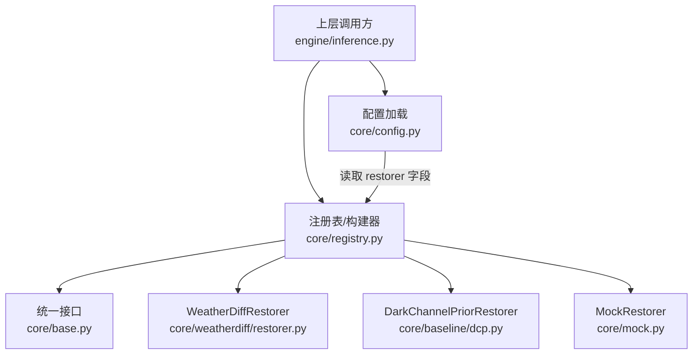
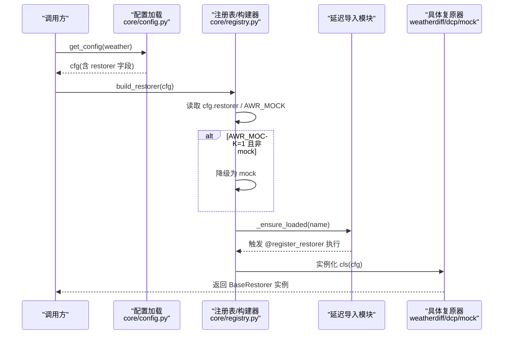
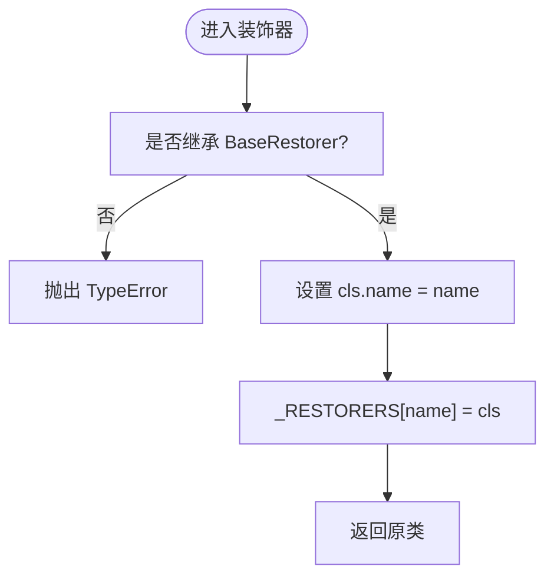
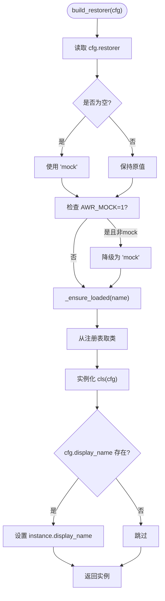
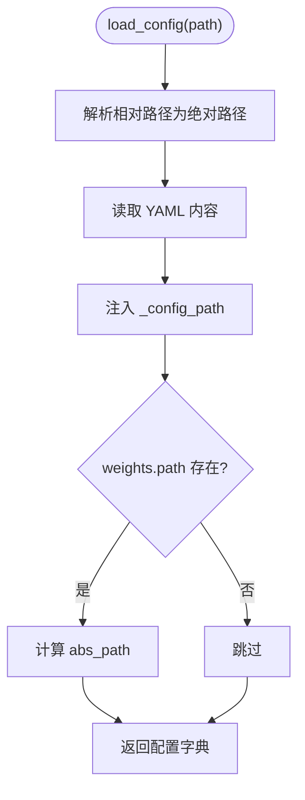
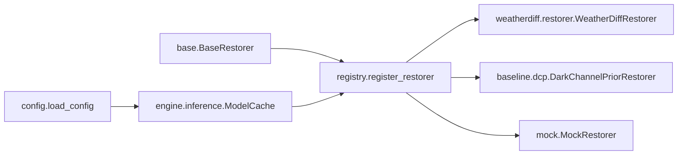

# 模型注册机制

<cite>
**本文引用的文件**
- [core/registry.py](file://core/registry.py)
- [core/base.py](file://core/base.py)
- [core/config.py](file://core/config.py)
- [core/weatherdiff/restorer.py](file://core/weatherdiff/restorer.py)
- [core/baseline/dcp.py](file://core/baseline/dcp.py)
- [core/mock.py](file://core/mock.py)
- [engine/inference.py](file://engine/inference.py)
- [configs/allweather.yaml](file://configs/allweather.yaml)
- [configs/dcp.yaml](file://configs/dcp.yaml)
</cite>

## 目录
1. [简介](#简介)
2. [项目结构](#项目结构)
3. [核心组件](#核心组件)
4. [架构总览](#架构总览)
5. [详细组件分析](#详细组件分析)
6. [依赖关系分析](#依赖关系分析)
7. [性能考虑](#性能考虑)
8. [故障排查指南](#故障排查指南)
9. [结论](#结论)
10. [附录：添加新模型的完整步骤](#附录添加新模型的完整步骤)

## 简介
本文件面向“如何扩展与使用模型注册机制”的读者，系统性说明：
- @register_restorer 装饰器的参数、行为与命名约定
- 通过配置系统动态加载与实例化不同复原模型的流程
- 模型发现机制与优先级规则（含环境变量降级）
- 添加新模型的完整步骤与示例路径
- 错误处理、版本兼容性与调试技巧

该机制的核心目标是：UI 与评测层只依赖统一接口，不关心底层具体模型；在需要时才导入重型依赖（如 torch），并支持运行时按配置选择模型。

## 项目结构
与模型注册相关的核心位置如下：
- 注册表与构建器：core/registry.py
- 统一接口契约：core/base.py
- 配置加载与解析：core/config.py
- 内置实现：
  - WeatherDiffusion 扩散模型：core/weatherdiff/restorer.py
  - 传统基线 DCP：core/baseline/dcp.py
  - Mock 假模型：core/mock.py
- 推理编排与缓存：engine/inference.py
- 配置文件示例：configs/*.yaml

图表来源
- [core/registry.py:29-84](file://core/registry.py#L29-L84)
- [core/config.py:25-57](file://core/config.py#L25-L57)
- [engine/inference.py:22-52](file://engine/inference.py#L22-L52)

章节来源
- [core/registry.py:1-84](file://core/registry.py#L1-L84)
- [core/config.py:1-98](file://core/config.py#L1-L98)
- [engine/inference.py:1-153](file://engine/inference.py#L1-L153)

## 核心组件
- BaseRestorer：定义所有复原器必须实现的接口与通用能力（进度上报、取消检查、输入校验、计时包装等）。
- register_restorer(name)：类装饰器，将继承自 BaseRestorer 的类登记到全局注册表，并设置 name。
- build_restorer(config)：根据配置中的 restorer 字段，按需延迟导入对应模块，构造并返回实例。
- ModelCache：按配置名缓存已加载的复原器实例，避免重复加载权重。

关键职责边界
- registry.py：负责“发现与实例化”，不关心具体实现细节。
- base.py：定义“契约”，确保各实现一致。
- weatherdiff/dcp/mock：各自实现 load_model/restore 等。
- config.py：提供配置加载、路径解析与显示名工具。
- engine/inference.py：编排推理流程与缓存策略。

章节来源
- [core/base.py:61-185](file://core/base.py#L61-L185)
- [core/registry.py:29-84](file://core/registry.py#L29-L84)
- [engine/inference.py:22-67](file://engine/inference.py#L22-L67)

## 架构总览
下图展示了从配置到模型实例化的端到端流程，包括环境变量降级与延迟加载。

图表来源
- [core/registry.py:49-84](file://core/registry.py#L49-L84)
- [core/config.py:77-79](file://core/config.py#L77-L79)
- [core/weatherdiff/restorer.py:32-39](file://core/weatherdiff/restorer.py#L32-L39)
- [core/baseline/dcp.py:23-35](file://core/baseline/dcp.py#L23-L35)
- [core/mock.py:27-37](file://core/mock.py#L27-L37)

## 详细组件分析

### 装饰器 @register_restorer
- 作用：将继承自 BaseRestorer 的类登记到全局注册表，并设置类的 name 属性。
- 参数：name（字符串），需与 configs/*.yaml 中 restorer 字段一致。
- 约束：仅允许继承 BaseRestorer 的类被注册，否则抛出类型错误。
- 命名约定：建议采用小写英文标识，保持唯一性，便于配置引用。

图表来源
- [core/registry.py:29-46](file://core/registry.py#L29-L46)

章节来源
- [core/registry.py:29-46](file://core/registry.py#L29-L46)

### 构建器 build_restorer 与延迟加载
- 入口：build_restorer(config)
- 流程：
  1) 读取 config["restorer"]，默认 fallback 为 "mock"
  2) 若环境变量 AWR_MOCK=1 且当前不是 mock，则强制降级为 mock
  3) 调用 _ensure_loaded(name) 按需导入对应模块，触发其中的 @register_restorer
  4) 从注册表中取出类并实例化，同时可选设置 display_name
- 关键点：
  - 延迟导入避免启动时加载 torch
  - 未知名称会抛出 KeyError，未注册但可导入会抛出 RuntimeError

图表来源
- [core/registry.py:68-84](file://core/registry.py#L68-L84)

章节来源
- [core/registry.py:49-84](file://core/registry.py#L49-L84)

### 配置系统与动态加载
- 配置加载：load_config(path) 支持相对路径自动补全，注入绝对权重路径与 _config_path
- 可用配置枚举：list_weather_configs() 扫描 configs/*.y*ml，并按 WEATHER_ORDER 排序
- 便捷获取：get_config(weather) 直接返回配置字典
- 权重路径：weight_path(cfg) 返回绝对路径或 None（无权重场景）

图表来源
- [core/config.py:25-57](file://core/config.py#L25-L57)

章节来源
- [core/config.py:25-98](file://core/config.py#L25-L98)

### 模型发现机制与优先级规则
- 内置映射：_LAZY_MODULES 维护 name -> 模块路径的映射
- 发现顺序：
  1) 已在注册表中的 name（可能由其他模块提前 import 触发）
  2) 若不在注册表，尝试从 _LAZY_MODULES 延迟导入对应模块
  3) 导入后仍找不到 name，抛出 RuntimeError
- 优先级与环境变量：
  - AWR_MOCK=1 时，任何非 mock 的 restorer 都会被降级为 mock
  - 可通过自定义模块在启动时 import 以提前注册额外模型

章节来源
- [core/registry.py:18-26](file://core/registry.py#L18-L26)
- [core/registry.py:49-65](file://core/registry.py#L49-L65)
- [core/registry.py:68-84](file://core/registry.py#L68-L84)

### 内置实现概览
- WeatherDiffRestorer：基于 patch 的条件扩散模型，负责设备选择、权重加载、预处理、采样、显存自适应、结果还原等工程细节。
- DarkChannelPriorRestorer：纯 numpy 去雾基线，无需权重与 GPU，用于对照实验。
- MockRestorer：纯 numpy 模拟逐步去噪过程，便于 UI/评测联调。

章节来源
- [core/weatherdiff/restorer.py:32-167](file://core/weatherdiff/restorer.py#L32-L167)
- [core/baseline/dcp.py:23-85](file://core/baseline/dcp.py#L23-L85)
- [core/mock.py:27-66](file://core/mock.py#L27-L66)

## 依赖关系分析
- registry.py 依赖 base.py 的 BaseRestorer 抽象类
- weatherdiff/restorer.py、baseline/dcp.py、mock.py 均通过 @register_restorer 向 registry 注册自身
- engine/inference.py 通过 build_restorer 获取实例，并使用 ModelCache 管理生命周期
- config.py 提供配置加载与路径解析，供各模块使用

图表来源
- [core/base.py:61-185](file://core/base.py#L61-L185)
- [core/registry.py:29-84](file://core/registry.py#L29-L84)
- [core/weatherdiff/restorer.py:32-39](file://core/weatherdiff/restorer.py#L32-L39)
- [core/baseline/dcp.py:23-35](file://core/baseline/dcp.py#L23-L35)
- [core/mock.py:27-37](file://core/mock.py#L27-L37)
- [engine/inference.py:22-52](file://engine/inference.py#L22-L52)

章节来源
- [core/registry.py:18-26](file://core/registry.py#L18-L26)
- [engine/inference.py:22-67](file://engine/inference.py#L22-L67)

## 性能考虑
- 延迟导入：torch 仅在需要时导入，降低启动开销与无 torch 环境下的依赖负担
- 权重缓存：ModelCache 按配置名缓存实例，切换天气类型时避免重复加载
- 显存自适应：扩散模型推理时若 OOM，会自动降低 patch_batch_size 重试
- 进度与取消：统一的进度上报与取消检查，避免阻塞与无效计算

章节来源
- [core/registry.py:21-26](file://core/registry.py#L21-L26)
- [engine/inference.py:22-67](file://engine/inference.py#L22-L67)
- [core/weatherdiff/restorer.py:137-162](file://core/weatherdiff/restorer.py#L137-L162)

## 故障排查指南
常见错误与定位方法：
- KeyError: 未知的 restorer
  - 原因：配置中 restorer 未在注册表且无法延迟导入
  - 排查：确认 _LAZY_MODULES 是否包含该 name；确认对应模块是否正确执行了 @register_restorer
- RuntimeError: 模块导入成功但未注册
  - 原因：模块导入后没有以该 name 注册
  - 排查：检查模块内是否有 @register_restorer("xxx")，并确保 name 与配置一致
- WeightNotFoundError: 权重缺失
  - 原因：配置 weights.path 指向的文件不存在
  - 排查：使用 weight_path(cfg) 检查绝对路径；执行下载脚本或手动放置权重
- RestoreCancelled: 用户取消
  - 原因：cancel_cb 返回 True
  - 排查：在上层捕获并提示“已取消”，不影响主流程
- 尺寸不一致错误
  - 原因：restore 输出尺寸与输入不一致
  - 排查：确保 restore 内部恢复到原始尺寸；BaseRestorer.restore_with_stats 会做校验

调试技巧：
- 使用 AWR_MOCK=1 快速验证 UI/评测链路，无需权重与 GPU
- 使用 AWR_DEVICE 强制指定设备（如 cuda/cpu）
- 打印 available_restorers() 查看当前可用的模型名集合
- 在 restore 循环中定期调用 check_cancel 与 report，保证可取消与进度反馈

章节来源
- [core/registry.py:49-65](file://core/registry.py#L49-L65)
- [core/base.py:37-185](file://core/base.py#L37-L185)
- [core/weatherdiff/restorer.py:47-90](file://core/weatherdiff/restorer.py#L47-L90)
- [core/config.py:86-91](file://core/config.py#L86-L91)

## 结论
本注册机制通过“装饰器 + 延迟导入 + 配置驱动”的方式，实现了：
- 解耦：上层不感知具体模型实现
- 可扩展：新增模型只需继承 BaseRestorer 并注册
- 可运行：支持环境变量降级与权重缓存，兼顾开发与生产体验
- 可观测：统一的进度、取消与统计接口，便于调试与评测

## 附录：添加新模型的完整步骤
目标：新增一个名为 "myrestorer" 的复原器，并通过配置动态加载。

步骤清单：
1) 新建实现类
- 在合适目录下创建模块（例如 core/myrestorer.py）
- 继承 BaseRestorer，实现 load_model 与 restore
- 使用 @register_restorer("myrestorer") 装饰类
- 设置 display_name 以便界面显示

2) 注册延迟导入
- 在 core/registry.py 的 _LAZY_MODULES 中添加条目："myrestorer": "core.myrestorer"

3) 编写配置
- 在 configs/ 下新增 myrestorer.yaml
- 设置 restorer: myrestorer
- 如有权重，设置 weights.path（相对或绝对路径均可，会被解析为绝对路径）
- 可选：设置 sampling、data 等参数

4) 验证可用性
- 调用 available_restorers() 确认 "myrestorer" 出现在可用列表中
- 使用 get_config("myrestorer") 加载配置
- 通过 build_restorer(cfg) 构造实例并调用 restore_with_stats 测试

5) 集成到推理管线
- 使用 engine/inference.py 的 ModelCache.get("myrestorer", overrides) 获取实例
- 调用 restore_array/restore_file/restore_batch 进行单图/批量推理

参考路径（不包含代码内容）：
- 装饰器用法与注册：[core/registry.py:29-46](file://core/registry.py#L29-L46)
- 延迟导入映射：[core/registry.py:21-26](file://core/registry.py#L21-L26)
- 构建器入口：[core/registry.py:68-84](file://core/registry.py#L68-L84)
- 统一接口契约：[core/base.py:61-185](file://core/base.py#L61-L185)
- 配置加载与权重路径：[core/config.py:25-57](file://core/config.py#L25-L57), [core/config.py:86-91](file://core/config.py#L86-L91)
- 内置实现参考：
  - 扩散模型：[core/weatherdiff/restorer.py:32-167](file://core/weatherdiff/restorer.py#L32-L167)
  - 传统基线：[core/baseline/dcp.py:23-85](file://core/baseline/dcp.py#L23-L85)
  - 假模型：[core/mock.py:27-66](file://core/mock.py#L27-L66)
- 推理编排与缓存：[engine/inference.py:22-67](file://engine/inference.py#L22-L67)
- 配置示例：
  - [configs/allweather.yaml:1-47](file://configs/allweather.yaml#L1-L47)
  - [configs/dcp.yaml:1-21](file://configs/dcp.yaml#L1-L21)