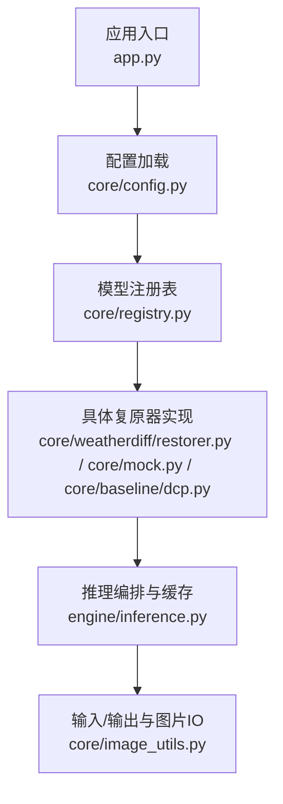
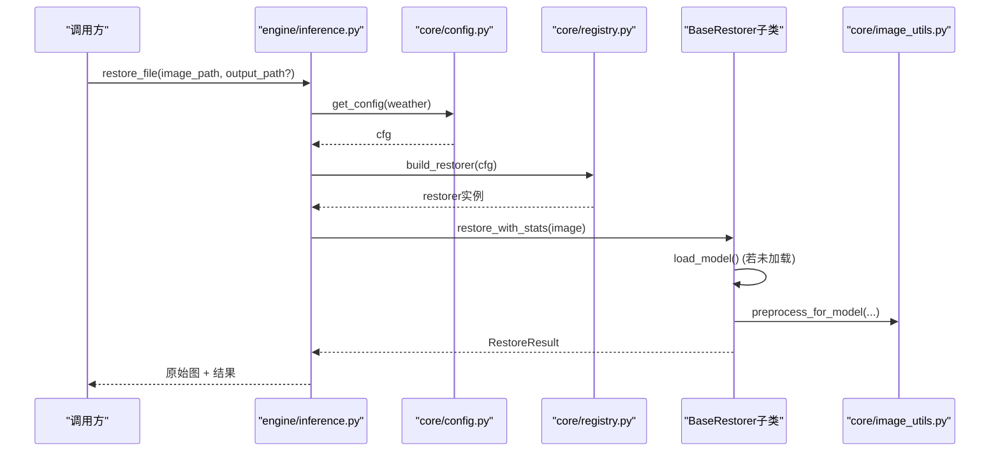
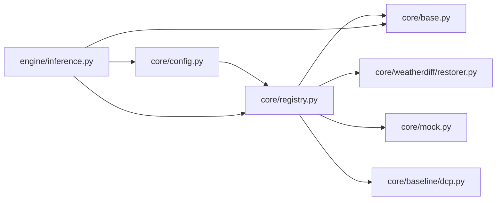

# 配置管理API

<cite>
**本文引用的文件**
- [core/config.py](file://core/config.py)
- [core/registry.py](file://core/registry.py)
- [core/base.py](file://core/base.py)
- [engine/inference.py](file://engine/inference.py)
- [configs/allweather.yaml](file://configs/allweather.yaml)
- [configs/haze.yaml](file://configs/haze.yaml)
- [configs/snow.yaml](file://configs/snow.yaml)
- [configs/dcp.yaml](file://configs/dcp.yaml)
- [configs/mock.yaml](file://configs/mock.yaml)
- [app.py](file://app.py)
</cite>

## 目录
1. [简介](#简介)
2. [项目结构](#项目结构)
3. [核心组件](#核心组件)
4. [架构总览](#架构总览)
5. [详细组件分析](#详细组件分析)
6. [依赖关系分析](#依赖关系分析)
7. [性能与内存特性](#性能与内存特性)
8. [故障排查指南](#故障排查指南)
9. [结论](#结论)
10. [附录：YAML配置规范与示例](#附录yaml配置规范与示例)

## 简介
本文件为“恶劣天气图像复原系统”的配置管理API文档，聚焦以下目标：
- YAML配置文件结构与参数定义
- 配置的加载、合并、验证与访问接口
- 环境检测机制与默认值处理
- 不同天气类型（雨、雾、雪）的配置说明与示例
- 配置热重载、参数覆盖与环境变量支持

该系统通过统一的配置入口与模型注册表，将“配置即契约”贯穿到UI、评测与推理管线中，确保多模型、多场景的可扩展性与可维护性。

## 项目结构
- 配置集中存放于 configs/*.yaml，每个文件描述一种天气或基线方法的具体参数
- core/config.py 提供配置的读取、路径解析与工具函数
- core/registry.py 根据配置中的 restorer 字段动态构建具体复原器实例
- engine/inference.py 提供推理编排、权重缓存与运行时参数覆盖
- app.py 为界面启动入口，并展示环境变量使用方式

图表来源
- [app.py:1-37](file://app.py#L1-L37)
- [core/config.py:25-98](file://core/config.py#L25-L98)
- [core/registry.py:68-84](file://core/registry.py#L68-L84)
- [engine/inference.py:22-68](file://engine/inference.py#L22-L68)

章节来源
- [app.py:1-37](file://app.py#L1-L37)
- [core/config.py:1-98](file://core/config.py#L1-L98)
- [core/registry.py:1-85](file://core/registry.py#L1-L85)
- [engine/inference.py:1-153](file://engine/inference.py#L1-L153)

## 核心组件
- 配置加载与工具
  - load_config(path): 读取YAML，解析相对路径为绝对路径，注入 _config_path
  - list_weather_configs(): 扫描 configs/*.y*ml，返回可用配置名与路径映射
  - get_config(weather): 按天气名获取配置
  - config_display_name(cfg)/weight_path(cfg)/ensure_dir(path): 显示名、权重路径、目录创建
- 模型注册与构建
  - register_restorer(name): 装饰器，将复原器类注册到全局表
  - build_restorer(config): 根据配置中的 restorer 字段构造实例；支持 AWR_MOCK=1 强制降级为 mock
- 推理编排与缓存
  - ModelCache.get(weather, overrides): 按配置名+覆盖参数获取已加载的复原器；支持运行时参数覆盖
  - restore_array/restore_file/restore_batch: 单图、文件、批量推理统一入口
  - _deep_update(base, patch): 递归合并配置（不修改原字典）

章节来源
- [core/config.py:25-98](file://core/config.py#L25-L98)
- [core/registry.py:29-84](file://core/registry.py#L29-L84)
- [engine/inference.py:22-153](file://engine/inference.py#L22-L153)

## 架构总览
配置驱动的统一复原流程如下：
- UI/评测调用 engine.inference 提供的 API
- 通过 core.config.get_config 读取对应 weather 的 YAML
- 通过 core.registry.build_restorer 动态构建复原器实例
- 由 BaseRestorer.restore_with_stats 统一封装计时、校验与结果包装
- WeatherDiffRestorer/MockRestorer/DCP 等具体实现按需加载权重并执行复原

图表来源
- [engine/inference.py:80-96](file://engine/inference.py#L80-L96)
- [core/config.py:77-79](file://core/config.py#L77-L79)
- [core/registry.py:68-84](file://core/registry.py#L68-L84)
- [core/base.py:111-138](file://core/base.py#L111-L138)

## 详细组件分析

### 配置加载与访问API
- load_config(path)
  - 支持传入 "rain"/"rain.yaml"/"configs/rain.yaml" 等相对形式
  - 自动解析 weights.path 为绝对路径，写入 weights.abs_path
  - 注入 _config_path 便于定位问题
- list_weather_configs()
  - 扫描 configs/*.y*ml，按 WEATHER_ORDER 排序返回
- get_config(weather)
  - 便捷方法，等价于 load_config(weather)
- weight_path(cfg)
  - 返回权重绝对路径；无权重时返回 None（如 dcp）
- ensure_dir(path)
  - 创建目录（含父目录），幂等

章节来源
- [core/config.py:25-98](file://core/config.py#L25-L98)

### 模型注册与构建API
- register_restorer(name)
  - 类装饰器，将继承 BaseRestorer 的类登记到全局表
- build_restorer(config)
  - 从配置中取 restorer 字段，默认 fallback 到 mock
  - 支持 AWR_MOCK=1 环境变量强制降级为 mock
  - 延迟导入具体实现模块，避免启动即加载重型依赖
- available_restorers()
  - 列出所有可注册的复原器名称（含未加载的）

章节来源
- [core/registry.py:29-84](file://core/registry.py#L29-L84)

### 推理编排与参数覆盖
- ModelCache.get(weather, overrides)
  - 首次访问时加载权重并缓存实例
  - 支持运行时参数覆盖（如 sampling.timesteps），不重新加载权重
  - 键仅包含影响权重的维度，采样步数变化直接更新配置
- restore_array/restore_file/restore_batch
  - 统一入口，封装进度回调、取消回调、错误隔离
- _deep_update(base, patch)
  - 递归合并，保留嵌套字典结构

章节来源
- [engine/inference.py:22-68](file://engine/inference.py#L22-L68)
- [engine/inference.py:135-143](file://engine/inference.py#L135-L143)

### 基础接口与校验
- BaseRestorer
  - 抽象方法 load_model()/restore()
  - restore_with_stats() 统一计时、尺寸校验、结果包装
  - validate_image() 严格校验输入/输出格式
  - check_cancel()/report() 安全地处理取消与进度上报
- RestoreResult
  - 包含 image、elapsed、steps、device、restorer、extra

章节来源
- [core/base.py:37-185](file://core/base.py#L37-L185)

### 具体复原器与配置绑定
- WeatherDiffRestorer
  - 设备选择：优先 AWR_DEVICE，否则 cuda/cpu 自动检测
  - 权重加载：支持 EMA 权重覆盖
  - 预处理/后处理：长边限制、尺寸对齐、小图填充、还原原始尺寸
  - 显存自适应：OOM 时自动降低 patch_batch_size 重试
- MockRestorer
  - 无需权重/GPU，模拟逐步去噪过程，支持 load_delay/step_delay
- DCP（暗通道先验）
  - 传统算法，无需权重，参数在 dcp.* 下

章节来源
- [core/weatherdiff/restorer.py:47-244](file://core/weatherdiff/restorer.py#L47-L244)
- [core/mock.py:27-81](file://core/mock.py#L27-L81)
- [configs/dcp.yaml:1-21](file://configs/dcp.yaml#L1-L21)

## 依赖关系分析
- 配置与实现解耦：UI/评测只依赖 core.base 与 engine.inference
- 延迟加载：core.registry 仅在需要时导入具体实现，避免启动开销
- 环境变量：AWR_MOCK=1 强制降级；AWR_DEVICE 指定设备
- 权重路径：core.config 自动解析相对路径为绝对路径

图表来源
- [core/config.py:25-98](file://core/config.py#L25-L98)
- [core/registry.py:68-84](file://core/registry.py#L68-L84)
- [engine/inference.py:16-19](file://engine/inference.py#L16-L19)

章节来源
- [core/registry.py:1-85](file://core/registry.py#L1-L85)
- [engine/inference.py:1-153](file://engine/inference.py#L1-L153)

## 性能与内存特性
- 权重缓存：ModelCache 保证同一配置只加载一次，切换天气不重复占显存
- 显存自适应：WeatherDiffRestorer 在 OOM 时自动降低 batch 并重试
- 设备选择：AWR_DEVICE 可强制 CPU/CUDA；否则自动检测
- 进度与预览：Mock/WeatherDiff 均支持 step-by-step 进度回调与中间预览

章节来源
- [engine/inference.py:22-68](file://engine/inference.py#L22-L68)
- [core/weatherdiff/restorer.py:137-162](file://core/weatherdiff/restorer.py#L137-L162)
- [core/weatherdiff/restorer.py:204-209](file://core/weatherdiff/restorer.py#L204-L209)

## 故障排查指南
- 找不到配置文件
  - 现象：load_config 抛出 FileNotFoundError
  - 处理：确认 configs 目录下存在对应 *.yaml，或使用 get_config(weather)
- 权重缺失
  - 现象：WeightNotFoundError
  - 处理：下载权重至 weights/ 目录，或检查 configs 中 weights.path
- 未知 restorer
  - 现象：KeyError/RuntimeError
  - 处理：确认 restorer 字段与已注册实现一致；必要时设置 AWR_MOCK=1
- 显存不足
  - 现象：RuntimeError out of memory
  - 处理：系统会自动降低 patch_batch_size；也可调小 image_size/grid_r
- 设备选择异常
  - 现象：运行在非预期设备
  - 处理：设置 AWR_DEVICE=cpu 或 cuda

章节来源
- [core/config.py:46-47](file://core/config.py#L46-L47)
- [core/weatherdiff/restorer.py:51-56](file://core/weatherdiff/restorer.py#L51-L56)
- [core/registry.py:54-61](file://core/registry.py#L54-L61)
- [core/weatherdiff/restorer.py:156-162](file://core/weatherdiff/restorer.py#L156-L162)
- [core/weatherdiff/restorer.py:204-209](file://core/weatherdiff/restorer.py#L204-L209)

## 结论
该配置管理系统以YAML为中心，结合注册表与推理编排，实现了：
- 配置即契约：UI/评测/推理统一依赖配置结构
- 动态构建：按 restorer 字段懒加载具体实现
- 灵活覆盖：运行时参数覆盖与缓存复用
- 健壮容错：路径解析、设备选择、显存自适应、错误隔离
- 可扩展：新增天气只需添加YAML并在注册表中声明

## 附录：YAML配置规范与示例

### 通用字段说明
- name: 配置标识（用于内部识别）
- display_name: 界面显示名称
- description: 配置描述
- restorer: 指定使用的复原器实现（如 weatherdiff / mock / dcp）
- weights.path: 权重文件相对或绝对路径；系统会转换为绝对路径并存入 weights.abs_path
- data.*: 数据与预处理相关参数（如 image_size、channels、conditional、max_side、size_multiple）
- model.*: 模型结构参数（如 type、in_channels、out_ch、ch、ch_mult、num_res_blocks、attn_resolutions、dropout、resamp_with_conv、ema、ema_rate）
- diffusion.*: 扩散过程参数（如 beta_schedule、beta_start、beta_end、num_diffusion_timesteps）
- sampling.*: 采样与推理参数（如 timesteps、grid_r、eta、patch_batch_size、seed）
- 特定实现字段：
  - dcp.*: 暗通道先验参数（如 patch_size、omega、t0、guided_radius、guided_eps）
  - mock.*: 假模型参数（如 load_delay、step_delay）

章节来源
- [configs/allweather.yaml:1-47](file://configs/allweather.yaml#L1-L47)
- [configs/haze.yaml:1-46](file://configs/haze.yaml#L1-L46)
- [configs/snow.yaml:1-46](file://configs/snow.yaml#L1-L46)
- [configs/dcp.yaml:1-21](file://configs/dcp.yaml#L1-L21)
- [configs/mock.yaml:1-22](file://configs/mock.yaml#L1-L22)

### 不同天气类型的配置示例与说明
- 去雾（haze）
  - 适用场景：雾霾与雨雾叠加退化
  - 关键参数：data.image_size、sampling.timesteps、model.ema
  - 权重：与 allweather 共用同一份权重
- 去雪（snow）
  - 适用场景：雪花与雪条纹遮挡退化
  - 关键参数：同上
  - 权重：与 allweather 共用同一份权重
- 统一模型（allweather）
  - 适用场景：单一模型同时处理多种叠加退化
  - 关键参数：data.channels、model.ch/ch_mult、diffusion.num_diffusion_timesteps、sampling.grid_r
- 基线对照（dcp）
  - 适用场景：非扩散方法的定量对照
  - 特点：无需权重，纯传统算法
  - 关键参数：dcp.patch_size、dcp.omega、dcp.t0、dcp.guided_radius、dcp.guided_eps
- 假模型（mock）
  - 适用场景：联调用开发、无需权重/GPU
  - 关键参数：sampling.timesteps、mock.load_delay、mock.step_delay

章节来源
- [configs/haze.yaml:1-46](file://configs/haze.yaml#L1-L46)
- [configs/snow.yaml:1-46](file://configs/snow.yaml#L1-L46)
- [configs/allweather.yaml:1-47](file://configs/allweather.yaml#L1-L47)
- [configs/dcp.yaml:1-21](file://configs/dcp.yaml#L1-L21)
- [configs/mock.yaml:1-22](file://configs/mock.yaml#L1-L22)

### 环境检测与默认值处理
- 设备检测
  - 优先 AWR_DEVICE；否则自动选择 cuda（若可用）或 cpu
- 降级开关
  - AWR_MOCK=1：任何非 mock 配置都会降级为 mock，便于无GPU/无torch环境开发
- 默认值策略
  - 若缺少 sampling.timesteps，默认使用 1
  - 若 weights 不存在，则返回 None（如 dcp）
  - 若 restorer 未指定，默认使用 mock

章节来源
- [core/weatherdiff/restorer.py:204-209](file://core/weatherdiff/restorer.py#L204-L209)
- [core/registry.py:74-77](file://core/registry.py#L74-L77)
- [core/base.py:144-148](file://core/base.py#L144-L148)
- [core/config.py:86-91](file://core/config.py#L86-L91)

### 配置热重载与参数覆盖
- 热重载
  - 当前实现未提供“监听YAML变更并自动重载”的能力
  - 推荐做法：在UI或评测层检测到配置变更后，释放旧实例并重新构建
- 参数覆盖
  - 使用 ModelCache.get(weather, overrides) 进行运行时覆盖
  - 覆盖示例：{"sampling": {"timesteps": 10}}
  - 覆盖生效范围：仅影响本次推理行为，不会持久化到YAML
  - 注意：仅当覆盖参数不影响权重加载时，才会复用缓存实例

章节来源
- [engine/inference.py:33-52](file://engine/inference.py#L33-L52)
- [engine/inference.py:135-143](file://engine/inference.py#L135-L143)

### 环境变量一览
- AWR_MOCK=1：强制使用假模型，跳过权重与torch依赖
- AWR_DEVICE=cpu|cuda：强制指定设备
- 其他：可通过 os.environ 扩展，但需同步更新 registry/weatherdiff 逻辑

章节来源
- [core/registry.py:74-77](file://core/registry.py#L74-L77)
- [core/weatherdiff/restorer.py:204-209](file://core/weatherdiff/restorer.py#L204-L209)
- [app.py:1-37](file://app.py#L1-L37)