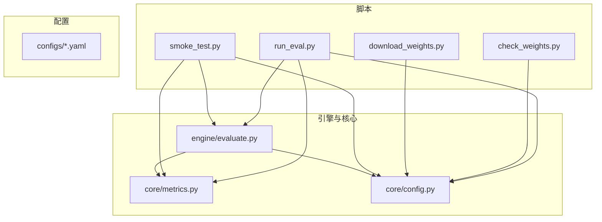
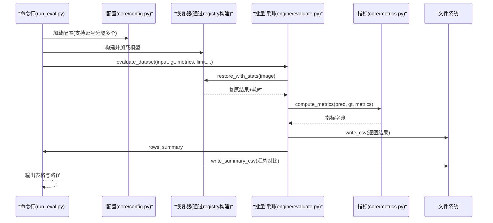
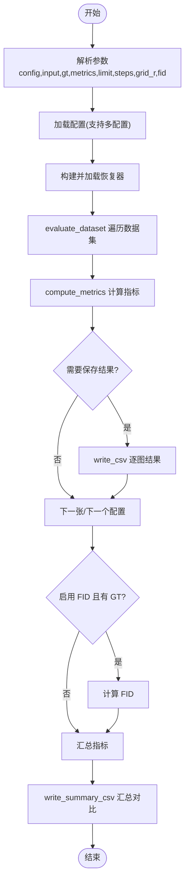
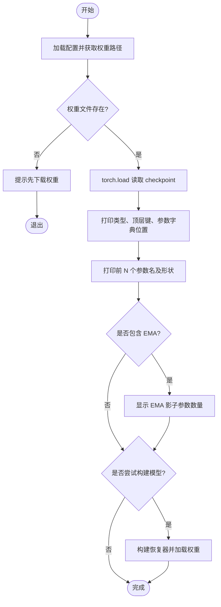
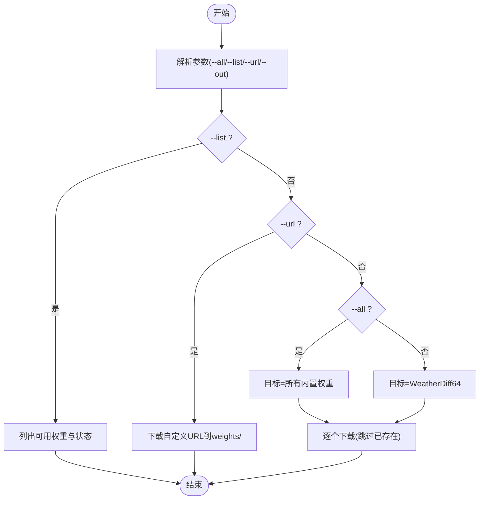
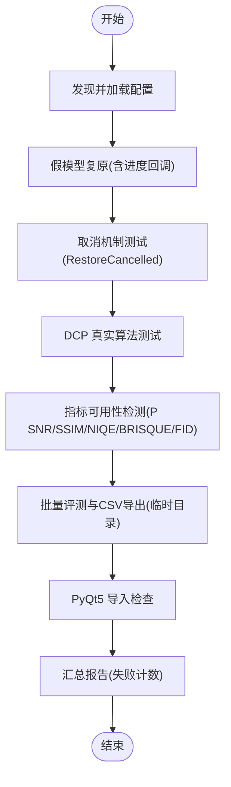
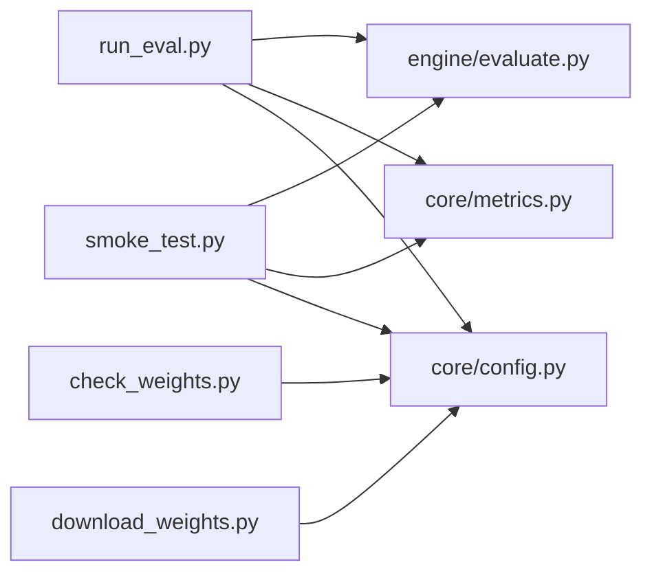

# 命令行工具

<cite>
**本文引用的文件**
- [scripts/run_eval.py](file://scripts/run_eval.py)
- [scripts/check_weights.py](file://scripts/check_weights.py)
- [scripts/download_weights.py](file://scripts/download_weights.py)
- [scripts/smoke_test.py](file://scripts/smoke_test.py)
- [engine/evaluate.py](file://engine/evaluate.py)
- [core/metrics.py](file://core/metrics.py)
- [core/config.py](file://core/config.py)
- [configs/mock.yaml](file://configs/mock.yaml)
- [configs/rain.yaml](file://configs/rain.yaml)
- [configs/dcp.yaml](file://configs/dcp.yaml)
- [configs/allweather.yaml](file://configs/allweather.yaml)
</cite>

## 目录
1. [简介](#简介)
2. [项目结构](#项目结构)
3. [核心组件](#核心组件)
4. [架构总览](#架构总览)
5. [详细组件分析](#详细组件分析)
6. [依赖关系分析](#依赖关系分析)
7. [性能注意事项](#性能注意事项)
8. [故障排查指南](#故障排查指南)
9. [结论](#结论)
10. [附录：参数清单与使用示例](#附录参数清单与使用示例)

## 简介
本仓库提供一组面向“恶劣天气图像复原”的命令行工具，覆盖权重下载、权重检查、批量评测与环境冒烟测试。这些脚本帮助模型组、评测组和界面组快速完成环境自检、数据评测、结果导出与对比汇总，同时支持不同模型（如 WeatherDiffusion 统一模型、DCP 基线）和多种指标（PSNR、SSIM、LPIPS、NIQE、BRISQUE、FID）。

## 项目结构
- 脚本入口位于 scripts/ 目录，分别负责：
  - 批量评测：run_eval.py
  - 权重检查：check_weights.py
  - 权重下载：download_weights.py
  - 冒烟测试：smoke_test.py
- 核心能力由 core/ 与 engine/ 提供：
  - engine/evaluate.py：批量评测流程、CSV 导出、汇总
  - core/metrics.py：指标计算、可用性探测、格式化
  - core/config.py：配置加载、路径解析、权重路径获取
- 配置文件位于 configs/，包含 mock、rain、haze、snow、allweather、dcp 等场景配置

图表来源
- [scripts/run_eval.py:1-126](file://scripts/run_eval.py#L1-L126)
- [scripts/check_weights.py:1-91](file://scripts/check_weights.py#L1-L91)
- [scripts/download_weights.py:1-121](file://scripts/download_weights.py#L1-L121)
- [scripts/smoke_test.py:1-156](file://scripts/smoke_test.py#L1-L156)
- [engine/evaluate.py:1-181](file://engine/evaluate.py#L1-L181)
- [core/metrics.py:1-315](file://core/metrics.py#L1-L315)
- [core/config.py:1-98](file://core/config.py#L1-L98)

章节来源
- [scripts/run_eval.py:1-126](file://scripts/run_eval.py#L1-L126)
- [engine/evaluate.py:1-181](file://engine/evaluate.py#L1-L181)
- [core/metrics.py:1-315](file://core/metrics.py#L1-L315)
- [core/config.py:1-98](file://core/config.py#L1-L98)

## 核心组件
- 批量评测（run_eval.py + engine/evaluate.py）
  - 遍历数据集，调用恢复器进行复原，计算指标并导出逐图 CSV 与汇总 CSV
  - 支持多方法并行评测与对比表生成
- 权重检查（check_weights.py）
  - 读取 checkpoint，打印参数键名、形状、是否带 module. 前缀、是否含 EMA
  - 可选尝试构建模型并加载权重，验证兼容性
- 权重下载（download_weights.py）
  - 从官方直链下载预训练权重，支持断点续传、列出可下载项、自定义 URL
- 冒烟测试（smoke_test.py）
  - 无需权重/GPU/Torch，验证依赖、配置、假模型、DCP、指标、批量评测与 CSV 导出、界面导入

章节来源
- [scripts/run_eval.py:1-126](file://scripts/run_eval.py#L1-L126)
- [scripts/check_weights.py:1-91](file://scripts/check_weights.py#L1-L91)
- [scripts/download_weights.py:1-121](file://scripts/download_weights.py#L1-L121)
- [scripts/smoke_test.py:1-156](file://scripts/smoke_test.py#L1-L156)

## 架构总览
以下序列图展示一次典型批量评测流程：命令行解析 -> 构建恢复器 -> 评估数据集 -> 计算指标 -> 导出 CSV -> 汇总对比。

图表来源
- [scripts/run_eval.py:32-91](file://scripts/run_eval.py#L32-L91)
- [engine/evaluate.py:51-116](file://engine/evaluate.py#L51-L116)
- [core/metrics.py:134-177](file://core/metrics.py#L134-L177)
- [core/config.py:25-57](file://core/config.py#L25-L57)

## 详细组件分析

### 批量评测脚本 run_eval.py
- 功能要点
  - 支持一次运行多个配置（逗号分隔），自动构建对应恢复器并评测
  - 支持指定指标列表、限制图片数量、覆盖采样步数与滑窗步长
  - 可选计算 FID（需 GT 目录且安装 pytorch-fid）
  - 输出：逐图 CSV、汇总 CSV、控制台进度与均值
- 关键流程
  - 解析参数 -> 加载配置 -> 构建恢复器 -> 调用 evaluate_dataset -> 写 CSV -> 汇总
- 错误处理
  - 单张图失败不中断整批；FID 计算异常会捕获并提示
- 性能相关
  - 可通过 steps/grid_r 控制采样步数与滑窗步长以平衡速度与质量

图表来源
- [scripts/run_eval.py:32-91](file://scripts/run_eval.py#L32-L91)
- [engine/evaluate.py:51-116](file://engine/evaluate.py#L51-L116)
- [core/metrics.py:112-128](file://core/metrics.py#L112-L128)

章节来源
- [scripts/run_eval.py:1-126](file://scripts/run_eval.py#L1-L126)
- [engine/evaluate.py:1-181](file://engine/evaluate.py#L1-L181)
- [core/metrics.py:1-315](file://core/metrics.py#L1-L315)

### 权重检查脚本 check_weights.py
- 作用
  - 在不实现 UNet 的情况下，仅读取 checkpoint，打印参数键名、形状、是否带 DataParallel 前缀、是否包含 EMA 影子参数
  - 可选尝试构建模型并加载权重，验证兼容性
- 适用场景
  - 移植或对接新模型前的权重结构确认
  - 排查 state_dict key 命名差异（如 module. 前缀）
- 行为说明
  - 若未找到权重文件，提示先执行下载脚本
  - 若未安装 torch，提示安装后再试

图表来源
- [scripts/check_weights.py:24-86](file://scripts/check_weights.py#L24-L86)
- [core/config.py:86-91](file://core/config.py#L86-L91)

章节来源
- [scripts/check_weights.py:1-91](file://scripts/check_weights.py#L1-L91)
- [core/config.py:1-98](file://core/config.py#L1-L98)

### 权重下载脚本 download_weights.py
- 功能
  - 下载官方 WeatherDiffusion 预训练权重（WeatherDiff64/128）
  - 支持 --list 查看可下载项与状态、--all 全部下载、--url 自定义地址下载
  - 断点续传：已存在的 .part 文件会被继续写入，完成后替换为最终文件
- 存储位置
  - 默认保存到 weights/ 目录，具体文件名由配置决定
- 错误处理
  - 下载失败时提示备选方案（浏览器/迅雷直接下载后放入 weights/）

图表来源
- [scripts/download_weights.py:82-116](file://scripts/download_weights.py#L82-L116)
- [scripts/download_weights.py:48-79](file://scripts/download_weights.py#L48-L79)

章节来源
- [scripts/download_weights.py:1-121](file://scripts/download_weights.py#L1-L121)

### 冒烟测试脚本 smoke_test.py
- 目的
  - 第一天环境自检：验证依赖、配置加载、假模型复原、取消机制、DCP 算法、指标计算、批量评测与 CSV 导出、PyQt5 导入
- 特点
  - 不需要权重、GPU、Torch（除 PyQt5 可选）
  - 自动生成临时数据，跑通全流程并报告通过/失败项
- 输出
  - 逐项 [ OK ] / [FAIL] 报告，最后统计失败项数量

图表来源
- [scripts/smoke_test.py:35-151](file://scripts/smoke_test.py#L35-L151)

章节来源
- [scripts/smoke_test.py:1-156](file://scripts/smoke_test.py#L1-L156)

## 依赖关系分析
- 模块耦合
  - run_eval.py 依赖 engine/evaluate.py、core/metrics.py、core/config.py
  - check_weights.py 依赖 core/config.py，可选依赖 torch
  - download_weights.py 依赖 core/config.py，使用标准库 urllib
  - smoke_test.py 依赖 core/base、core/config、core/image_utils、core/metrics、engine/evaluate
- 外部依赖
  - PyYAML（配置加载）
  - Torch/LPIPS（可选指标）
  - PyIQA（NIQE/BRISQUE）
  - PyTorch-FID（FID）
  - PyQt5（界面，可选）

图表来源
- [scripts/run_eval.py:20-29](file://scripts/run_eval.py#L20-L29)
- [scripts/check_weights.py:15-22](file://scripts/check_weights.py#L15-L22)
- [scripts/download_weights.py:15-24](file://scripts/download_weights.py#L15-L24)
- [scripts/smoke_test.py:18-29](file://scripts/smoke_test.py#L18-L29)

章节来源
- [scripts/run_eval.py:1-126](file://scripts/run_eval.py#L1-L126)
- [scripts/check_weights.py:1-91](file://scripts/check_weights.py#L1-L91)
- [scripts/download_weights.py:1-121](file://scripts/download_weights.py#L1-L121)
- [scripts/smoke_test.py:1-156](file://scripts/smoke_test.py#L1-L156)

## 性能注意事项
- 采样步数与滑窗步长
  - 通过 --steps 与 --grid-r 调整扩散采样步数与滑窗步长，影响速度与质量
- 显存与尺寸
  - 大分辨率或 patch_size 较大时显存占用更高；可按需降低 image_size 或增大 grid_r
- 指标开销
  - LPIPS/NIQE/BRISQUE/FID 需要额外依赖与计算时间；按需启用
- 批量评测
  - 单张图失败不会中断整体流程；建议先用小样本 limit 调试

[本节为通用指导，不直接分析具体文件]

## 故障排查指南
- 权重不存在
  - 使用 download_weights.py 下载；或使用 --url 指定自定义权重
- 缺少依赖
  - 指标不可用时，根据提示安装相应包（lpips、pyiqa、pytorch-fid）
- 尺寸不一致
  - 指标计算要求预测与 GT 尺寸一致；engine/evaluate.py 会对 GT 做缩放对齐
- 下载失败
  - 网络问题或服务器限制；可使用浏览器/迅雷下载后放入 weights/ 目录
- 取消机制
  - 冒烟测试中会验证 cancel_cb 是否能正确抛出 RestoreCancelled

章节来源
- [scripts/download_weights.py:72-79](file://scripts/download_weights.py#L72-L79)
- [engine/evaluate.py:100-106](file://engine/evaluate.py#L100-L106)
- [scripts/smoke_test.py:67-81](file://scripts/smoke_test.py#L67-L81)

## 结论
本套命令行工具覆盖了从环境自检、权重管理到批量评测与结果导出的完整链路。通过统一的配置系统与模块化设计，用户可灵活组合不同模型与指标，快速验证与对比不同方法的性能。建议在开发初期优先运行冒烟测试，随后使用权重下载与检查脚本确保模型就绪，再开展批量评测与结果分析。

[本节为总结性内容，不直接分析具体文件]

## 附录：参数清单与使用示例

### 批量评测 run_eval.py
- 参数
  - --config：配置名，逗号分隔可一次跑多个方法（如 rain,dcp）
  - --input：退化图目录（必填）
  - --gt：GT 目录（可选；不提供则只算无参考指标）
  - --out：结果输出根目录（默认 outputs/eval）
  - --metrics：指标列表，逗号分隔（psnr,ssim,lpips,niqe,brisque）
  - --limit：只跑前 N 张，0 表示全部
  - --steps：覆盖采样步数
  - --grid-r：覆盖滑窗步长
  - --fid：额外计算 FID（需要 GT 目录与 pytorch-fid）
- 使用示例
  - 用假模型快速跑通流程（无需权重/GPU）
  - 真实模型 + 三类天气
  - 一次跑多个方法做对照，自动生成汇总对比表
  - 附带计算 FID

章节来源
- [scripts/run_eval.py:32-43](file://scripts/run_eval.py#L32-L43)
- [scripts/run_eval.py:49-91](file://scripts/run_eval.py#L49-L91)

### 权重检查 check_weights.py
- 参数
  - --config：配置名（rain/haze/snow/allweather/dcp）
  - --limit：打印前 N 个参数名
  - --try-build：尝试真正构建模型并加载权重
- 使用示例
  - 检查默认配置的权重结构
  - 限制打印条目数
  - 尝试构建并加载以验证兼容性

章节来源
- [scripts/check_weights.py:24-29](file://scripts/check_weights.py#L24-L29)
- [scripts/check_weights.py:39-86](file://scripts/check_weights.py#L39-L86)

### 权重下载 download_weights.py
- 参数
  - --all：下载全部权重
  - --list：列出可下载的权重及其状态
  - --url：下载自定义 URL（备选模型权重）
  - --out：配合 --url 指定保存文件名
- 使用示例
  - 下载默认 WeatherDiff64
  - 下载全部权重
  - 列出可下载项
  - 下载自定义 URL 权重

章节来源
- [scripts/download_weights.py:82-116](file://scripts/download_weights.py#L82-L116)
- [scripts/download_weights.py:48-79](file://scripts/download_weights.py#L48-L79)

### 冒烟测试 smoke_test.py
- 参数
  - 无（直接运行）
- 使用示例
  - 首次运行以验证环境与依赖
  - 在修改代码后再次运行以确保全链路可用

章节来源
- [scripts/smoke_test.py:35-151](file://scripts/smoke_test.py#L35-L151)

### 自动化脚本编写指导与集成建议
- 推荐顺序
  - 先运行冒烟测试，确保基础环境可用
  - 使用 download_weights.py 准备权重，再用 check_weights.py 验证
  - 使用 run_eval.py 进行批量评测，结合 --metrics 与 --fid 按需扩展
- 集成建议
  - 将 run_eval.py 纳入 CI 流水线，对关键数据集进行回归评测
  - 使用 --limit 进行快速验证，生产环境去掉限制
  - 将 CSV 结果上传至版本化存储，便于对比历史结果
  - 针对不同配置（rain/haze/snow/allweather/dcp）建立标准化评测模板

[本节为通用指导，不直接分析具体文件]