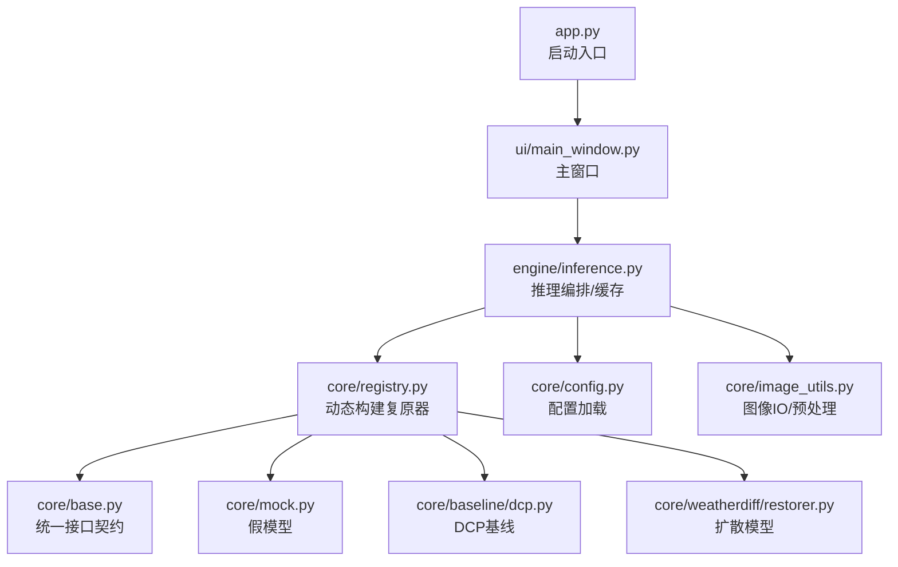
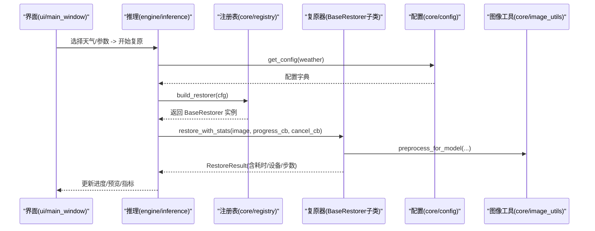
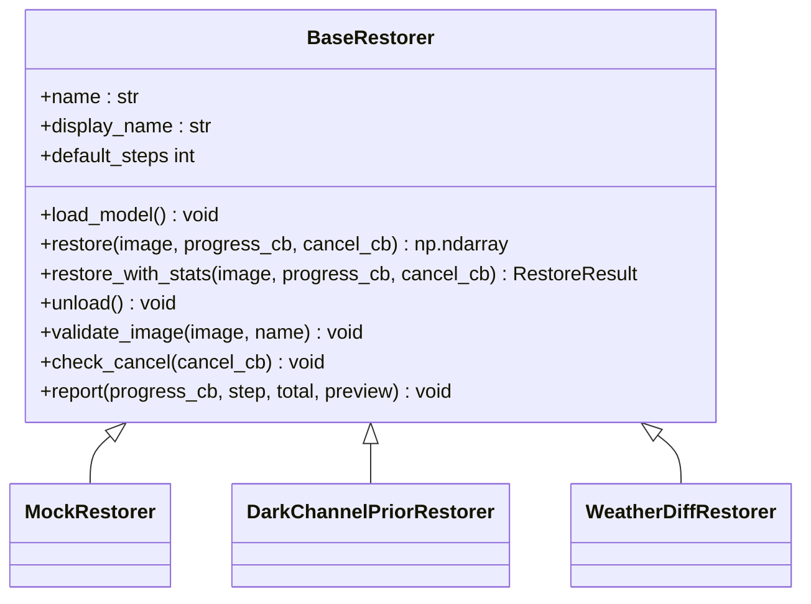
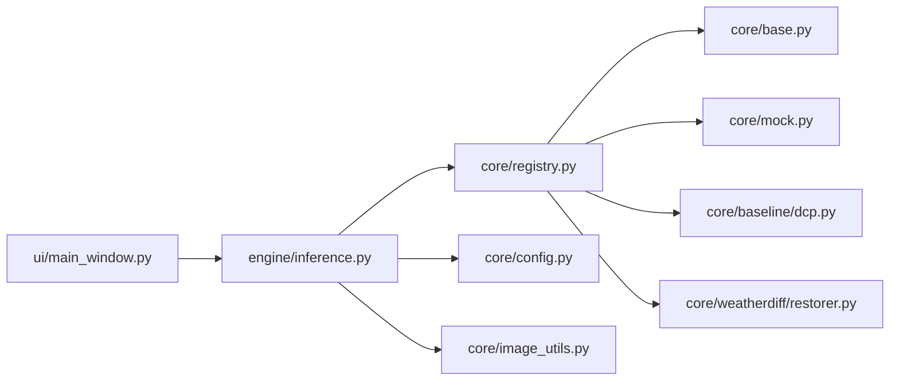

# 代码规范

<cite>
**本文引用的文件**
- [app.py](file://app.py)
- [core/base.py](file://core/base.py)
- [core/config.py](file://core/config.py)
- [core/registry.py](file://core/registry.py)
- [core/image_utils.py](file://core/image_utils.py)
- [core/mock.py](file://core/mock.py)
- [core/baseline/dcp.py](file://core/baseline/dcp.py)
- [core/weatherdiff/restorer.py](file://core/weatherdiff/restorer.py)
- [engine/inference.py](file://engine/inference.py)
- [ui/main_window.py](file://ui/main_window.py)
- [scripts/smoke_test.py](file://scripts/smoke_test.py)
- [requirements.txt](file://requirements.txt)
</cite>

## 目录
1. [简介](#简介)
2. [项目结构](#项目结构)
3. [核心组件](#核心组件)
4. [架构总览](#架构总览)
5. [详细组件分析](#详细组件分析)
6. [依赖关系分析](#依赖关系分析)
7. [性能注意事项](#性能注意事项)
8. [故障排查指南](#故障排查指南)
9. [结论](#结论)
10. [附录](#附录)

## 简介
本指南面向本项目“基于扩散模型的恶劣天气图像复原系统”的编码规范与开发流程，覆盖以下方面：
- 编码风格约定：命名、注释、文件组织、接口契约
- 单元测试与测试要求：用例设计、Mock 使用、覆盖率建议
- 代码审查与版本控制：Git 工作流、分支管理、提交信息规范
- 性能优化原则：内存管理、计算效率、GPU 资源利用
- 调试技巧与常见问题：CUDA 显存不足、模型加载失败等

本指南严格依据仓库现有实现进行提炼，确保可执行、可落地。

## 项目结构
项目采用分层与按功能域组织的混合结构：
- core：统一接口契约（BaseRestorer）、配置加载、注册表、图像处理工具、各复原器实现（mock、dcp、weatherdiff）
- engine：推理编排、批量处理、结果缓存（ModelCache）
- ui：PyQt5 界面（单图复原、批量评测、环境信息）
- configs：不同天气/方法的 YAML 配置
- scripts：环境自检与冒烟测试
- weights/data：权重与数据（README 说明）

图表来源
- [app.py:19-36](file://app.py#L19-L36)
- [ui/main_window.py:499-515](file://ui/main_window.py#L499-L515)
- [engine/inference.py:22-68](file://engine/inference.py#L22-L68)
- [core/registry.py:68-84](file://core/registry.py#L68-L84)
- [core/base.py:61-148](file://core/base.py#L61-L148)
- [core/config.py:25-57](file://core/config.py#L25-L57)
- [core/image_utils.py:145-167](file://core/image_utils.py#L145-L167)

章节来源
- [app.py:19-36](file://app.py#L19-L36)
- [ui/main_window.py:499-515](file://ui/main_window.py#L499-L515)
- [engine/inference.py:22-68](file://engine/inference.py#L22-L68)
- [core/registry.py:68-84](file://core/registry.py#L68-L84)
- [core/base.py:61-148](file://core/base.py#L61-L148)
- [core/config.py:25-57](file://core/config.py#L25-L57)
- [core/image_utils.py:145-167](file://core/image_utils.py#L145-L167)

## 核心组件
- 统一接口契约（BaseRestorer）：定义 load_model、restore、unload、进度回调、取消回调、输入输出格式校验、统计封装 RestoreResult。所有复原器必须继承并遵循该契约。
- 配置加载（config）：读取 YAML，解析相对路径为绝对路径，注入 _config_path，提供 weather 配置列表与显示名。
- 模型注册表（registry）：通过装饰器 @register_restorer 将具体复原器注册到名称空间；build_restorer 根据配置动态构造实例；支持 AWR_MOCK=1 降级为 mock。
- 图像工具（image_utils）：统一图像 IO、尺寸限制、对齐、填充、归一化、USM 锐化、合成演示图等。
- 推理编排（engine.inference）：ModelCache 缓存已加载的 restorer；提供 restore_array/restore_file/restore_batch；保证 UI 与命令行行为一致。
- 界面（ui.main_window）：单图复原、批量评测、环境信息页；通过 worker 异步调用推理，支持进度与预览。

章节来源
- [core/base.py:61-185](file://core/base.py#L61-L185)
- [core/config.py:25-98](file://core/config.py#L25-L98)
- [core/registry.py:1-85](file://core/registry.py#L1-L85)
- [core/image_utils.py:1-253](file://core/image_utils.py#L1-L253)
- [engine/inference.py:22-153](file://engine/inference.py#L22-L153)
- [ui/main_window.py:61-515](file://ui/main_window.py#L61-L515)

## 架构总览
系统以 BaseRestorer 为契约中心，UI 与评测层仅依赖抽象接口；具体实现通过 registry 动态加载；engine 负责缓存与批处理；configs 驱动行为；image_utils 提供统一的图像数据约定。

图表来源
- [ui/main_window.py:188-240](file://ui/main_window.py#L188-L240)
- [engine/inference.py:70-78](file://engine/inference.py#L70-L78)
- [core/registry.py:68-84](file://core/registry.py#L68-L84)
- [core/config.py:77-83](file://core/config.py#L77-L83)
- [core/base.py:111-148](file://core/base.py#L111-L148)
- [core/image_utils.py:145-167](file://core/image_utils.py#L145-L167)

## 详细组件分析

### 统一接口契约（BaseRestorer）
- 职责：定义复原器最小实现集、输入输出约束、进度与取消机制、统计封装。
- 关键约定：
  - 图像格式：numpy.ndarray，dtype=uint8，shape=(H,W,3)，RGB 通道顺序
  - restore 输出尺寸必须与输入一致
  - 进度回调：progress_cb(step, total, preview)
  - 取消回调：cancel_cb() -> bool，触发时抛出 RestoreCancelled
  - 统一入口：restore_with_stats 负责计时、校验、封装 RestoreResult
- 复杂度：validate_image O(1)；restore_with_stats 时间取决于具体实现；空间主要为中间张量与结果数组。

图表来源
- [core/base.py:61-185](file://core/base.py#L61-L185)
- [core/mock.py:27-81](file://core/mock.py#L27-L81)
- [core/baseline/dcp.py:23-126](file://core/baseline/dcp.py#L23-L126)
- [core/weatherdiff/restorer.py:32-244](file://core/weatherdiff/restorer.py#L32-L244)

章节来源
- [core/base.py:61-185](file://core/base.py#L61-L185)

### 配置加载（core/config）
- 能力：加载 YAML，自动解析相对路径为绝对路径，注入 _config_path；列出可用配置并按 WEATHER_ORDER 排序；提供 display_name 与 weight_path 辅助函数。
- 最佳实践：新增天气只需添加 YAML；避免硬编码路径；使用 ensure_dir 创建输出目录。

章节来源
- [core/config.py:1-98](file://core/config.py#L1-L98)

### 模型注册表（core/registry）
- 能力：延迟导入实现模块，避免启动即加载 torch；@register_restorer 装饰器登记类；build_restorer 根据配置构造实例；AWR_MOCK=1 强制降级为 mock。
- 扩展方式：新增复原器时，在对应模块内用 @register_restorer("xxx") 注册，并在 _LAZY_MODULES 中声明延迟导入映射。

章节来源
- [core/registry.py:1-85](file://core/registry.py#L1-L85)

### 图像工具（core/image_utils）
- 能力：统一图像 IO、尺寸限制、对齐到倍数、反射填充、归一化、USM 锐化、对比拼接、生成演示图。
- 约定：内存中图像一律 RGB uint8 (H,W,3)。

章节来源
- [core/image_utils.py:1-253](file://core/image_utils.py#L1-L253)

### 推理编排（engine/inference）
- 能力：ModelCache 按配置名缓存 restorer 实例，避免重复加载；restore_array/restore_file/restore_batch 提供统一入口；支持 on_item 回调与错误隔离。
- 性能要点：release_others/clear 释放显存；_deep_update 合并运行时覆盖参数。

章节来源
- [engine/inference.py:22-153](file://engine/inference.py#L22-L153)

### 界面（ui/main_window）
- 能力：单图复原（打开/拖拽、参数、进度、对比、指标、保存）、批量评测（目录选择、后台评测、表格、导出 CSV）、环境信息（依赖/指标/GPU/权重）。
- 交互：通过 RestoreWorker/EvalWorker 异步执行，避免阻塞 UI；支持取消与进度反馈。

章节来源
- [ui/main_window.py:61-515](file://ui/main_window.py#L61-L515)

### 假模型（core/mock）
- 能力：纯 numpy 模拟逐步去噪过程，支持进度回调、中间预览、可取消、耗时统计；无需权重与 GPU。
- 用途：界面组/评测组第一周联调与冒烟测试。

章节来源
- [core/mock.py:1-81](file://core/mock.py#L1-L81)

### 暗通道先验基线（core/baseline/dcp）
- 能力：纯 numpy 实现去雾，作为传统方法对照；包含暗通道、大气光估计、透射率细化与成像方程复原。
- 用途：指标表格中的传统方法列与演示兜底方案。

章节来源
- [core/baseline/dcp.py:1-126](file://core/baseline/dcp.py#L1-L126)

### 扩散模型复原器（core/weatherdiff/restorer）
- 能力：设备选择、权重加载（兼容 DataParallel 前缀与 EMA）、预处理、patch-based DDIM 采样、显存不足自动降 batch 重试、后处理还原尺寸。
- 容错：显存不足时捕获 RuntimeError，降低 patch_batch_size 并重试；EMA 权重应用提升效果。

章节来源
- [core/weatherdiff/restorer.py:1-244](file://core/weatherdiff/restorer.py#L1-L244)

## 依赖关系分析
- 耦合点：
  - UI 与评测层仅依赖 BaseRestorer 抽象，不关心具体实现，松耦合
  - registry 解耦具体模块导入，避免启动开销
  - engine 通过 ModelCache 集中管理实例生命周期
- 外部依赖：
  - PyTorch（可选，仅在 weatherdiff 需要）
  - PyQt5（界面）
  - numpy/Pillow/pyyaml/scikit-image（基础）
  - 指标库（lpips/pyiqa/pytorch-fid，可选）

图表来源
- [ui/main_window.py:499-515](file://ui/main_window.py#L499-L515)
- [engine/inference.py:22-68](file://engine/inference.py#L22-L68)
- [core/registry.py:18-26](file://core/registry.py#L18-L26)
- [core/base.py:61-148](file://core/base.py#L61-L148)
- [core/config.py:25-57](file://core/config.py#L25-L57)
- [core/image_utils.py:145-167](file://core/image_utils.py#L145-L167)

章节来源
- [requirements.txt:1-34](file://requirements.txt#L1-L34)

## 性能注意事项
- 显存管理
  - 扩散模型推理时若遇 CUDA out of memory，restorer 会自动降低 patch_batch_size 重试；必要时手动设置 sampling.patch_batch_size 更小
  - 使用 ModelCache.release_others/clear 释放未使用模型显存
  - 卸载模型后调用 cuda.empty_cache 清理缓存
- 计算效率
  - 预处理阶段限制长边 size_multiple 对齐，减少不必要放大
  - 合理设置 timesteps/grid_r/eta 平衡质量与速度
  - 批量评测时使用 limit 限制样本数，避免长时间运行
- GPU 资源利用
  - 优先使用 CUDA；可通过环境变量 AWR_DEVICE=cpu 强制 CPU 调试
  - 大分辨率图像先限制 max_side，再送入模型
- 内存与类型
  - 保持图像为 uint8 以减少内存占用；仅在必要处转为 float32
  - 使用 to_float01/to_uint8 安全转换

[本节为通用指导，不直接分析具体文件]

## 故障排查指南
- 缺少依赖
  - 症状：ImportError（如 PyQt5、torch、pyyaml）
  - 解决：按 requirements.txt 安装；界面组最小依赖即可开发；模型组需安装 torch/torchvision
- 权重缺失
  - 症状：WeightNotFoundError
  - 解决：运行 scripts/download_weights.py 或手动放置至 weights/，并检查 configs 中 weights.path
- 显存不足
  - 症状：RuntimeError: out of memory
  - 解决：降低 sampling.patch_batch_size；增大显存或换更大显卡；使用 AWR_DEVICE=cpu 验证逻辑
- 模型加载失败
  - 症状：state_dict 键不匹配、EMA 未应用
  - 解决：确认权重格式兼容；检查 model 配置与权重是否匹配；查看日志中 missing/unexpected 提示
- 取消无效
  - 症状：点击取消仍继续
  - 解决：确保在循环中调用 check_cancel；UI 层正确传递 cancel_cb
- 指标不可用
  - 症状：NIQE/BRISQUE/LPIPS/FID 不可用
  - 解决：安装对应依赖；通过 About 页面查看指标可用性

章节来源
- [core/weatherdiff/restorer.py:47-98](file://core/weatherdiff/restorer.py#L47-L98)
- [core/weatherdiff/restorer.py:138-167](file://core/weatherdiff/restorer.py#L138-L167)
- [core/base.py:37-54](file://core/base.py#L37-L54)
- [ui/main_window.py:441-496](file://ui/main_window.py#L441-L496)
- [scripts/smoke_test.py:35-151](file://scripts/smoke_test.py#L35-L151)

## 结论
本项目以 BaseRestorer 为核心契约，结合 registry 的动态加载与 engine 的缓存编排，实现了可扩展、易测试、易维护的复原系统。配合清晰的配置管理与图像工具，既能快速联调（mock），又能高效部署真实模型（weatherdiff/dcp）。建议在团队内严格执行本规范，以提升协作效率与代码质量。

[本节为总结性内容，不直接分析具体文件]

## 附录

### 编码风格约定
- 命名
  - 模块/包：小写下划线（如 core/image_utils）
  - 类：帕斯卡命名（如 BaseRestorer、WeatherDiffRestorer）
  - 函数/变量：小写下划线（如 load_config、preprocess_for_model）
  - 常量：全大写（如 IMAGE_EXTS、WEATHER_ORDER）
- 注释
  - 模块级 docstring 说明职责与用法
  - 类/函数首行 docstring 描述参数、返回值、异常
  - 复杂逻辑块加行内注释解释意图
- 文件组织
  - core 下按功能域划分（base、config、registry、image_utils、baseline、weatherdiff）
  - engine 聚焦推理编排与缓存
  - ui 聚焦界面交互
  - configs 存放 YAML 配置
  - scripts 存放工具脚本（下载权重、冒烟测试等）

章节来源
- [core/base.py:1-20](file://core/base.py#L1-L20)
- [core/config.py:1-23](file://core/config.py#L1-L23)
- [core/registry.py:1-26](file://core/registry.py#L1-L26)
- [core/image_utils.py:1-16](file://core/image_utils.py#L1-L16)

### 单元测试编写要求
- 目标
  - 覆盖核心接口：BaseRestorer 的 validate_image、restore_with_stats、check_cancel、report
  - 覆盖关键路径：配置加载、图像预处理/后处理、批量评测、CSV 导出
  - 覆盖异常路径：权重缺失、取消、显存不足降级
- 用例设计
  - 输入校验：非 uint8、非 RGB、尺寸不一致应报错
  - 进度与取消：mock 模型应能触发多次进度回调，取消应抛 RestoreCancelled
  - 批量评测：多张图片、无 GT 场景、部分失败不影响整体
- Mock 使用
  - 使用 mock.yaml 或 AWR_MOCK=1 替代真实模型
  - 对耗时操作使用 time.sleep 或 fast path 加速
- 覆盖率建议
  - 核心模块（base、config、registry、image_utils、inference）行覆盖率 ≥ 80%
  - 关键算法（dcp、weatherdiff）至少覆盖主要分支与异常路径
- 执行方式
  - 使用 pytest 运行 tests 目录（如有）
  - 首次运行 scripts/smoke_test.py 验证环境

[本节为通用指导，不直接分析具体文件]

### 代码审查流程
- 变更范围
  - 修改 BaseRestorer 接口需群内同步并由组长确认
  - 新增复原器需在 registry 中注册，并补充配置与文档
- 审查要点
  - 是否符合接口契约（输入输出、进度/取消）
  - 是否处理异常与边界条件
  - 是否影响性能（显存、CPU/GPU 切换）
  - 是否更新相关配置与文档
- 提交流程
  - 分支：feature/*、fix/*、release/*
  - PR 描述：变更目的、影响范围、测试情况
  - 评审通过后合并至主分支

[本节为通用指导，不直接分析具体文件]

### 版本控制最佳实践
- Git 工作流
  - 主干保护：main/master 仅允许合并 PR
  - 分支策略：功能分支独立开发，定期 rebase 保持线性历史
- 提交信息规范
  - 格式：<type>(<scope>): <subject>
  - 示例：feat(config): 增加 allweather 配置；fix(inference): 修复显存不足重试逻辑
- 标签与发布
  - 重要版本打 tag（如 v0.1.0）
  - 发布说明包含新增特性、修复问题、已知限制

[本节为通用指导，不直接分析具体文件]

### 调试技巧与常见问题
- 调试开关
  - AWR_MOCK=1：强制使用假模型，便于无权重/无 GPU 调试
  - AWR_DEVICE=cpu：强制 CPU 运行，排除 CUDA 相关问题
- 日志定位
  - 关注 weatherdiff 加载日志（missing/unexpected/EMA 应用）
  - 关注显存不足降级日志（patch_batch_size 调整）
- 常用命令
  - python app.py：启动界面
  - python scripts/smoke_test.py：环境自检与冒烟测试
  - python scripts/download_weights.py：下载权重

章节来源
- [app.py:19-36](file://app.py#L19-L36)
- [core/weatherdiff/restorer.py:47-98](file://core/weatherdiff/restorer.py#L47-L98)
- [scripts/smoke_test.py:35-151](file://scripts/smoke_test.py#L35-L151)