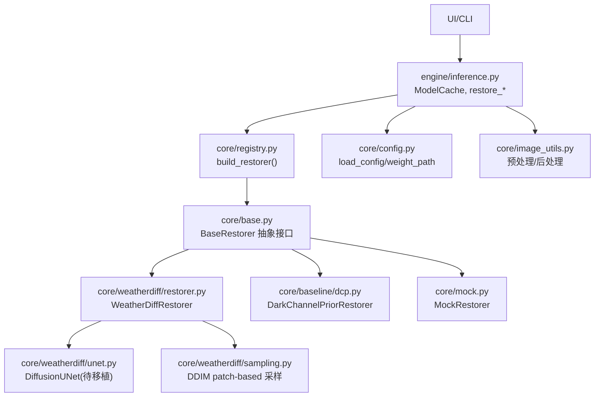
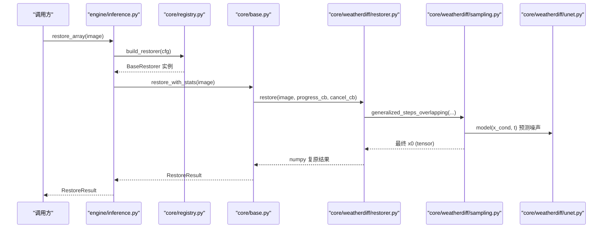
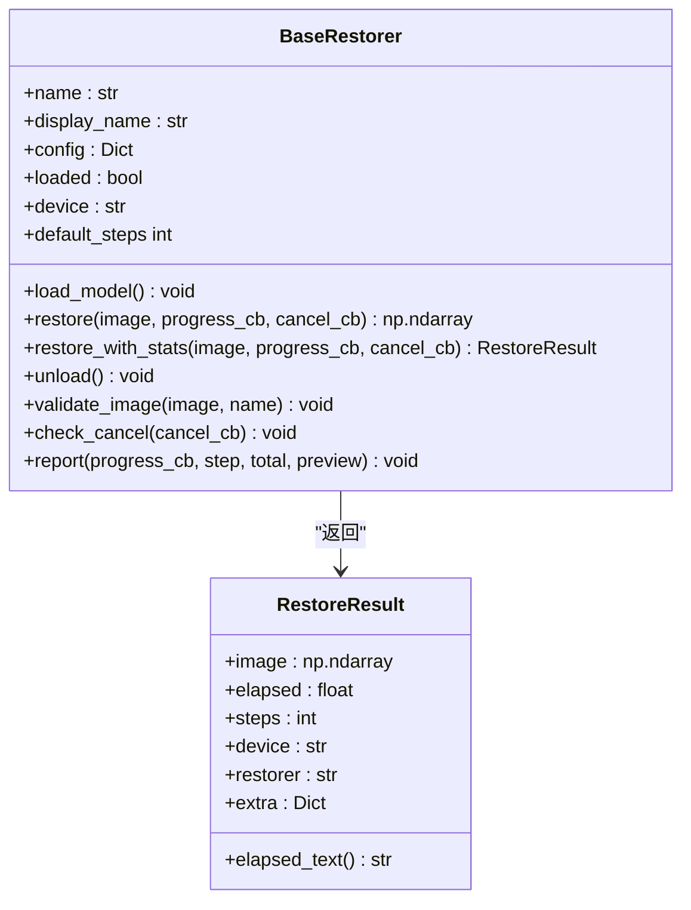
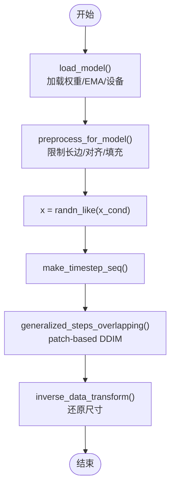
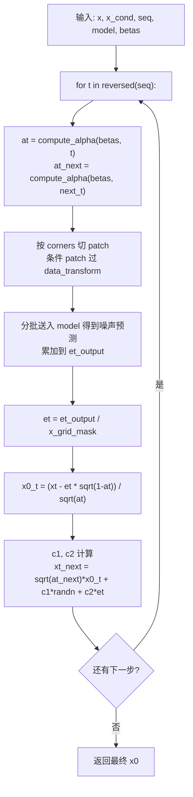
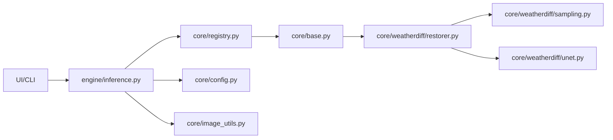

# 开发者指南

<cite>
**本文引用的文件**
- [core/base.py](file://core/base.py)
- [core/registry.py](file://core/registry.py)
- [core/config.py](file://core/config.py)
- [core/image_utils.py](file://core/image_utils.py)
- [core/mock.py](file://core/mock.py)
- [core/baseline/dcp.py](file://core/baseline/dcp.py)
- [core/weatherdiff/restorer.py](file://core/weatherdiff/restorer.py)
- [core/weatherdiff/unet.py](file://core/weatherdiff/unet.py)
- [core/weatherdiff/sampling.py](file://core/weatherdiff/sampling.py)
- [engine/inference.py](file://engine/inference.py)
- [configs/allweather.yaml](file://configs/allweather.yaml)
- [configs/haze.yaml](file://configs/haze.yaml)
- [scripts/smoke_test.py](file://scripts/smoke_test.py)
- [requirements.txt](file://requirements.txt)
</cite>

## 目录
1. [简介](#简介)
2. [项目结构](#项目结构)
3. [核心组件](#核心组件)
4. [架构总览](#架构总览)
5. [详细组件分析](#详细组件分析)
6. [依赖关系分析](#依赖关系分析)
7. [性能与优化建议](#性能与优化建议)
8. [调试与常见问题](#调试与常见问题)
9. [代码规范与开发流程](#代码规范与开发流程)
10. [结论](#结论)

## 简介
本指南面向希望扩展或修改“基于扩散模型的恶劣天气复原系统”的开发者。内容涵盖：
- 如何集成新的复原算法（继承 BaseRestorer、实现必要方法、注册新模型）
- 扩散模型实现细节（UNet 网络结构、采样算法修改、训练数据准备）
- 代码规范与开发流程（单元测试、代码审查、版本控制最佳实践）
- 性能优化（内存管理、计算加速、并行处理）
- 调试技巧与常见问题解决方案

## 项目结构
仓库采用分层组织：
- core：核心接口与实现（基类、注册表、配置、图像工具、各复原器）
- engine：推理编排（单图/批量、缓存、回调）
- configs：不同场景的配置（雨/雾/雪/统一模型/DCP）
- scripts：环境自检、权重下载、评测脚本
- ui：PyQt 界面（可选）
- weights：预训练权重（需下载）

图表来源
- [engine/inference.py:22-68](file://engine/inference.py#L22-L68)
- [core/registry.py:29-85](file://core/registry.py#L29-L85)
- [core/base.py:61-185](file://core/base.py#L61-L185)
- [core/weatherdiff/restorer.py:32-167](file://core/weatherdiff/restorer.py#L32-L167)
- [core/weatherdiff/unet.py:51-72](file://core/weatherdiff/unet.py#L51-L72)
- [core/weatherdiff/sampling.py:31-163](file://core/weatherdiff/sampling.py#L31-L163)
- [core/baseline/dcp.py:23-85](file://core/baseline/dcp.py#L23-L85)
- [core/mock.py:27-81](file://core/mock.py#L27-L81)
- [core/config.py:25-98](file://core/config.py#L25-L98)
- [core/image_utils.py:145-168](file://core/image_utils.py#L145-L168)

章节来源
- [engine/inference.py:1-153](file://engine/inference.py#L1-L153)
- [core/registry.py:1-85](file://core/registry.py#L1-L85)
- [core/base.py:1-185](file://core/base.py#L1-L185)
- [core/config.py:1-98](file://core/config.py#L1-L98)
- [core/image_utils.py:1-253](file://core/image_utils.py#L1-L253)

## 核心组件
- BaseRestorer：统一复原接口契约，定义 load_model/restore/进度与取消回调、输出尺寸一致性校验等。
- Registry：按配置动态构建复原器，支持延迟加载模块与环境变量降级为假模型。
- WeatherDiffRestorer：扩散模型复原器，负责设备选择、权重加载、预处理、patch-based DDIM 采样、显存自适应重试、后处理还原。
- DiffusionUNet：条件扩散 UNet 网络（当前为占位，需从官方仓库移植）。
- sampling：通用扩散采样工具（beta 调度、时间步序列、重叠网格、数据变换），以及待实现的 generalized_steps_overlapping。
- MockRestorer/DCP：无需权重的对照实现，便于联调与评测。
- Engine：推理编排与权重缓存，提供单图/批量恢复能力。

章节来源
- [core/base.py:61-185](file://core/base.py#L61-L185)
- [core/registry.py:29-85](file://core/registry.py#L29-L85)
- [core/weatherdiff/restorer.py:32-167](file://core/weatherdiff/restorer.py#L32-L167)
- [core/weatherdiff/unet.py:51-72](file://core/weatherdiff/unet.py#L51-L72)
- [core/weatherdiff/sampling.py:31-163](file://core/weatherdiff/sampling.py#L31-L163)
- [core/mock.py:27-81](file://core/mock.py#L27-L81)
- [core/baseline/dcp.py:23-85](file://core/baseline/dcp.py#L23-L85)
- [engine/inference.py:22-68](file://engine/inference.py#L22-L68)

## 架构总览
系统通过配置驱动选择复原器，引擎层负责实例化与缓存，具体复原逻辑在各自 restorer 中实现；扩散模型路径由 restorer 调用 unet 与 sampling 完成 patch-based 去噪。

图表来源
- [engine/inference.py:70-78](file://engine/inference.py#L70-L78)
- [core/registry.py:68-85](file://core/registry.py#L68-L85)
- [core/base.py:111-138](file://core/base.py#L111-L138)
- [core/weatherdiff/restorer.py:102-167](file://core/weatherdiff/restorer.py#L102-L167)
- [core/weatherdiff/sampling.py:115-163](file://core/weatherdiff/sampling.py#L115-L163)
- [core/weatherdiff/unet.py:51-72](file://core/weatherdiff/unet.py#L51-L72)

## 详细组件分析

### 统一接口与基类（BaseRestorer）
- 职责：定义所有复原器的最小契约，确保 UI/评测层不关心底层模型类型。
- 关键约定：
  - 输入/输出图像格式：RGB uint8 (H, W, 3)，输出尺寸必须与输入一致。
  - 进度回调：progress_cb(step, total, preview)。
  - 取消回调：cancel_cb() -> bool，返回 True 应尽快抛出 RestoreCancelled。
  - 统一入口：restore_with_stats 自动计时、校验输出尺寸并封装 RestoreResult。
- 错误与健壮性：validate_image 严格检查类型与形状；check_cancel/report 保证异常不影响主流程。

图表来源
- [core/base.py:45-185](file://core/base.py#L45-L185)

章节来源
- [core/base.py:1-185](file://core/base.py#L1-L185)

### 模型注册与构建（Registry）
- 功能：根据配置中的 restorer 字段动态构造复原器；支持延迟导入避免启动时加载 torch；环境变量 AWR_MOCK=1 可强制降级到假模型。
- 使用方式：上层仅调用 build_restorer(config)，不直接 import 具体模型。

章节来源
- [core/registry.py:1-85](file://core/registry.py#L1-L85)

### 配置与权重路径（Config）
- 功能：加载 YAML 配置，解析相对路径为绝对路径，注入 _config_path 便于排查；提供 list_weather_configs/get_config/weight_path 等工具。
- 关键点：weights.path 会被转换为 abs_path；未配置权重时返回 None（如 DCP）。

章节来源
- [core/config.py:1-98](file://core/config.py#L1-L98)

### 图像预处理与后处理（Image Utils）
- 功能：统一图像 IO、尺寸限制、对齐到倍数、反射填充、归一化、还原原始尺寸等。
- 关键点：preprocess_for_model/postprocess_to_origin 成对使用，保证输出与输入等大。

章节来源
- [core/image_utils.py:145-168](file://core/image_utils.py#L145-L168)
- [core/image_utils.py:109-143](file://core/image_utils.py#L109-L143)

### 扩散模型复原器（WeatherDiffRestorer）
- 职责：设备选择、权重加载（兼容 DataParallel 前缀与 EMA）、预处理、patch-based DDIM 采样、显存不足自动降批重试、后处理还原。
- 关键流程：
  - load_model：定位权重、构建 UNet、加载 state_dict、应用 EMA（若启用）、设置 betas。
  - restore：预处理、生成初始噪声、计算时间步序列、调用 generalized_steps_overlapping、反归一化、还原尺寸。
  - 显存自适应：捕获 out of memory 异常，逐步降低 patch_batch_size 并重试。

图表来源
- [core/weatherdiff/restorer.py:47-90](file://core/weatherdiff/restorer.py#L47-L90)
- [core/weatherdiff/restorer.py:102-167](file://core/weatherdiff/restorer.py#L102-L167)
- [core/weatherdiff/sampling.py:54-81](file://core/weatherdiff/sampling.py#L54-L81)

章节来源
- [core/weatherdiff/restorer.py:32-167](file://core/weatherdiff/restorer.py#L32-L167)

### 扩散采样（Sampling）
- 已实现：beta 调度、时间步压缩、重叠网格坐标、数据变换、alpha_bar 计算。
- 待实现：generalized_steps_overlapping（核心循环，参考官方 utils/sampling.py）。
- 要点：将整图切分为重叠 patch，逐 patch 预测噪声并按覆盖次数平均，再执行 DDIM 更新。

图表来源
- [core/weatherdiff/sampling.py:31-110](file://core/weatherdiff/sampling.py#L31-L110)
- [core/weatherdiff/sampling.py:115-163](file://core/weatherdiff/sampling.py#L115-L163)

章节来源
- [core/weatherdiff/sampling.py:1-163](file://core/weatherdiff/sampling.py#L1-L163)

### UNet 网络（DiffusionUNet）
- 现状：占位骨架，要求类名与子模块属性名与官方完全一致，forward 签名固定。
- 任务：从官方仓库移植 models/unet.py，保持 config 属性访问方式（DictConfig 包装）。

章节来源
- [core/weatherdiff/unet.py:1-72](file://core/weatherdiff/unet.py#L1-L72)

### 对照实现（Mock/DCP）
- MockRestorer：纯 numpy 模拟逐步去噪，支持进度回调与取消，便于联调。
- DarkChannelPriorRestorer：传统去雾基线，无需权重，用于指标对比与演示兜底。

章节来源
- [core/mock.py:27-81](file://core/mock.py#L27-L81)
- [core/baseline/dcp.py:23-85](file://core/baseline/dcp.py#L23-L85)

### 推理编排（Engine）
- ModelCache：按配置名缓存复原器实例，避免重复加载权重；支持 release_others/clear 释放显存。
- restore_array/restore_file/restore_batch：统一入口，支持进度回调与取消，批量处理容错。

章节来源
- [engine/inference.py:22-68](file://engine/inference.py#L22-L68)
- [engine/inference.py:70-153](file://engine/inference.py#L70-L153)

## 依赖关系分析
- 耦合度：
  - 上层（UI/CLI）仅依赖 engine 与 base 接口，解耦良好。
  - restorer 依赖 registry/config/image_utils，扩散模型路径依赖 sampling/unet。
- 外部依赖：
  - PyTorch 仅在需要扩散模型时导入（延迟导入策略）。
  - 配置文件通过 YAML 管理，新增场景只需添加 yaml。

图表来源
- [engine/inference.py:1-153](file://engine/inference.py#L1-L153)
- [core/registry.py:1-85](file://core/registry.py#L1-L85)
- [core/base.py:1-185](file://core/base.py#L1-L185)
- [core/weatherdiff/restorer.py:1-244](file://core/weatherdiff/restorer.py#L1-L244)
- [core/weatherdiff/sampling.py:1-163](file://core/weatherdiff/sampling.py#L1-L163)
- [core/weatherdiff/unet.py:1-72](file://core/weatherdiff/unet.py#L1-L72)
- [core/config.py:1-98](file://core/config.py#L1-L98)
- [core/image_utils.py:1-253](file://core/image_utils.py#L1-L253)

章节来源
- [requirements.txt:1-34](file://requirements.txt#L1-L34)

## 性能与优化建议
- 内存管理
  - 使用 ModelCache 缓存已加载的复原器，切换场景时避免重复加载。
  - 显存不足时，restorer 会自动降低 patch_batch_size 重试；必要时调用 unload 释放显存。
  - 合理设置 max_side 与 size_multiple，控制预处理后的分辨率。
- 计算加速
  - 使用 GPU（CUDA）运行扩散模型；通过 AWR_DEVICE 环境变量强制指定设备。
  - 调整 sampling.timesteps 与 grid_r 平衡质量与速度。
  - 利用 patch-based 并行推理（patch_batch_size）提高吞吐。
- 并行处理
  - 批量恢复时使用 restore_batch，单张失败不中断整体流程。
  - 进度回调与取消机制提升交互体验与资源利用率。

[本节为通用指导，不直接分析具体文件]

## 调试与常见问题
- 权重缺失
  - 现象：WeightNotFoundError。
  - 解决：执行 scripts/download_weights.py 或将权重放入 weights/ 并在配置中设置 weights.path。
- 设备问题
  - 现象：无 CUDA 或显存不足。
  - 解决：设置 AWR_DEVICE=cpu；或降低 patch_batch_size/timesteps；或使用 mock 模式快速验证。
- 输出尺寸不一致
  - 现象：restore_with_stats 抛出尺寸不一致错误。
  - 解决：确保 restore 内部恢复到原始尺寸，使用 postprocess_to_origin。
- 进度/取消无效
  - 现象：UI 无反馈或无法取消。
  - 解决：在耗时循环中定期调用 check_cancel/report；确保回调函数正确实现。
- 环境自检
  - 使用 scripts/smoke_test.py 进行全链路冒烟测试，验证依赖、配置、假模型、DCP、指标、批量评测与界面依赖。

章节来源
- [core/weatherdiff/restorer.py:47-90](file://core/weatherdiff/restorer.py#L47-L90)
- [core/base.py:111-138](file://core/base.py#L111-L138)
- [scripts/smoke_test.py:35-156](file://scripts/smoke_test.py#L35-L156)

## 代码规范与开发流程
- 统一接口
  - 所有复原器必须继承 BaseRestorer，实现 load_model/restore，遵循输入输出约定与回调协议。
- 注册与配置
  - 使用 @register_restorer("name") 注册新复原器；在 configs/*.yaml 中添加对应配置。
- 单元测试
  - 使用 smoke_test.py 验证基础链路；为新复原器编写用例，覆盖正常、取消、显存不足等场景。
- 代码审查
  - 关注接口契约、错误处理、性能敏感路径（显存、I/O）、日志与提示是否清晰。
- 版本控制
  - 提交前运行 smoke_test；变更接口需同步团队；配置与权重路径变更需文档化。

章节来源
- [core/base.py:61-185](file://core/base.py#L61-L185)
- [core/registry.py:29-85](file://core/registry.py#L29-L85)
- [scripts/smoke_test.py:35-156](file://scripts/smoke_test.py#L35-L156)

## 结论
本指南提供了扩展与修改系统的完整路径：通过 BaseRestorer 统一接口、Registry 动态构建、Engine 编排推理，结合 WeatherDiffRestorer 的 patch-based 扩散采样与 UNet 网络，可实现高效、可扩展的恶劣天气复原。遵循代码规范、完善测试与性能优化，可保障系统稳定与易用。