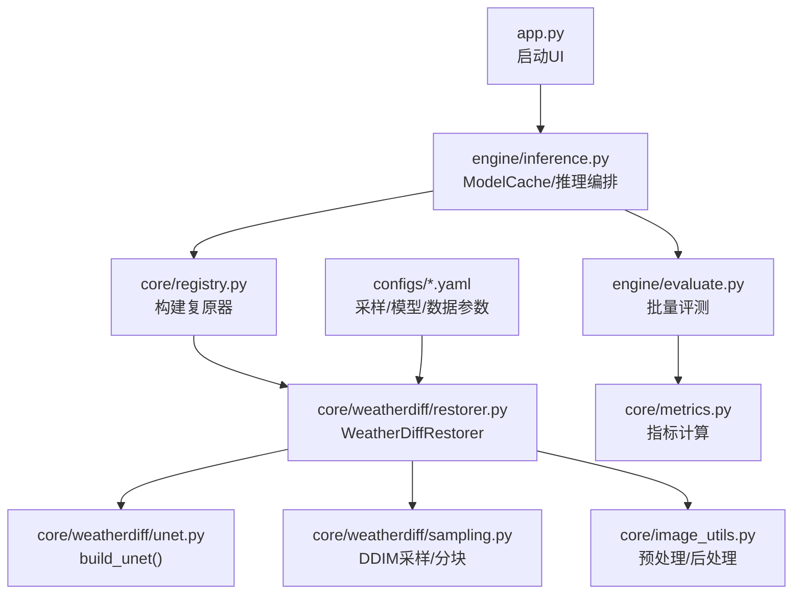
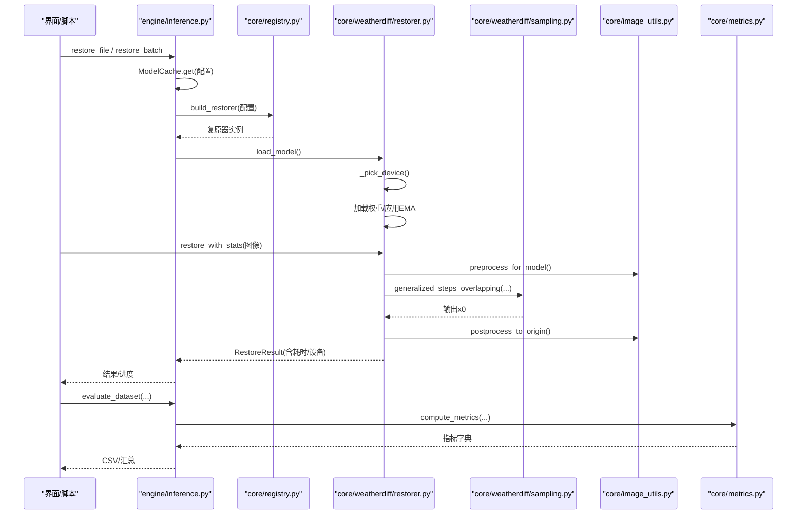
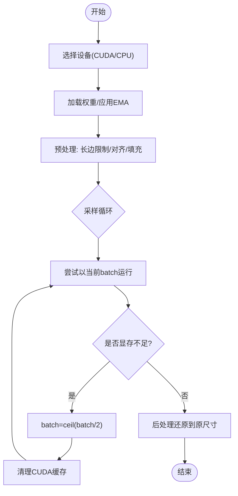
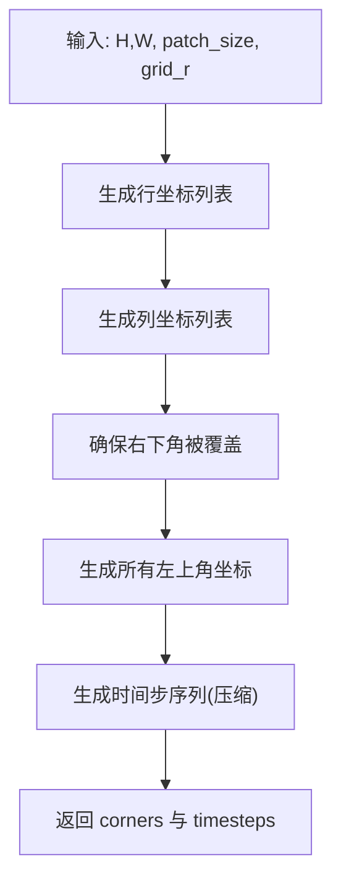
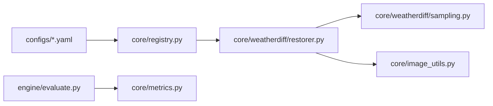

# 性能优化

<cite>
**本文引用的文件**
- [app.py](file://app.py)
- [requirements.txt](file://requirements.txt)
- [core/base.py](file://core/base.py)
- [core/config.py](file://core/config.py)
- [core/image_utils.py](file://core/image_utils.py)
- [core/metrics.py](file://core/metrics.py)
- [core/registry.py](file://core/registry.py)
- [core/weatherdiff/restorer.py](file://core/weatherdiff/restorer.py)
- [core/weatherdiff/sampling.py](file://core/weatherdiff/sampling.py)
- [core/weatherdiff/unet.py](file://core/weatherdiff/unet.py)
- [engine/inference.py](file://engine/inference.py)
- [engine/evaluate.py](file://engine/evaluate.py)
- [scripts/run_eval.py](file://scripts/run_eval.py)
- [scripts/smoke_test.py](file://scripts/smoke_test.py)
- [configs/allweather.yaml](file://configs/allweather.yaml)
- [configs/haze.yaml](file://configs/haze.yaml)
</cite>

## 目录
1. [简介](#简介)
2. [项目结构](#项目结构)
3. [核心组件](#核心组件)
4. [架构总览](#架构总览)
5. [详细组件分析](#详细组件分析)
6. [依赖关系分析](#依赖关系分析)
7. [性能考虑](#性能考虑)
8. [故障排查指南](#故障排查指南)
9. [结论](#结论)
10. [附录](#附录)

## 简介
本指南面向基于扩散模型的恶劣天气图像复原系统，聚焦生产级性能优化。内容覆盖：
- 内存管理策略：GPU 显存控制、批大小自适应、模型权重与中间张量释放、EMA 权重应用时机
- 计算加速方法：采样步数压缩、重叠分块推理、异步/并行处理、设备选择与缓存
- 图像处理优化：长边限制、尺寸对齐、反射填充、后处理还原
- 性能监控与分析：计时、指标统计、批量评测导出
- 实际测试案例与基准思路：冒烟测试、单图/批量评测流程
- 生产部署考量：并发、负载均衡、资源限制、回退策略

## 项目结构
本项目采用“配置驱动 + 插件式复原器”的架构：
- 配置层：configs/*.yaml 定义数据、模型、扩散与采样参数
- 核心层：core/* 提供统一接口、图像工具、指标、注册表与 WeatherDiffusion 实现骨架
- 引擎层：engine/* 负责推理编排、批量评测与结果导出
- 脚本层：scripts/* 提供评测入口与环境自检
- UI 层：ui/*（与本指南重点无关）

图表来源
- [app.py:19-32](file://app.py#L19-L32)
- [engine/inference.py:22-68](file://engine/inference.py#L22-L68)
- [core/weatherdiff/restorer.py:32-90](file://core/weatherdiff/restorer.py#L32-L90)
- [core/weatherdiff/sampling.py:54-81](file://core/weatherdiff/sampling.py#L54-L81)
- [core/image_utils.py:145-167](file://core/image_utils.py#L145-L167)
- [engine/evaluate.py:51-116](file://engine/evaluate.py#L51-L116)
- [core/metrics.py:134-177](file://core/metrics.py#L134-L177)

章节来源
- [app.py:19-32](file://app.py#L19-L32)
- [engine/inference.py:22-68](file://engine/inference.py#L22-L68)
- [core/weatherdiff/restorer.py:32-90](file://core/weatherdiff/restorer.py#L32-L90)
- [core/weatherdiff/sampling.py:54-81](file://core/weatherdiff/sampling.py#L54-L81)
- [core/image_utils.py:145-167](file://core/image_utils.py#L145-L167)
- [engine/evaluate.py:51-116](file://engine/evaluate.py#L51-L116)
- [core/metrics.py:134-177](file://core/metrics.py#L134-L177)

## 核心组件
- BaseRestorer：统一复原接口契约，封装计时、校验、进度与取消回调
- WeatherDiffRestorer：加载权重、设备选择、预处理、分块 DDIM 采样、显存不足自动降批重试、后处理还原
- ModelCache：按配置名缓存已加载的复原器实例，避免重复读盘与占显存
- sampling：beta 调度、时间步压缩、重叠网格坐标生成、数据归一化
- image_utils：统一图像 IO、几何变换、预处理/后处理
- metrics：PSNR/SSIM/LPIPS/NIQE/BRISQUE/FID 等指标计算与汇总
- engine/evaluate：批量评测、CSV 导出、均值汇总

章节来源
- [core/base.py:61-148](file://core/base.py#L61-L148)
- [core/weatherdiff/restorer.py:32-167](file://core/weatherdiff/restorer.py#L32-L167)
- [engine/inference.py:22-68](file://engine/inference.py#L22-L68)
- [core/weatherdiff/sampling.py:31-81](file://core/weatherdiff/sampling.py#L31-L81)
- [core/image_utils.py:22-167](file://core/image_utils.py#L22-L167)
- [core/metrics.py:57-177](file://core/metrics.py#L57-L177)
- [engine/evaluate.py:51-116](file://engine/evaluate.py#L51-L116)

## 架构总览
下图展示从 UI 到推理再到评测的关键调用链，突出性能相关路径：设备选择、权重缓存、分块采样、显存自适应、批量评测与指标计算。

图表来源
- [engine/inference.py:22-68](file://engine/inference.py#L22-L68)
- [core/weatherdiff/restorer.py:47-90](file://core/weatherdiff/restorer.py#L47-L90)
- [core/weatherdiff/restorer.py:102-167](file://core/weatherdiff/restorer.py#L102-L167)
- [core/weatherdiff/sampling.py:54-81](file://core/weatherdiff/sampling.py#L54-L81)
- [core/image_utils.py:145-167](file://core/image_utils.py#L145-L167)
- [engine/evaluate.py:51-116](file://engine/evaluate.py#L51-L116)
- [core/metrics.py:134-177](file://core/metrics.py#L134-L177)

## 详细组件分析

### WeatherDiffRestorer：显存与批大小自适应
- 设备选择：优先 CUDA，支持环境变量强制 CPU
- 权重加载：兼容 DataParallel 前缀、EMA 影子参数覆盖
- 预处理：长边限制、尺寸对齐 16、小图反射填充
- 采样：分块 DDIM，patch_batch_size 默认 32，显存不足时自动减半重试并清理缓存
- 后处理：还原到原始尺寸

图表来源
- [core/weatherdiff/restorer.py:47-90](file://core/weatherdiff/restorer.py#L47-L90)
- [core/weatherdiff/restorer.py:102-167](file://core/weatherdiff/restorer.py#L102-L167)

章节来源
- [core/weatherdiff/restorer.py:47-90](file://core/weatherdiff/restorer.py#L47-L90)
- [core/weatherdiff/restorer.py:102-167](file://core/weatherdiff/restorer.py#L102-L167)

### sampling：分块与时间步压缩
- beta 调度：线性/二次/常数/JSD，用于 alpha_bar 计算
- 时间步序列：将 1000 步压缩为 N 步（如 25），显著减少迭代次数
- 重叠网格：生成滑窗坐标，保证边界覆盖
- 数据变换：[-1,1] 与 [0,1] 互转

图表来源
- [core/weatherdiff/sampling.py:54-81](file://core/weatherdiff/sampling.py#L54-L81)

章节来源
- [core/weatherdiff/sampling.py:31-81](file://core/weatherdiff/sampling.py#L31-L81)

### image_utils：图像处理优化
- 长边限制：防止超大图导致显存爆炸
- 尺寸对齐：向上取整到 16 的倍数，适配网络下采样
- 反射填充：小图最小尺寸兜底，避免无效切片
- 后处理还原：裁剪与缩放回原始尺寸

章节来源
- [core/image_utils.py:109-167](file://core/image_utils.py#L109-L167)

### ModelCache：权重缓存与显存控制
- 按配置名缓存复原器实例，切换天气类型不重复加载
- release_others：仅保留指定配置的模型，释放其他模型显存
- clear：清空全部缓存

章节来源
- [engine/inference.py:22-68](file://engine/inference.py#L22-L68)

### 指标与评测：性能度量
- compute_metrics：按需计算 PSNR/SSIM/LPIPS/NIQE/BRISQUE
- evaluate_dataset：遍历数据集、恢复、保存结果、计算指标、汇总
- write_csv/write_summary_csv：导出逐图与汇总 CSV

章节来源
- [core/metrics.py:134-177](file://core/metrics.py#L134-L177)
- [engine/evaluate.py:51-116](file://engine/evaluate.py#L51-L116)

## 依赖关系分析
- 配置驱动：configs/*.yaml 决定 data/model/diffusion/sampling 参数
- 注册表：core/registry.py 根据 restorer 字段构建具体复原器
- 运行时依赖：PyTorch 仅在需要时导入，降低冷启动成本
- 指标依赖：延迟导入 LPIPS/NIQE/BRISQUE/FID，缺失不影响基础功能

图表来源
- [core/weatherdiff/restorer.py:32-90](file://core/weatherdiff/restorer.py#L32-L90)
- [core/weatherdiff/sampling.py:31-81](file://core/weatherdiff/sampling.py#L31-L81)
- [core/image_utils.py:145-167](file://core/image_utils.py#L145-L167)
- [engine/evaluate.py:51-116](file://engine/evaluate.py#L51-L116)
- [core/metrics.py:134-177](file://core/metrics.py#L134-L177)

章节来源
- [core/weatherdiff/restorer.py:32-90](file://core/weatherdiff/restorer.py#L32-L90)
- [core/weatherdiff/sampling.py:31-81](file://core/weatherdiff/sampling.py#L31-L81)
- [core/image_utils.py:145-167](file://core/image_utils.py#L145-L167)
- [engine/evaluate.py:51-116](file://engine/evaluate.py#L51-L116)
- [core/metrics.py:134-177](file://core/metrics.py#L134-L177)

## 性能考虑

### 内存管理与 GPU 显存优化
- 设备选择与显存释放
  - 优先使用 CUDA；可通过环境变量强制 CPU
  - 卸载模型时调用 CUDA 缓存清理，避免碎片累积
- 批大小自适应
  - 初始 patch_batch_size 来自配置（默认 32）
  - 遇到显存不足自动减半并重试，直至可运行或降至 1
- 权重与中间张量
  - 权重加载后进入 eval 模式，关闭梯度
  - 采样过程在 no_grad 上下文执行，减少显存占用
  - EMA 权重覆盖提升质量，但需权衡额外拷贝开销

章节来源
- [core/weatherdiff/restorer.py:47-90](file://core/weatherdiff/restorer.py#L47-L90)
- [core/weatherdiff/restorer.py:102-167](file://core/weatherdiff/restorer.py#L102-L167)

### 计算加速方法
- 采样步数压缩
  - 通过 make_timestep_seq 将 1000 步压缩为 N 步（如 25），显著降低迭代次数
- 重叠分块推理
  - 将大图切分为 patch 并行推理，显存只与 patch 数量和大小相关
  - 通过覆盖 mask 平均融合，避免拼接伪影
- 设备与缓存
  - ModelCache 避免重复加载权重，减少 IO 与初始化开销
  - 指标模块对 LPIPS/NIQE/BRISQUE 进行模型缓存，避免重复构建

章节来源
- [core/weatherdiff/sampling.py:54-81](file://core/weatherdiff/sampling.py#L54-L81)
- [engine/inference.py:22-68](file://engine/inference.py#L22-L68)
- [core/metrics.py:250-276](file://core/metrics.py#L250-L276)

### 图像处理优化技巧
- 长边限制：防止超大图导致显存与时间开销激增
- 尺寸对齐：向上取整到 16 的倍数，匹配网络下采样步长
- 反射填充：小图最小尺寸兜底，保证切片有效
- 后处理还原：裁剪与缩放回原始尺寸，保持输出与输入一致

章节来源
- [core/image_utils.py:109-167](file://core/image_utils.py#L109-L167)

### 性能监控与分析工具
- 计时与统计
  - BaseRestorer.restore_with_stats 统一计时，返回 elapsed、device、restorer 等信息
- 指标计算
  - compute_metrics 支持多种有参考/无参考指标，失败时静默记录 None
- 批量评测与导出
  - evaluate_dataset 遍历数据集，输出逐图 CSV 与汇总 CSV，便于对比不同配置

章节来源
- [core/base.py:111-148](file://core/base.py#L111-L148)
- [core/metrics.py:134-177](file://core/metrics.py#L134-L177)
- [engine/evaluate.py:51-116](file://engine/evaluate.py#L51-L116)

### 实际测试案例与基准思路
- 环境自检与冒烟测试
  - scripts/smoke_test.py 验证依赖、配置、假模型、DCP、指标、批量评测与 CSV 导出
- 批量评测命令
  - scripts/run_eval.py 支持多配置、多指标、FID、限制样本数、覆盖采样步数与网格步长
- 基准建议
  - 固定数据集与随机种子，比较不同 timesteps、grid_r、patch_batch_size 下的速度与质量
  - 记录每张图的 elapsed_s 与指标均值，形成对比表

章节来源
- [scripts/smoke_test.py:35-151](file://scripts/smoke_test.py#L35-L151)
- [scripts/run_eval.py:32-91](file://scripts/run_eval.py#L32-L91)

### 生产环境部署考虑
- 并发处理
  - 使用 ModelCache 共享同一配置下的复原器实例，避免重复加载
  - 结合进程/线程池进行图片批处理，注意每进程显存上限
- 负载均衡
  - 多机多卡部署时，按配置名拆分任务，避免单卡过载
- 资源限制
  - 设置 max_side 与 size_multiple 控制输入尺寸
  - 动态调整 patch_batch_size 应对不同显存容量
- 回退策略
  - 显存不足自动降批；指标依赖缺失时降级为可用指标

章节来源
- [engine/inference.py:22-68](file://engine/inference.py#L22-L68)
- [core/weatherdiff/restorer.py:102-167](file://core/weatherdiff/restorer.py#L102-L167)
- [core/image_utils.py:109-167](file://core/image_utils.py#L109-L167)

## 故障排查指南
- 权重缺失
  - 抛出 WeightNotFoundError，提示下载或放置权重文件
- 显存不足
  - 自动检测 RuntimeError 中的 out of memory，逐步降低 batch 并清理缓存
- 指标不可用
  - 延迟导入第三方库，缺失时记录 None 并提示安装
- 取消机制
  - 支持 cancel_cb，长时间任务可随时中断并抛出 RestoreCancelled

章节来源
- [core/weatherdiff/restorer.py:47-90](file://core/weatherdiff/restorer.py#L47-L90)
- [core/weatherdiff/restorer.py:102-167](file://core/weatherdiff/restorer.py#L102-L167)
- [core/metrics.py:205-219](file://core/metrics.py#L205-L219)
- [core/base.py:37-43](file://core/base.py#L37-L43)

## 结论
本项目通过配置驱动、分块采样、批大小自适应、权重缓存与统一评测框架，提供了可扩展且易优化的恶劣天气复原流水线。生产环境中应重点关注：
- 合理设置采样步数与网格步长，平衡质量与速度
- 利用 ModelCache 与显存自适应，稳定大场景推理
- 借助批量评测与指标导出，持续跟踪不同策略的效果
- 针对部署环境调优输入尺寸、批大小与并发度

## 附录

### 关键配置项说明（节选）
- data.image_size：patch 边长（如 64）
- data.max_side：长边限制（如 1024）
- data.size_multiple：尺寸对齐倍数（如 16）
- diffusion.num_diffusion_timesteps：总扩散步数（如 1000）
- sampling.timesteps：采样步数（如 25）
- sampling.grid_r：滑窗步长（如 16）
- sampling.patch_batch_size：单次并行 patch 数量（如 32）

章节来源
- [configs/allweather.yaml:15-46](file://configs/allweather.yaml#L15-L46)
- [configs/haze.yaml:14-45](file://configs/haze.yaml#L14-L45)

### 依赖清单要点
- 最小依赖：numpy、pillow、pyyaml、PyQt5、scikit-image
- 深度学习：torch、torchvision
- 指标扩展：lpips、pyiqa、pytorch-fid
- 可视化与工具：pyqtgraph、tqdm、requests

章节来源
- [requirements.txt:14-34](file://requirements.txt#L14-L34)