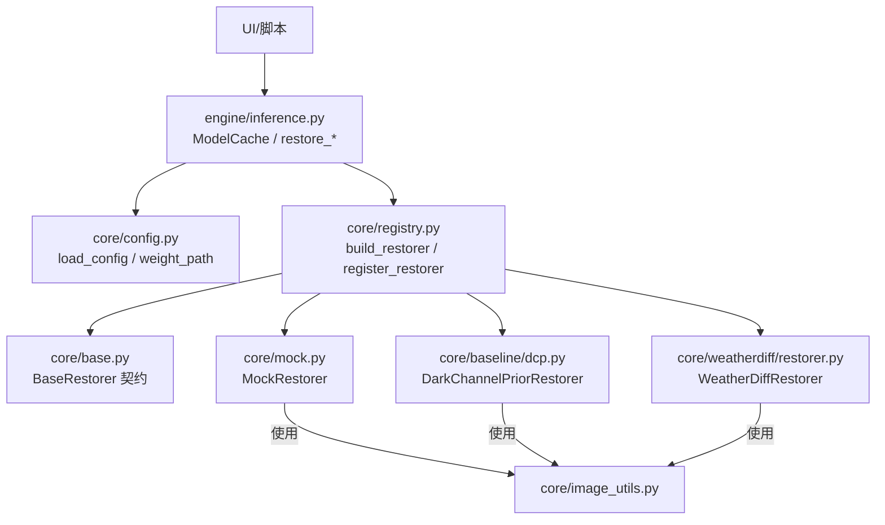
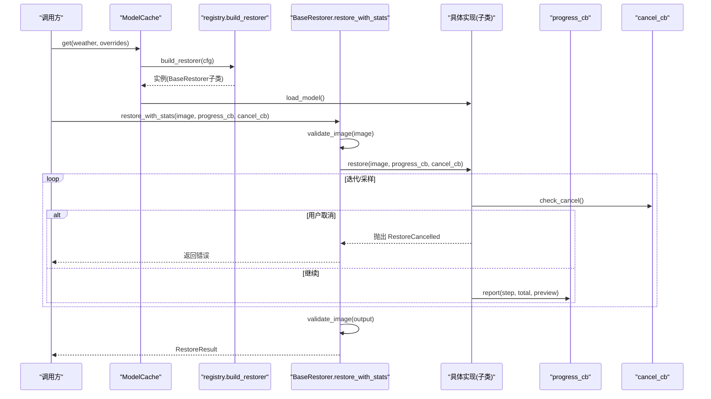
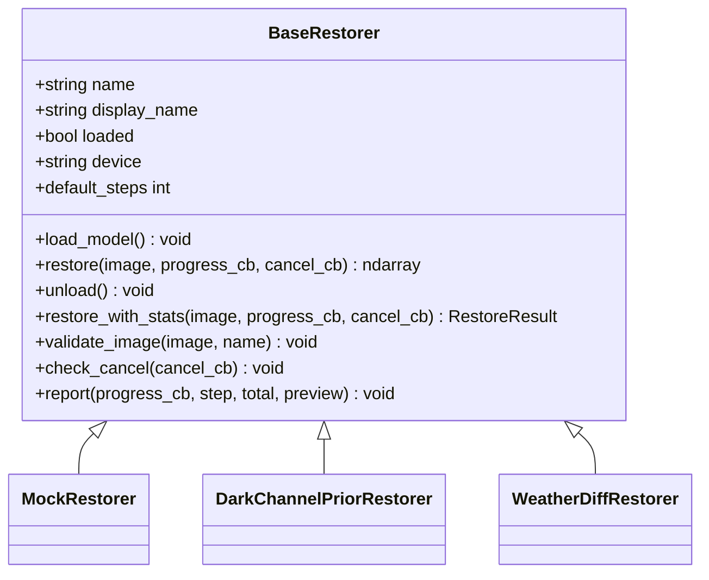
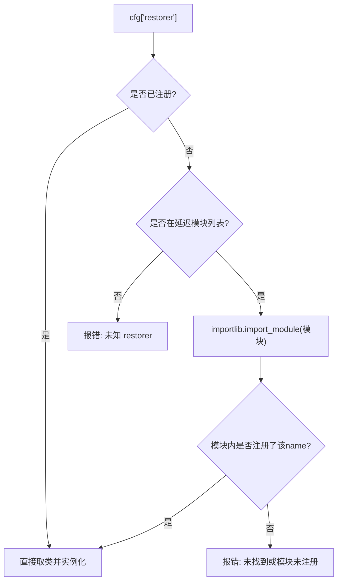
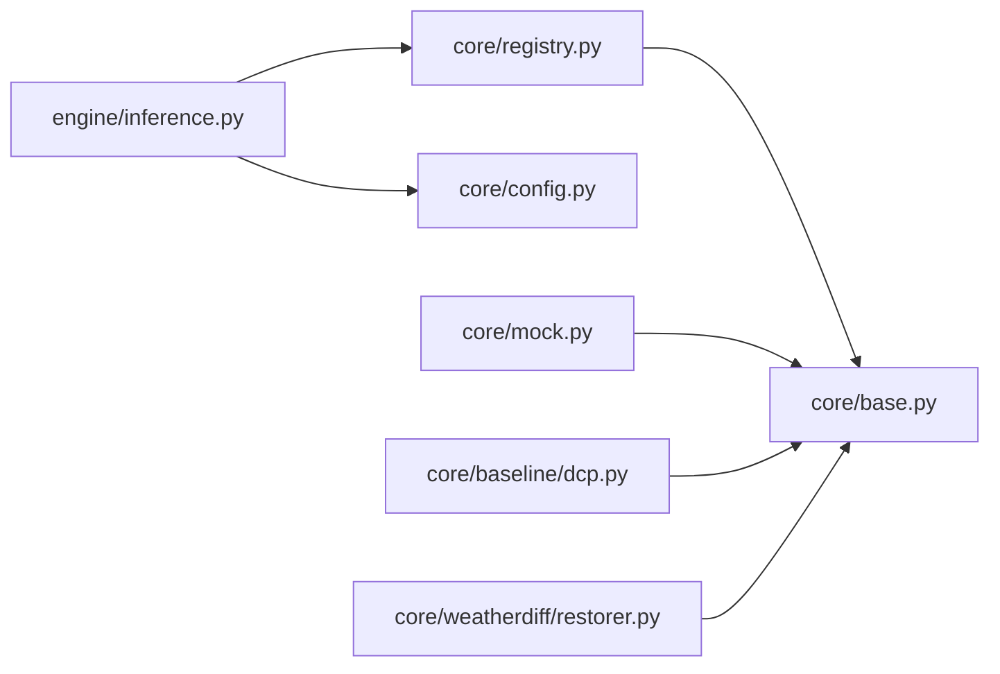

# 新算法集成

<cite>
**本文引用的文件**
- [core/base.py](file://core/base.py)
- [core/registry.py](file://core/registry.py)
- [core/config.py](file://core/config.py)
- [core/mock.py](file://core/mock.py)
- [core/baseline/dcp.py](file://core/baseline/dcp.py)
- [core/weatherdiff/restorer.py](file://core/weatherdiff/restorer.py)
- [configs/allweather.yaml](file://configs/allweather.yaml)
- [configs/dcp.yaml](file://configs/dcp.yaml)
- [engine/inference.py](file://engine/inference.py)
</cite>

## 目录
1. [简介](#简介)
2. [项目结构](#项目结构)
3. [核心组件](#核心组件)
4. [架构总览](#架构总览)
5. [详细组件分析](#详细组件分析)
6. [依赖关系分析](#依赖关系分析)
7. [性能考虑](#性能考虑)
8. [故障排查指南](#故障排查指南)
9. [结论](#结论)
10. [附录：最小可行示例与配置规范](#附录最小可行示例与配置规范)

## 简介
本指南面向希望将“新复原算法”接入本项目的开发者。你将学会：
- 如何继承 BaseRestorer 基类，实现 load_model() 与 restore() 方法，并可选覆盖 unload()。
- 如何使用 @register_restorer 装饰器将新算法注册到系统中。
- 如何编写配置文件（YAML），定义权重路径、模型参数、采样参数等。
- 如何在推理流程中正确上报进度、支持取消、处理异常（如权重缺失、图像格式不合法）。
- 参考现有实现（Mock、DCP、WeatherDiffusion）快速完成一个可运行的最小集成。

## 项目结构
本项目采用“统一接口 + 注册表 + 配置驱动”的架构：
- core/base.py 定义了所有复原器的统一契约（BaseRestorer、RestoreResult、异常类型、工具方法）。
- core/registry.py 提供 @register_restorer 装饰器与 build_restorer() 动态构造器，按配置名加载具体实现。
- core/config.py 负责 YAML 配置加载、路径解析与权重路径获取。
- engine/inference.py 提供统一的推理编排与缓存（ModelCache），屏蔽底层差异。
- 各算法实现位于 core/* 下，并通过 @register_restorer("name") 注册。
- configs/*.yaml 为不同算法/场景的配置入口。

图表来源
- [engine/inference.py:22-68](file://engine/inference.py#L22-L68)
- [core/registry.py:29-84](file://core/registry.py#L29-L84)
- [core/config.py:25-91](file://core/config.py#L25-L91)
- [core/base.py:61-185](file://core/base.py#L61-L185)

章节来源
- [engine/inference.py:22-68](file://engine/inference.py#L22-L68)
- [core/registry.py:29-84](file://core/registry.py#L29-L84)
- [core/config.py:25-91](file://core/config.py#L25-L91)
- [core/base.py:61-185](file://core/base.py#L61-L185)

## 核心组件
- BaseRestorer：统一接口契约，强制子类实现 load_model() 与 restore()；提供 restore_with_stats()、validate_image()、check_cancel()、report() 等通用能力。
- 注册表 registry：@register_restorer(name) 将实现类登记到全局映射；build_restorer(cfg) 根据配置中的 restorer 字段动态构建实例。
- 配置 config：load_config() 读取 YAML，自动解析 weights.path 为绝对路径；weight_path() 供模型取权重路径。
- 推理编排 inference：ModelCache 缓存已加载的复原器实例，避免重复加载；restore_array/file/batch 统一入口。

章节来源
- [core/base.py:61-185](file://core/base.py#L61-L185)
- [core/registry.py:29-84](file://core/registry.py#L29-L84)
- [core/config.py:25-91](file://core/config.py#L25-L91)
- [engine/inference.py:22-68](file://engine/inference.py#L22-L68)

## 架构总览
下图展示了从配置到具体算法实现的完整调用链，以及进度回调与取消机制的交互。

图表来源
- [engine/inference.py:22-68](file://engine/inference.py#L22-L68)
- [core/registry.py:68-84](file://core/registry.py#L68-L84)
- [core/base.py:111-138](file://core/base.py#L111-L138)
- [core/base.py:153-181](file://core/base.py#L153-L181)

## 详细组件分析

### BaseRestorer 契约与扩展点
- 必须实现
  - load_model(): 加载权重并将 self.loaded 置 True；若权重缺失应抛 WeightNotFoundError。
  - restore(): 对单张 RGB uint8 (H,W,3) 图像执行复原，输出尺寸须与输入一致；支持 progress_cb 与 cancel_cb。
- 可选覆盖
  - unload(): 释放显存或内部资源；默认仅重置 loaded。
  - default_steps: 用于 UI 显示进度条总步数预估值。
- 通用能力
  - restore_with_stats(): 统一入口，负责计时、输入输出校验、尺寸一致性检查，并返回 RestoreResult。
  - validate_image(): 校验图像类型、通道、dtype。
  - check_cancel(): 在耗时循环中定期调用，被取消时抛 RestoreCancelled。
  - report(): 安全上报进度，回调异常不影响主流程。

图表来源
- [core/base.py:61-185](file://core/base.py#L61-L185)
- [core/mock.py:27-81](file://core/mock.py#L27-L81)
- [core/baseline/dcp.py:23-126](file://core/baseline/dcp.py#L23-L126)
- [core/weatherdiff/restorer.py:32-244](file://core/weatherdiff/restorer.py#L32-L244)

章节来源
- [core/base.py:61-185](file://core/base.py#L61-L185)

### 模型注册机制
- 使用 @register_restorer("name") 装饰器将子类登记到全局映射 _RESTORERS。
- build_restorer(cfg) 根据 cfg["restorer"] 决定加载哪个模块（延迟导入以避免启动开销），然后实例化该类。
- 可通过环境变量 AWR_MOCK=1 将任意配置降级为 mock，便于联调。

图表来源
- [core/registry.py:29-84](file://core/registry.py#L29-L84)

章节来源
- [core/registry.py:29-84](file://core/registry.py#L29-L84)

### 配置系统（YAML）
- 基本字段
  - name/display_name/description：用于界面展示与识别。
  - restorer：对应注册的算法名（如 weatherdiff、dcp、mock）。
  - weights.path：权重文件相对或绝对路径；会被解析为绝对路径并存入 weights.abs_path。
  - data/model/diffusion/sampling：各算法特定参数。
- 推荐写法
  - 权重路径写相对路径（相对于项目根），由 load_config 自动补全。
  - sampling.timesteps 控制采样步数，也作为 UI 进度条总步数参考。
  - 对于无权重算法（如 dcp），可不写 weights 段。

章节来源
- [configs/allweather.yaml:1-47](file://configs/allweather.yaml#L1-L47)
- [configs/dcp.yaml:1-21](file://configs/dcp.yaml#L1-L21)
- [core/config.py:25-91](file://core/config.py#L25-L91)

### 现有实现参考
- MockRestorer：纯 numpy，无需权重与 GPU，模拟逐步去噪过程，适合联调与演示。
- DarkChannelPriorRestorer：传统去雾基线，纯 numpy，无需权重，步骤清晰，可作为非扩散方法的对照。
- WeatherDiffRestorer：基于 patch 的条件扩散模型，包含设备选择、权重加载（兼容 DataParallel/module. 前缀、EMA）、预处理、采样、后处理与显存自适应。

章节来源
- [core/mock.py:27-81](file://core/mock.py#L27-L81)
- [core/baseline/dcp.py:23-126](file://core/baseline/dcp.py#L23-L126)
- [core/weatherdiff/restorer.py:32-244](file://core/weatherdiff/restorer.py#L32-L244)

## 依赖关系分析
- 耦合度
  - 上层（UI/脚本）只依赖 base 契约与 inference 编排，不直接 import 具体算法。
  - 算法通过 registry 注册，解耦了“配置名 -> 实现类”的绑定。
- 外部依赖
  - PyTorch 仅在需要时导入（如 weatherdiff），避免在无 GPU 环境启动失败。
  - yaml 用于配置解析。
- 潜在循环依赖
  - 当前结构无循环依赖；registry 仅依赖 base，算法实现依赖 registry 与 base。

图表来源
- [engine/inference.py:22-68](file://engine/inference.py#L22-L68)
- [core/registry.py:29-84](file://core/registry.py#L29-L84)
- [core/config.py:25-91](file://core/config.py#L25-L91)
- [core/base.py:61-185](file://core/base.py#L61-L185)

章节来源
- [engine/inference.py:22-68](file://engine/inference.py#L22-L68)
- [core/registry.py:29-84](file://core/registry.py#L29-L84)
- [core/config.py:25-91](file://core/config.py#L25-L91)
- [core/base.py:61-185](file://core/base.py#L61-L185)

## 性能考虑
- 权重缓存：ModelCache 保证同一配置只加载一次权重，切换天气类型时不会重复占显存。
- 延迟导入：torch 按需导入，降低启动成本。
- 显存自适应：扩散模型在 OOM 时自动降低 patch_batch_size 重试。
- 进度与取消：在长耗时循环中定期调用 check_cancel()，及时响应取消，避免无效计算。
- 图像校验：统一在 restore_with_stats 中校验输入输出形状与 dtype，减少下游错误。

[本节为通用指导，不直接分析具体文件]

## 故障排查指南
- 权重文件缺失
  - 现象：load_model() 找不到权重文件。
  - 处理：实现中应抛 WeightNotFoundError；UI 捕获后提示用户放置权重或下载。
  - 参考：[core/weatherdiff/restorer.py:47-56](file://core/weatherdiff/restorer.py#L47-L56)
- 图像格式不合法
  - 现象：输入不是 RGB uint8 或通道数不对。
  - 处理：validate_image() 会抛出 TypeError/ValueError；确保上游转换正确。
  - 参考：[core/base.py:153-161](file://core/base.py#L153-L161)
- 输出尺寸不一致
  - 现象：restore() 输出尺寸与输入不一致。
  - 处理：restore_with_stats() 会抛出 ValueError；请在模型内部恢复到原始尺寸。
  - 参考：[core/base.py:126-131](file://core/base.py#L126-L131)
- 用户取消
  - 现象：长时间推理中被取消。
  - 处理：在循环中调用 check_cancel()，触发 RestoreCancelled；UI 捕获后提示“已取消”。
  - 参考：[core/base.py:163-166](file://core/base.py#L163-L166)
- 进度回调异常
  - 现象：UI 侧回调抛错。
  - 处理：report() 捕获异常，不影响推理主流程。
  - 参考：[core/base.py:168-181](file://core/base.py#L168-L181)
- 未知 restorer
  - 现象：配置中 restorer 名称未注册。
  - 处理：build_restorer() 会抛出 KeyError/RuntimeError；检查注册与配置。
  - 参考：[core/registry.py:49-61](file://core/registry.py#L49-L61)

章节来源
- [core/weatherdiff/restorer.py:47-56](file://core/weatherdiff/restorer.py#L47-L56)
- [core/base.py:153-166](file://core/base.py#L153-L166)
- [core/base.py:126-131](file://core/base.py#L126-L131)
- [core/base.py:168-181](file://core/base.py#L168-L181)
- [core/registry.py:49-61](file://core/registry.py#L49-L61)

## 结论
通过继承 BaseRestorer、使用 @register_restorer 注册、配合 YAML 配置与 inference 编排，你可以以极小改动将新算法无缝接入系统。建议优先参考 MockRestorer 与 DarkChannelPriorRestorer 的最小实现，再迁移到更复杂的深度学习模型。遵循统一的输入输出约定、进度与取消协议、以及错误处理规范，可确保 UI 与评测层稳定运行。

[本节为总结性内容，不直接分析具体文件]

## 附录：最小可行示例与配置规范

### 实现步骤清单
1. 新建算法类并继承 BaseRestorer。
2. 实现必须方法：
   - load_model(): 加载权重（如有），设置 self.device 与 self.loaded = True；缺失权重抛 WeightNotFoundError。
   - restore(): 接收 image、progress_cb、cancel_cb；返回与原图同尺寸的 RGB uint8 数组；在循环中调用 check_cancel() 与 report()。
3. 可选覆盖：
   - unload(): 释放显存或内部资源。
   - default_steps: 设置进度条总步数。
4. 使用 @register_restorer("your_name") 装饰类。
5. 新增配置文件 configs/your_name.yaml，填写 restorer、weights（如有）、data/model/sampling 等。
6. 通过 engine/inference.py 的 ModelCache 与 restore_* 函数进行推理。

### 配置文件规范（YAML）
- 必填项
  - restorer: 对应你注册的算法名。
  - 其他字段按算法需求定义。
- 权重路径
  - weights.path: 相对或绝对路径；会被解析为绝对路径。
- 采样参数
  - sampling.timesteps: 控制采样步数，也影响 UI 进度条。
- 示例参考
  - 扩散模型配置：[configs/allweather.yaml:1-47](file://configs/allweather.yaml#L1-L47)
  - 传统基线配置：[configs/dcp.yaml:1-21](file://configs/dcp.yaml#L1-L21)

章节来源
- [configs/allweather.yaml:1-47](file://configs/allweather.yaml#L1-L47)
- [configs/dcp.yaml:1-21](file://configs/dcp.yaml#L1-L21)

### 最小可行示例（伪代码指引）
以下为“从零到一”的最小实现要点（不直接粘贴代码，给出路径与行号以便查阅）：
- 继承与注册
  - 参考注册与继承模式：[core/mock.py:27-38](file://core/mock.py#L27-L38)、[core/baseline/dcp.py:23-35](file://core/baseline/dcp.py#L23-L35)
- 实现 load_model()
  - 若无权重：参考 [core/baseline/dcp.py:33-35](file://core/baseline/dcp.py#L33-L35)
  - 若有权重：参考 [core/weatherdiff/restorer.py:47-90](file://core/weatherdiff/restorer.py#L47-L90)
- 实现 restore()
  - 进度与取消：参考 [core/baseline/dcp.py:53-85](file://core/baseline/dcp.py#L53-L85)
  - 复杂采样流程：参考 [core/weatherdiff/restorer.py:102-167](file://core/weatherdiff/restorer.py#L102-L167)
- 配置
  - 参考 [configs/dcp.yaml:1-21](file://configs/dcp.yaml#L1-L21) 或 [configs/allweather.yaml:1-47](file://configs/allweather.yaml#L1-L47)

章节来源
- [core/mock.py:27-38](file://core/mock.py#L27-L38)
- [core/baseline/dcp.py:23-35](file://core/baseline/dcp.py#L23-L35)
- [core/baseline/dcp.py:53-85](file://core/baseline/dcp.py#L53-L85)
- [core/weatherdiff/restorer.py:47-90](file://core/weatherdiff/restorer.py#L47-L90)
- [core/weatherdiff/restorer.py:102-167](file://core/weatherdiff/restorer.py#L102-L167)
- [configs/dcp.yaml:1-21](file://configs/dcp.yaml#L1-L21)
- [configs/allweather.yaml:1-47](file://configs/allweather.yaml#L1-L47)