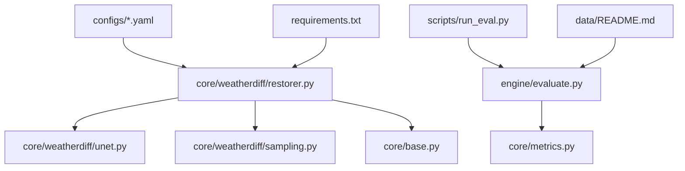
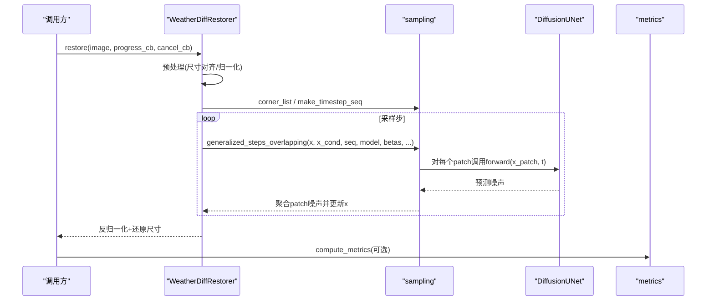
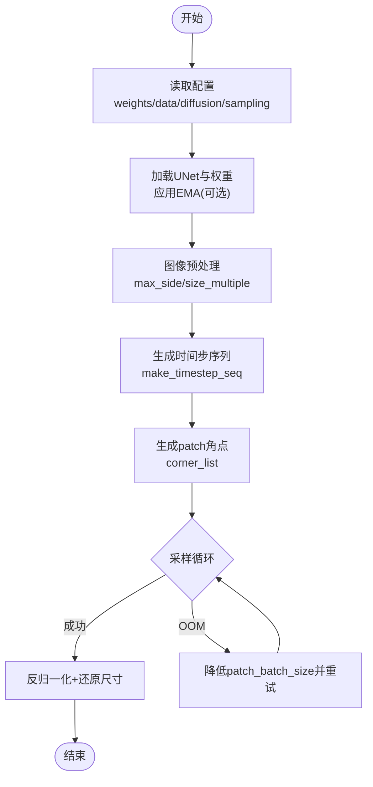
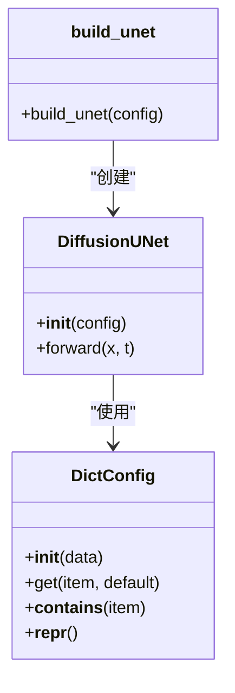
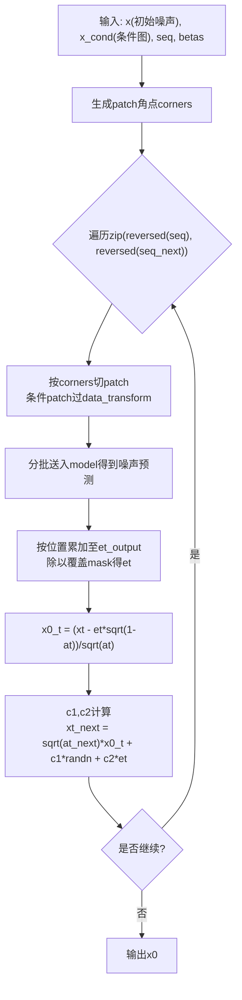
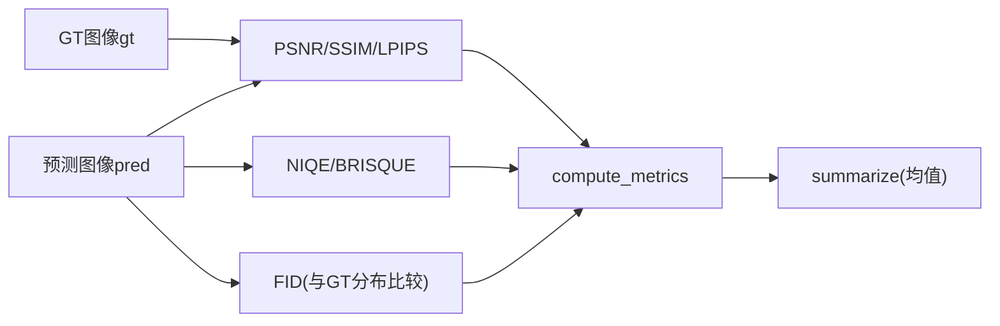
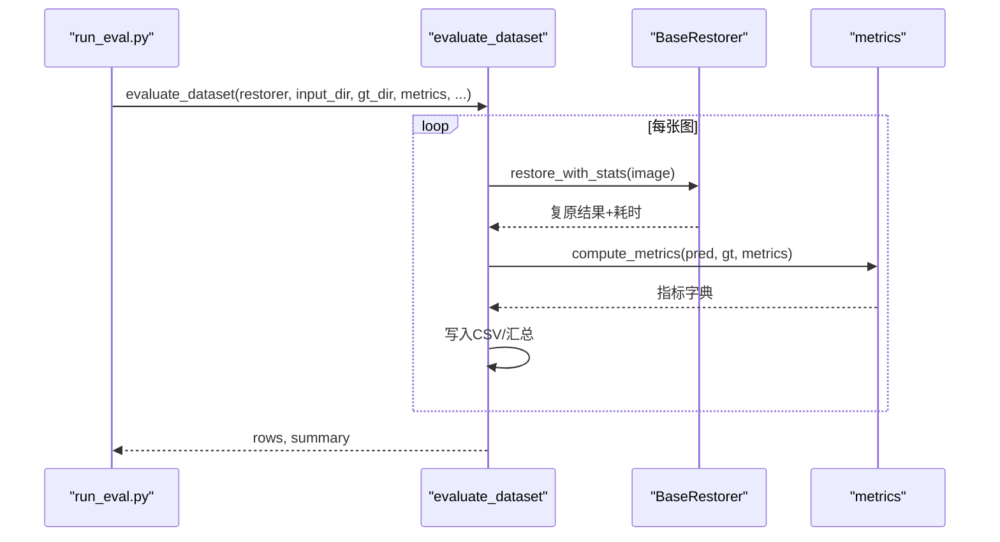
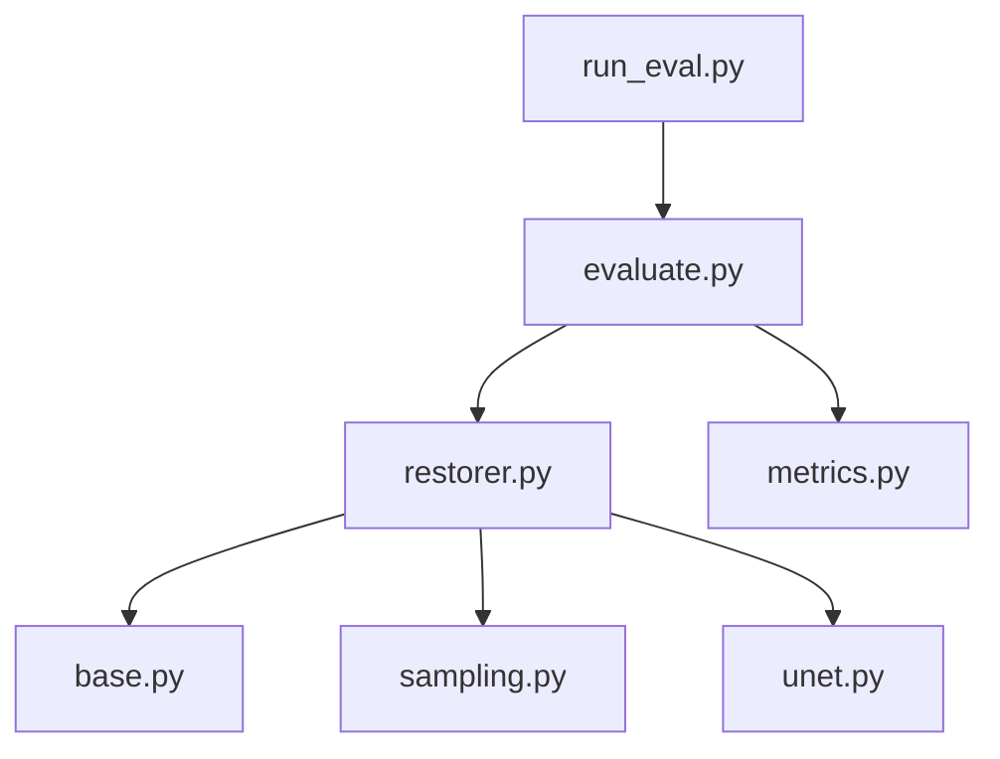

# 模型开发

<cite>
**本文引用的文件**
- [restorer.py](file://core/weatherdiff/restorer.py)
- [unet.py](file://core/weatherdiff/unet.py)
- [sampling.py](file://core/weatherdiff/sampling.py)
- [allweather.yaml](file://configs/allweather.yaml)
- [base.py](file://core/base.py)
- [metrics.py](file://core/metrics.py)
- [evaluate.py](file://engine/evaluate.py)
- [run_eval.py](file://scripts/run_eval.py)
- [README.md](file://data/README.md)
- [requirements.txt](file://requirements.txt)
</cite>

## 目录
1. [简介](#简介)
2. [项目结构](#项目结构)
3. [核心组件](#核心组件)
4. [架构总览](#架构总览)
5. [详细组件分析](#详细组件分析)
6. [依赖关系分析](#依赖关系分析)
7. [性能考虑](#性能考虑)
8. [故障排查指南](#故障排查指南)
9. [结论](#结论)
10. [附录](#附录)

## 简介
本项目围绕 WeatherDiffusion 扩散模型，面向雨、雾、雪等恶劣天气的图像复原任务。代码库提供了统一的复原器接口、基于 patch 的条件扩散推理流程、DDIM 采样骨架、指标评测与批量评测脚本，以及可配置的权重加载与设备管理。当前仓库中 UNet 网络结构与 patch-based DDIM 主循环为待实现占位，需从官方仓库移植以完成端到端训练与推理。

## 项目结构
- configs：不同场景与模型的配置文件（如 allweather.yaml），定义数据尺寸、通道数、是否条件输入、UNet 超参、扩散噪声调度、采样步数与滑窗策略等。
- core：核心逻辑
  - base：统一复原器抽象接口与结果封装
  - weatherdiff：WeatherDiffusion 复原器、UNet 占位、采样骨架
  - metrics：PSNR、SSIM、LPIPS、NIQE、BRISQUE、FID 等指标计算
  - image_utils：图像预处理/后处理工具
  - registry：复原器注册与构建
- engine：批量评测与推理入口
- scripts：命令行工具（下载权重、检查权重、运行评测、冒烟测试）
- data：数据集说明与约定
- ui：可视化界面（与本指南关联度较低）
- weights：预训练权重存放位置

图表来源
- [restorer.py:32-167](file://core/weatherdiff/restorer.py#L32-L167)
- [unet.py:51-72](file://core/weatherdiff/unet.py#L51-L72)
- [sampling.py:31-163](file://core/weatherdiff/sampling.py#L31-L163)
- [base.py:61-148](file://core/base.py#L61-L148)
- [metrics.py:134-193](file://core/metrics.py#L134-L193)
- [evaluate.py:51-116](file://engine/evaluate.py#L51-L116)
- [run_eval.py:32-91](file://scripts/run_eval.py#L32-L91)
- [README.md:6-51](file://data/README.md#L6-L51)
- [requirements.txt:14-33](file://requirements.txt#L14-L33)

章节来源
- [allweather.yaml:1-47](file://configs/allweather.yaml#L1-L47)
- [README.md:6-51](file://data/README.md#L6-L51)

## 核心组件
- WeatherDiffRestorer：负责设备选择、权重加载（兼容 DataParallel 前缀与 EMA）、图像预处理、调用 patch-based DDIM 采样、显存自适应重试、结果还原到原始尺寸。
- DiffusionUNet：条件扩散 UNet 网络结构（当前为占位，需移植官方实现）。
- sampling：提供 beta 调度、时间步压缩、重叠 patch 坐标生成、数据归一化与 alpha 计算；generalized_steps_overlapping 为待实现的 patch-based DDIM 主循环。
- metrics：提供 PSNR、SSIM、LPIPS、NIQE、BRISQUE、FID 等指标计算与汇总。
- evaluate：批量评测流程，遍历数据集、执行复原、计算指标、导出 CSV。
- run_eval：命令行入口，支持多配置、多方法对比、可选 FID。

章节来源
- [restorer.py:32-167](file://core/weatherdiff/restorer.py#L32-L167)
- [unet.py:51-72](file://core/weatherdiff/unet.py#L51-L72)
- [sampling.py:31-163](file://core/weatherdiff/sampling.py#L31-L163)
- [metrics.py:134-193](file://core/metrics.py#L134-L193)
- [evaluate.py:51-116](file://engine/evaluate.py#L51-L116)
- [run_eval.py:32-91](file://scripts/run_eval.py#L32-L91)

## 架构总览
WeatherDiffusion 采用“条件扩散 + patch 滑动窗口”的推理架构：
- 输入退化图经预处理对齐到 16 的倍数并限制长边，切分为重叠 patch。
- 每个去噪步对所有 patch 分别预测噪声，按位置累加得到整图噪声估计，再走一步 DDIM 更新。
- 通过控制 patch_batch_size 调节显存占用，自动降级避免 OOM。
- 最终输出反归一化并还原到原始分辨率。

图表来源
- [restorer.py:102-167](file://core/weatherdiff/restorer.py#L102-L167)
- [sampling.py:54-163](file://core/weatherdiff/sampling.py#L54-L163)
- [unet.py:51-72](file://core/weatherdiff/unet.py#L51-L72)
- [metrics.py:134-193](file://core/metrics.py#L134-L193)

## 详细组件分析

### WeatherDiffRestorer（推理编排）
- 权重加载：读取配置文件中的权重路径，构造 UNet，加载 state_dict，支持 module. 前缀剥离与 EMA 覆盖。
- 设备选择：优先 CUDA，可通过环境变量强制指定。
- 预处理：限制最大边、对齐到 16 的倍数、反射填充小图。
- 采样：生成时间步序列与 patch 角点列表，调用 generalized_steps_overlapping；显存不足时自动减半 patch_batch_size 重试。
- 后处理：反归一化、转 uint8、还原到原始尺寸。

图表来源
- [restorer.py:47-90](file://core/weatherdiff/restorer.py#L47-L90)
- [restorer.py:102-167](file://core/weatherdiff/restorer.py#L102-L167)

章节来源
- [restorer.py:47-167](file://core/weatherdiff/restorer.py#L47-L167)

### DiffusionUNet（网络结构）
- 要求：类名 DiffusionUNet，构造签名 DiffusionUNet(config)，config 为可属性访问对象。
- 子模块命名必须与官方一致：conv_in / down / mid / up / norm_out / conv_out / temb.dense。
- forward(x, t)：输入 x 为 (B, 6, P, P) = concat[条件patch(3), 噪声patch(3)]，t 为时间步；返回预测噪声 (B, 3, P, P)。
- 输入通道数应为 config.model.in_channels * 2（因为 conditional=True）。

图表来源
- [unet.py:31-59](file://core/weatherdiff/unet.py#L31-L59)
- [unet.py:64-72](file://core/weatherdiff/unet.py#L64-L72)

章节来源
- [unet.py:1-72](file://core/weatherdiff/unet.py#L1-L72)

### Patch-based DDIM 采样（sampling）
- beta 调度：线性、二次、常数、JSD 多种方案，默认线性。
- 时间步压缩：将 1000 步压缩为 sampling_timesteps 步的等间隔序列。
- 重叠网格：生成滑窗左上角坐标，确保右下角被覆盖。
- 数据变换：[-1,1] 与 [0,1] 互转。
- alpha 计算：compute_alpha(betas, t) 用于 DDIM 更新。
- generalized_steps_overlapping：待实现的主循环，需按官方 utils/sampling.py 实现 patch 级噪声预测、累加平均与 DDIM 更新。

图表来源
- [sampling.py:31-110](file://core/weatherdiff/sampling.py#L31-L110)
- [sampling.py:115-163](file://core/weatherdiff/sampling.py#L115-L163)

章节来源
- [sampling.py:31-163](file://core/weatherdiff/sampling.py#L31-L163)

### 指标体系（metrics）
- 有参考指标：PSNR（纯 numpy）、SSIM（优先 scikit-image，兜底内置实现）、LPIPS（感知相似度，越小越好）。
- 无参考指标：NIQE、BRISQUE（需要 pyiqa）。
- 数据集级指标：FID（需要 pytorch-fid，建议每目录至少 50 张）。
- 汇总：compute_metrics 计算单图指标，summarize 求均值（忽略 None 与 inf）。

图表来源
- [metrics.py:57-128](file://core/metrics.py#L57-L128)
- [metrics.py:134-193](file://core/metrics.py#L134-L193)

章节来源
- [metrics.py:57-193](file://core/metrics.py#L57-L193)

### 批量评测（engine.evaluate + scripts.run_eval）
- evaluate_dataset：遍历配对图像，执行复原，计算指标，保存输出，导出逐图 CSV 与汇总 CSV。
- run_eval：命令行入口，支持多配置、多方法对比，可选 FID，支持覆盖采样步数与滑窗步长。

图表来源
- [evaluate.py:51-116](file://engine/evaluate.py#L51-L116)
- [run_eval.py:32-91](file://scripts/run_eval.py#L32-L91)
- [metrics.py:134-193](file://core/metrics.py#L134-L193)

章节来源
- [evaluate.py:51-116](file://engine/evaluate.py#L51-L116)
- [run_eval.py:32-91](file://scripts/run_eval.py#L32-L91)

## 依赖关系分析
- restorer.py 依赖 base.py（统一接口）、image_utils（预处理/后处理）、registry（注册）、sampling（采样）、unet（网络）。
- sampling.py 提供通用扩散工具函数，不依赖网络结构。
- metrics.py 依赖 image_utils 进行数据类型转换，延迟导入第三方库以避免启动失败。
- evaluate.py 依赖 base、image_utils、metrics，串联批处理流程。
- run_eval.py 作为命令行入口，组合上述模块。

图表来源
- [restorer.py:17-30](file://core/weatherdiff/restorer.py#L17-L30)
- [evaluate.py:10-18](file://engine/evaluate.py#L10-L18)
- [run_eval.py:24-29](file://scripts/run_eval.py#L24-L29)

章节来源
- [restorer.py:17-30](file://core/weatherdiff/restorer.py#L17-L30)
- [evaluate.py:10-18](file://engine/evaluate.py#L10-L18)
- [run_eval.py:24-29](file://scripts/run_eval.py#L24-L29)

## 性能考虑
- 显存优化：
  - 使用 patch-based 推理，显存仅与 patch_size 和 patch_batch_size 相关，与整图分辨率解耦。
  - 自动 OOM 检测与降 batch 重试机制，保障大图的稳定推理。
- 采样加速：
  - 通过 make_timestep_seq 将 1000 步压缩为较少步数（如 25 步），显著减少计算量。
  - 调整 grid_r 控制滑窗步长，平衡边界质量与速度。
- 设备选择：
  - 优先 CUDA，可通过环境变量强制 CPU/CUDA。
- 指标计算：
  - LPIPS、NIQE、BRISQUE、FID 依赖第三方库，按需安装；未安装时优雅降级或提示不可用。

章节来源
- [restorer.py:137-161](file://core/weatherdiff/restorer.py#L137-L161)
- [sampling.py:54-58](file://core/weatherdiff/sampling.py#L54-L58)
- [metrics.py:205-219](file://core/metrics.py#L205-L219)
- [requirements.txt:21-33](file://requirements.txt#L21-L33)

## 故障排查指南
- 权重缺失：
  - 现象：load_model 抛出 WeightNotFoundError。
  - 处理：执行 download_weights 或手动放置权重到 weights/，并检查 configs 中的 weights.path。
- 显存不足：
  - 现象：RuntimeError out of memory。
  - 处理：自动降低 patch_batch_size 重试；也可在配置中调小 patch_batch_size 或增大 grid_r。
- 指标不可用：
  - 现象：LPIPS/NIQE/BRISQUE/FID 计算失败。
  - 处理：安装对应依赖（lpips、pyiqa、pytorch-fid）；未安装时 compute_metrics 会记录 None 并跳过。
- 尺寸不一致：
  - 现象：评估时报错预测与 GT 尺寸不一致。
  - 处理：确保预处理阶段对齐到 16 的倍数；评估时会自动缩放 GT 到输出尺寸。

章节来源
- [restorer.py:50-75](file://core/weatherdiff/restorer.py#L50-L75)
- [restorer.py:137-161](file://core/weatherdiff/restorer.py#L137-L161)
- [metrics.py:134-177](file://core/metrics.py#L134-L177)
- [evaluate.py:100-106](file://engine/evaluate.py#L100-L106)

## 结论
本仓库为 WeatherDiffusion 的完整工程框架，已实现推理编排、patch 采样骨架、指标评测与批量评测流程。当前关键缺口在于 UNet 网络结构与 patch-based DDIM 主循环的实现，需从官方仓库移植以完成端到端训练与推理。配置系统灵活，支持多天气场景与统一模型；指标体系完备，便于科学评估。

## 附录

### 训练数据准备流程（基于仓库现有能力）
- 数据集组织：遵循 data/README.md 约定的目录结构，input/ 与 gt/ 分开存放，文件名主干一致以便自动配对。
- 数据增强：当前仓库未提供训练数据增强逻辑；可在外部预处理管线中添加随机裁剪、翻转、颜色抖动等。
- 批次构建：训练阶段需在外部训练脚本中按 patch_size 切分图像并构建批次；推理阶段由 restorer 内部完成 patch 切分与聚合。
- 损失函数设计：扩散模型通常以预测噪声的均方误差为主；具体实现需在 UNet 训练循环中定义。

章节来源
- [README.md:6-51](file://data/README.md#L6-L51)

### 模型训练脚本使用方法与超参数调优建议
- 训练脚本：仓库未包含训练脚本；建议在外部实现训练循环，使用 restorer 中的 diffusion 配置（beta_schedule、beta_start、beta_end、num_diffusion_timesteps）与 sampling 配置（timesteps、grid_r、eta、patch_batch_size、seed）。
- 超参数建议：
  - beta_schedule：线性常用且稳定；quad/const/jsd 可用于实验对比。
  - num_diffusion_timesteps：1000 为标准设置；推理时可压缩到 25 步以提升速度。
  - patch_size：64 为默认；更大可提高细节但增加显存。
  - grid_r：16 为默认；增大可减少重叠、提升速度，但可能影响边界质量。
  - eta：推理默认 0；若做随机采样可尝试非零值。
  - patch_batch_size：根据显存调整，默认 32；OOM 时自动降级。

章节来源
- [allweather.yaml:22-47](file://configs/allweather.yaml#L22-L47)
- [restorer.py:81-88](file://core/weatherdiff/restorer.py#L81-L88)
- [sampling.py:31-58](file://core/weatherdiff/sampling.py#L31-L58)

### 模型评估指标的选择与解释
- PSNR：峰值信噪比，越大越好；对像素级误差敏感。
- SSIM：结构相似度，越大越好；关注局部结构与亮度对比。
- LPIPS：感知相似度，越小越好；基于深度特征的距离，更贴近人眼感知。
- NIQE/BRISQUE：无参考指标，越小越好；无需 GT，适合真实场景。
- FID：分布级指标，越小越好；比较预测集与 GT 集的分布差异，需足够样本量。

章节来源
- [metrics.py:27-47](file://core/metrics.py#L27-L47)
- [metrics.py:57-128](file://core/metrics.py#L57-L128)
- [metrics.py:134-193](file://core/metrics.py#L134-L193)