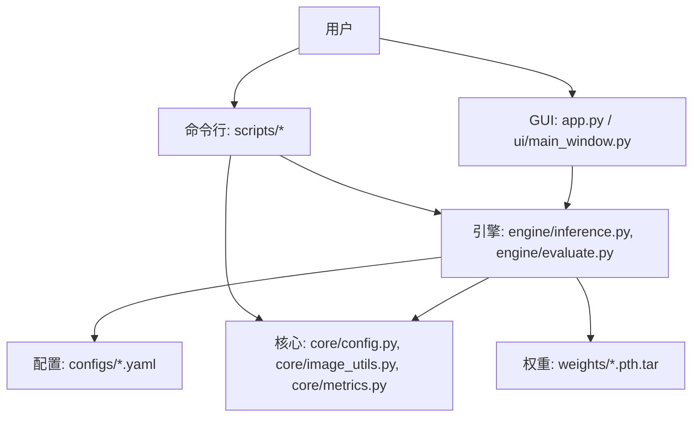
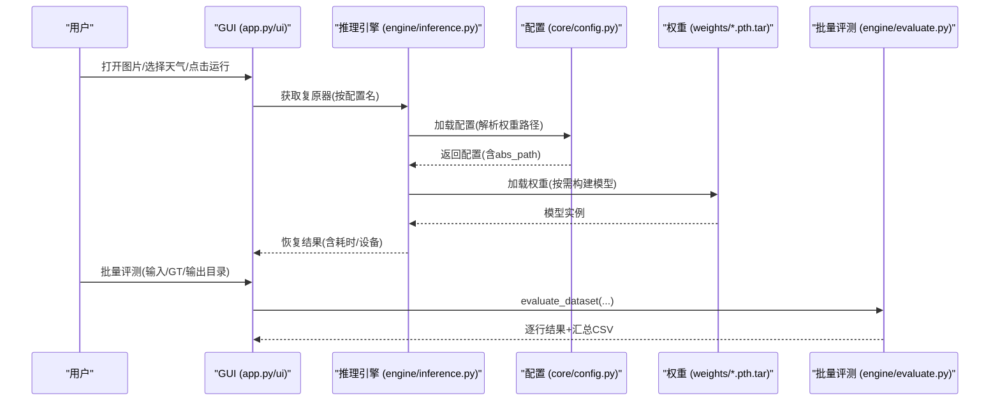
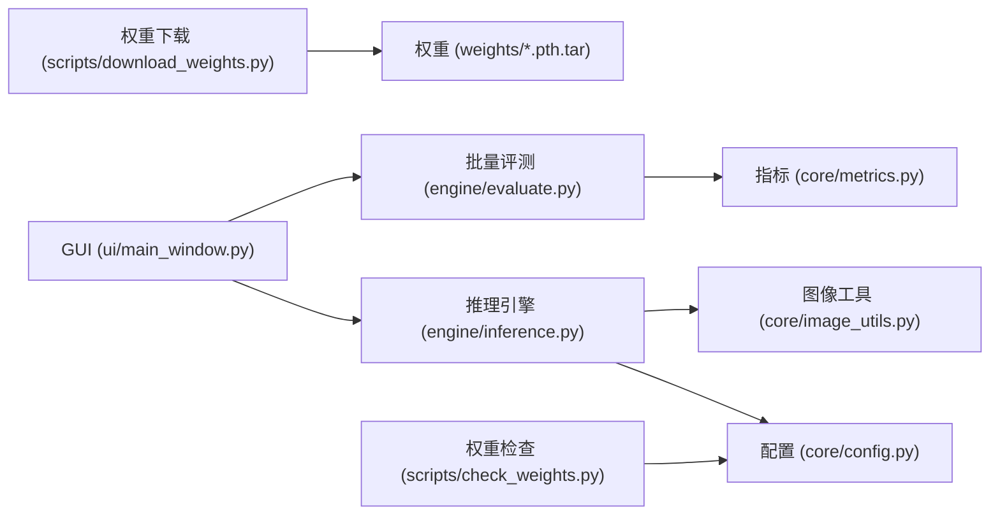

# 快速开始

<cite>
**本文引用的文件**
- [requirements.txt](file://requirements.txt)
- [app.py](file://app.py)
- [scripts/download_weights.py](file://scripts/download_weights.py)
- [weights/README.md](file://weights/README.md)
- [data/README.md](file://data/README.md)
- [configs/allweather.yaml](file://configs/allweather.yaml)
- [configs/haze.yaml](file://configs/haze.yaml)
- [configs/snow.yaml](file://configs/snow.yaml)
- [core/config.py](file://core/config.py)
- [ui/main_window.py](file://ui/main_window.py)
- [engine/inference.py](file://engine/inference.py)
- [engine/evaluate.py](file://engine/evaluate.py)
- [scripts/smoke_test.py](file://scripts/smoke_test.py)
- [scripts/check_weights.py](file://scripts/check_weights.py)
</cite>

## 目录
1. [简介](#简介)
2. [项目结构](#项目结构)
3. [核心组件](#核心组件)
4. [架构总览](#架构总览)
5. [详细组件分析](#详细组件分析)
6. [依赖关系分析](#依赖关系分析)
7. [性能注意事项](#性能注意事项)
8. [故障排查指南](#故障排查指南)
9. [结论](#结论)
10. [附录](#附录)

## 简介
本指南面向首次接触“恶劣天气图像复原系统”的用户，目标是帮助你在最短时间内完成环境安装、权重下载与配置、GUI 启动与第一张图像处理，并掌握命令行工具进行批量处理与测试。系统支持多种天气类型（雨、雾、雪）的统一模型推理，并提供可视化界面与批量评测能力。

## 项目结构
仓库采用分层组织：
- 配置与数据：configs/*.yaml 定义不同天气场景与模型参数；data/ 存放数据集（不在版本库中）。
- 核心逻辑：core/ 提供配置加载、图像工具、指标计算、注册表与基础复原接口。
- 引擎层：engine/ 封装推理编排与批量评测流程。
- 脚本：scripts/ 提供权重下载、权重检查、冒烟测试等实用工具。
- 界面：ui/ 基于 PyQt5 的 GUI，包含单图复原、批量评测与环境信息查看。
- 入口：app.py 启动 GUI 应用。

图表来源
- [app.py:1-37](file://app.py#L1-L37)
- [ui/main_window.py:499-519](file://ui/main_window.py#L499-L519)
- [engine/inference.py:22-68](file://engine/inference.py#L22-L68)
- [engine/evaluate.py:51-116](file://engine/evaluate.py#L51-L116)
- [core/config.py:25-57](file://core/config.py#L25-L57)
- [configs/allweather.yaml:1-47](file://configs/allweather.yaml#L1-L47)

章节来源
- [app.py:1-37](file://app.py#L1-L37)
- [ui/main_window.py:499-519](file://ui/main_window.py#L499-L519)
- [engine/inference.py:22-68](file://engine/inference.py#L22-L68)
- [engine/evaluate.py:51-116](file://engine/evaluate.py#L51-L116)
- [core/config.py:25-57](file://core/config.py#L25-L57)
- [configs/allweather.yaml:1-47](file://configs/allweather.yaml#L1-L47)

## 核心组件
- 配置系统：集中管理各天气场景的模型参数、采样策略与权重路径，自动解析相对路径为绝对路径。
- 推理编排：提供单图、单文件、批量推理接口，内置模型缓存以优化切换天气时的显存与加载开销。
- 批量评测：遍历数据集配对输入与 GT，计算 PSNR/SSIM 等指标，导出 CSV。
- 权重管理：提供一键下载与自检脚本，支持断点续传与多权重列表。
- GUI：三标签页（单图复原、批量评测、关于/环境），支持拖拽图片、实时进度、结果保存与指标展示。

章节来源
- [core/config.py:25-57](file://core/config.py#L25-L57)
- [engine/inference.py:22-68](file://engine/inference.py#L22-L68)
- [engine/evaluate.py:51-116](file://engine/evaluate.py#L51-L116)
- [scripts/download_weights.py:82-116](file://scripts/download_weights.py#L82-L116)
- [ui/main_window.py:61-251](file://ui/main_window.py#L61-L251)

## 架构总览
下图展示了从 GUI 到推理引擎再到配置与权重的调用链，以及批量评测的数据流。

图表来源
- [app.py:19-32](file://app.py#L19-L32)
- [ui/main_window.py:188-240](file://ui/main_window.py#L188-L240)
- [engine/inference.py:33-52](file://engine/inference.py#L33-L52)
- [core/config.py:25-57](file://core/config.py#L25-L57)
- [engine/evaluate.py:51-116](file://engine/evaluate.py#L51-L116)

## 详细组件分析

### 环境安装与依赖
- Python 版本建议：3.10（见依赖清单注释）。
- PyTorch 需先按 CUDA 版本单独安装，再安装其余依赖。
- 最小依赖（界面组/评测组初期开发可用）：numpy、pillow、pyyaml、PyQt5、scikit-image。
- 深度学习依赖（模型组）：torch、torchvision。
- 指标扩展（评测组）：lpips、pyiqa、pytorch-fid。
- 可视化工具：pyqtgraph、tqdm、requests。

安装步骤概览：
1. 创建并激活虚拟环境（推荐）。
2. 按显卡 CUDA 版本安装 PyTorch 与 torchvision。
3. 执行依赖安装命令。
4. 使用冒烟测试脚本验证环境是否就绪。

章节来源
- [requirements.txt:1-34](file://requirements.txt#L1-L34)
- [scripts/smoke_test.py:35-151](file://scripts/smoke_test.py#L35-L151)

### 权重文件的下载与配置
- 推荐使用脚本一键下载默认权重（WeatherDiff64），也支持下载全部或自定义 URL。
- 权重目录位于 weights/，配置文件通过 configs/*.yaml 引用权重路径，系统会自动解析为绝对路径。
- 下载完成后，可使用权重检查脚本打印 checkpoint 结构与关键键名，必要时尝试构建模型并加载。

操作步骤：
1. 运行权重下载脚本（默认下载 WeatherDiff64）。
2. 如需查看所有可下载权重，使用 --list。
3. 下载完成后，运行权重检查脚本验证。

章节来源
- [scripts/download_weights.py:82-116](file://scripts/download_weights.py#L82-L116)
- [weights/README.md:5-28](file://weights/README.md#L5-L28)
- [core/config.py:25-57](file://core/config.py#L25-L57)
- [scripts/check_weights.py:24-86](file://scripts/check_weights.py#L24-L86)

### 第一个示例：启动 GUI 并处理第一张图像
- 启动方式：直接运行入口脚本；也可设置环境变量使用假模型或强制 CPU。
- 在 GUI 中打开一张退化图像，选择天气类型（如 allweather/haze/snow/dcp），点击运行即可看到逐步去噪的预览与最终结果。
- 支持拖拽图片、选择 GT 计算 PSNR/SSIM、保存结果。

操作要点：
- 正常启动：python app.py
- 使用假模型（无需权重/GPU）：设置 AWR_MOCK=1 后启动
- 强制 CPU：设置 AWR_DEVICE=cpu 后启动

章节来源
- [app.py:1-37](file://app.py#L1-L37)
- [ui/main_window.py:61-251](file://ui/main_window.py#L61-L251)

### 命令行工具：批量处理与测试
- 冒烟测试：在不依赖权重与 GPU 的情况下，验证依赖、配置、假模型、DCP 算法、指标计算、批量评测与 CSV 导出。
- 权重检查：打印 checkpoint 结构，必要时尝试构建模型并加载。
- 批量评测：通过 evaluate_dataset 对数据集进行复原与指标计算，支持限制数量、导出 CSV。

常用命令：
- 冒烟测试：python scripts/smoke_test.py
- 权重检查：python scripts/check_weights.py [--config rain] [--try-build]
- 批量评测：结合 UI 的“批量评测”页或调用 evaluate_dataset（由 UI 与脚本共用）

章节来源
- [scripts/smoke_test.py:35-151](file://scripts/smoke_test.py#L35-L151)
- [scripts/check_weights.py:24-86](file://scripts/check_weights.py#L24-L86)
- [engine/evaluate.py:51-116](file://engine/evaluate.py#L51-L116)

### 配置说明与天气类型
- 统一模型（allweather）：不区分天气类型，一个模型处理多种叠加退化。
- 去雾（haze）、去雪（snow）：与统一模型共用同一份权重，对应官方测试场景。
- 配置项包括 data.image_size、model 参数、diffusion 参数、sampling 策略等。

章节来源
- [configs/allweather.yaml:1-47](file://configs/allweather.yaml#L1-L47)
- [configs/haze.yaml:1-46](file://configs/haze.yaml#L1-L46)
- [configs/snow.yaml:1-46](file://configs/snow.yaml#L1-L46)

## 依赖关系分析
- GUI 依赖 PyQt5，并通过 ModelCache 复用已加载的复原器实例，减少重复加载与显存占用。
- 推理引擎依赖配置系统与图像工具，负责加载模型、执行恢复、保存结果。
- 批量评测依赖图像配对、指标计算与 CSV 导出。
- 权重下载与检查脚本独立于 GUI，便于在服务器或无头环境中使用。

图表来源
- [ui/main_window.py:499-519](file://ui/main_window.py#L499-L519)
- [engine/inference.py:22-68](file://engine/inference.py#L22-L68)
- [engine/evaluate.py:51-116](file://engine/evaluate.py#L51-L116)
- [core/config.py:25-57](file://core/config.py#L25-L57)
- [scripts/download_weights.py:82-116](file://scripts/download_weights.py#L82-L116)
- [scripts/check_weights.py:24-86](file://scripts/check_weights.py#L24-L86)

章节来源
- [ui/main_window.py:499-519](file://ui/main_window.py#L499-L519)
- [engine/inference.py:22-68](file://engine/inference.py#L22-L68)
- [engine/evaluate.py:51-116](file://engine/evaluate.py#L51-L116)
- [core/config.py:25-57](file://core/config.py#L25-L57)
- [scripts/download_weights.py:82-116](file://scripts/download_weights.py#L82-L116)
- [scripts/check_weights.py:24-86](file://scripts/check_weights.py#L24-L86)

## 性能注意事项
- 显存与速度：patch 大小影响显存与速度，默认使用 patch=64；若切换到 patch=128 需调整 data.image_size 并准备更大显存。
- 模型缓存：ModelCache 会缓存已加载的复原器，切换天气时避免重复加载；可通过 release_others() 控制显存。
- 采样步数：sampling.timesteps 越大质量可能更好但更慢；可在运行时覆盖该参数而不重新加载权重。
- 批量评测：限制 limit 用于调试；FID 需要足够样本量以保证数值可靠。

章节来源
- [scripts/download_weights.py:26-37](file://scripts/download_weights.py#L26-L37)
- [engine/inference.py:33-68](file://engine/inference.py#L33-L68)
- [data/README.md:42-51](file://data/README.md#L42-L51)

## 故障排查指南
- 缺少 PyQt5：启动 GUI 时会提示安装；确保已安装 PyQt5。
- 权重未找到：运行权重下载脚本；或使用 --list 查看可下载权重；确认 weights/ 目录存在且包含权重文件。
- 指标不可用：检查 lpips、pyiqa、pytorch-fid 等依赖是否安装；在“关于/环境”页可查看指标可用性。
- GPU 驱动/CUDA 问题：确认已按 CUDA 版本安装 PyTorch；在“关于/环境”页查看 cuda available 与设备信息。
- 内存不足：降低 sampling.timesteps、减小 image_size 或关闭其他占用显存的程序；必要时释放其他模型缓存。
- 取消任务：GUI 支持取消按钮；底层支持 cancel_cb 回调，遇到 RestoreCancelled 会中断处理。

章节来源
- [app.py:19-32](file://app.py#L19-L32)
- [scripts/download_weights.py:82-116](file://scripts/download_weights.py#L82-L116)
- [ui/main_window.py:441-496](file://ui/main_window.py#L441-L496)
- [scripts/smoke_test.py:35-151](file://scripts/smoke_test.py#L35-L151)

## 结论
通过本快速开始指南，你可以完成环境安装、权重下载与配置、GUI 启动与第一张图像处理，并使用命令行工具进行批量处理与测试。系统提供了灵活的配置与强大的批处理能力，适合在不同硬件条件下进行开发与评估。

## 附录
- 数据集目录约定：data/ 下按天气类型分目录存放 input/ 与 gt/，文件名主干一致以便自动配对。
- 权重直链：官方提供 TU Graz 直链，无需 Google Drive；支持断点续传。
- 备选方案：当主方案效果/速度不满意时，可参考其他仓库提供的权重与模型。

章节来源
- [data/README.md:1-51](file://data/README.md#L1-L51)
- [weights/README.md:5-40](file://weights/README.md#L5-L40)