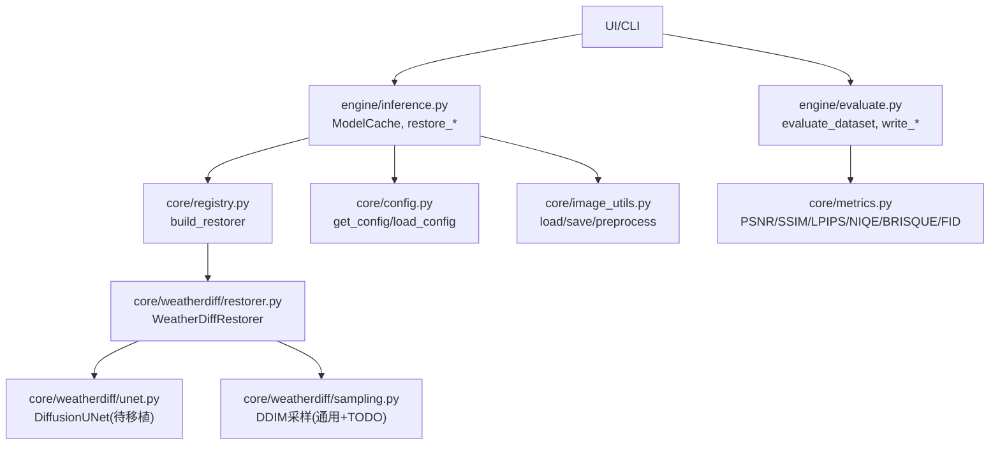
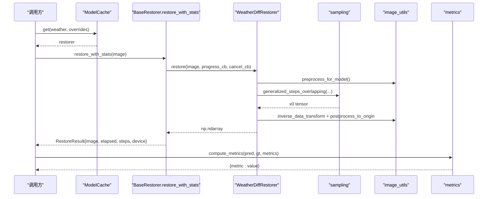
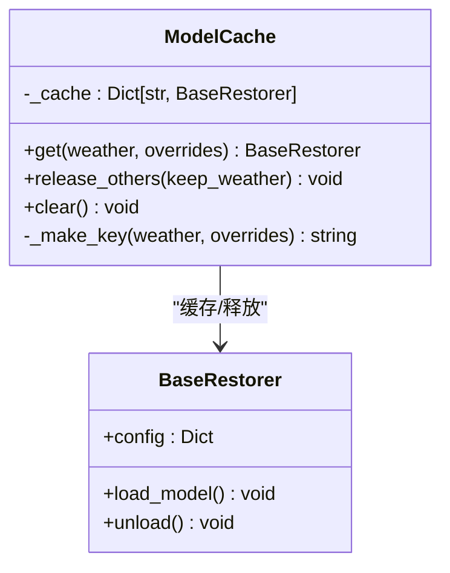
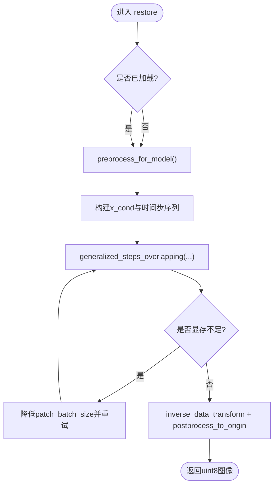
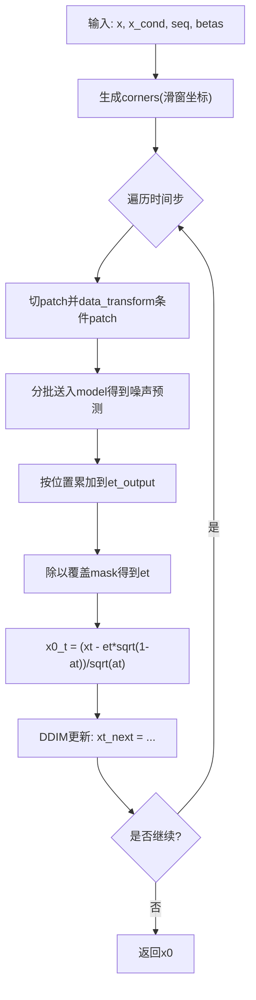
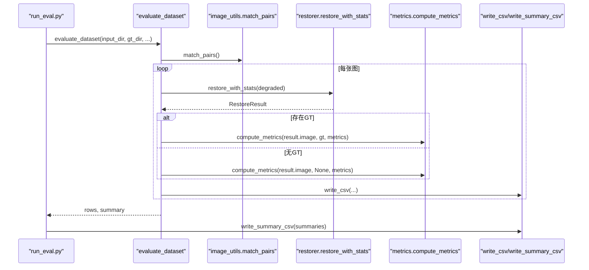
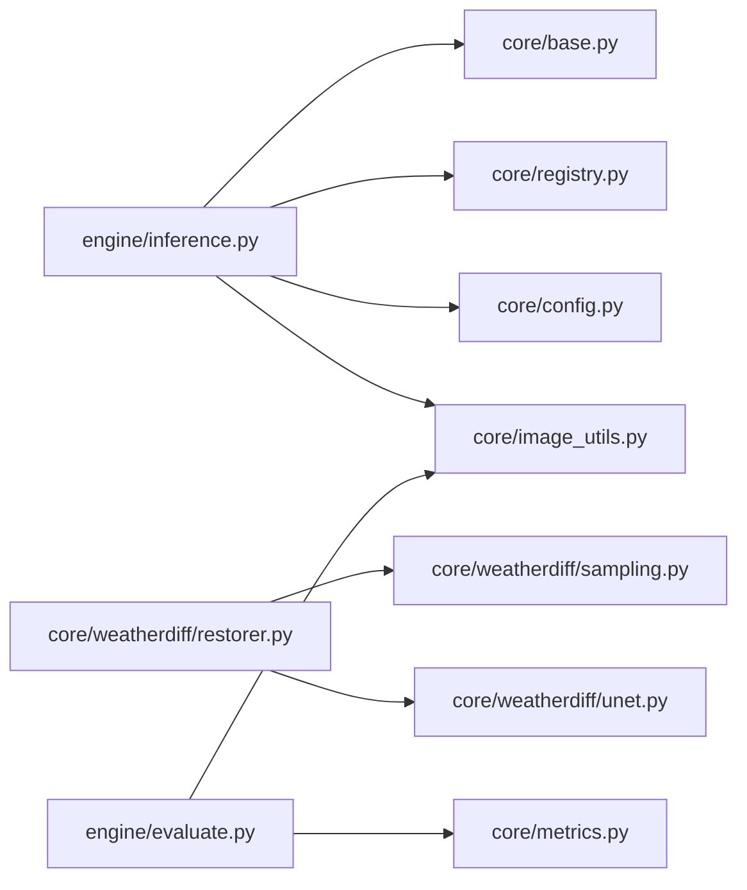

# 推理引擎

<cite>
**本文引用的文件**
- [engine/inference.py](file://engine/inference.py)
- [engine/evaluate.py](file://engine/evaluate.py)
- [core/base.py](file://core/base.py)
- [core/weatherdiff/restorer.py](file://core/weatherdiff/restorer.py)
- [core/weatherdiff/sampling.py](file://core/weatherdiff/sampling.py)
- [core/weatherdiff/unet.py](file://core/weatherdiff/unet.py)
- [core/config.py](file://core/config.py)
- [core/metrics.py](file://core/metrics.py)
- [core/image_utils.py](file://core/image_utils.py)
- [core/registry.py](file://core/registry.py)
- [scripts/run_eval.py](file://scripts/run_eval.py)
- [configs/rain.yaml](file://configs/rain.yaml)
- [configs/allweather.yaml](file://configs/allweather.yaml)
</cite>

## 目录
1. [简介](#简介)
2. [项目结构](#项目结构)
3. [核心组件](#核心组件)
4. [架构总览](#架构总览)
5. [详细组件分析](#详细组件分析)
6. [依赖关系分析](#依赖关系分析)
7. [性能考量](#性能考量)
8. [故障排查指南](#故障排查指南)
9. [结论](#结论)
10. [附录：API与使用示例](#附录api与使用示例)

## 简介
本推理引擎面向恶劣天气图像复原，提供统一的模型加载、推理编排、批量评测与结果导出能力。核心围绕 WeatherDiffusion 扩散模型实现，采用 patch-based DDIM 采样以控制显存占用；同时提供 Mock 与 DCP 基线以支持快速验证与对比。系统通过配置驱动（YAML）管理不同天气场景与采样参数，并通过 ModelCache 缓存已加载的模型实例，避免重复读盘与显存膨胀。

## 项目结构
- engine: 推理编排与批量评测入口
- core: 基础接口、配置、图像工具、指标计算、注册表与具体复原器实现
- configs: 各天气场景的配置（rain/haze/snow/allweather/dcp/mock）
- scripts: 命令行脚本（下载权重、检查权重、运行评测等）
- ui: 可选的图形界面（不在本文重点）
- weights/data: 权重与数据目录

图表来源
- [engine/inference.py:22-67](file://engine/inference.py#L22-L67)
- [engine/evaluate.py:51-116](file://engine/evaluate.py#L51-L116)
- [core/registry.py:68-84](file://core/registry.py#L68-L84)
- [core/config.py:25-91](file://core/config.py#L25-L91)
- [core/weatherdiff/restorer.py:47-90](file://core/weatherdiff/restorer.py#L47-L90)
- [core/weatherdiff/sampling.py:31-163](file://core/weatherdiff/sampling.py#L31-L163)
- [core/metrics.py:134-193](file://core/metrics.py#L134-L193)

章节来源
- [engine/inference.py:1-153](file://engine/inference.py#L1-L153)
- [engine/evaluate.py:1-181](file://engine/evaluate.py#L1-L181)
- [core/config.py:1-98](file://core/config.py#L1-L98)

## 核心组件
- BaseRestorer: 统一复原接口契约，定义 load_model/restore/restore_with_stats/unload 等，提供进度与取消回调、尺寸校验与计时封装。
- WeatherDiffRestorer: 基于 WeatherDiffusion 的具体实现，负责设备选择、权重加载（含 EMA）、预处理、patch-based DDIM 采样、后处理与显存自适应。
- ModelCache: 按配置名缓存已加载的复原器实例，支持 release_others/clear 释放显存，避免重复加载。
- 采样模块 sampling: 提供 beta 调度、时间步压缩、重叠网格生成、数据变换等通用逻辑；generalized_steps_overlapping 为 TODO，需模型组实现。
- 指标模块 metrics: 有参考/无参考/数据集级指标，延迟导入第三方库，提供 compute_metrics/summarize/format_value 等。
- 图像工具 image_utils: 统一图像 IO、几何变换、预处理/后处理、配对匹配等。
- 配置 config: YAML 加载、路径解析、权重路径获取、天气顺序等。
- 注册表 registry: 动态构建复原器，支持 AWR_MOCK 降级到假模型。

章节来源
- [core/base.py:61-185](file://core/base.py#L61-L185)
- [core/weatherdiff/restorer.py:32-90](file://core/weatherdiff/restorer.py#L32-L90)
- [engine/inference.py:22-67](file://engine/inference.py#L22-L67)
- [core/weatherdiff/sampling.py:31-163](file://core/weatherdiff/sampling.py#L31-L163)
- [core/metrics.py:134-193](file://core/metrics.py#L134-L193)
- [core/image_utils.py:145-167](file://core/image_utils.py#L145-L167)
- [core/config.py:25-91](file://core/config.py#L25-L91)
- [core/registry.py:68-84](file://core/registry.py#L68-L84)

## 架构总览
推理流程从上层调用开始，经 ModelCache 获取或创建复原器，执行预处理、模型加载、采样、后处理，最终返回结果并统计耗时。批量评测则遍历数据集，逐图复原并计算指标，输出 CSV 与汇总。

图表来源
- [engine/inference.py:70-96](file://engine/inference.py#L70-L96)
- [core/base.py:111-138](file://core/base.py#L111-L138)
- [core/weatherdiff/restorer.py:102-167](file://core/weatherdiff/restorer.py#L102-L167)
- [core/weatherdiff/sampling.py:115-163](file://core/weatherdiff/sampling.py#L115-L163)
- [core/image_utils.py:145-167](file://core/image_utils.py#L145-L167)
- [core/metrics.py:134-193](file://core/metrics.py#L134-L193)

## 详细组件分析

### ModelCache 模型缓存机制
- 功能要点
  - 按 weather|overrides_key 缓存 BaseRestorer 实例，避免重复加载权重与显存占用。
  - 支持运行时覆盖部分配置（如 timesteps/grid_r），无需重新加载权重。
  - 提供 release_others(keep_weather) 仅保留指定天气的模型，clear 清空全部。
- 内存优化
  - 通过 unload() 释放模型与中间张量，必要时调用 CUDA empty_cache。
  - key 设计忽略不影响权重的采样参数，减少缓存碎片。
- 设备切换
  - 由底层 restorer._pick_device 决定设备，可通过环境变量 AWR_DEVICE 强制指定。

图表来源
- [engine/inference.py:22-67](file://engine/inference.py#L22-L67)
- [core/base.py:61-143](file://core/base.py#L61-L143)

章节来源
- [engine/inference.py:22-67](file://engine/inference.py#L22-L67)

### WeatherDiffRestorer 推理流程
- 权重加载
  - 根据配置查找权重路径，缺失时抛出 WeightNotFoundError。
  - 兼容 DataParallel 前缀与 EMA 权重覆盖。
  - 自动选择设备（优先 CUDA，可被 AWR_DEVICE 覆盖）。
- 预处理
  - 长边限制、尺寸对齐至 16 的倍数、小图反射填充。
- 采样过程
  - 构造初始噪声与条件输入，生成时间步序列。
  - 调用 patch-based DDIM 采样（generalized_steps_overlapping）。
  - 显存不足时自动降低 patch_batch_size 重试。
- 后处理
  - 反归一化、裁剪回原始尺寸，返回 RGB uint8。

图表来源
- [core/weatherdiff/restorer.py:47-90](file://core/weatherdiff/restorer.py#L47-L90)
- [core/weatherdiff/restorer.py:102-167](file://core/weatherdiff/restorer.py#L102-L167)
- [core/image_utils.py:145-167](file://core/image_utils.py#L145-L167)

章节来源
- [core/weatherdiff/restorer.py:47-167](file://core/weatherdiff/restorer.py#L47-L167)

### 采样模块 sampling
- 通用能力
  - beta 调度（linear/quad/const/jsd）。
  - 时间步压缩（DDIM 加速）。
  - 重叠网格坐标生成（corner_list）。
  - 数据变换（[-1,1] <-> [0,1]）。
- TODO
  - generalized_steps_overlapping: 需实现 patch 切分、分批推理、累加平均、DDIM 更新与进度/取消回调。

图表来源
- [core/weatherdiff/sampling.py:31-110](file://core/weatherdiff/sampling.py#L31-L110)
- [core/weatherdiff/sampling.py:115-163](file://core/weatherdiff/sampling.py#L115-L163)

章节来源
- [core/weatherdiff/sampling.py:31-163](file://core/weatherdiff/sampling.py#L31-L163)

### 批量评估 evaluate_dataset
- 数据处理
  - match_pairs 将退化图与 GT 按文件名主干配对，支持常见后缀约定。
  - 支持 limit 限制样本数用于调试。
- 指标计算
  - compute_metrics 支持 PSNR/SSIM/LPIPS（有参考）与 NIQE/BRISQUE（无参考）。
  - summarize 对多张图指标求均值，忽略 None/inf。
- 结果导出
  - write_csv 导出逐图指标（utf-8-sig 兼容 Excel）。
  - write_summary_csv 导出方法间对比汇总表。

图表来源
- [engine/evaluate.py:51-116](file://engine/evaluate.py#L51-L116)
- [core/image_utils.py:45-78](file://core/image_utils.py#L45-L78)
- [core/metrics.py:134-193](file://core/metrics.py#L134-L193)
- [scripts/run_eval.py:32-91](file://scripts/run_eval.py#L32-L91)

章节来源
- [engine/evaluate.py:51-116](file://engine/evaluate.py#L51-L116)
- [scripts/run_eval.py:32-91](file://scripts/run_eval.py#L32-L91)

### 配置与注册
- 配置加载
  - load_config 支持相对路径解析，注入绝对权重路径与 _config_path。
  - get_config 按天气名读取对应 YAML。
- 注册表
  - build_restorer 根据配置中的 restorer 字段动态构建实例，支持 AWR_MOCK=1 降级到 mock。
  - 内置实现 lazy 加载，避免启动即引入 torch。

章节来源
- [core/config.py:25-91](file://core/config.py#L25-L91)
- [core/registry.py:68-84](file://core/registry.py#L68-L84)
- [configs/rain.yaml:1-51](file://configs/rain.yaml#L1-L51)
- [configs/allweather.yaml:1-47](file://configs/allweather.yaml#L1-L47)

## 依赖关系分析
- 耦合性
  - engine 层仅依赖 base 接口与工具模块，保持低耦合。
  - restorer 依赖 sampling 与 image_utils，解耦网络结构（unet.py 占位）。
  - 指标模块延迟导入第三方库，提升鲁棒性。
- 外部依赖
  - PyTorch（扩散模型推理与 LPIPS/FID）。
  - Pillow（图像IO）。
  - PyYAML（配置加载）。
  - scikit-image（SSIM 可选，提供兜底实现）。
  - pyiqa（NIQE/BRISQUE）。
  - pytorch-fid（FID）。

图表来源
- [engine/inference.py:1-153](file://engine/inference.py#L1-L153)
- [core/base.py:1-185](file://core/base.py#L1-L185)
- [core/weatherdiff/restorer.py:1-244](file://core/weatherdiff/restorer.py#L1-L244)
- [core/weatherdiff/sampling.py:1-163](file://core/weatherdiff/sampling.py#L1-L163)
- [core/weatherdiff/unet.py:1-72](file://core/weatherdiff/unet.py#L1-L72)
- [engine/evaluate.py:1-181](file://engine/evaluate.py#L1-L181)
- [core/metrics.py:1-315](file://core/metrics.py#L1-L315)

章节来源
- [core/metrics.py:1-315](file://core/metrics.py#L1-L315)
- [core/registry.py:1-85](file://core/registry.py#L1-L85)

## 性能考量
- 批大小调整
  - 通过 sampling.patch_batch_size 控制一次并行处理的 patch 数量；显存不足时会自动减半重试。
  - 在高分辨率图像上建议适当减小该值以避免 OOM。
- 显存管理
  - 使用 ModelCache.release_others(keep_weather) 仅保留当前模型，其余卸载。
  - 在 restorer.unload 中清理 CUDA 缓存。
- 并行处理
  - 采样阶段按 patch 分批，充分利用 GPU 并行；注意显存与吞吐的平衡。
- 采样步数与滑窗步长
  - timesteps 越小越快但质量可能下降；grid_r 越大 patch 数量越少，速度更快但拼接处可能略粗糙。
- 预处理
  - max_side 限制长边可有效控制显存与耗时；size_multiple=16 满足模型要求。

[本节为通用指导，不直接分析具体文件]

## 故障排查指南
- 权重缺失
  - 现象：WeightNotFoundError。
  - 处理：执行 download_weights.py 或将权重放置于 weights/ 并检查配置中的 weights.path。
- 缺少 PyTorch
  - 现象：ImportError 提示需要 torch。
  - 处理：安装 torch，或设置 AWR_MOCK=1 使用假模型进行流程验证。
- 指标不可用
  - 现象：MetricUnavailable（如 lpips/niqe/brisque/fid）。
  - 处理：按需安装对应依赖（lpips/pyiqa/pytorch-fid），或使用 available_metrics 探测。
- 尺寸不一致
  - 现象：恢复输出与输入尺寸不一致报错。
  - 处理：确保模型内部使用 postprocess_to_origin 还原到原始尺寸。
- 显存不足
  - 现象：RuntimeError out of memory。
  - 处理：降低 patch_batch_size、增大 grid_r、减小 max_side；或释放其他模型实例。

章节来源
- [core/weatherdiff/restorer.py:47-90](file://core/weatherdiff/restorer.py#L47-L90)
- [core/weatherdiff/restorer.py:192-209](file://core/weatherdiff/restorer.py#L192-L209)
- [core/metrics.py:50-52](file://core/metrics.py#L50-L52)
- [core/base.py:127-131](file://core/base.py#L127-L131)
- [core/weatherdiff/restorer.py:156-161](file://core/weatherdiff/restorer.py#L156-L161)

## 结论
本推理引擎通过统一的接口与配置驱动，实现了 WeatherDiffusion 的高效推理与批量评测。ModelCache 有效管理模型实例与显存，采样模块提供可扩展的 patch-based DDIM 框架，指标模块支持多维度评估。整体架构清晰、模块化程度高，便于扩展新模型与新指标。

[本节为总结性内容，不直接分析具体文件]

## 附录：API与使用示例

### 推理 API
- ModelCache.get(weather, overrides)
  - 作用：获取或创建复原器实例，支持运行时覆盖采样参数。
  - 示例：获取 rain 配置并覆盖 timesteps=10。
- restore_array(restorer, image, progress_cb, cancel_cb)
  - 作用：对内存中的单张图做复原。
- restore_file(restorer, input_path, output_path, progress_cb, cancel_cb)
  - 作用：对图片文件做复原，可选保存输出。
- restore_batch(restorer, files, output_dir, on_item, cancel_cb, step_cb)
  - 作用：批量复原，支持逐项回调与错误隔离。

章节来源
- [engine/inference.py:22-67](file://engine/inference.py#L22-L67)
- [engine/inference.py:70-132](file://engine/inference.py#L70-L132)

### 评测 API
- evaluate_dataset(restorer, input_dir, gt_dir=None, output_dir=None, metrics=None, limit=None, weather="", save_outputs=True, progress_cb=None, cancel_cb=None)
  - 作用：批量评测，返回逐行结果与汇总。
- write_csv(rows, path)
  - 作用：导出逐图指标 CSV。
- write_summary_csv(summaries, path)
  - 作用：导出方法间对比汇总 CSV。

章节来源
- [engine/evaluate.py:51-116](file://engine/evaluate.py#L51-L116)
- [engine/evaluate.py:119-156](file://engine/evaluate.py#L119-L156)

### 命令行示例
- 使用假模型跑通流程（无需权重/GPU）
  - python scripts/run_eval.py --config mock --input data/raindrop/test_a/data --gt data/raindrop/test_a/gt --limit 10
- 真实模型 + 三类天气
  - python scripts/run_eval.py --config rain --input data/raindrop/test_a/data --gt data/raindrop/test_a/gt
- 一次跑多个方法做对照，自动生成汇总对比表
  - python scripts/run_eval.py --config rain,dcp --input data/rainfog/input --gt data/rainfog/gt --metrics psnr,ssim,niqe
- 额外计算 FID（需要 pytorch-fid，且 GT 目录图片数量足够）
  - python scripts/run_eval.py --config rain --input ... --gt ... --fid

章节来源
- [scripts/run_eval.py:32-91](file://scripts/run_eval.py#L32-L91)