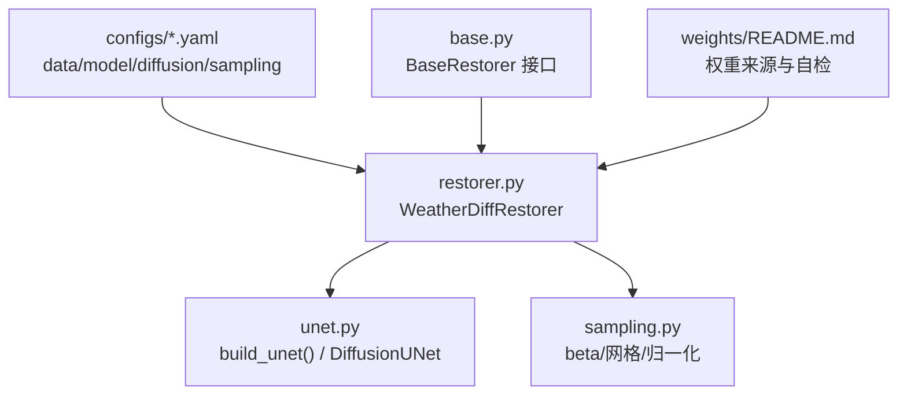
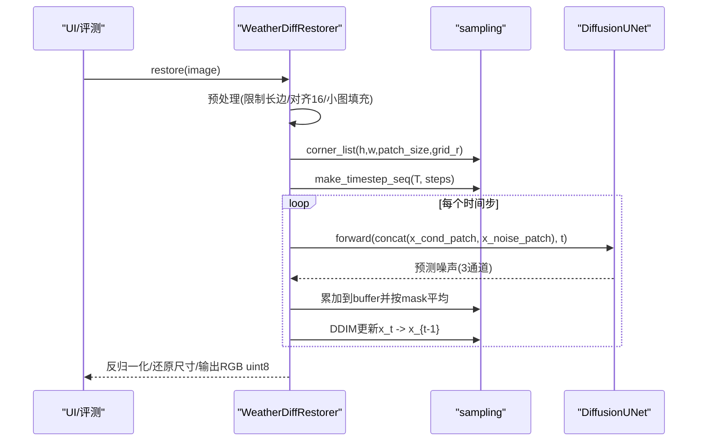
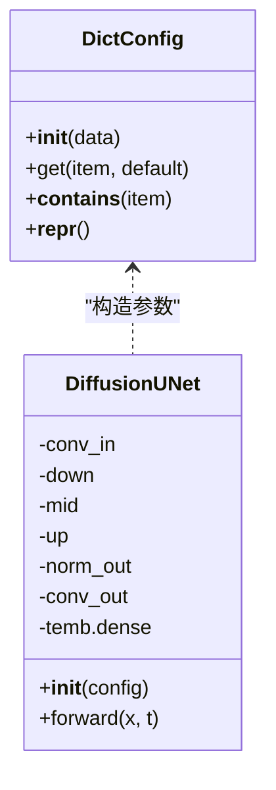
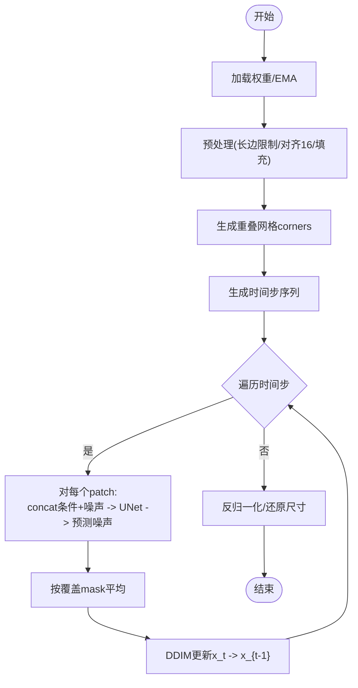
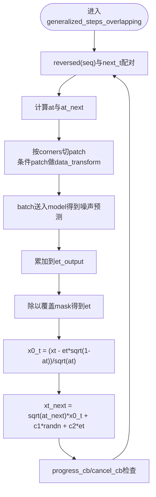
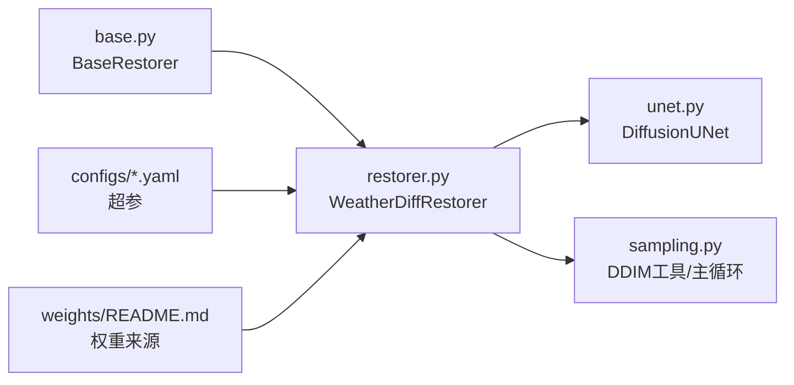

# UNet网络结构

<cite>
**本文引用的文件**
- [core/weatherdiff/unet.py](file://core/weatherdiff/unet.py)
- [core/weatherdiff/restorer.py](file://core/weatherdiff/restorer.py)
- [core/weatherdiff/sampling.py](file://core/weatherdiff/sampling.py)
- [configs/allweather.yaml](file://configs/allweather.yaml)
- [configs/haze.yaml](file://configs/haze.yaml)
- [configs/snow.yaml](file://configs/snow.yaml)
- [core/base.py](file://core/base.py)
- [weights/README.md](file://weights/README.md)
</cite>

## 目录
1. [简介](#简介)
2. [项目结构](#项目结构)
3. [核心组件](#核心组件)
4. [架构总览](#架构总览)
5. [详细组件分析](#详细组件分析)
6. [依赖关系分析](#依赖关系分析)
7. [性能与显存优化](#性能与显存优化)
8. [故障排查指南](#故障排查指南)
9. [结论](#结论)
10. [附录：参数配置示例](#附录参数配置示例)

## 简介
本技术文档围绕 WeatherDiffusion 的 UNet 网络结构展开，目标是帮助模型组在现有占位实现基础上，移植官方 WeatherDiffusion 仓库中的完整 UNet 实现。当前代码库已提供完整的工程接口、权重加载与推理流程、以及 patch-based DDIM 采样框架；UNet 的具体实现（类名 DiffusionUNet）目前为占位，需要严格对齐官方权重文件的 state_dict 键名与 forward 接口。

## 项目结构
- core/weatherdiff/unet.py：定义 DiffusionUNet 占位与构建工厂函数 build_unet，并给出严格的接口契约（输入通道、forward 签名、子模块属性命名）。
- core/weatherdiff/restorer.py：封装设备选择、权重加载（含 EMA）、预处理、patch 切片与采样调用、显存自适应重试等工程逻辑。
- core/weatherdiff/sampling.py：提供 beta 调度、时间步序列生成、重叠网格坐标、数据归一化等通用工具，并预留 generalized_steps_overlapping 待实现。
- configs/*.yaml：统一的多天气模型配置（image_size、channels、conditional、model 超参、diffusion 超参、sampling 超参）。
- core/base.py：统一的复原器接口契约（BaseRestorer），约束输入输出格式、回调协议与错误类型。
- weights/README.md：官方权重下载与自检说明。

图表来源
- [core/weatherdiff/restorer.py:47-90](file://core/weatherdiff/restorer.py#L47-L90)
- [core/weatherdiff/unet.py:51-71](file://core/weatherdiff/unet.py#L51-L71)
- [core/weatherdiff/sampling.py:31-110](file://core/weatherdiff/sampling.py#L31-L110)
- [configs/allweather.yaml:15-46](file://configs/allweather.yaml#L15-L46)
- [core/base.py:61-185](file://core/base.py#L61-L185)
- [weights/README.md:1-40](file://weights/README.md#L1-L40)

章节来源
- [core/weatherdiff/unet.py:1-72](file://core/weatherdiff/unet.py#L1-L72)
- [core/weatherdiff/restorer.py:1-244](file://core/weatherdiff/restorer.py#L1-L244)
- [core/weatherdiff/sampling.py:1-163](file://core/weatherdiff/sampling.py#L1-L163)
- [configs/allweather.yaml:1-47](file://configs/allweather.yaml#L1-L47)
- [core/base.py:1-185](file://core/base.py#L1-L185)
- [weights/README.md:1-40](file://weights/README.md#L1-L40)

## 核心组件
- DiffusionUNet（占位）：必须继承 torch.nn.Module，构造签名为 DiffusionUNet(config)，子模块属性名需与官方一致（conv_in / down / mid / up / norm_out / conv_out / temb.dense），forward(x, t) 接收拼接后的条件+噪声输入 (B, 6, P, P)，返回预测噪声 (B, 3, P, P)。
- WeatherDiffRestorer：负责权重加载（兼容 DataParallel 前缀与 EMA）、预处理、patch 切分、DDIM 采样、显存不足自动降批重试、结果后处理还原到原始尺寸。
- sampling：提供 beta 调度、alpha_bar 计算、重叠网格坐标、数据归一化/反归一化，以及待实现的 generalized_steps_overlapping（patch-based DDIM 主循环）。
- 配置：data.image_size=64/128、data.channels=3、data.conditional=true；model.in_channels=3、out_ch=3、ch=128、ch_mult=[1,2,3,4]、num_res_blocks=2、attn_resolutions=[16]、dropout=0.0、resamp_with_conv=true、ema=true、ema_rate=0.999；diffusion 使用线性 beta 调度，1000 步；sampling 使用 25 步、grid_r=16、eta=0.0。

章节来源
- [core/weatherdiff/unet.py:10-22](file://core/weatherdiff/unet.py#L10-L22)
- [core/weatherdiff/restorer.py:47-90](file://core/weatherdiff/restorer.py#L47-L90)
- [core/weatherdiff/sampling.py:31-110](file://core/weatherdiff/sampling.py#L31-L110)
- [configs/allweather.yaml:15-46](file://configs/allweather.yaml#L15-L46)

## 架构总览
WeatherDiffusion 采用“条件扩散 + UNet”范式：以退化图像作为条件，UNet 在每个时间步预测噪声，通过 DDIM 采样逐步去噪得到复原图像。由于高分辨率图像显存压力大，推理阶段采用 patch-based 策略：将整图切分为重叠小块，逐块进行去噪，再按覆盖次数加权平均得到整图估计。

图表来源
- [core/weatherdiff/restorer.py:102-167](file://core/weatherdiff/restorer.py#L102-L167)
- [core/weatherdiff/sampling.py:54-110](file://core/weatherdiff/sampling.py#L54-L110)
- [core/weatherdiff/unet.py:16-20](file://core/weatherdiff/unet.py#L16-L20)

## 详细组件分析

### DiffusionUNet（占位与移植要求）
- 类名与构造：必须为 DiffusionUNet(config)，config 为支持属性访问的对象（DictConfig）。
- 子模块属性名：conv_in / down / mid / up / norm_out / conv_out / temb.dense，必须与官方完全一致，否则 state_dict 无法匹配。
- 输入输出：forward(x, t)
  - x: (B, 6, P, P) = concat[条件patch(3通道), 噪声patch(3通道)]
  - t: (B,) 或 (1,) 时间步
  - 返回: 预测噪声 (B, 3, P, P)
- 输入通道数：config.model.in_channels * 2（因为 data.conditional=True）

图表来源
- [core/weatherdiff/unet.py:31-71](file://core/weatherdiff/unet.py#L31-L71)

章节来源
- [core/weatherdiff/unet.py:10-22](file://core/weatherdiff/unet.py#L10-L22)
- [core/weatherdiff/unet.py:31-71](file://core/weatherdiff/unet.py#L31-L71)

### WeatherDiffRestorer（推理管线）
- 权重加载：从配置路径加载 checkpoint，提取 state_dict，去除 module. 前缀，load_state_dict(strict=False)；若存在 ema_helper，则应用 EMA 影子参数。
- 预处理：限制最大边长、尺寸对齐到 16 的倍数、小图反射填充。
- Patch 切分与采样：根据 grid_r 生成重叠网格坐标，构造时间步序列，调用 generalized_steps_overlapping 执行 DDIM 采样。
- 显存自适应：遇到 out of memory 时自动将 patch_batch_size 减半重试。
- 后处理：反归一化、还原到原始尺寸，输出 RGB uint8。

图表来源
- [core/weatherdiff/restorer.py:47-90](file://core/weatherdiff/restorer.py#L47-L90)
- [core/weatherdiff/restorer.py:102-167](file://core/weatherdiff/restorer.py#L102-L167)
- [core/weatherdiff/sampling.py:54-110](file://core/weatherdiff/sampling.py#L54-L110)

章节来源
- [core/weatherdiff/restorer.py:47-90](file://core/weatherdiff/restorer.py#L47-L90)
- [core/weatherdiff/restorer.py:102-167](file://core/weatherdiff/restorer.py#L102-L167)

### sampling（Patch-based DDIM 采样）
- 已实现：beta 调度（linear/quad/const/jsd）、时间步压缩序列、重叠网格坐标、数据归一化/反归一化、alpha_bar 计算。
- 待实现：generalized_steps_overlapping，需在每个时间步内：
  - 按 corners 切 patch，条件 patch 需先做 data_transform
  - 分批送入 model，得到噪声预测，按位置累加进 et_output
  - 用覆盖次数 mask 平均得到 et
  - 计算 x0_t 与下一步 xt_next（含 eta 控制随机性）
  - 每步调用 progress_cb/check cancel_cb

图表来源
- [core/weatherdiff/sampling.py:54-110](file://core/weatherdiff/sampling.py#L54-L110)
- [core/weatherdiff/sampling.py:115-163](file://core/weatherdiff/sampling.py#L115-L163)

章节来源
- [core/weatherdiff/sampling.py:31-110](file://core/weatherdiff/sampling.py#L31-L110)
- [core/weatherdiff/sampling.py:115-163](file://core/weatherdiff/sampling.py#L115-L163)

### 编码器-解码器层级结构与卷积配置
- 依据配置：
  - in_channels=3，out_ch=3，基础通道 ch=128，通道倍增 ch_mult=[1,2,3,4]，形成多级下采样/上采样分支。
  - num_res_blocks=2：每个分辨率块包含两个残差块。
  - attn_resolutions=[16]：在特定分辨率引入注意力机制。
  - resamp_with_conv=true：使用可学习的重采样卷积。
  - dropout=0.0：训练时可启用正则化。
- 这些配置将决定 UNet 的编码器-解码器深度、通道宽度、注意力层位置与重采样方式。

章节来源
- [configs/allweather.yaml:22-33](file://configs/allweather.yaml#L22-L33)
- [configs/haze.yaml:21-32](file://configs/haze.yaml#L21-L32)
- [configs/snow.yaml:21-32](file://configs/snow.yaml#L21-L32)

### 跳跃连接与多尺度特征融合
- 跳跃连接：在 UNet 中，编码器各层的特征图经上采样后与对应解码器层特征拼接，以保留空间细节信息。
- 多尺度融合：通过不同分辨率的特征图（由 ch_mult 控制通道扩展）捕获全局上下文与局部细节，结合注意力层增强关键区域表征。
- 注意：具体实现细节需移植官方 UNet 后才能确认，但上述设计符合标准 UNet 范式与配置语义。

章节来源
- [configs/allweather.yaml:22-33](file://configs/allweather.yaml#L22-L33)

### 注意力机制集成位置与效果
- 配置 attn_resolutions=[16]：表明在分辨率为 16 的特征图上嵌入注意力模块，用于建模长程依赖。
- 效果：提升复杂天气场景下的结构恢复能力，尤其在雾/雪条纹等具有长程相关性的退化中。

章节来源
- [configs/allweather.yaml:22-33](file://configs/allweather.yaml#L22-L33)

### 网络权重初始化与训练技巧
- 权重来源：官方发布统一多天气模型权重（WeatherDiff64/128），推理时建议应用 EMA 影子参数以提升质量。
- 训练技巧（参考配置）：
  - beta_schedule=linear，beta_start=0.0001，beta_end=0.02，num_diffusion_timesteps=1000。
  - sampling 使用 25 步、grid_r=16、eta=0.0，保证确定性高质量重建。
  - 推理时启用 EMA 覆盖（默认 ema=true，ema_rate=0.999）。

章节来源
- [configs/allweather.yaml:35-46](file://configs/allweather.yaml#L35-L46)
- [core/weatherdiff/restorer.py:70-75](file://core/weatherdiff/restorer.py#L70-L75)
- [weights/README.md:13-21](file://weights/README.md#L13-L21)

### 可视化与参数配置示例
- 网络结构可视化：见“架构总览”与“详细组件分析”中的流程图与时序图。
- 参数配置示例：
  - data.image_size=64，channels=3，conditional=true
  - model.in_channels=3，out_ch=3，ch=128，ch_mult=[1,2,3,4]，num_res_blocks=2，attn_resolutions=[16]，dropout=0.0，resamp_with_conv=true，ema=true，ema_rate=0.999
  - diffusion.beta_schedule=linear，beta_start=0.0001，beta_end=0.02，num_diffusion_timesteps=1000
  - sampling.timesteps=25，grid_r=16，eta=0.0，patch_batch_size=32，seed=61

章节来源
- [configs/allweather.yaml:15-46](file://configs/allweather.yaml#L15-L46)

### 修改与扩展指导原则
- 保持接口契约：
  - 类名 DiffusionUNet，构造 DiffusionUNet(config)，forward(x, t) 输入输出形状固定。
  - 子模块属性名必须与官方一致（conv_in/down/mid/up/norm_out/conv_out/temb.dense）。
- 权重兼容性：
  - 确保 state_dict 键名与官方一致，避免 missing/unexpected 警告。
  - 推理时优先应用 EMA 权重。
- 扩展点：
  - 可在 sampling.py 中调整 patch 大小、步长、采样步数与 eta。
  - 在 restorer.py 中调整预处理策略（如 max_side、size_multiple）。
  - 在 configs 中调整 model 超参（如 ch、ch_mult、attn_resolutions、dropout）。

章节来源
- [core/weatherdiff/unet.py:10-22](file://core/weatherdiff/unet.py#L10-L22)
- [core/weatherdiff/restorer.py:47-90](file://core/weatherdiff/restorer.py#L47-L90)
- [core/weatherdiff/sampling.py:115-163](file://core/weatherdiff/sampling.py#L115-L163)
- [configs/allweather.yaml:15-46](file://configs/allweather.yaml#L15-L46)

## 依赖关系分析
- restorer.py 依赖 unet.py 的 build_unet 与 DiffusionUNet，依赖 sampling.py 的工具函数与待实现的主循环。
- sampling.py 依赖 PyTorch（仅在 compute_alpha 与 inverse_data_transform 中使用）。
- 配置驱动：configs/*.yaml 提供 data/model/diffusion/sampling 超参，影响网络结构与采样行为。
- base.py 提供统一接口，约束输入输出与回调协议。

图表来源
- [core/base.py:61-185](file://core/base.py#L61-L185)
- [core/weatherdiff/restorer.py:47-90](file://core/weatherdiff/restorer.py#L47-L90)
- [core/weatherdiff/unet.py:51-71](file://core/weatherdiff/unet.py#L51-L71)
- [core/weatherdiff/sampling.py:31-110](file://core/weatherdiff/sampling.py#L31-L110)
- [configs/allweather.yaml:15-46](file://configs/allweather.yaml#L15-L46)
- [weights/README.md:13-21](file://weights/README.md#L13-L21)

章节来源
- [core/base.py:61-185](file://core/base.py#L61-L185)
- [core/weatherdiff/restorer.py:47-90](file://core/weatherdiff/restorer.py#L47-L90)
- [core/weatherdiff/unet.py:51-71](file://core/weatherdiff/unet.py#L51-L71)
- [core/weatherdiff/sampling.py:31-110](file://core/weatherdiff/sampling.py#L31-L110)
- [configs/allweather.yaml:15-46](file://configs/allweather.yaml#L15-L46)
- [weights/README.md:13-21](file://weights/README.md#L13-L21)

## 性能与显存优化
- Patch-based 推理：显存占用与 patch 大小和并行数量相关，与整图分辨率解耦。
- 显存自适应：遇到 out of memory 时自动降低 patch_batch_size 重试。
- 采样步数：默认 25 步，平衡速度与质量；可调至更高以获得更稳定结果。
- 注意力层：attn_resolutions=[16] 增加计算开销，可根据硬件调整。

章节来源
- [core/weatherdiff/restorer.py:137-161](file://core/weatherdiff/restorer.py#L137-L161)
- [configs/allweather.yaml:41-46](file://configs/allweather.yaml#L41-L46)

## 故障排查指南
- 权重缺失：检查 weights/ 目录是否存在 WeatherDiff64.pth.tar，或执行 download_weights.py。
- 权重不匹配：确保 DiffusionUNet 子模块属性名与官方一致；若出现 missing/unexpected，检查 state_dict 键名。
- EMA 未生效：确认 ckpt 中存在 ema_helper，且 config.model.ema=true。
- 显存不足：降低 patch_batch_size 或 image_size；或减少采样步数。
- 输入格式错误：确保输入为 RGB uint8 (H, W, 3)，输出尺寸与输入一致。

章节来源
- [core/weatherdiff/restorer.py:47-90](file://core/weatherdiff/restorer.py#L47-L90)
- [core/weatherdiff/restorer.py:137-167](file://core/weatherdiff/restorer.py#L137-L167)
- [weights/README.md:13-28](file://weights/README.md#L13-L28)

## 结论
当前代码库已提供完整的 WeatherDiffusion 推理框架与接口契约，UNet 的具体实现仍需从官方仓库移植。移植时需严格遵循类名、子模块属性名与 forward 接口的约定，以确保权重加载与推理正确。通过 patch-based DDIM 采样与 EMA 权重应用，可在有限显存下实现高质量的多天气复原。后续可根据实际需求调整网络结构与采样策略，以实现更好的性能与质量平衡。

## 附录：参数配置示例
- 统一模型配置（allweather.yaml）：
  - data.image_size=64，channels=3，conditional=true
  - model.in_channels=3，out_ch=3，ch=128，ch_mult=[1,2,3,4]，num_res_blocks=2，attn_resolutions=[16]，dropout=0.0，resamp_with_conv=true，ema=true，ema_rate=0.999
  - diffusion.beta_schedule=linear，beta_start=0.0001，beta_end=0.02，num_diffusion_timesteps=1000
  - sampling.timesteps=25，grid_r=16，eta=0.0，patch_batch_size=32，seed=61

章节来源
- [configs/allweather.yaml:15-46](file://configs/allweather.yaml#L15-L46)