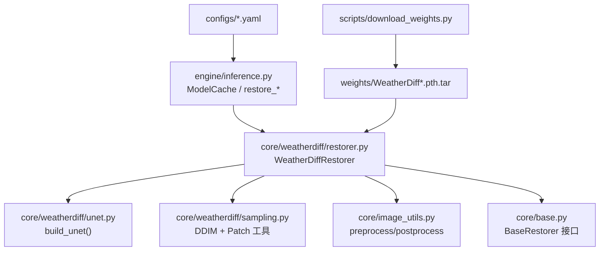
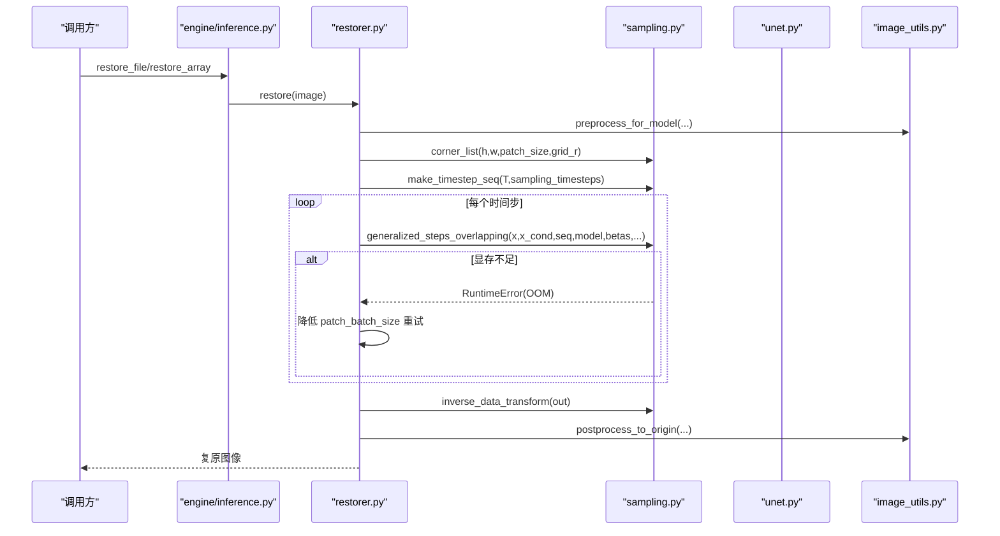
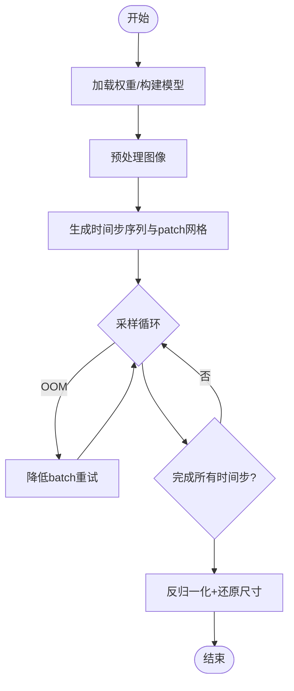
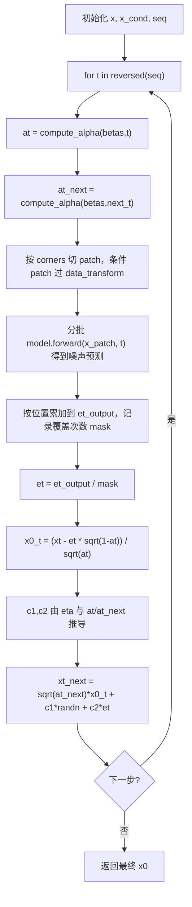
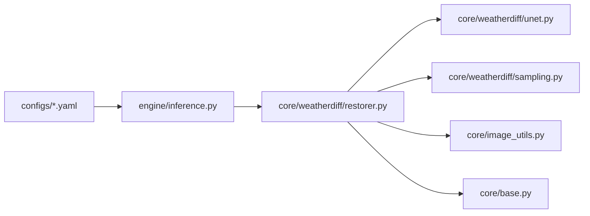

# WeatherDiffusion模型

<cite>
**本文引用的文件**
- [restorer.py](file://core/weatherdiff/restorer.py)
- [unet.py](file://core/weatherdiff/unet.py)
- [sampling.py](file://core/weatherdiff/sampling.py)
- [allweather.yaml](file://configs/allweather.yaml)
- [haze.yaml](file://configs/haze.yaml)
- [snow.yaml](file://configs/snow.yaml)
- [inference.py](file://engine/inference.py)
- [image_utils.py](file://core/image_utils.py)
- [base.py](file://core/base.py)
- [download_weights.py](file://scripts/download_weights.py)
</cite>

## 目录
1. [简介](#简介)
2. [项目结构](#项目结构)
3. [核心组件](#核心组件)
4. [架构总览](#架构总览)
5. [详细组件分析](#详细组件分析)
6. [依赖关系分析](#依赖关系分析)
7. [性能与内存优化](#性能与内存优化)
8. [故障排查指南](#故障排查指南)
9. [结论](#结论)
10. [附录：配置参数与调优建议](#附录配置参数与调优建议)

## 简介
本仓库实现了一个基于条件扩散模型的恶劣天气图像复原管线，核心为 WeatherDiffusion。该方案将退化图像作为条件输入，通过 UNet 预测噪声，并使用 DDIM 采样进行去噪恢复。工程上采用 Patch-based 推理机制，以固定大小的重叠 patch 并行处理，从而在有限显存下支持高分辨率图像。当前代码已提供完整的推理编排、权重加载、预处理/后处理、进度回调与取消机制；UNet 网络结构与 Patch-based DDIM 主循环为“待移植”的占位实现，需从官方仓库迁移并补齐。

## 项目结构
- 配置层：configs/*.yaml 定义数据尺寸、模型结构、扩散步数、采样策略等。
- 核心层：
  - core/weatherdiff/restorer.py：统一封装设备选择、权重加载、预处理、Patch-based 采样调用、显存自适应重试、结果还原。
  - core/weatherdiff/unet.py：UNet 工厂与占位类（待移植）。
  - core/weatherdiff/sampling.py：beta 调度、时间步序列、滑窗坐标、数据归一化、以及待实现的 generalized_steps_overlapping。
  - core/image_utils.py：图像 IO、尺寸对齐、反射填充、前后处理工具。
  - core/base.py：统一接口契约（BaseRestorer、RestoreResult、回调约定）。
- 引擎层：engine/inference.py：模型缓存、单图/批量推理编排。
- 脚本层：scripts/download_weights.py：下载官方预训练权重。

图表来源
- [inference.py:22-67](file://engine/inference.py#L22-L67)
- [restorer.py:47-90](file://core/weatherdiff/restorer.py#L47-L90)
- [unet.py:51-58](file://core/weatherdiff/unet.py#L51-L58)
- [sampling.py:31-58](file://core/weatherdiff/sampling.py#L31-L58)
- [image_utils.py:145-167](file://core/image_utils.py#L145-L167)
- [download_weights.py:26-37](file://scripts/download_weights.py#L26-L37)

章节来源
- [inference.py:22-67](file://engine/inference.py#L22-L67)
- [restorer.py:47-90](file://core/weatherdiff/restorer.py#L47-L90)
- [unet.py:51-58](file://core/weatherdiff/unet.py#L51-L58)
- [sampling.py:31-58](file://core/weatherdiff/sampling.py#L31-L58)
- [image_utils.py:145-167](file://core/image_utils.py#L145-L167)
- [download_weights.py:26-37](file://scripts/download_weights.py#L26-L37)

## 核心组件
- WeatherDiffRestorer：负责权重加载、设备选择、预处理、调用 Patch-based DDIM 采样、显存不足自动降批重试、结果还原到原始尺寸。
- DiffusionUNet（占位）：需要移植官方 WeatherDiffusion 的 UNet，要求类名、子模块属性名与 forward(x, t) 签名严格一致。
- sampling：提供 beta 调度、alpha_bar 计算、时间步压缩、滑窗坐标生成、数据归一化；generalized_steps_overlapping 待实现。
- inference：ModelCache 按配置名缓存实例，避免重复加载；提供单图/批量推理入口。
- image_utils：长边限制、16 倍数对齐、反射填充、前后处理。
- base：统一接口与结果数据结构，约束输入输出格式与回调协议。

章节来源
- [restorer.py:32-90](file://core/weatherdiff/restorer.py#L32-L90)
- [unet.py:51-72](file://core/weatherdiff/unet.py#L51-L72)
- [sampling.py:31-58](file://core/weatherdiff/sampling.py#L31-L58)
- [inference.py:22-67](file://engine/inference.py#L22-L67)
- [image_utils.py:109-167](file://core/image_utils.py#L109-L167)
- [base.py:61-148](file://core/base.py#L61-L148)

## 架构总览
WeatherDiffusion 的条件扩散推理流程如下：
- 输入图像经预处理：长边限制、16 倍数对齐、必要时反射填充至最小 patch 尺寸。
- 构造初始噪声 x，生成时间步序列 seq（如 1000 步压缩到 25 步）。
- 使用 corner_list 生成重叠 patch 的左上角坐标。
- 对每个时间步，遍历所有 patch，分批送入 UNet 预测噪声，累加到整图 buffer，并用覆盖次数 mask 平均得到 et。
- 依据 DDIM 公式更新 x_t -> x_{t-1}，直至完成全部时间步。
- 反归一化并裁剪回原始尺寸，输出复原图像。

图表来源
- [inference.py:70-96](file://engine/inference.py#L70-L96)
- [restorer.py:102-167](file://core/weatherdiff/restorer.py#L102-L167)
- [sampling.py:54-81](file://core/weatherdiff/sampling.py#L54-L81)
- [image_utils.py:145-167](file://core/image_utils.py#L145-L167)

## 详细组件分析

### WeatherDiffRestorer（推理编排与资源管理）
- 权重加载：
  - 根据配置查找权重路径，不存在则抛出 WeightNotFoundError。
  - 构建 UNet 并加载 state_dict，兼容 DataParallel 的 module. 前缀。
  - 若启用 EMA，则将 ema_helper 影子参数覆盖到模型。
- 推理流程：
  - 预处理：限制长边、16 倍数对齐、反射填充至最小 patch。
  - 构造初始噪声 x，生成时间步序列与 patch 网格。
  - 调用 generalized_steps_overlapping 执行 Patch-based DDIM 采样。
  - 显存不足时自动减半 patch_batch_size 并重试。
  - 反归一化并还原到原始尺寸。
- 设备选择：优先 CUDA，可通过环境变量强制指定。
- 进度与取消：包装 progress_cb，支持 cancel_cb 中断。

图表来源
- [restorer.py:47-90](file://core/weatherdiff/restorer.py#L47-L90)
- [restorer.py:102-167](file://core/weatherdiff/restorer.py#L102-L167)

章节来源
- [restorer.py:47-90](file://core/weatherdiff/restorer.py#L47-L90)
- [restorer.py:102-167](file://core/weatherdiff/restorer.py#L102-L167)

### DiffusionUNet（条件扩散网络）
- 要求：
  - 类名 DiffusionUNet，构造签名为 DiffusionUNet(config)。
  - 子模块属性命名必须与官方一致：conv_in / down / mid / up / norm_out / conv_out / temb.dense。
  - forward(x, t)：x 为拼接后的 (B, 6, P, P)，即条件 patch(3通道)+噪声 patch(3通道)；t 为时间步；返回预测噪声 (B, 3, P, P)。
  - 输入通道数为 config.model.in_channels * 2（因为 data.conditional=True）。
- 当前状态：占位实现，需从官方仓库迁移。

章节来源
- [unet.py:51-72](file://core/weatherdiff/unet.py#L51-L72)

### Patch-based DDIM 采样（sampling.py）
- 已实现：
  - get_beta_schedule：线性/二次/常数/JSD 等 beta 调度。
  - make_timestep_seq：将 1000 步压缩为 N 步等间隔序列。
  - overlapping_grid_indices/corner_list：生成滑窗左上角坐标，保证右下角被覆盖。
  - data_transform/inverse_data_transform：[-1,1] 与 [0,1] 互转。
  - compute_alpha：计算 alpha_bar_t，形状 (B,1,1,1)。
- 待实现：
  - generalized_steps_overlapping：核心主循环，按 patch 切分、分批推理、累加噪声估计、mask 平均、DDIM 更新、进度上报与取消检查。

图表来源
- [sampling.py:31-58](file://core/weatherdiff/sampling.py#L31-L58)
- [sampling.py:61-81](file://core/weatherdiff/sampling.py#L61-L81)
- [sampling.py:84-109](file://core/weatherdiff/sampling.py#L84-L109)
- [sampling.py:115-163](file://core/weatherdiff/sampling.py#L115-L163)

章节来源
- [sampling.py:31-58](file://core/weatherdiff/sampling.py#L31-L58)
- [sampling.py:61-81](file://core/weatherdiff/sampling.py#L61-L81)
- [sampling.py:84-109](file://core/weatherdiff/sampling.py#L84-L109)
- [sampling.py:115-163](file://core/weatherdiff/sampling.py#L115-L163)

### 图像预处理与后处理（image_utils.py）
- 预处理：
  - limit_long_side：控制最大长边，避免过大分辨率导致显存爆炸。
  - resize_to_multiple：向上取整到 16 的倍数，满足 UNet 下采样步长要求。
  - pad_to_min_size：当图像小于 patch 大小时做反射填充，确保可切分。
  - preprocess_for_model：组合上述步骤，返回处理后图像与原始尺寸。
- 后处理：
  - postprocess_to_origin：裁剪并缩放到原始尺寸，保证输出与输入等大。

章节来源
- [image_utils.py:109-167](file://core/image_utils.py#L109-L167)

### 推理编排与缓存（engine/inference.py）
- ModelCache：按配置名缓存 BaseRestorer 实例，避免重复加载权重；支持 release_others 释放其他模型以节省显存。
- restore_array/restore_file/restore_batch：统一入口，封装进度回调与错误处理。
- 配置覆盖：运行时可覆盖 sampling.timesteps/grid_r 等参数而不重新加载权重。

章节来源
- [inference.py:22-67](file://engine/inference.py#L22-L67)
- [inference.py:70-132](file://engine/inference.py#L70-L132)

## 依赖关系分析
- restorer.py 依赖：
  - unet.py：构建 UNet。
  - sampling.py：beta 调度、时间步序列、patch 网格、DDIM 主循环。
  - image_utils.py：预处理/后处理。
  - base.py：统一接口与异常类型。
- inference.py 依赖：
  - base.py：BaseRestorer 抽象。
  - config：获取配置。
  - registry：构建具体 restorer。
  - image_utils：图像 IO。
- 配置文件：
  - allweather.yaml/haze.yaml/snow.yaml：统一权重与参数，仅场景描述不同。

图表来源
- [inference.py:22-67](file://engine/inference.py#L22-L67)
- [restorer.py:47-90](file://core/weatherdiff/restorer.py#L47-L90)
- [unet.py:51-58](file://core/weatherdiff/unet.py#L51-L58)
- [sampling.py:31-58](file://core/weatherdiff/sampling.py#L31-L58)
- [image_utils.py:145-167](file://core/image_utils.py#L145-L167)
- [base.py:61-148](file://core/base.py#L61-L148)

章节来源
- [inference.py:22-67](file://engine/inference.py#L22-L67)
- [restorer.py:47-90](file://core/weatherdiff/restorer.py#L47-L90)
- [unet.py:51-58](file://core/weatherdiff/unet.py#L51-L58)
- [sampling.py:31-58](file://core/weatherdiff/sampling.py#L31-L58)
- [image_utils.py:145-167](file://core/image_utils.py#L145-L167)
- [base.py:61-148](file://core/base.py#L61-L148)

## 性能与内存优化
- Patch-based 推理：
  - 显存占用与 patch 大小和一次并行 patch 数量相关，与整图分辨率解耦。
  - 通过 grid_r 控制重叠度，平衡边界伪影与计算量。
- 动态批大小调整：
  - 遇到 OOM 自动将 patch_batch_size 减半重试，提升鲁棒性。
- 预处理优化：
  - 长边限制减少不必要的高分辨率计算。
  - 16 倍数对齐与反射填充避免越界与边界效应。
- 权重与 EMA：
  - 默认启用 EMA 权重覆盖，通常能带来更稳定的推理质量。

[本节为通用性能讨论，不直接分析具体文件]

## 故障排查指南
- 权重缺失：
  - 现象：加载时报 WeightNotFoundError。
  - 解决：运行 scripts/download_weights.py 下载权重，或手动放置到 weights/ 目录并检查 configs 中的 weights.path。
- 权重键不匹配：
  - 现象：load_state_dict 报 missing/unexpected keys。
  - 解决：确认 UNet 子模块属性名与官方一致；检查是否使用了 DataParallel 的 module. 前缀（已自动剥离）。
- 显存不足：
  - 现象：RuntimeError out of memory。
  - 解决：降低 sampling.patch_batch_size；或减小 data.max_side；或改用更小 patch（如 64 而非 128）。
- 输出尺寸不一致：
  - 现象：校验失败，提示输出与输入尺寸不一致。
  - 解决：确保使用 postprocess_to_origin 还原到原始尺寸。
- 进度回调异常：
  - 现象：UI 报错但不影响推理。
  - 说明：progress_cb 内部异常被捕获，不会中断主流程。

章节来源
- [restorer.py:47-90](file://core/weatherdiff/restorer.py#L47-L90)
- [restorer.py:102-167](file://core/weatherdiff/restorer.py#L102-L167)
- [base.py:111-148](file://core/base.py#L111-L148)
- [download_weights.py:82-116](file://scripts/download_weights.py#L82-L116)

## 结论
本仓库提供了 WeatherDiffusion 的完整推理管线与工程化能力，包括权重管理、预处理/后处理、Patch-based 采样、显存自适应与统一接口。当前关键实现点在于：
- 从官方仓库迁移 UNet 网络结构，保持类名与子模块属性名一致。
- 实现 generalized_steps_overlapping，完成 Patch-based DDIM 主循环。
- 合理配置采样参数与预处理策略，以获得质量与性能的平衡。

[本节为总结性内容，不直接分析具体文件]

## 附录：配置参数与调优建议
- 数据与模型
  - data.image_size：patch 边长，常用 64 或 128。越大质量越好但更慢且更吃显存。
  - data.channels：通常为 3。
  - data.conditional：设为 true，表示条件扩散。
  - data.max_side：限制输入长边，控制显存与耗时。
  - data.size_multiple：应为 16，以满足下采样步长。
  - model.in_channels/out_ch/ch/ch_mult/attn_resolutions/dropout/resamp_with_conv：遵循官方 OpenAI-style UNet 配置。
  - model.ema/ema_rate：推理时启用 EMA 权重覆盖，通常提升稳定性。
- 扩散过程
  - diffusion.beta_schedule：linear/quad/const/jsd。
  - diffusion.beta_start/beta_end：噪声方差调度范围。
  - diffusion.num_diffusion_timesteps：训练步数，推理时可压缩。
- 采样策略
  - sampling.timesteps：推理步数，越小越快但可能损失细节。
  - sampling.grid_r：patch 滑动步长，影响重叠度与边界质量。
  - sampling.eta：DDIM 随机性系数，推理常用 0。
  - sampling.patch_batch_size：一次并行处理的 patch 数量，显存不足时调小。
  - sampling.seed：固定种子可复现实验。
- 权重
  - weights.path：指向 WeatherDiff64.pth.tar 或 WeatherDiff128.pth.tar。
  - 推荐使用 WeatherDiff64 作为默认，兼顾速度与质量；如需更高画质可使用 128 并相应调整 data.image_size。

章节来源
- [allweather.yaml:10-47](file://configs/allweather.yaml#L10-L47)
- [haze.yaml:9-46](file://configs/haze.yaml#L9-L46)
- [snow.yaml:9-46](file://configs/snow.yaml#L9-L46)
- [download_weights.py:26-37](file://scripts/download_weights.py#L26-L37)