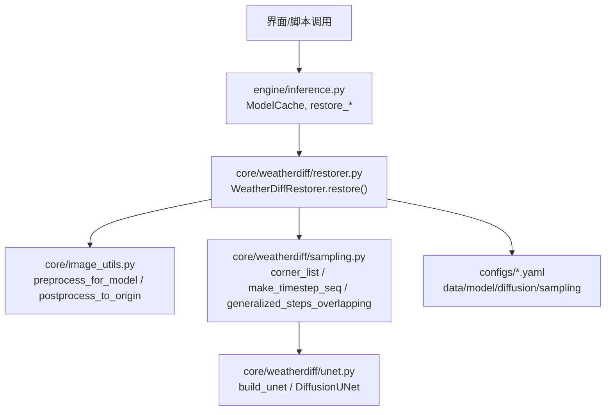
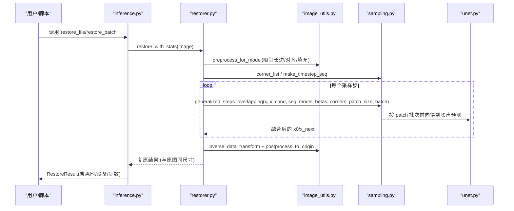
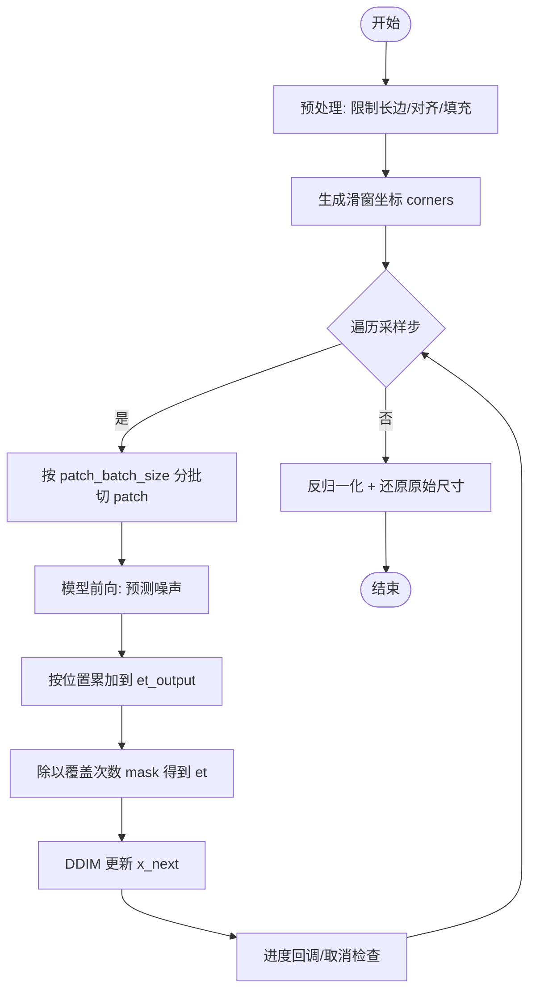
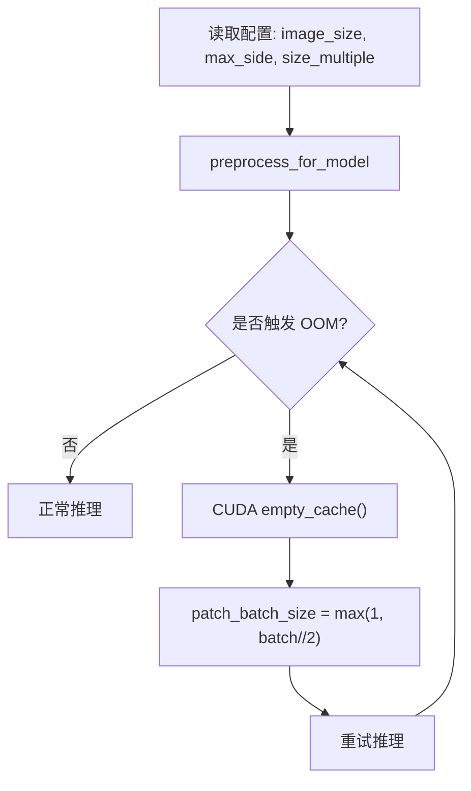
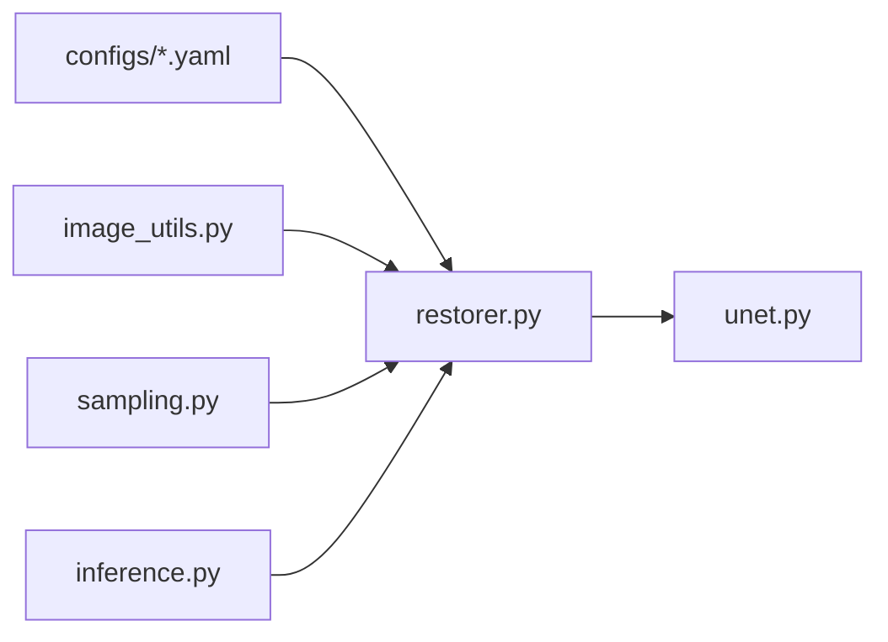

# 分块推理

<cite>
**本文引用的文件**
- [restorer.py](file://core/weatherdiff/restorer.py)
- [sampling.py](file://core/weatherdiff/sampling.py)
- [unet.py](file://core/weatherdiff/unet.py)
- [image_utils.py](file://core/image_utils.py)
- [base.py](file://core/base.py)
- [inference.py](file://engine/inference.py)
- [allweather.yaml](file://configs/allweather.yaml)
- [haze.yaml](file://configs/haze.yaml)
- [rain.yaml](file://configs/rain.yaml)
- [snow.yaml](file://configs/snow.yaml)
- [download_weights.py](file://scripts/download_weights.py)
</cite>

## 目录
1. [简介](#简介)
2. [项目结构](#项目结构)
3. [核心组件](#核心组件)
4. [架构总览](#架构总览)
5. [详细组件分析](#详细组件分析)
6. [依赖关系分析](#依赖关系分析)
7. [性能与显存优化](#性能与显存优化)
8. [故障排除与内存泄漏检测](#故障排除与内存泄漏检测)
9. [结论](#结论)
10. [附录：配置与参数说明](#附录配置与参数说明)

## 简介
本技术文档围绕“分块推理机制”展开，面向大尺寸图像在扩散模型复原任务中的内存优化与工程落地。本项目采用 WeatherDiffusion 的分块（patch-based）DDIM 采样策略，将整图切分为重叠小块，逐块进行去噪预测并按覆盖次数归一化融合，从而将显存占用从“与整图分辨率相关”降为“仅与 patch 大小和批大小相关”。文档重点解释：
- 图像分块的算法实现、重叠区域处理与边界融合
- 自适应分块大小选择与动态调整策略
- GPU 显存管理与批处理优化
- 分块推理对生成质量的影响及补偿措施
- 不同图像尺寸下的性能对比与优化建议
- 内存泄漏检测与故障排除指南
- 在恶劣天气图像复原任务中的实际应用效果

## 项目结构
本项目以“统一接口 + 可插拔模型”的方式组织代码。核心流程由 engine 层编排，weatherdiff 模块提供基于扩散模型的复原器，image_utils 提供图像预处理/后处理工具，configs 提供不同场景的默认参数。

图表来源
- [inference.py:22-68](file://engine/inference.py#L22-L68)
- [restorer.py:102-167](file://core/weatherdiff/restorer.py#L102-L167)
- [image_utils.py:145-167](file://core/image_utils.py#L145-L167)
- [sampling.py:61-81](file://core/weatherdiff/sampling.py#L61-L81)
- [unet.py:51-58](file://core/weatherdiff/unet.py#L51-L58)

章节来源
- [inference.py:22-68](file://engine/inference.py#L22-L68)
- [restorer.py:102-167](file://core/weatherdiff/restorer.py#L102-L167)
- [image_utils.py:145-167](file://core/image_utils.py#L145-L167)
- [sampling.py:61-81](file://core/weatherdiff/sampling.py#L61-L81)
- [unet.py:51-58](file://core/weatherdiff/unet.py#L51-L58)

## 核心组件
- WeatherDiffRestorer：负责设备选择、权重加载、预处理、分块采样、后处理与显存自适应重试。
- sampling：提供 beta 调度、时间步序列、滑窗坐标生成、数据变换与占位的主循环接口。
- image_utils：统一图像 IO、尺寸限制、对齐、填充、还原等几何处理。
- base：定义统一的复原器接口、结果结构与进度/取消回调契约。
- inference：模型缓存、单图/批量推理编排。

章节来源
- [restorer.py:32-167](file://core/weatherdiff/restorer.py#L32-L167)
- [sampling.py:31-163](file://core/weatherdiff/sampling.py#L31-L163)
- [image_utils.py:22-167](file://core/image_utils.py#L22-L167)
- [base.py:61-185](file://core/base.py#L61-L185)
- [inference.py:22-153](file://engine/inference.py#L22-L153)

## 架构总览
下图展示了从输入图像到输出复原结果的完整数据流，突出分块推理的关键节点。

图表来源
- [inference.py:70-132](file://engine/inference.py#L70-L132)
- [restorer.py:102-167](file://core/weatherdiff/restorer.py#L102-L167)
- [image_utils.py:145-167](file://core/image_utils.py#L145-L167)
- [sampling.py:115-163](file://core/weatherdiff/sampling.py#L115-L163)
- [unet.py:51-58](file://core/weatherdiff/unet.py#L51-L58)

## 详细组件分析

### 分块推理算法与重叠区域处理
- 滑窗生成：通过 overlapping_grid_indices 计算水平与垂直方向的左上角坐标列表，确保右下角被覆盖；corner_list 将其组合成所有 patch 的起始位置。
- 重叠融合：在每个去噪步中，对所有 patch 分别预测噪声，累加至整图 buffer，并用“每个像素被多少 patch 覆盖”的 mask 做平均，得到整图噪声估计，再进行 DDIM 更新。
- 数据变换：条件输入使用 data_transform 映射到 [-1, 1]，最终输出经 inverse_data_transform 裁剪回 [0, 1]。

图表来源
- [sampling.py:61-81](file://core/weatherdiff/sampling.py#L61-L81)
- [sampling.py:115-163](file://core/weatherdiff/sampling.py#L115-L163)
- [restorer.py:116-167](file://core/weatherdiff/restorer.py#L116-L167)

章节来源
- [sampling.py:61-81](file://core/weatherdiff/sampling.py#L61-L81)
- [sampling.py:115-163](file://core/weatherdiff/sampling.py#L115-L163)
- [restorer.py:116-167](file://core/weatherdiff/restorer.py#L116-L167)

### 自适应分块大小与动态调整策略
- 分块大小选择：由配置 data.image_size 决定（默认 64），对应训练时的 patch 尺寸，也是推理滑窗大小。
- 动态批大小调整：当出现显存不足错误时，restorer 自动将 patch_batch_size 减半并清空 CUDA 缓存后重试，直至成功或降至 1。
- 长边限制与对齐：预处理阶段限制最大长边（默认 1024），并将宽高向上取整到 size_multiple（默认 16）的倍数，保证滑窗与网络要求一致。

图表来源
- [restorer.py:116-167](file://core/weatherdiff/restorer.py#L116-L167)
- [image_utils.py:145-167](file://core/image_utils.py#L145-L167)

章节来源
- [restorer.py:116-167](file://core/weatherdiff/restorer.py#L116-L167)
- [image_utils.py:145-167](file://core/image_utils.py#L145-L167)

### GPU 显存管理与批处理优化
- 设备选择：优先使用 CUDA，可通过环境变量强制 CPU。
- 权重加载：支持 DataParallel 的 module. 前缀剥离与 EMA 权重覆盖，提升质量。
- 批处理优化：通过 patch_batch_size 控制一次并行处理的 patch 数量；显存不足时自动降级。
- 资源释放：unload 时清空模型引用与 CUDA 缓存，避免残留显存。

章节来源
- [restorer.py:47-98](file://core/weatherdiff/restorer.py#L47-L98)
- [restorer.py:204-210](file://core/weatherdiff/restorer.py#L204-L210)
- [inference.py:22-68](file://engine/inference.py#L22-L68)

### 分块推理对生成质量的影响与补偿
- 影响：分块推理引入边界拼接与重叠平均，可能带来轻微接缝或高频细节损失；grid_r 越大，重叠越少，速度越快但质量略降。
- 补偿措施：
  - 合理设置 grid_r（默认 16）以平衡速度与质量。
  - 使用 EMA 权重（默认开启）提升稳定性与细节恢复。
  - 适当增加采样步数 timesteps（默认 25）以提升质量，代价是耗时增加。
  - 保持尺寸对齐与最小尺寸填充，避免边缘信息丢失。

章节来源
- [sampling.py:61-81](file://core/weatherdiff/sampling.py#L61-L81)
- [restorer.py:70-78](file://core/weatherdiff/restorer.py#L70-L78)
- [allweather.yaml:41-46](file://configs/allweather.yaml#L41-L46)

### 不同图像尺寸下的性能对比与优化建议
- 小图（<=512x512）：默认 patch=64、batch=32 通常足够，速度快且质量稳定。
- 中大图（1024~2048）：建议启用 max_side=1024 限制长边，必要时降低 patch_batch_size；若需更高细节，可尝试 patch=128（需更大显存）。
- 大图（>2048）：强烈建议使用 max_side 限制与较小 grid_r，必要时降低 timesteps 以换取吞吐；关注显存峰值与 OOM 重试路径。
- 通用建议：
  - 优先调 patch_batch_size 而非直接缩小图像，以保持细节。
  - 使用 EMA 权重与合适的 eta（默认 0）以获得更好重建。
  - 批量推理时复用 ModelCache 减少重复加载开销。

[本节为通用指导，不直接分析具体文件]

### 在恶劣天气图像复原任务中的实际应用效果
- 多天气统一模型：rain/haze/snow/allweather 共用同一份权重，通过配置切换场景；适用于真实场景中叠加退化（如雨雾雪混合）。
- 典型参数：timesteps=25、grid_r=16、patch_batch_size=32，配合 max_side=1024 与 size_multiple=16，可在消费级 GPU 上获得可用质量与速度。
- 实际体验：分块推理使高分辨率图像也能在有限显存下完成复原；EMA 权重显著提升细节恢复与噪声抑制。

章节来源
- [rain.yaml:1-51](file://configs/rain.yaml#L1-L51)
- [haze.yaml:1-46](file://configs/haze.yaml#L1-L46)
- [snow.yaml:1-46](file://configs/snow.yaml#L1-L46)
- [allweather.yaml:1-47](file://configs/allweather.yaml#L1-L47)

## 依赖关系分析
- restorer 依赖 sampling 与 image_utils，并通过 unet 构建模型。
- inference 提供模型缓存与批量推理，封装 restorer 的统一接口。
- configs 提供各场景默认参数，驱动 restorer 的行为。

图表来源
- [restorer.py:19-30](file://core/weatherdiff/restorer.py#L19-L30)
- [inference.py:16-19](file://engine/inference.py#L16-L19)
- [sampling.py:21-26](file://core/weatherdiff/sampling.py#L21-L26)
- [unet.py:26-30](file://core/weatherdiff/unet.py#L26-L30)

章节来源
- [restorer.py:19-30](file://core/weatherdiff/restorer.py#L19-L30)
- [inference.py:16-19](file://engine/inference.py#L16-L19)

## 性能与显存优化
- 关键参数
  - image_size：分块大小（默认 64），增大可提升细节但显著增加显存。
  - grid_r：滑窗步长（默认 16），增大可减少 patch 数量、加速但降低质量。
  - timesteps：采样步数（默认 25），增大提升质量但耗时线性增长。
  - patch_batch_size：单次并行 patch 数（默认 32），显存不足会自动减半。
  - max_side：长边上限（默认 1024），控制整体显存与耗时。
  - size_multiple：尺寸对齐倍数（默认 16），保证滑窗与网络兼容。
- 优化建议
  - 优先调整 patch_batch_size 与 grid_r 来平衡显存与速度。
  - 使用 EMA 权重与合适的 eta（默认 0）提升质量。
  - 批量推理时复用 ModelCache，避免重复加载权重。
  - 对超大图，结合 max_side 限制与较小 grid_r，必要时降低 timesteps。

章节来源
- [rain.yaml:45-51](file://configs/rain.yaml#L45-L51)
- [allweather.yaml:41-46](file://configs/allweather.yaml#L41-L46)
- [restorer.py:137-161](file://core/weatherdiff/restorer.py#L137-L161)

## 故障排除与内存泄漏检测
- 常见问题
  - 权重缺失：抛出 WeightNotFoundError，需执行下载脚本或手动放置权重。
  - 显存不足：自动降级 patch_batch_size 并重试；若仍失败，降低 timesteps 或 grid_r。
  - 尺寸不匹配：确保 size_multiple 与 image_size 一致，预处理会向上取整对齐。
- 内存泄漏检测
  - 使用 torch.cuda.memory_summary 与 memory_allocated 监控显存峰值。
  - 在长时间运行中定期调用 unload 或 release_others 释放未使用模型。
  - 注意 progress_cb 与 cancel_cb 异常不应中断主流程，避免隐藏错误。
- 调试步骤
  - 验证权重：运行 scripts/check_weights.py（如存在）或先下载权重。
  - 逐步降级参数：先减小 patch_batch_size，再减小 timesteps，最后考虑 max_side。
  - 观察日志：打印设备、EMA 应用情况与 OOM 重试信息。

章节来源
- [restorer.py:47-98](file://core/weatherdiff/restorer.py#L47-L98)
- [restorer.py:137-167](file://core/weatherdiff/restorer.py#L137-L167)
- [download_weights.py:26-37](file://scripts/download_weights.py#L26-L37)

## 结论
本项目通过分块推理有效解决了大尺寸图像在扩散模型复原中的显存瓶颈问题。其核心在于将整图切分为重叠小块，逐块预测噪声并按覆盖次数归一化融合，从而将显存占用与整图分辨率解耦。配合自适应批大小、EMA 权重与合理的参数配置，能够在恶劣天气复原任务中取得稳定且高质量的结果。对于生产环境，建议根据硬件能力与质量需求，灵活调整 image_size、grid_r、timesteps 与 patch_batch_size，并结合 ModelCache 与显存监控实现高效稳定的推理服务。

[本节为总结性内容，不直接分析具体文件]

## 附录：配置与参数说明
- 场景配置
  - rain/haze/snow/allweather：共用同一份权重，区别在于采样参数预设与评测统计。
- 关键配置项
  - data.image_size：分块大小（默认 64）。
  - data.max_side：长边上限（默认 1024）。
  - data.size_multiple：尺寸对齐倍数（默认 16）。
  - sampling.timesteps：采样步数（默认 25）。
  - sampling.grid_r：滑窗步长（默认 16）。
  - sampling.patch_batch_size：单次并行 patch 数（默认 32）。
  - diffusion.beta_schedule/beta_start/beta_end：beta 调度与范围。
  - model.ema：是否应用 EMA 权重（默认 true）。

章节来源
- [rain.yaml:14-51](file://configs/rain.yaml#L14-L51)
- [haze.yaml:14-46](file://configs/haze.yaml#L14-L46)
- [snow.yaml:14-46](file://configs/snow.yaml#L14-L46)
- [allweather.yaml:15-47](file://configs/allweather.yaml#L15-L47)