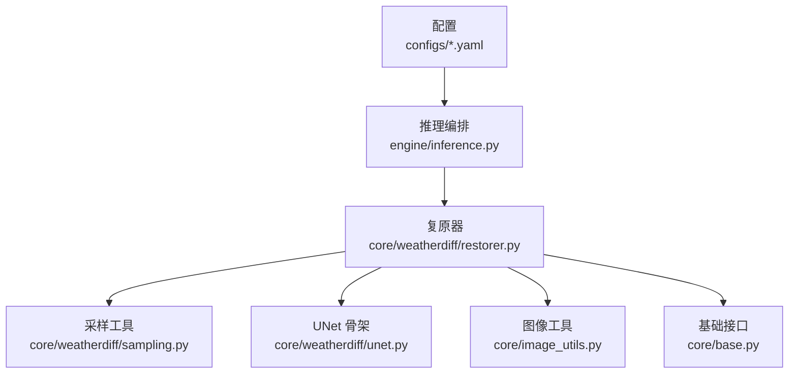
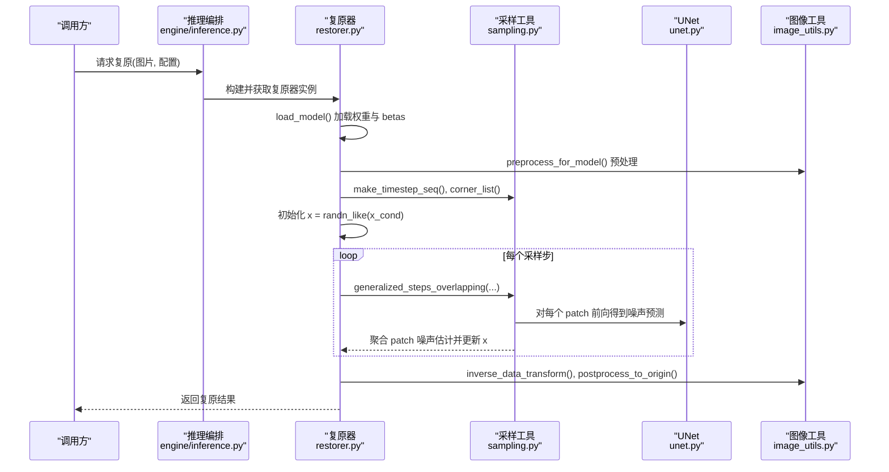
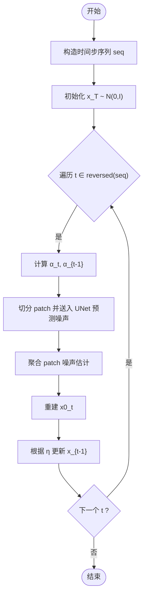
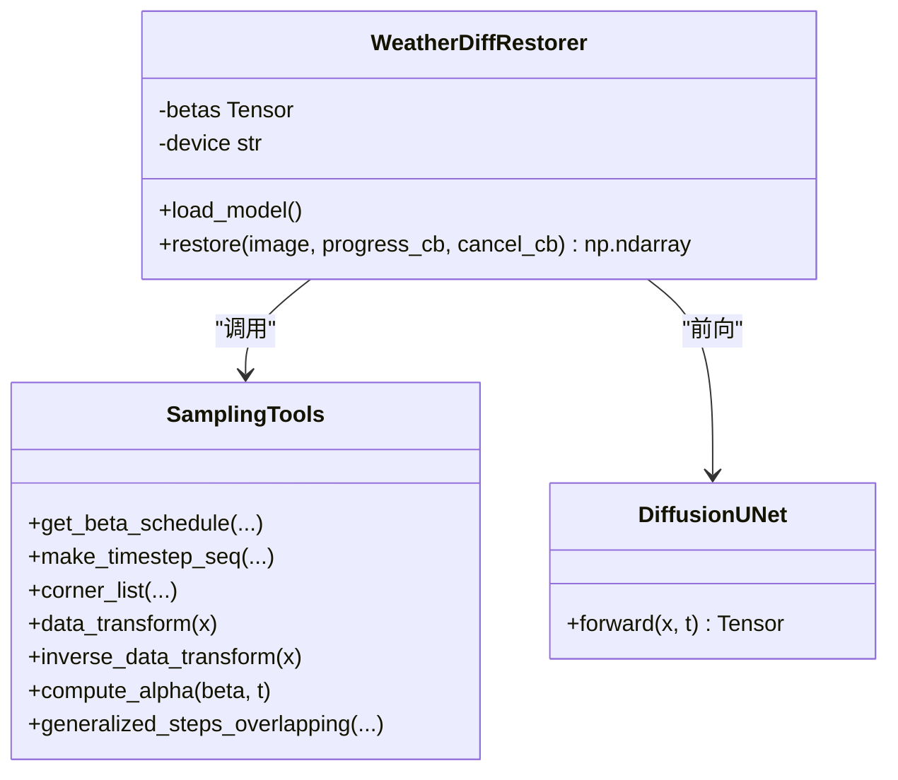
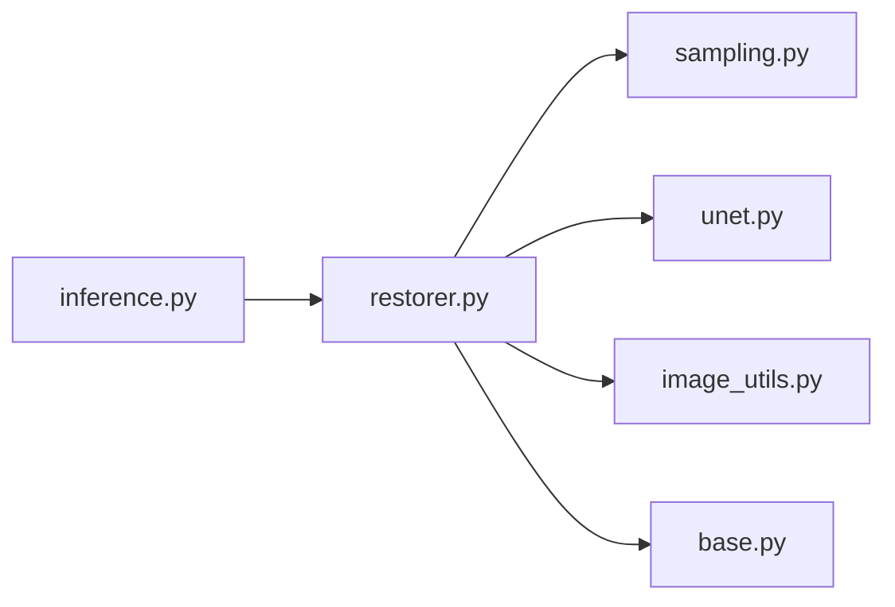

# 采样算法

<cite>
**本文引用的文件**
- [sampling.py](file://core/weatherdiff/sampling.py)
- [restorer.py](file://core/weatherdiff/restorer.py)
- [unet.py](file://core/weatherdiff/unet.py)
- [allweather.yaml](file://configs/allweather.yaml)
- [haze.yaml](file://configs/haze.yaml)
- [inference.py](file://engine/inference.py)
- [image_utils.py](file://core/image_utils.py)
- [base.py](file://core/base.py)
</cite>

## 目录
1. [简介](#简介)
2. [项目结构](#项目结构)
3. [核心组件](#核心组件)
4. [架构总览](#架构总览)
5. [详细组件分析](#详细组件分析)
6. [依赖关系分析](#依赖关系分析)
7. [性能与调参建议](#性能与调参建议)
8. [故障排查指南](#故障排查指南)
9. [结论](#结论)
10. [附录：图像复原中的采样策略应用](#附录图像复原中的采样策略应用)

## 简介
本技术文档围绕本项目中基于扩散模型的恶劣天气复原任务，系统阐述 DDIM（Denoising Diffusion Implicit Models）采样算法的数学原理、实现要点与工程实践。重点包括：
- 前向加噪与反向去噪的数学推导
- 确定性采样与随机采样的区别及适用场景
- 采样步数对生成质量与计算效率的影响
- 条件扩散中条件信息注入机制
- 不同采样参数的效果对比与调优建议
- 采样过程的可视化示例与调试技巧
- 在图像复原任务中的应用策略

## 项目结构
本项目采用分层模块化设计：
- 配置层：configs/*.yaml 定义数据、模型、扩散过程与采样参数
- 推理编排层：engine/inference.py 负责缓存、批量处理与结果输出
- 复原器层：core/weatherdiff/restorer.py 封装权重加载、预处理/后处理、调用采样
- 采样与网络层：core/weatherdiff/sampling.py 提供 beta 调度、时间步压缩、滑窗坐标等通用工具；unet.py 为条件扩散 UNet 占位骨架
- 工具层：core/image_utils.py 提供图像 IO、尺寸对齐、归一化等工具
- 接口契约：core/base.py 统一复原器接口与进度/取消回调

**图表来源**
- [restorer.py:32-90](file://core/weatherdiff/restorer.py#L32-L90)
- [sampling.py:31-109](file://core/weatherdiff/sampling.py#L31-L109)
- [unet.py:51-72](file://core/weatherdiff/unet.py#L51-L72)
- [inference.py:22-68](file://engine/inference.py#L22-L68)
- [image_utils.py:145-167](file://core/image_utils.py#L145-L167)
- [base.py:61-148](file://core/base.py#L61-L148)

**章节来源**
- [restorer.py:32-90](file://core/weatherdiff/restorer.py#L32-L90)
- [inference.py:22-68](file://engine/inference.py#L22-L68)
- [image_utils.py:145-167](file://core/image_utils.py#L145-L167)
- [base.py:61-148](file://core/base.py#L61-L148)

## 核心组件
- 采样工具模块（sampling.py）
  - 提供 beta 调度、alpha_bar 计算、时间步序列压缩、滑窗坐标生成、数据归一化等通用函数
  - 预留 generalized_steps_overlapping 作为 Patch-based DDIM 主循环入口（待实现）
- 复原器（restorer.py）
  - 负责设备选择、权重加载（含 EMA）、预处理/后处理、显存自适应重试、进度回调包装
  - 调用 sampling 模块完成采样，并返回与输入同尺寸的复原图
- 条件扩散 UNet（unet.py）
  - 占位骨架，要求类名与子模块命名与官方一致，forward 接收拼接后的条件+噪声 patch 和时间步，输出噪声预测
- 配置（configs/*.yaml）
  - 定义 diffusion 参数（beta 调度、步数）、sampling 参数（timesteps、grid_r、eta、patch_batch_size、seed）
- 图像工具（image_utils.py）
  - 长边限制、尺寸对齐到 16 的倍数、反射填充、前后处理还原原始尺寸
- 基础接口（base.py）
  - 统一 BaseRestorer 抽象类、RestoreResult、进度/取消回调约定

**章节来源**
- [sampling.py:31-109](file://core/weatherdiff/sampling.py#L31-L109)
- [restorer.py:47-90](file://core/weatherdiff/restorer.py#L47-L90)
- [unet.py:51-72](file://core/weatherdiff/unet.py#L51-L72)
- [allweather.yaml:15-46](file://configs/allweather.yaml#L15-L46)
- [image_utils.py:145-167](file://core/image_utils.py#L145-L167)
- [base.py:61-148](file://core/base.py#L61-L148)

## 架构总览
下图展示从配置到推理的端到端流程，以及关键模块间的依赖关系。

**图表来源**
- [restorer.py:102-167](file://core/weatherdiff/restorer.py#L102-L167)
- [sampling.py:54-109](file://core/weatherdiff/sampling.py#L54-L109)
- [unet.py:51-72](file://core/weatherdiff/unet.py#L51-L72)
- [image_utils.py:145-167](file://core/image_utils.py#L145-L167)

## 详细组件分析

### 前向加噪与反向去噪的数学推导
- 前向过程（加噪）
  - 给定初始图像 x_0，按时间步 t=1..T 逐步添加高斯噪声，得到 x_t
  - 使用 beta 调度控制每步方差，alpha_bar_t 表示累积信噪比
  - 本项目通过 get_beta_schedule 与 compute_alpha 实现 beta 序列与 alpha_bar 的计算
- 反向过程（去噪）
  - DDIM 将随机扩散过程退化为确定性或可控随机过程
  - 在每个时间步，利用网络预测噪声 ε_θ(x_t, t)，结合 α_t、α_{t-1} 与 η 参数进行状态更新
  - 本项目采样主循环注释中给出了标准 DDIM 更新公式的关键项：x0_t 重建、c1/c2 系数、下一时刻 xt_next 更新

**图表来源**
- [sampling.py:54-109](file://core/weatherdiff/sampling.py#L54-L109)
- [sampling.py:115-158](file://core/weatherdiff/sampling.py#L115-L158)

**章节来源**
- [sampling.py:31-109](file://core/weatherdiff/sampling.py#L31-L109)
- [sampling.py:115-158](file://core/weatherdiff/sampling.py#L115-L158)

### 确定性采样与随机采样的区别与适用场景
- 确定性采样（η=0）
  - 去除随机项，轨迹唯一，适合需要可重复结果的复原任务
  - 本项目默认 eta=0，保证推理稳定性与一致性
- 随机采样（η>0）
  - 引入随机扰动，增加多样性，适合生成任务或探索解空间
  - 在复原任务中可能引入不必要的波动，需谨慎使用

**章节来源**
- [allweather.yaml:41-46](file://configs/allweather.yaml#L41-L46)
- [haze.yaml:40-45](file://configs/haze.yaml#L40-L45)
- [sampling.py:115-158](file://core/weatherdiff/sampling.py#L115-L158)

### 采样步数对生成质量与计算效率的影响
- 步数较少（如 10-20）
  - 速度快，但细节恢复可能不足，边缘与纹理易模糊
- 步数适中（如 25-50）
  - 平衡质量与速度，通常能满足复原需求
- 步数较多（>50）
  - 质量提升边际递减，计算成本显著上升
- 本项目默认 timesteps=25，可通过配置覆盖

**章节来源**
- [allweather.yaml:41-46](file://configs/allweather.yaml#L41-L46)
- [haze.yaml:40-45](file://configs/haze.yaml#L40-L45)
- [restorer.py:128-131](file://core/weatherdiff/restorer.py#L128-L131)

### 条件扩散中的条件信息注入机制
- 条件图 x_cond 为退化图像（值域 [0,1]），在采样前经 data_transform 映射到 [-1,1]
- UNet 输入为条件 patch 与噪声 patch 的拼接，通道数为 in_channels*2
- 时间步 t 作为条件输入，使网络能按扩散阶段调整去噪强度
- 本项目 restorer.py 将 x_cond 传入采样主循环，由 generalized_steps_overlapping 负责切 patch 并送入 model

**图表来源**
- [restorer.py:32-90](file://core/weatherdiff/restorer.py#L32-L90)
- [sampling.py:84-109](file://core/weatherdiff/sampling.py#L84-L109)
- [unet.py:51-72](file://core/weatherdiff/unet.py#L51-L72)

**章节来源**
- [restorer.py:102-167](file://core/weatherdiff/restorer.py#L102-L167)
- [sampling.py:84-109](file://core/weatherdiff/sampling.py#L84-L109)
- [unet.py:51-72](file://core/weatherdiff/unet.py#L51-L72)

### 不同采样参数的效果对比与调优建议
- timesteps（采样步数）
  - 低：快但细节弱；高：慢但更稳定
  - 建议从 25 起步，根据质量/速度权衡调整
- grid_r（滑窗步长）
  - 小：重叠多，边界融合好，计算量增大
  - 大：计算快，但可能出现接缝
  - 默认 16，可根据分辨率与显存调整
- eta（随机性）
  - 0：确定性，推荐用于复原
  - >0：随机性增强，适用于生成任务
- patch_batch_size（并行 patch 数）
  - 受显存限制，自动降级重试
  - 建议根据 GPU 显存设置，过大导致 OOM
- seed（随机种子）
  - 固定 seed 可复现实验结果

**章节来源**
- [allweather.yaml:41-46](file://configs/allweather.yaml#L41-L46)
- [haze.yaml:40-45](file://configs/haze.yaml#L40-L45)
- [restorer.py:137-161](file://core/weatherdiff/restorer.py#L137-L161)

### 采样过程的可视化示例与调试技巧
- 进度回调
  - restorer.py 将中间预览图转换为 RGB uint8 并通过 progress_cb 上报
  - 可在 UI 层实时显示去噪过程
- 常见问题定位
  - OOM：降低 patch_batch_size，或减小图像尺寸
  - 权重未加载：检查 weights 路径与 EMA 参数匹配
  - 尺寸不一致：确保预处理/后处理正确还原原始尺寸

**章节来源**
- [restorer.py:172-190](file://core/weatherdiff/restorer.py#L172-L190)
- [restorer.py:156-161](file://core/weatherdiff/restorer.py#L156-L161)
- [image_utils.py:145-167](file://core/image_utils.py#L145-L167)

## 依赖关系分析
- 模块耦合
  - restorer.py 强依赖 sampling.py 与 unet.py，同时使用 image_utils.py 做前后处理
  - inference.py 通过 ModelCache 复用复原器实例，减少重复加载
- 外部依赖
  - PyTorch：张量运算与模型前向
  - NumPy/Pillow：图像处理与 IO
- 潜在循环依赖
  - 当前结构清晰，无循环导入风险

**图表来源**
- [inference.py:22-68](file://engine/inference.py#L22-L68)
- [restorer.py:32-90](file://core/weatherdiff/restorer.py#L32-L90)

**章节来源**
- [inference.py:22-68](file://engine/inference.py#L22-L68)
- [restorer.py:32-90](file://core/weatherdiff/restorer.py#L32-L90)

## 性能与调参建议
- 显存优化
  - 降低 patch_batch_size，启用自动降级重试
  - 限制 max_side，避免超大图像
- 速度优化
  - 减少 timesteps，合理设置 grid_r
  - 使用 CUDA 加速（AWR_DEVICE=cuda）
- 质量优先
  - 适当增加 timesteps，减小 grid_r
  - 固定 seed 以复现实验

[本节为通用指导，不直接分析具体文件]

## 故障排查指南
- 权重缺失
  - 抛出 WeightNotFoundError，需下载或放置权重文件
- 显存不足
  - 捕获 RuntimeError 并自动降低 patch_batch_size 重试
- 尺寸不一致
  - 校验输出尺寸与输入一致，否则抛出 ValueError
- 进度回调异常
  - 安全上报，不影响主流程

**章节来源**
- [restorer.py:50-69](file://core/weatherdiff/restorer.py#L50-L69)
- [restorer.py:156-161](file://core/weatherdiff/restorer.py#L156-L161)
- [base.py:111-138](file://core/base.py#L111-L138)
- [base.py:162-181](file://core/base.py#L162-L181)

## 结论
本项目提供了完整的扩散模型采样基础设施，支持条件扩散与 Patch-based 高效推理。通过合理的采样参数配置与工程优化，可在恶劣天气复原任务中取得良好效果。后续需完善 UNet 与采样主循环的具体实现，以充分发挥模型潜力。

[本节为总结性内容，不直接分析具体文件]

## 附录：图像复原中的采样策略应用
- 策略选择
  - 复原任务优先使用确定性采样（η=0），保证结果稳定
  - 根据图像复杂度与资源情况调整 timesteps 与 grid_r
- 条件注入
  - 将退化图作为条件输入，帮助网络聚焦于去噪与复原
- 可视化与调试
  - 利用进度回调观察去噪过程，快速定位问题
  - 通过不同参数组合对比效果，形成调参经验

[本节为概念性内容，不直接分析具体文件]