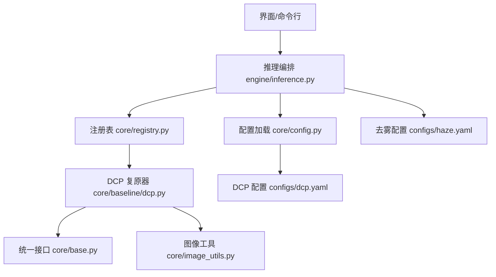
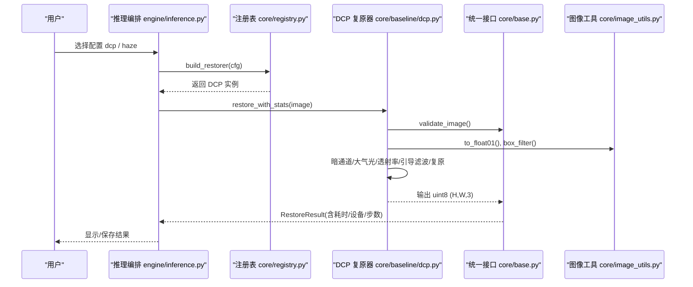
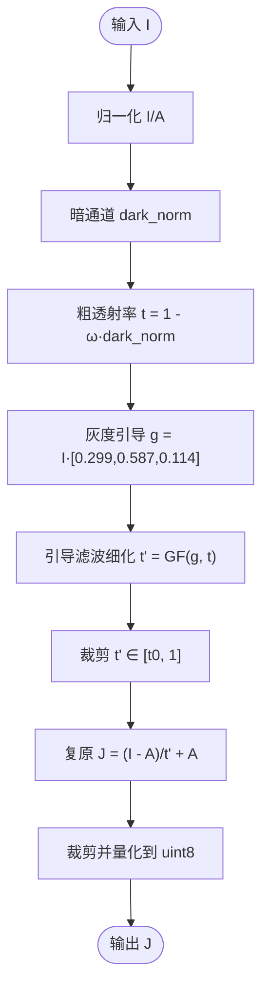
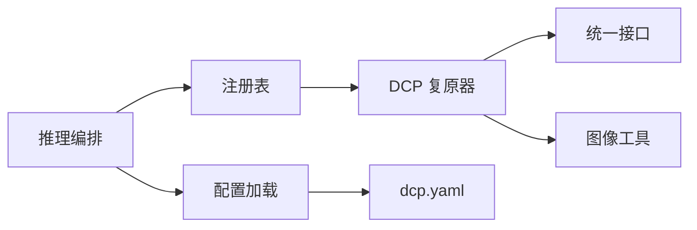

# 传统算法基线

<cite>
**本文引用的文件**
- [core/baseline/dcp.py](file://core/baseline/dcp.py)
- [configs/dcp.yaml](file://configs/dcp.yaml)
- [core/base.py](file://core/base.py)
- [core/config.py](file://core/config.py)
- [core/image_utils.py](file://core/image_utils.py)
- [core/registry.py](file://core/registry.py)
- [engine/inference.py](file://engine/inference.py)
- [configs/haze.yaml](file://configs/haze.yaml)
</cite>

## 目录
1. [简介](#简介)
2. [项目结构](#项目结构)
3. [核心组件](#核心组件)
4. [架构总览](#架构总览)
5. [详细组件分析](#详细组件分析)
6. [依赖关系分析](#依赖关系分析)
7. [性能考量](#性能考量)
8. [故障排查指南](#故障排查指南)
9. [结论](#结论)
10. [附录](#附录)

## 简介
本文件聚焦于传统算法基线中的暗通道先验（Dark Channel Prior, DCP）去雾方法，系统阐述其数学基础、物理意义、图像退化模型与解混过程，并详细说明参数估计、引导滤波等关键步骤的实现细节。同时给出与传统深度学习方法的对比思路、参数调优指导、效果评估方法与改进方向，帮助读者在工程实践中快速落地与优化该基线。

## 项目结构
本项目采用“统一复原接口 + 可插拔复原器”的架构：所有复原器继承统一基类，通过注册表动态加载；DCP 作为纯 NumPy 实现的传统基线，无需权重即可运行，便于快速验证与评测对照。

图表来源
- [engine/inference.py:22-68](file://engine/inference.py#L22-L68)
- [core/registry.py:18-85](file://core/registry.py#L18-L85)
- [core/baseline/dcp.py:23-85](file://core/baseline/dcp.py#L23-L85)
- [core/base.py:61-148](file://core/base.py#L61-L148)
- [core/image_utils.py:173-187](file://core/image_utils.py#L173-L187)
- [core/config.py:25-79](file://core/config.py#L25-L79)
- [configs/dcp.yaml:1-21](file://configs/dcp.yaml#L1-L21)
- [configs/haze.yaml:1-46](file://configs/haze.yaml#L1-L46)

章节来源
- [engine/inference.py:22-68](file://engine/inference.py#L22-L68)
- [core/registry.py:18-85](file://core/registry.py#L18-L85)
- [core/config.py:25-79](file://core/config.py#L25-L79)

## 核心组件
- 统一复原接口 BaseRestorer：定义 load_model、restore、进度回调、取消回调、尺寸校验等契约，确保 UI 与评测层对各类复原器行为一致。
- DCP 复原器 DarkChannelPriorRestorer：基于 He et al. CVPR 2009 的暗通道先验，提供五阶段处理流程（暗通道、大气光、粗透射率、引导滤波细化、成像方程复原）。
- 图像工具 image_utils：提供 box_filter、to_float01、resize 等纯 NumPy 工具，保证无 OpenCV/Torch 依赖也能运行。
- 配置系统 config：读取 YAML 配置，解析路径，注入绝对路径，支持按天气名获取配置。
- 注册表 registry：延迟导入具体复原器模块，避免启动时加载重型依赖。
- 推理编排 inference：ModelCache 缓存已加载复原器，提供单图/批量推理入口。

章节来源
- [core/base.py:61-148](file://core/base.py#L61-L148)
- [core/baseline/dcp.py:23-85](file://core/baseline/dcp.py#L23-L85)
- [core/image_utils.py:94-98](file://core/image_utils.py#L94-L98)
- [core/image_utils.py:173-187](file://core/image_utils.py#L173-L187)
- [core/config.py:25-79](file://core/config.py#L25-L79)
- [core/registry.py:18-85](file://core/registry.py#L18-L85)
- [engine/inference.py:22-68](file://engine/inference.py#L22-L68)

## 架构总览
DCP 作为传统基线，遵循统一接口并通过注册表按需加载。推理流程由 engine/inference.py 驱动，根据配置构建复原器实例，调用 restore_with_stats 进行计时与校验，最终返回标准结果对象。

图表来源
- [engine/inference.py:70-96](file://engine/inference.py#L70-L96)
- [core/registry.py:68-85](file://core/registry.py#L68-L85)
- [core/baseline/dcp.py:37-85](file://core/baseline/dcp.py#L37-L85)
- [core/base.py:111-138](file://core/base.py#L111-L138)
- [core/image_utils.py:94-98](file://core/image_utils.py#L94-L98)
- [core/image_utils.py:173-187](file://core/image_utils.py#L173-L187)

## 详细组件分析

### 暗通道先验（DCP）去雾原理与实现
- 数学基础与物理意义
  - 退化模型：观测图像 I(x) = J(x)·t(x) + A·(1 - t(x))，其中 J 为清晰图像，A 为全局大气光，t(x) 为空间变化的透射率。该模型描述了雾/霾导致的光散射叠加效应。
  - 暗通道先验：自然场景中，绝大多数局部区域的至少一个颜色通道的强度很低，因此“通道最小值再取局部最小值”得到的暗通道接近零。利用该统计特性可估计透射率与大气光。
- 图像退化建模与解混
  - 估计大气光 A：在暗通道最亮的少量像素中选取原图亮度最高者，作为全局大气光估计。
  - 估计粗透射率：对归一化图像 I/A 计算暗通道，得到 1 - ω·dark_norm，ω 用于保留少量雾以避免过增强。
  - 透射率细化：使用引导滤波以灰度图为引导，保持边缘的同时平滑噪声，随后裁剪至 [t0, 1] 防止数值不稳定。
  - 复原成像：J = (I - A)/t + A，并对结果做范围裁剪与量化到 uint8。
- 关键步骤实现要点
  - 暗通道：通道最小 + 滑窗局部最小值，采用可分离的行/列最小值堆叠方式，避免显式卷积开销。
  - 大气光：argpartition 高效选取 top-k 像素，再选亮度最大者。
  - 引导滤波：积分图均值滤波 box_filter 实现，计算局部均值、方差与协方差，得到线性系数 a,b 后重建。
  - 数值稳定：除零保护、范围裁剪、浮点转 uint8。

图表来源
- [core/baseline/dcp.py:56-85](file://core/baseline/dcp.py#L56-L85)
- [core/image_utils.py:173-187](file://core/image_utils.py#L173-L187)

章节来源
- [core/baseline/dcp.py:56-85](file://core/baseline/dcp.py#L56-L85)
- [core/baseline/dcp.py:88-125](file://core/baseline/dcp.py#L88-L125)
- [core/image_utils.py:173-187](file://core/image_utils.py#L173-L187)

### 参数与配置
- 主要参数
  - patch_size：暗通道局部窗口大小，影响去雾强度与细节保留。
  - omega：透射率缩放因子，越小越去雾彻底，过大可能残留雾。
  - t0：透射率下限，防止近景或强反射区域出现负值或不稳定。
  - guided_radius：引导滤波半径，控制平滑程度与边缘保持。
  - guided_eps：引导滤波正则项，控制拟合误差容忍度。
- 配置文件位置
  - DCP 专用配置位于 configs/dcp.yaml，包含上述参数及数据预处理选项。
  - 去雾场景也可参考 configs/haze.yaml（对应扩散模型配置），用于对比实验设置。

章节来源
- [configs/dcp.yaml:15-21](file://configs/dcp.yaml#L15-L21)
- [configs/haze.yaml:14-46](file://configs/haze.yaml#L14-L46)

### 与传统深度学习方法的效果差异与适用场景
- 差异点
  - DCP：无需训练与权重，速度快、可解释性强；对均匀雾霾有效，但对雨滴、雪花等离散遮挡物效果有限。
  - 深度学习（如 WeatherDiffusion）：需要权重与 GPU，能学习复杂退化分布，对多类型恶劣天气有更强泛化能力，但部署成本更高。
- 适用场景
  - DCP：快速基线、离线批处理、资源受限环境、教学演示与指标对照。
  - 深度学习：高质量复原、复杂场景、端到端管线集成。

章节来源
- [core/baseline/dcp.py:1-10](file://core/baseline/dcp.py#L1-L10)
- [configs/haze.yaml:1-46](file://configs/haze.yaml#L1-L46)

### 与其他基线的对比分析与改进方向
- 对比维度
  - 速度：DCP 纯 CPU/NumPy，适合轻量部署；深度学习需 GPU 且推理较慢。
  - 质量：DCP 在均匀雾霾上表现稳健；深度学习在复杂退化下更优。
  - 可维护性：DCP 参数少、易调试；深度学习需关注权重版本与采样策略。
- 改进方向
  - 自适应参数：根据图像统计（如暗通道均值、对比度）自动调节 omega、guided_radius。
  - 多尺度引导：结合多分辨率引导滤波提升细节恢复。
  - 混合策略：将 DCP 作为初始化或残差修正，与深度学习融合。
  - 鲁棒性增强：引入异常检测（如雪/雨滴掩膜）避免误增强。

[本节为概念性讨论，不直接分析具体文件，故无章节来源]

## 依赖关系分析
- 模块耦合
  - DCP 依赖 base（统一接口）、image_utils（box_filter、to_float01）、registry（装饰器注册）。
  - 推理编排依赖 registry、config、base，形成“配置→构建→执行→结果”的闭环。
- 外部依赖
  - NumPy、Pillow；无 OpenCV/Torch 依赖，便于在无 GPU 环境运行。
- 潜在循环依赖
  - 当前结构为单向依赖，未见循环引用风险。

图表来源
- [core/baseline/dcp.py:16-20](file://core/baseline/dcp.py#L16-L20)
- [core/registry.py:18-85](file://core/registry.py#L18-L85)
- [core/config.py:25-79](file://core/config.py#L25-L79)
- [engine/inference.py:16-19](file://engine/inference.py#L16-L19)

章节来源
- [core/baseline/dcp.py:16-20](file://core/baseline/dcp.py#L16-L20)
- [core/registry.py:18-85](file://core/registry.py#L18-L85)
- [core/config.py:25-79](file://core/config.py#L25-L79)
- [engine/inference.py:16-19](file://engine/inference.py#L16-L19)

## 性能考量
- 时间复杂度
  - 暗通道：O(HW·k^2) 近似，实际通过行/列最小值堆叠降低常数开销。
  - 引导滤波：基于积分图的均值滤波 O(HW)，整体线性复杂度。
- 内存占用
  - 中间数组较多（暗通道、均值、方差、协方差），建议控制 max_side 与 guided_radius。
- 优化建议
  - 增大 guided_radius 会显著增加计算量，可按图像分辨率自适应调整。
  - 使用 to_float01 与 box_filter 的向量化操作减少 Python 循环。
  - 批量处理时复用已加载复原器实例（ModelCache）。

[本节提供通用指导，不直接分析具体文件，故无章节来源]

## 故障排查指南
- 常见错误
  - 输入图像格式不符：必须为 RGB uint8 (H,W,3)。
  - 输出尺寸不一致：restore_with_stats 会校验输出尺寸与输入一致。
  - 取消任务：cancel_cb 返回 True 时应抛出 RestoreCancelled。
- 定位方法
  - 检查 base.validate_image 与 restore_with_stats 的尺寸校验逻辑。
  - 确认 progress_cb/report 调用顺序与预览图传递。
  - 查看配置是否正确加载（_config_path、weights.abs_path）。

章节来源
- [core/base.py:153-181](file://core/base.py#L153-L181)
- [core/base.py:111-138](file://core/base.py#L111-L138)
- [core/config.py:25-57](file://core/config.py#L25-L57)

## 结论
DCP 作为经典传统基线，具备无需权重、易于部署、可解释性强等优势，适用于快速验证与指标对照。其在均匀雾霾场景下表现稳健，但在复杂退化（雨滴、雪花）上存在局限。结合深度学习方法的泛化能力与 DCP 的高效性，可在工程实践中形成互补方案。通过合理参数调优与改进策略，可进一步提升 DCP 的鲁棒性与适用范围。

[本节为总结性内容，不直接分析具体文件，故无章节来源]

## 附录
- 参数调优指导
  - patch_size：小窗口保留细节但噪声敏感；大窗口更平滑但可能模糊边缘。建议从 15 起步，按图像分辨率微调。
  - omega：0.9~1.0 区间内尝试，过小会导致过增强，过大则残留雾。
  - t0：0.05~0.2 区间，近景或强反射区域可适当提高下限。
  - guided_radius：40 左右平衡平滑与边缘，高分辨率图像可适度增大。
  - guided_eps：1e-3 附近，过小易过拟合噪声，过大过度平滑。
- 效果评估方法
  - 有参考指标：PSNR、SSIM（需 GT 对齐）。
  - 无参考指标：NIQE、BRISQUE（当无法配对 GT 时使用）。
  - 主观评价：视觉清晰度、色彩还原、伪影情况。
- 与其他基线对比
  - 与深度学习（如 WeatherDiffusion）对比：关注质量、速度、资源消耗与稳定性。
  - 与更多传统方法对比：如 Retinex、直方图均衡等，分析各自优势与局限。

[本节为通用指导，不直接分析具体文件，故无章节来源]