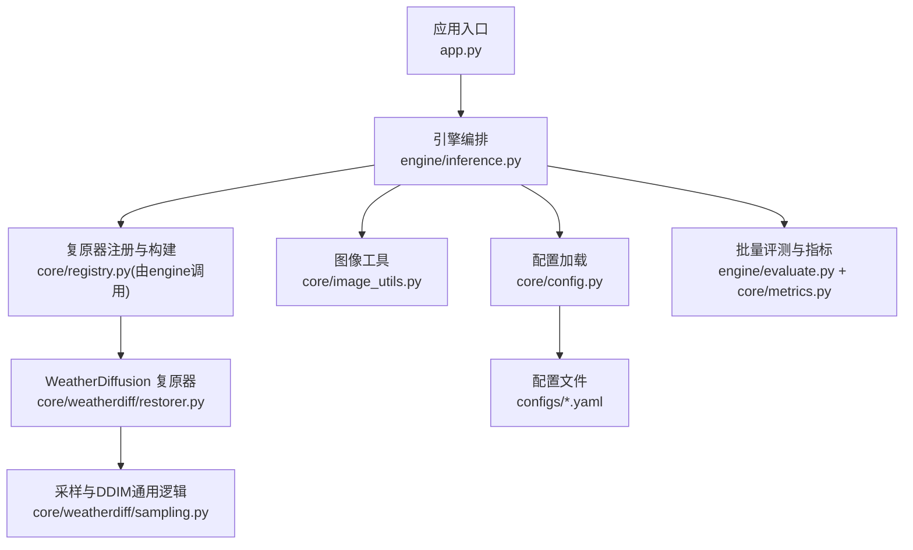
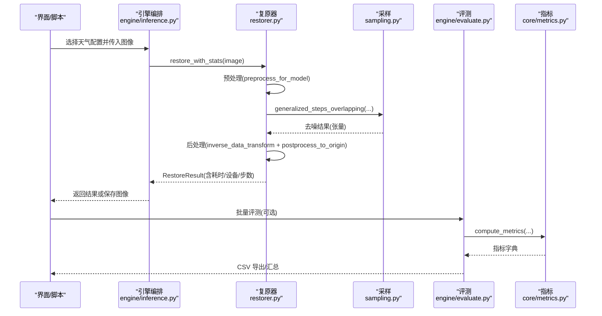
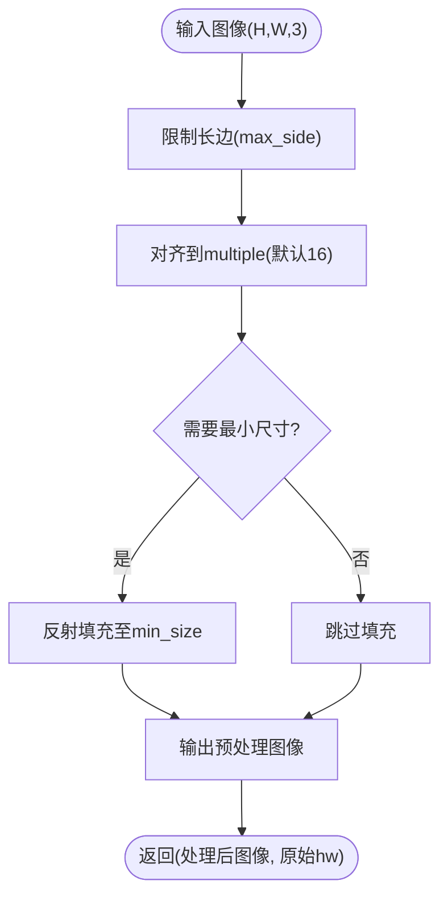
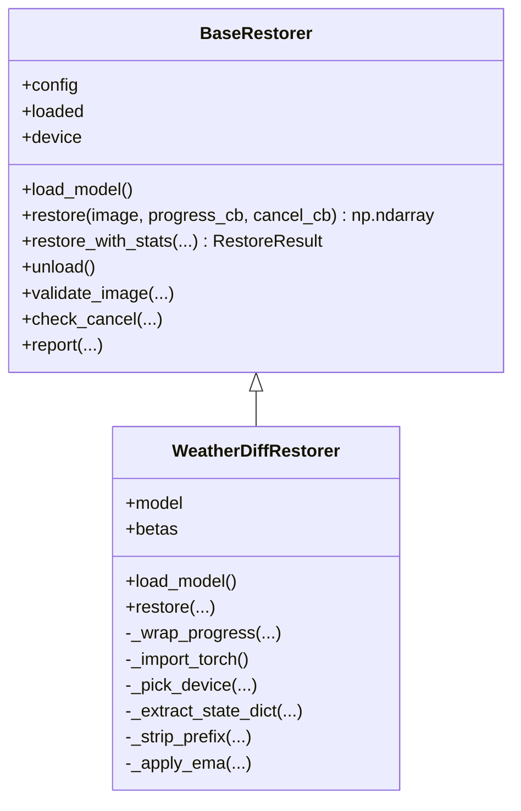
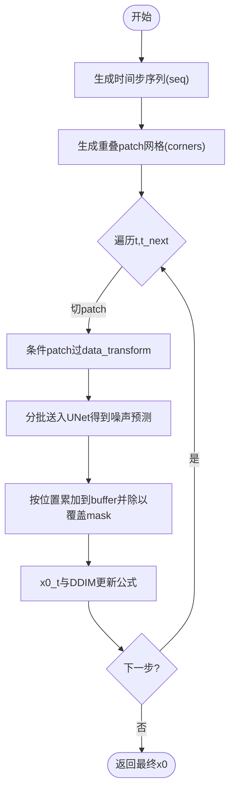
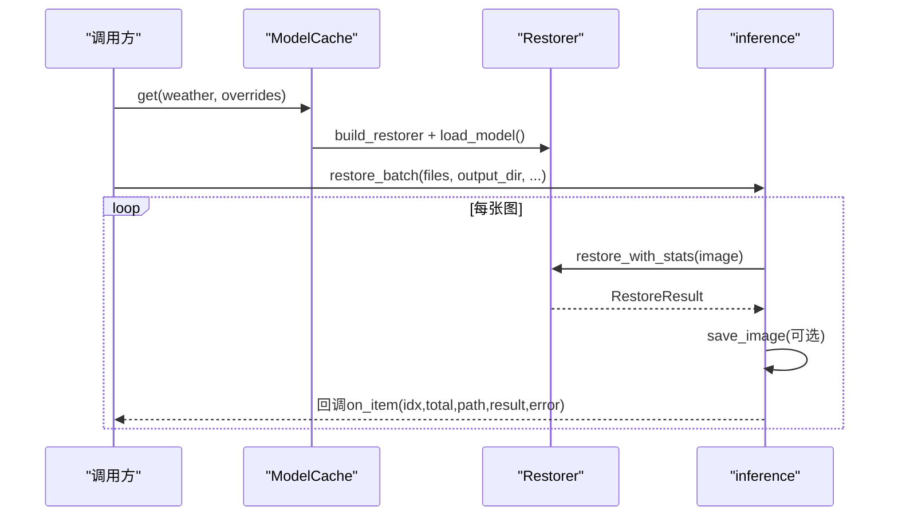
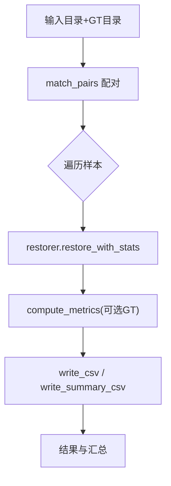
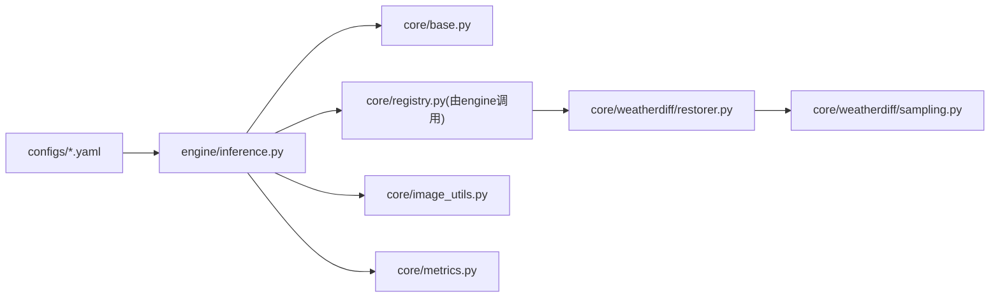

# 图像处理工具

<cite>
**本文引用的文件**
- [core/image_utils.py](file://core/image_utils.py)
- [core/base.py](file://core/base.py)
- [core/config.py](file://core/config.py)
- [core/weatherdiff/restorer.py](file://core/weatherdiff/restorer.py)
- [core/weatherdiff/sampling.py](file://core/weatherdiff/sampling.py)
- [engine/inference.py](file://engine/inference.py)
- [engine/evaluate.py](file://engine/evaluate.py)
- [core/metrics.py](file://core/metrics.py)
- [configs/allweather.yaml](file://configs/allweather.yaml)
- [configs/haze.yaml](file://configs/haze.yaml)
- [configs/snow.yaml](file://configs/snow.yaml)
- [configs/dcp.yaml](file://configs/dcp.yaml)
- [scripts/smoke_test.py](file://scripts/smoke_test.py)
- [app.py](file://app.py)
</cite>

## 目录
1. [简介](#简介)
2. [项目结构](#项目结构)
3. [核心组件](#核心组件)
4. [架构总览](#架构总览)
5. [详细组件分析](#详细组件分析)
6. [依赖关系分析](#依赖关系分析)
7. [性能与内存优化](#性能与内存优化)
8. [故障排查指南](#故障排查指南)
9. [结论](#结论)
10. [附录：常用任务与示例路径](#附录：常用任务与示例路径)

## 简介
本图像处理工具面向恶劣天气（雨、雾、雪）图像复原，提供统一的预处理/后处理管线、扩散模型推理编排、批量评测与指标计算能力。系统通过配置驱动不同天气场景（雨/雾/雪/统一模型），并以“接口契约”隔离具体实现，便于扩展多种复原方法（扩散模型、传统算法、假模型）。文档重点说明：
- 图像格式转换、尺寸调整、归一化等预处理/后处理实现
- 不同天气类型的配置与参数设置
- 批处理高效实现与显存/内存优化策略
- 常见任务的实用流程与代码路径指引
- 性能优化建议与最佳实践

## 项目结构
- 核心层 core：定义统一接口、图像工具、指标、配置加载、WeatherDiffusion 复原器与采样模块
- 引擎层 engine：单图/批量推理编排、批量评测与结果导出
- 配置 configs：按天气类型划分的 YAML 配置（rain/haze/snow/allweather/dcp）
- 脚本 scripts：环境自检与冒烟测试
- UI app.py：PyQt5 界面入口（可选）

图表来源
- [app.py:19-32](file://app.py#L19-L32)
- [engine/inference.py:22-67](file://engine/inference.py#L22-L67)
- [core/config.py:25-57](file://core/config.py#L25-L57)
- [core/weatherdiff/restorer.py:32-90](file://core/weatherdiff/restorer.py#L32-L90)
- [core/weatherdiff/sampling.py:31-81](file://core/weatherdiff/sampling.py#L31-L81)
- [engine/evaluate.py:51-116](file://engine/evaluate.py#L51-L116)
- [core/metrics.py:134-177](file://core/metrics.py#L134-L177)
- [configs/allweather.yaml:1-47](file://configs/allweather.yaml#L1-L47)

章节来源
- [app.py:19-32](file://app.py#L19-L32)
- [engine/inference.py:22-67](file://engine/inference.py#L22-L67)
- [core/config.py:25-57](file://core/config.py#L25-L57)

## 核心组件
- 统一接口契约 BaseRestorer：规定输入输出格式、进度回调、取消机制、计时与校验
- 图像工具 image_utils：统一 RGB uint8 (H,W,3) 约定，提供读写、缩放、对齐、填充、简单滤波与可视化
- WeatherDiffusion 复原器：权重加载、设备选择、预处理、patch-based DDIM 采样、显存自适应重试、后处理还原
- 采样模块 sampling：beta 调度、时间步压缩、重叠 patch 网格、数据归一化、待实现的通用主循环
- 引擎编排 inference：ModelCache 缓存模型实例、单图/批量推理、错误隔离与回调透传
- 评测 evaluate：数据集遍历、GT 配对、指标计算、CSV 导出
- 指标 metrics：PSNR/SSIM/LPIPS/NIQE/BRISQUE/FID，延迟导入与可用性探测

章节来源
- [core/base.py:61-148](file://core/base.py#L61-L148)
- [core/image_utils.py:22-167](file://core/image_utils.py#L22-L167)
- [core/weatherdiff/restorer.py:32-167](file://core/weatherdiff/restorer.py#L32-L167)
- [core/weatherdiff/sampling.py:31-163](file://core/weatherdiff/sampling.py#L31-L163)
- [engine/inference.py:22-153](file://engine/inference.py#L22-L153)
- [engine/evaluate.py:51-181](file://engine/evaluate.py#L51-L181)
- [core/metrics.py:134-177](file://core/metrics.py#L134-L177)

## 架构总览
系统以配置为中心，支持多天气场景的统一推理与评测。UI/CLI 通过 engine 调用具体 restorer；restorer 负责预处理、采样与后处理；评测模块负责指标计算与汇总。

图表来源
- [engine/inference.py:70-132](file://engine/inference.py#L70-L132)
- [core/weatherdiff/restorer.py:102-167](file://core/weatherdiff/restorer.py#L102-L167)
- [core/weatherdiff/sampling.py:115-163](file://core/weatherdiff/sampling.py#L115-L163)
- [engine/evaluate.py:51-116](file://engine/evaluate.py#L51-L116)
- [core/metrics.py:134-177](file://core/metrics.py#L134-L177)

## 详细组件分析

### 图像预处理与后处理（image_utils）
- 统一约定：内存中图像为 RGB uint8 (H,W,3)
- 关键能力
  - 读取/保存：load_image/save_image，自动创建目录、中文路径支持
  - 类型转换：to_uint8/to_float01，安全范围裁剪与类型推断
  - 尺寸控制：resize、limit_long_side（长边限制）、resize_to_multiple（对齐到倍数，默认16）、pad_to_min_size（反射填充）
  - 统一预处理：preprocess_for_model（长边限制→对齐→最小尺寸填充），postprocess_to_origin（还原原始尺寸）
  - 简单空域滤波：box_filter（积分图均值滤波）、unsharp_mask（USM锐化）
  - 可视化与演示：side_by_side、make_demo_image（合成带雨纹噪声的演示图）

图表来源
- [core/image_utils.py:101-167](file://core/image_utils.py#L101-L167)

章节来源
- [core/image_utils.py:22-167](file://core/image_utils.py#L22-L167)

### WeatherDiffusion 复原器（restorer.py）
- 职责
  - 设备选择：优先 CUDA，可通过环境变量强制 CPU
  - 权重加载：兼容 DataParallel module. 前缀与 EMA 权重覆盖
  - 预处理：调用 image_utils.preprocess_for_model
  - 采样：构造时间步序列与 patch 网格，调用 sampling.generalized_steps_overlapping
  - 显存自适应：遇到 OOM 自动减半 patch_batch_size 并重试
  - 后处理：inverse_data_transform → 转 numpy → postprocess_to_origin 还原尺寸
- 进度与取消：包装 progress_cb，将中间预览转为可显示图像；支持 cancel_cb 中断

图表来源
- [core/base.py:61-148](file://core/base.py#L61-L148)
- [core/weatherdiff/restorer.py:32-167](file://core/weatherdiff/restorer.py#L32-L167)

章节来源
- [core/weatherdiff/restorer.py:32-167](file://core/weatherdiff/restorer.py#L32-L167)

### 采样与 DDIM（sampling.py）
- 已实现
  - beta 调度：linear/quad/const/jsd
  - 时间步压缩：make_timestep_seq（从 1000 步抽取等间隔序列）
  - 重叠 patch 网格：overlapping_grid_indices/corner_list（保证右下角覆盖）
  - 数据归一化：data_transform/inverse_data_transform（[-1,1]↔[0,1]）
  - alpha_bar 计算：compute_alpha
- 待实现
  - generalized_steps_overlapping：按官方思路实现 patch 级去噪累加与平均，完成整图 DDIM 更新

图表来源
- [core/weatherdiff/sampling.py:31-163](file://core/weatherdiff/sampling.py#L31-L163)

章节来源
- [core/weatherdiff/sampling.py:31-163](file://core/weatherdiff/sampling.py#L31-L163)

### 配置与天气类型（configs/*.yaml）
- allweather：统一模型，不区分天气类型，适合叠加退化演示
- haze：去雾（雾霾/雨雾叠加），对应 rainfog 场景
- snow：去雪（雪花/雪条纹遮挡）
- dcp：非扩散对照基线（暗通道先验），无需权重
- 公共字段
  - data.image_size：patch 大小（默认 64）
  - data.max_side：长边上限（默认 1024）
  - data.size_multiple：尺寸对齐倍数（默认 16）
  - sampling.timesteps：采样步数（默认 25）
  - sampling.patch_batch_size：一次并行 patch 数量（默认 32）
  - sampling.grid_r：patch 步幅（默认 16）
  - sampling.seed：随机种子（默认 61）

章节来源
- [configs/allweather.yaml:1-47](file://configs/allweather.yaml#L1-L47)
- [configs/haze.yaml:1-46](file://configs/haze.yaml#L1-L46)
- [configs/snow.yaml:1-46](file://configs/snow.yaml#L1-L46)
- [configs/dcp.yaml:1-21](file://configs/dcp.yaml#L1-L21)

### 引擎编排与批处理（engine/inference.py）
- ModelCache：按配置名缓存 restorer 实例，避免重复加载权重；支持 release_others/clear 释放显存
- 单图/批量推理：restore_array/restore_file/restore_batch，支持 on_item 回调与 step_cb 进度
- 错误隔离：单张失败不影响整批，记录错误信息

图表来源
- [engine/inference.py:22-153](file://engine/inference.py#L22-L153)

章节来源
- [engine/inference.py:22-153](file://engine/inference.py#L22-L153)

### 批量评测与指标（engine/evaluate.py + core/metrics.py）
- 数据集遍历：match_pairs 按文件名主干匹配 GT（支持 _clean/_gt/_target/_norain/_free 等后缀）
- 指标计算：compute_metrics 支持 PSNR/SSIM/LPIPS/NIQE/BRISQUE，FID 需额外库
- 结果导出：write_csv/write_summary_csv，UTF-8-SIG 编码，Excel 友好

图表来源
- [engine/evaluate.py:51-181](file://engine/evaluate.py#L51-L181)
- [core/metrics.py:134-177](file://core/metrics.py#L134-L177)

章节来源
- [engine/evaluate.py:51-181](file://engine/evaluate.py#L51-L181)
- [core/metrics.py:134-177](file://core/metrics.py#L134-L177)

## 依赖关系分析
- 配置驱动：configs/*.yaml 决定 restorer、权重路径、采样与数据参数
- 接口解耦：engine 仅依赖 base 与 registry，不直接耦合具体模型
- 外部依赖延迟导入：metrics 中的 LPIPS/NIQE/BRISQUE/FID 按需加载，缺失时给出明确提示
- 设备与环境：AWR_DEVICE 可强制 CPU；AWR_MOCK=1 可用假模型快速验证

图表来源
- [core/config.py:25-57](file://core/config.py#L25-L57)
- [engine/inference.py:22-67](file://engine/inference.py#L22-L67)
- [core/weatherdiff/restorer.py:32-90](file://core/weatherdiff/restorer.py#L32-L90)
- [core/weatherdiff/sampling.py:31-81](file://core/weatherdiff/sampling.py#L31-L81)
- [core/metrics.py:205-219](file://core/metrics.py#L205-L219)

章节来源
- [core/config.py:25-57](file://core/config.py#L25-L57)
- [engine/inference.py:22-67](file://engine/inference.py#L22-L67)
- [core/metrics.py:205-219](file://core/metrics.py#L205-L219)

## 性能与内存优化
- 预处理阶段
  - limit_long_side：限制长边，降低显存与耗时（推荐 1024）
  - resize_to_multiple：对齐到 16 的倍数，适配 UNet 下采样
  - pad_to_min_size：小图反射填充，避免过小 patch 导致边界效应
- 采样阶段
  - patch_batch_size：控制单次并行 patch 数量，显存不足时自动减半重试
  - timesteps：减少采样步数可显著提速，但可能影响质量（默认 25）
  - grid_r：增大步幅可减少 patch 数量，提升速度但可能引入拼接痕迹（默认 16）
- 资源管理
  - ModelCache：同一配置只加载一次权重，切换天气类型不重复占显存
  - unload/release_others：及时释放未使用模型，控制显存峰值
  - 设备选择：AWR_DEVICE=cpu 可在无 GPU 环境下运行；有 GPU 时自动使用 CUDA
- 指标计算
  - 延迟导入：仅在需要时加载第三方库，避免启动开销
  - 缓存：LPIPS/NIQE/BRISQUE 模型缓存，避免重复初始化

章节来源
- [core/image_utils.py:101-167](file://core/image_utils.py#L101-L167)
- [core/weatherdiff/restorer.py:137-167](file://core/weatherdiff/restorer.py#L137-L167)
- [engine/inference.py:22-67](file://engine/inference.py#L22-L67)
- [core/metrics.py:205-219](file://core/metrics.py#L205-L219)

## 故障排查指南
- 找不到权重文件
  - 现象：加载权重时报错
  - 处理：执行下载脚本或手动放置权重，检查 configs 中 weights.path
  - 参考路径：[core/weatherdiff/restorer.py:47-56](file://core/weatherdiff/restorer.py#L47-L56)
- 显存不足（OOM）
  - 现象：采样阶段 RuntimeError out of memory
  - 处理：自动降低 patch_batch_size 并重试；也可手动调小 timesteps/grid_r
  - 参考路径：[core/weatherdiff/restorer.py:137-161](file://core/weatherdiff/restorer.py#L137-L161)
- 指标不可用
  - 现象：LPIPS/NIQE/BRISQUE/FID 报错或缺失
  - 处理：安装对应依赖；或使用 available_metrics 查看状态
  - 参考路径：[core/metrics.py:205-219](file://core/metrics.py#L205-L219)
- 批量评测中断
  - 现象：某张图失败导致整体中断
  - 处理：当前实现单张失败不中断，记录 error；检查该图路径与尺寸
  - 参考路径：[engine/evaluate.py:92-116](file://engine/evaluate.py#L92-L116)
- 环境自检
  - 使用冒烟测试验证依赖、配置、假模型、DCP、指标与批量评测链路
  - 参考路径：[scripts/smoke_test.py:35-151](file://scripts/smoke_test.py#L35-L151)

章节来源
- [core/weatherdiff/restorer.py:47-56](file://core/weatherdiff/restorer.py#L47-L56)
- [core/weatherdiff/restorer.py:137-161](file://core/weatherdiff/restorer.py#L137-L161)
- [core/metrics.py:205-219](file://core/metrics.py#L205-L219)
- [engine/evaluate.py:92-116](file://engine/evaluate.py#L92-L116)
- [scripts/smoke_test.py:35-151](file://scripts/smoke_test.py#L35-L151)

## 结论
本工具以配置驱动和接口契约为核心，提供了从图像预处理/后处理、扩散模型推理、批处理到评测指标的完整流水线。通过长边限制、尺寸对齐、patch 级采样与显存自适应重试，实现了在有限资源下的高效复原。不同天气类型通过独立配置即可切换，便于对比与扩展。建议在实际使用中结合冒烟测试与指标评估，逐步调优采样参数与预处理阈值，以获得质量与性能的平衡。

## 附录：常用任务与示例路径
- 图像增强（USM 锐化）
  - 函数：unsharp_mask
  - 参考路径：[core/image_utils.py:190-194](file://core/image_utils.py#L190-L194)
- 添加噪声/合成演示图
  - 函数：make_demo_image（含雨纹噪声）
  - 参考路径：[core/image_utils.py:206-231](file://core/image_utils.py#L206-L231)
- 质量评估（PSNR/SSIM/NIQE/BRISQUE/FID）
  - 函数：compute_metrics、psnr、ssim、niqe、brisque、fid
  - 参考路径：[core/metrics.py:134-177](file://core/metrics.py#L134-L177)
- 批量复原与保存
  - 函数：restore_batch、save_image
  - 参考路径：[engine/inference.py:99-132](file://engine/inference.py#L99-L132), [core/image_utils.py:28-33](file://core/image_utils.py#L28-L33)
- 批量评测与导出 CSV
  - 函数：evaluate_dataset、write_csv、write_summary_csv
  - 参考路径：[engine/evaluate.py:51-181](file://engine/evaluate.py#L51-L181)
- 启动界面（可选）
  - 入口：app.py
  - 参考路径：[app.py:19-32](file://app.py#L19-L32)
- 环境自检（无需权重/GPU）
  - 脚本：smoke_test.py
  - 参考路径：[scripts/smoke_test.py:35-151](file://scripts/smoke_test.py#L35-L151)