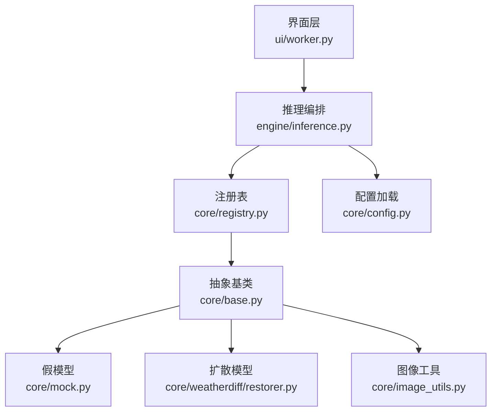
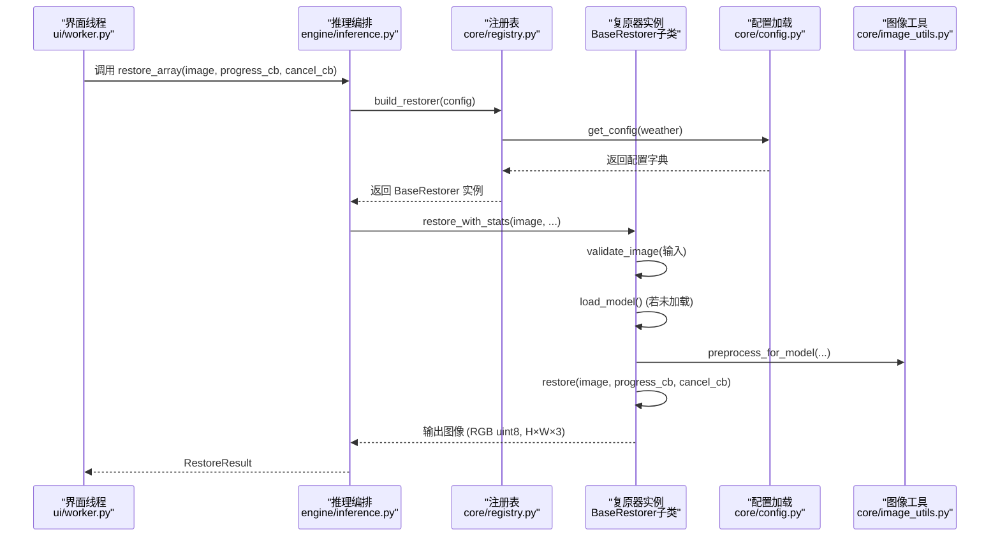
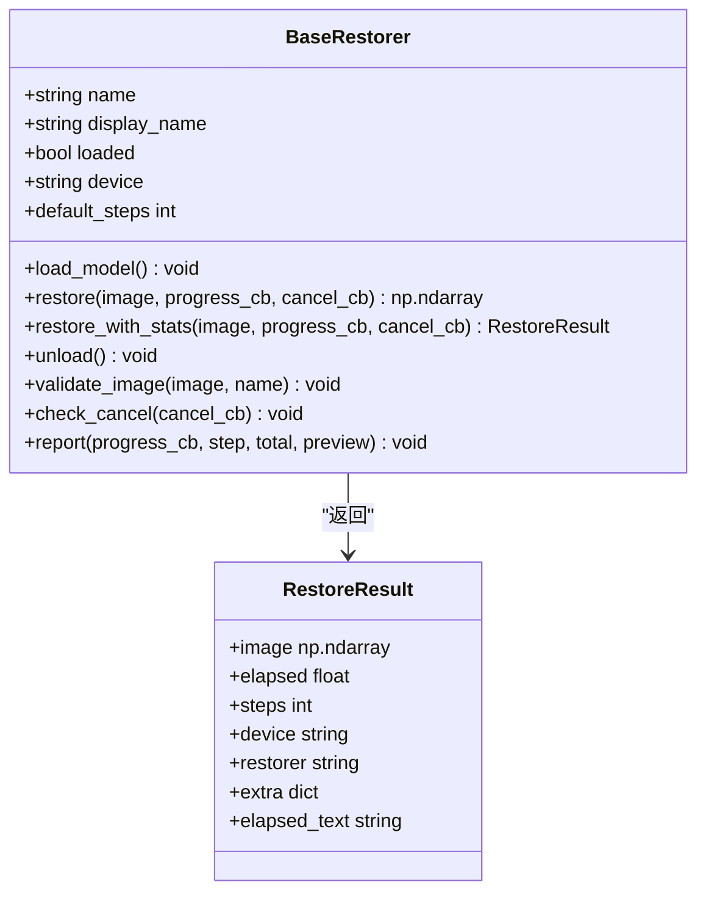
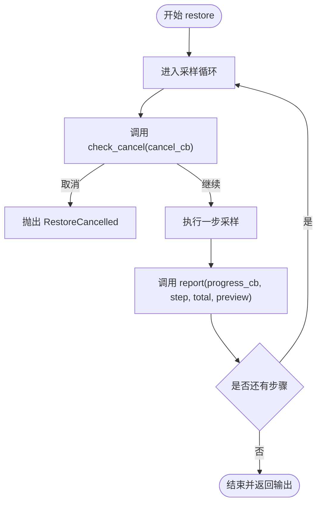
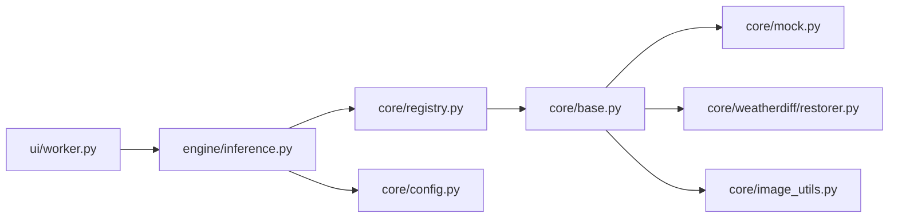
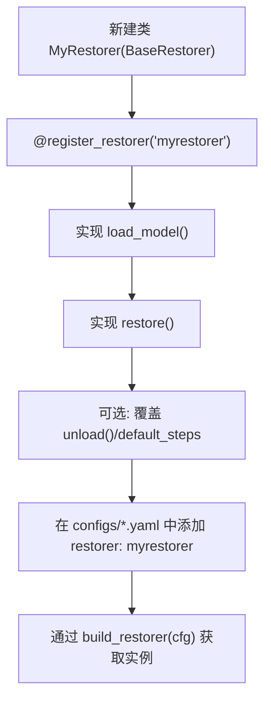

# 基础框架

<cite>
**本文引用的文件**
- [core/base.py](file://core/base.py)
- [core/registry.py](file://core/registry.py)
- [core/config.py](file://core/config.py)
- [core/weatherdiff/restorer.py](file://core/weatherdiff/restorer.py)
- [core/mock.py](file://core/mock.py)
- [core/image_utils.py](file://core/image_utils.py)
- [engine/inference.py](file://engine/inference.py)
- [ui/worker.py](file://ui/worker.py)
- [configs/allweather.yaml](file://configs/allweather.yaml)
</cite>

## 目录
1. [简介](#简介)
2. [项目结构](#项目结构)
3. [核心组件](#核心组件)
4. [架构总览](#架构总览)
5. [详细组件分析](#详细组件分析)
6. [依赖关系分析](#依赖关系分析)
7. [性能考量](#性能考量)
8. [故障排查指南](#故障排查指南)
9. [结论](#结论)
10. [附录：新模型集成示例与配置管理](#附录：新模型集成示例与配置管理)

## 简介
本框架围绕一个统一的复原接口契约构建，所有复原模型（扩散模型、传统算法、假模型）都必须继承 BaseRestorer 抽象基类，实现 load_model() 与 restore() 方法。通过注册表机制按配置动态构造具体复原器；通过统一的数据类 RestoreResult 承载结果；通过进度回调与取消回调提供可中断、可观测的推理流程；并提供图像验证、错误处理与资源管理的通用能力。UI 层与评测层只依赖该契约，不关心底层模型实现。

## 项目结构
- core 模块定义统一接口契约、注册表、配置加载、图像工具以及具体复原器实现。
- engine 模块负责推理编排、权重缓存、批量处理。
- ui 模块在后台线程中调用 engine，将进度、预览、完成与异常以信号形式反馈给界面。
- configs 目录存放不同天气或模型的 YAML 配置，包含 restorer 字段用于选择具体实现。

图表来源
- [ui/worker.py:32-89](file://ui/worker.py#L32-L89)
- [engine/inference.py:22-77](file://engine/inference.py#L22-L77)
- [core/registry.py:29-84](file://core/registry.py#L29-L84)
- [core/base.py:61-185](file://core/base.py#L61-L185)
- [core/mock.py:27-81](file://core/mock.py#L27-L81)
- [core/weatherdiff/restorer.py:32-167](file://core/weatherdiff/restorer.py#L32-L167)
- [core/config.py:25-98](file://core/config.py#L25-L98)
- [core/image_utils.py:145-167](file://core/image_utils.py#L145-L167)

章节来源
- [core/base.py:1-185](file://core/base.py#L1-L185)
- [core/registry.py:1-85](file://core/registry.py#L1-L85)
- [core/config.py:1-98](file://core/config.py#L1-L98)
- [core/weatherdiff/restorer.py:1-244](file://core/weatherdiff/restorer.py#L1-L244)
- [core/mock.py:1-81](file://core/mock.py#L1-L81)
- [core/image_utils.py:1-253](file://core/image_utils.py#L1-L253)
- [engine/inference.py:1-153](file://engine/inference.py#L1-L153)
- [ui/worker.py:1-162](file://ui/worker.py#L1-L162)
- [configs/allweather.yaml:1-47](file://configs/allweather.yaml#L1-L47)

## 核心组件
- BaseRestorer 抽象基类：定义统一接口契约与通用能力。
- RestoreResult 数据类：封装一次复原的完整结果。
- 注册表 registry：按配置中的 restorer 字段动态构造具体复原器。
- 配置 config：加载 YAML 并解析路径，提供可用配置列表。
- 图像工具 image_utils：统一图像格式、预处理/后处理、IO 与简单滤波。
- 具体复原器：MockRestorer（纯 numpy）、WeatherDiffRestorer（扩散模型）。
- 推理编排 engine：ModelCache 权重缓存、单图/批量恢复。
- UI 线程 worker：后台执行推理，信号化进度、预览、完成与异常。

章节来源
- [core/base.py:45-185](file://core/base.py#L45-L185)
- [core/registry.py:18-84](file://core/registry.py#L18-L84)
- [core/config.py:25-98](file://core/config.py#L25-L98)
- [core/image_utils.py:22-167](file://core/image_utils.py#L22-L167)
- [core/mock.py:27-81](file://core/mock.py#L27-L81)
- [core/weatherdiff/restorer.py:32-167](file://core/weatherdiff/restorer.py#L32-L167)
- [engine/inference.py:22-153](file://engine/inference.py#L22-L153)
- [ui/worker.py:32-162](file://ui/worker.py#L32-L162)

## 架构总览
下图展示了从 UI 到具体复原器的调用链路与关键交互点。

图表来源
- [ui/worker.py:63-89](file://ui/worker.py#L63-L89)
- [engine/inference.py:70-77](file://engine/inference.py#L70-L77)
- [core/registry.py:68-84](file://core/registry.py#L68-L84)
- [core/config.py:77-79](file://core/config.py#L77-L79)
- [core/base.py:111-138](file://core/base.py#L111-L138)
- [core/image_utils.py:145-167](file://core/image_utils.py#L145-L167)

## 详细组件分析

### BaseRestorer 抽象基类与统一接口契约
- 设计目标：为所有复原模型提供一致的加载、推理、统计、验证与回调接口，屏蔽底层差异。
- 必须实现的接口：
  - load_model(): 加载权重并设置 loaded=True；缺失权重应抛出 WeightNotFoundError。
  - restore(image, progress_cb=None, cancel_cb=None): 对单张退化图进行复原，返回与原图尺寸一致的 RGB uint8 图像；支持进度上报与取消。
- 可选覆盖：
  - unload(): 释放显存等；默认仅重置 loaded。
  - default_steps: 进度条总步数预估值，默认取自配置的 sampling.timesteps。
- 通用能力：
  - restore_with_stats(): 统一入口，自动校验输入/输出、计时、填充 RestoreResult。
  - validate_image(): 校验图像类型、通道、dtype。
  - check_cancel(): 在循环中定期检查取消，触发则抛 RestoreCancelled。
  - report(): 安全上报进度，回调内部异常不影响主流程。
- 约定：
  - 图像统一格式：numpy.ndarray，dtype=uint8，shape=(H, W, 3)，通道顺序 RGB。
  - restore() 的输出尺寸必须与输入一致。
  - 进度回调签名：progress_cb(step, total, preview)。
  - 取消回调签名：cancel_cb() -> bool，返回 True 时尽快抛 RestoreCancelled。

图表来源
- [core/base.py:45-185](file://core/base.py#L45-L185)

章节来源
- [core/base.py:11-185](file://core/base.py#L11-L185)

### RestoreResult 数据类
- 用途：统一 UI 与评测的结果结构，避免各自定义。
- 字段说明：
  - image: 复原后的图像（RGB uint8）。
  - elapsed: 耗时秒数。
  - steps: 实际采样步数（通常来自配置）。
  - device: 实际使用设备（cpu/cuda）。
  - restorer: 模型标识（如 weatherdiff / mock / dcp）。
  - extra: 其他信息（如显存占用等）。
  - elapsed_text: 便捷属性，格式化耗时文本。

章节来源
- [core/base.py:45-59](file://core/base.py#L45-L59)

### 进度回调与取消回调机制
- 进度回调：
  - 由 BaseRestorer.report() 安全上报，捕获回调异常，确保推理不被打断。
  - WeatherDiffRestorer 将中间 tensor 转换为 RGB uint8 并通过 postprocess_to_origin 还原尺寸后再上报。
  - MockRestorer 每步都上报当前中间结果，便于演示逐步去噪动画。
- 取消回调：
  - 在耗时循环中调用 BaseRestorer.check_cancel()，若 cancel_cb() 返回 True，则抛出 RestoreCancelled。
  - UI 线程通过 QThread 的信号将取消事件传播到 worker，并在 run() 中捕获 RestoreCancelled 发出 cancelled 信号。

图表来源
- [core/base.py:163-181](file://core/base.py#L163-L181)
- [core/weatherdiff/restorer.py:138-167](file://core/weatherdiff/restorer.py#L138-L167)
- [core/mock.py:55-66](file://core/mock.py#L55-L66)
- [ui/worker.py:63-89](file://ui/worker.py#L63-L89)

章节来源
- [core/base.py:163-181](file://core/base.py#L163-L181)
- [core/weatherdiff/restorer.py:138-167](file://core/weatherdiff/restorer.py#L138-L167)
- [core/mock.py:55-66](file://core/mock.py#L55-L66)
- [ui/worker.py:63-89](file://ui/worker.py#L63-L89)

### 图像验证、错误处理与资源管理
- 图像验证：
  - BaseRestorer.validate_image() 强制要求 RGB uint8 且形状为 (H, W, 3)。
  - restore_with_stats() 在推理前后分别校验输入与输出，并强制输出尺寸与输入一致。
- 错误处理：
  - WeightNotFoundError：权重缺失时抛出，UI 捕获后提示用户放置权重。
  - RestoreCancelled：用户主动取消时抛出，UI 捕获后提示“已取消”。
  - 批量处理中单张失败不中断整批，记录错误信息并继续。
- 资源管理：
  - ModelCache 按配置名缓存复原器实例，避免重复加载权重与显存占用。
  - WeatherDiffRestorer.unload() 清理模型与显存缓存。
  - 显存不足时自动降低 patch_batch_size 重试。

章节来源
- [core/base.py:111-138](file://core/base.py#L111-L138)
- [core/base.py:153-167](file://core/base.py#L153-L167)
- [core/weatherdiff/restorer.py:92-98](file://core/weatherdiff/restorer.py#L92-L98)
- [core/weatherdiff/restorer.py:138-161](file://core/weatherdiff/restorer.py#L138-L161)
- [engine/inference.py:22-67](file://engine/inference.py#L22-L67)
- [ui/worker.py:80-88](file://ui/worker.py#L80-L88)

### 具体复原器实现

#### MockRestorer（假模型）
- 特点：无需 torch/GPU，纯 numpy 模拟逐步去噪过程，行为与真实模型一致（进度、预览、取消、耗时统计）。
- 实现要点：
  - load_model(): 模拟加载延迟，设置 device="cpu"，标记 loaded。
  - restore(): 根据 sampling.timesteps 生成多步中间结果，每步上报预览；最终返回融合后的图像。
  - _fake_restore(): 均值滤波+锐化+提亮，模拟复原效果。

章节来源
- [core/mock.py:27-81](file://core/mock.py#L27-L81)

#### WeatherDiffRestorer（扩散模型）
- 特点：基于 patch 的条件扩散模型，负责设备选择、权重加载（兼容 DataParallel 前缀与 EMA）、预处理、采样、显存自适应与后处理。
- 实现要点：
  - load_model(): 读取权重路径，构建 UNet，加载 state_dict，应用 EMA（若启用），设置 device 与 betas。
  - restore(): 预处理图像（长边限制、对齐 16、最小尺寸填充），构造时间步序列，调用采样函数 generalized_steps_overlapping，处理显存不足自动降 batch，后处理还原原始尺寸。
  - _wrap_progress(): 将中间 tensor 转为 RGB uint8 并还原尺寸后上报。
  - 设备选择：优先使用 cuda（若可用），可通过环境变量 AWR_DEVICE 强制指定。

章节来源
- [core/weatherdiff/restorer.py:32-167](file://core/weatherdiff/restorer.py#L32-L167)
- [core/weatherdiff/restorer.py:172-244](file://core/weatherdiff/restorer.py#L172-L244)

## 依赖关系分析
- 耦合与内聚：
  - BaseRestorer 作为核心抽象，被所有复原器继承，内聚度高。
  - registry 与 config 解耦具体实现，通过名称动态加载，降低耦合。
  - engine.inference 聚合 UI 与模型之间的编排逻辑，职责清晰。
- 直接/间接依赖：
  - UI 依赖 engine，engine 依赖 registry/config/base/image_utils，具体复原器依赖各自模块。
  - WeatherDiffRestorer 依赖 PyTorch（延迟导入），MockRestorer 无外部依赖。
- 外部依赖与集成点：
  - PyTorch（扩散模型）、Pillow（图像 IO）、PyYAML（配置加载）、PyQt5（UI 线程）。
- 接口契约与实现细节：
  - 所有复原器遵循 BaseRestorer 的接口契约，确保上层代码稳定。
  - 通过 @register_restorer 装饰器将实现注册到全局表，避免硬编码 import。

图表来源
- [ui/worker.py:32-89](file://ui/worker.py#L32-L89)
- [engine/inference.py:22-77](file://engine/inference.py#L22-L77)
- [core/registry.py:29-84](file://core/registry.py#L29-L84)
- [core/base.py:61-185](file://core/base.py#L61-L185)
- [core/mock.py:27-81](file://core/mock.py#L27-L81)
- [core/weatherdiff/restorer.py:32-167](file://core/weatherdiff/restorer.py#L32-L167)
- [core/config.py:25-98](file://core/config.py#L25-L98)
- [core/image_utils.py:145-167](file://core/image_utils.py#L145-L167)

章节来源
- [core/registry.py:18-84](file://core/registry.py#L18-L84)
- [engine/inference.py:22-67](file://engine/inference.py#L22-L67)
- [core/base.py:61-185](file://core/base.py#L61-L185)

## 性能考量
- 显存自适应：WeatherDiffRestorer 在显存不足时自动降低 patch_batch_size 并重试，提升鲁棒性。
- 权重缓存：ModelCache 避免重复加载权重与显存占用，切换天气类型时体验流畅。
- 预处理优化：长边限制与尺寸对齐减少不必要计算；小图反射填充保证 patch 尺寸。
- 进度与预览：仅在需要时转换 tensor 为图像并上报，避免阻塞主流程。
- 设备选择：优先 CUDA，支持环境变量强制指定，便于测试与部署。

[本节为通用指导，不直接分析具体文件]

## 故障排查指南
- 权重缺失：
  - 现象：抛出 WeightNotFoundError。
  - 处理：检查 weights/ 目录与配置中的 weights.path，必要时运行下载脚本。
- 用户取消：
  - 现象：抛出 RestoreCancelled。
  - 处理：UI 捕获后提示“已取消”，不视为错误。
- 显存不足：
  - 现象：RuntimeError out of memory。
  - 处理：自动降低 patch_batch_size 重试；也可手动调小 sampling.patch_batch_size。
- 图像格式错误：
  - 现象：validate_image 抛出 TypeError/ValueError。
  - 处理：确保输入为 RGB uint8 (H, W, 3)。
- 输出尺寸不一致：
  - 现象：restore_with_stats 抛出 ValueError。
  - 处理：在模型内部恢复到原始尺寸，或使用 image_utils 的后处理函数。

章节来源
- [core/base.py:41-43](file://core/base.py#L41-L43)
- [core/base.py:111-138](file://core/base.py#L111-L138)
- [core/weatherdiff/restorer.py:50-56](file://core/weatherdiff/restorer.py#L50-L56)
- [core/weatherdiff/restorer.py:138-161](file://core/weatherdiff/restorer.py#L138-L161)
- [ui/worker.py:80-88](file://ui/worker.py#L80-L88)

## 结论
本框架通过 BaseRestorer 抽象基类与统一接口契约，实现了复原模型的标准化接入；通过注册表与配置管理，支持动态选择与扩展；通过进度与取消回调，提供可观测与可中断的推理流程；通过图像验证与错误处理，保障稳定性与易用性。UI 与评测层只需依赖契约，即可无缝对接不同模型实现。

[本节为总结，不直接分析具体文件]

## 附录：新模型集成示例与配置管理

### 新模型集成步骤
- 创建自定义复原器类，继承 BaseRestorer，并使用 @register_restorer("your_name") 装饰器注册。
- 实现必需方法：
  - load_model(): 加载权重，设置 self.loaded = True；缺失权重抛 WeightNotFoundError。
  - restore(image, progress_cb=None, cancel_cb=None): 执行复原，返回与原图尺寸一致的 RGB uint8 图像；在循环中调用 check_cancel 与 report。
- 可选覆盖：
  - unload(): 释放显存等资源。
  - default_steps: 设置进度条总步数预估值。
- 在配置文件中添加对应条目，设置 restorer 字段为你的名称，并配置相关参数（如 sampling、data、model 等）。

图表来源
- [core/registry.py:29-46](file://core/registry.py#L29-L46)
- [core/base.py:87-106](file://core/base.py#L87-L106)
- [core/base.py:144-148](file://core/base.py#L144-L148)
- [configs/allweather.yaml:10-14](file://configs/allweather.yaml#L10-L14)

章节来源
- [core/registry.py:29-46](file://core/registry.py#L29-L46)
- [core/base.py:87-106](file://core/base.py#L87-L106)
- [core/base.py:144-148](file://core/base.py#L144-L148)
- [configs/allweather.yaml:10-14](file://configs/allweather.yaml#L10-L14)

### 配置管理与模型注册机制
- 配置加载：
  - load_config(path) 支持相对路径与多种后缀，自动解析 weights.path 为绝对路径，并注入 _config_path。
  - list_weather_configs() 列出所有可用配置，供 UI 下拉框填充。
  - get_config(weather) 按天气名取配置。
- 模型注册：
  - @register_restorer(name) 将复原器类登记到全局表，name 与配置中的 restorer 字段对应。
  - build_restorer(config) 根据配置构造实例，支持 AWR_MOCK=1 降级为假模型。
  - available_restorers() 返回已注册与可延迟加载的名称集合。

章节来源
- [core/config.py:25-98](file://core/config.py#L25-L98)
- [core/registry.py:18-84](file://core/registry.py#L18-L84)