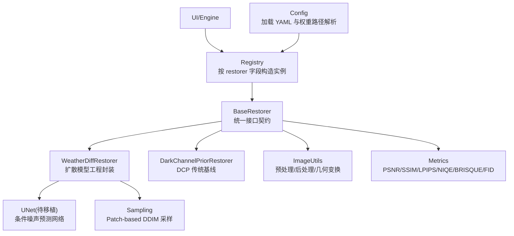
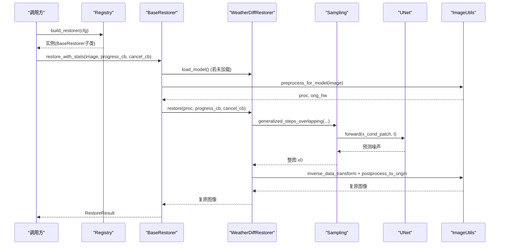
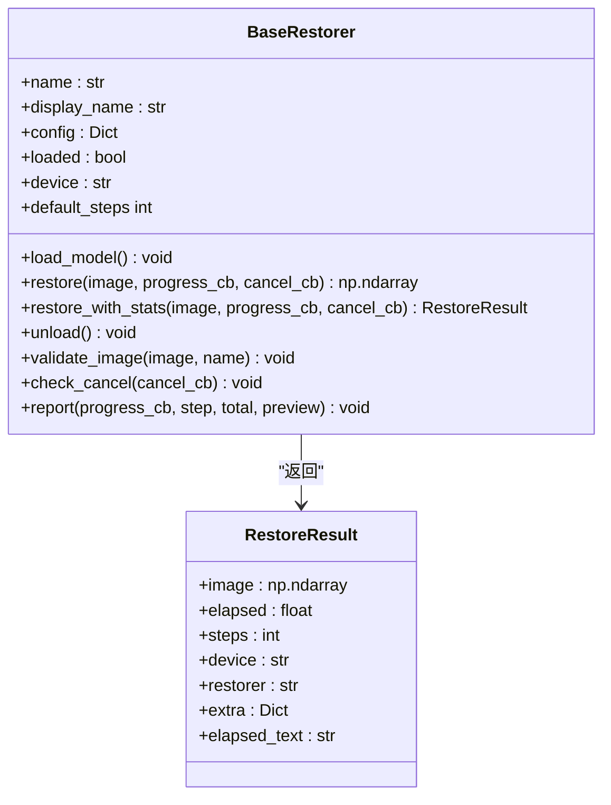
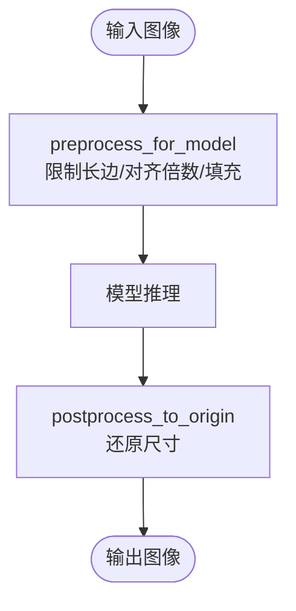
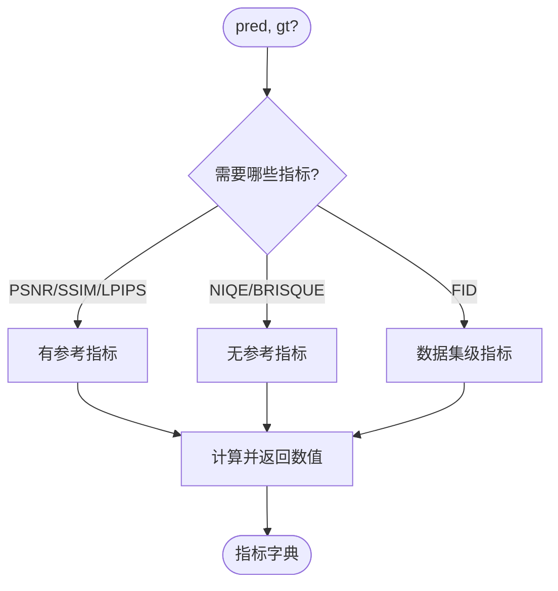
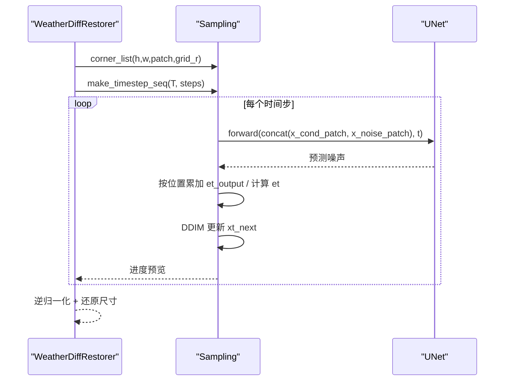
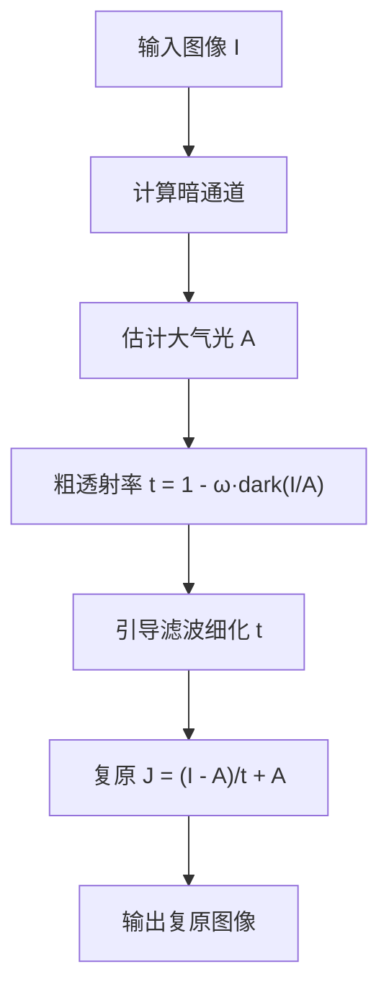
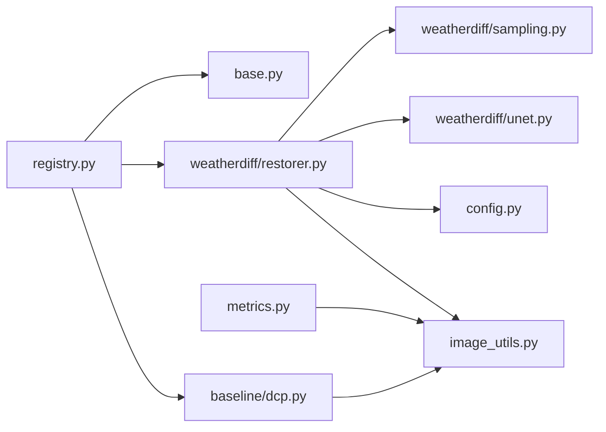

# 核心模块

<cite>
**本文引用的文件**
- [core/base.py](file://core/base.py)
- [core/image_utils.py](file://core/image_utils.py)
- [core/metrics.py](file://core/metrics.py)
- [core/weatherdiff/restorer.py](file://core/weatherdiff/restorer.py)
- [core/weatherdiff/unet.py](file://core/weatherdiff/unet.py)
- [core/weatherdiff/sampling.py](file://core/weatherdiff/sampling.py)
- [core/baseline/dcp.py](file://core/baseline/dcp.py)
- [core/config.py](file://core/config.py)
- [core/registry.py](file://core/registry.py)
- [configs/allweather.yaml](file://configs/allweather.yaml)
- [configs/dcp.yaml](file://configs/dcp.yaml)
</cite>

## 目录
1. [简介](#简介)
2. [项目结构](#项目结构)
3. [核心组件](#核心组件)
4. [架构总览](#架构总览)
5. [详细组件分析](#详细组件分析)
6. [依赖关系分析](#依赖关系分析)
7. [性能考虑](#性能考虑)
8. [故障排查指南](#故障排查指南)
9. [结论](#结论)
10. [附录：API 参考与使用示例](#附录api-参考与使用示例)

## 简介
本仓库围绕“基于扩散模型的恶劣天气图像复原”展开，提供统一的复原接口、图像处理工具、质量评估指标、WeatherDiffusion 扩散模型工程实现与传统基线（暗通道先验 DCP）。核心目标是让 UI、评测与推理层以统一契约调用不同复原器，并支持可扩展的注册机制。

## 项目结构
- core 目录为核心模块：抽象基类、图像工具、指标、WeatherDiffusion 实现、传统基线、配置加载与模型注册表。
- configs 目录存放各场景配置（如 allweather、dcp），通过配置驱动选择复原器与采样参数。
- engine 负责评测与推理流程编排（不在本文深入）。
- ui 提供可视化界面（不在本文深入）。

图表来源
- [core/registry.py:21-26](file://core/registry.py#L21-L26)
- [core/base.py:61-185](file://core/base.py#L61-L185)
- [core/weatherdiff/restorer.py:32-167](file://core/weatherdiff/restorer.py#L32-L167)
- [core/weatherdiff/unet.py:51-72](file://core/weatherdiff/unet.py#L51-L72)
- [core/weatherdiff/sampling.py:31-163](file://core/weatherdiff/sampling.py#L31-L163)
- [core/image_utils.py:145-167](file://core/image_utils.py#L145-L167)
- [core/metrics.py:134-193](file://core/metrics.py#L134-L193)
- [core/config.py:25-91](file://core/config.py#L25-L91)

章节来源
- [core/registry.py:1-85](file://core/registry.py#L1-L85)
- [core/config.py:1-98](file://core/config.py#L1-L98)

## 核心组件
- BaseRestorer 抽象基类：定义统一接口、进度回调、取消回调、结果封装与校验。
- WeatherDiffusion 复原器：工程化封装 UNet 与 Patch-based DDIM 采样，处理设备、权重、EMA、显存自适应等。
- 图像工具：统一 RGB uint8 约定，提供 IO、尺寸对齐、归一化、滤波、锐化等。
- 评估指标：有参考（PSNR、SSIM、LPIPS）与无参考（NIQE、BRISQUE）、数据集级（FID），延迟导入第三方库。
- 传统基线 DCP：纯 NumPy 实现的暗通道先验去雾，无需权重与 GPU。
- 配置与注册：YAML 配置驱动，动态构建复原器，支持 AWR_MOCK 降级。

章节来源
- [core/base.py:61-185](file://core/base.py#L61-L185)
- [core/weatherdiff/restorer.py:32-167](file://core/weatherdiff/restorer.py#L32-L167)
- [core/image_utils.py:1-253](file://core/image_utils.py#L1-L253)
- [core/metrics.py:1-315](file://core/metrics.py#L1-L315)
- [core/baseline/dcp.py:1-126](file://core/baseline/dcp.py#L1-L126)
- [core/config.py:25-91](file://core/config.py#L25-L91)
- [core/registry.py:21-85](file://core/registry.py#L21-L85)

## 架构总览
系统采用“配置驱动 + 注册表 + 统一接口”的架构：
- 配置文件指定 restorer 名称（如 weatherdiff、dcp），由 Registry 按需加载对应模块并构造实例。
- BaseRestorer 统一 restore_with_stats 入口，封装计时、输入输出校验、默认步数等。
- WeatherDiffRestorer 将 UNet 与采样解耦，restorer 只负责工程流；sampling 提供通用 patch 滑窗与 alpha/beta 计算；unet 为待移植的网络骨架。
- ImageUtils 保证全链路数据格式一致（RGB uint8），并提供预处理/后处理。
- Metrics 提供可插拔的质量评估，第三方库延迟导入，不可用时返回 None 或抛出 MetricUnavailable。

图表来源
- [core/registry.py:68-85](file://core/registry.py#L68-L85)
- [core/base.py:111-138](file://core/base.py#L111-L138)
- [core/weatherdiff/restorer.py:102-167](file://core/weatherdiff/restorer.py#L102-L167)
- [core/weatherdiff/sampling.py:115-163](file://core/weatherdiff/sampling.py#L115-L163)
- [core/weatherdiff/unet.py:51-72](file://core/weatherdiff/unet.py#L51-L72)
- [core/image_utils.py:145-167](file://core/image_utils.py#L145-L167)

## 详细组件分析

### BaseRestorer 抽象基类
- 设计目标：为所有复原器提供统一接口与通用能力，屏蔽底层差异。
- 关键约定：
  - 输入/输出均为 RGB uint8 (H, W, 3)，输出尺寸必须与输入一致。
  - 进度回调 progress_cb(step, total, preview) 与取消回调 cancel_cb() -> bool。
  - 异常类型：RestoreCancelled（用户取消）、WeightNotFoundError（权重缺失）。
- 主要方法：
  - load_model(): 加载权重并置 loaded=True。
  - restore(): 执行复原，支持进度与取消。
  - restore_with_stats(): 统一入口，计时、校验、构造 RestoreResult。
  - validate_image()/check_cancel()/report(): 工具方法，保证健壮性。
  - default_steps: 从配置读取采样步数作为进度条预估。
- 扩展机制：
  - 新增复原器只需继承 BaseRestorer，实现 load_model 与 restore，并通过 @register_restorer 注册。

图表来源
- [core/base.py:45-185](file://core/base.py#L45-L185)

章节来源
- [core/base.py:1-185](file://core/base.py#L1-L185)

### 图像处理工具函数
- 统一约定：内存中图像一律为 RGB uint8 (H, W, 3)。
- 读写与配对：
  - load_image/save_image：支持中文路径与自动创建目录。
  - list_images/match_pairs：批量列出图片并按文件名主干匹配 GT（兼容多种后缀）。
- 类型与尺寸：
  - to_uint8/to_float01：安全转换数据类型与值域。
  - resize/limit_long_side/resize_to_multiple/pad_to_min_size：控制长边、对齐倍数、最小尺寸填充。
- 预处理/后处理：
  - preprocess_for_model：限制长边、对齐到倍数、可选最小尺寸填充，返回处理后图像与原始尺寸。
  - postprocess_to_origin：还原到原始尺寸。
- 简单空域滤波：
  - box_filter：积分图均值滤波，支持单通道与多通道。
  - unsharp_mask：USM 锐化。
  - side_by_side：左右拼接用于对比展示。
  - make_demo_image：生成带雨纹的合成图，便于无数据集测试。

图表来源
- [core/image_utils.py:145-167](file://core/image_utils.py#L145-L167)

章节来源
- [core/image_utils.py:1-253](file://core/image_utils.py#L1-L253)

### 评估指标
- 有参考指标：
  - PSNR：纯 NumPy 实现，计算 MSE 后取对数。
  - SSIM：优先 scikit-image，缺失时回退到内置实现（7x7 窗口）。
  - LPIPS：延迟导入 lpips，需 torch，返回感知相似度分数。
- 无参考指标：
  - NIQE/BRISQUE：延迟导入 pyiqa，返回质量分数。
- 数据集级指标：
  - FID：延迟导入 pytorch-fid，比较生成分布与真实分布差异。
- 组合入口：
  - compute_metrics：单张图指标计算，支持指定指标集与静默模式。
  - summarize：多张图指标均值（忽略 None 与 inf）。
  - available_metrics：探测当前可用指标。
- 设计原则：第三方库延迟导入，不可用时抛 MetricUnavailable 或由上层捕获为 None。

图表来源
- [core/metrics.py:57-128](file://core/metrics.py#L57-L128)
- [core/metrics.py:134-193](file://core/metrics.py#L134-L193)

章节来源
- [core/metrics.py:1-315](file://core/metrics.py#L1-L315)

### WeatherDiffusion 扩散模型
- 工程封装（restorer.py）：
  - 设备选择：环境变量 AWR_DEVICE 强制，否则 CUDA/CPU。
  - 权重加载：支持 DataParallel 前缀剥离、EMA 权重覆盖。
  - 预处理：限制长边、对齐到 16 的倍数、小图反射填充。
  - 采样：调用 sampling.generalized_steps_overlapping，支持 patch_batch_size 自适应降额。
  - 后处理：逆归一化、转 RGB uint8、还原原始尺寸。
- 网络结构（unet.py）：
  - 当前为占位骨架，要求类名 DiffusionUNet，属性命名与官方一致（conv_in/down/mid/up/norm_out/conv_out/temb.dense）。
  - forward(x, t)：输入 concat[条件patch(3), 噪声patch(3)]，时间步 t，返回预测噪声 (B, 3, P, P)。
  - 输入通道 = in_channels * 2（因 conditional=True）。
- 采样算法（sampling.py）：
  - beta 调度：linear/quad/const/jsd。
  - 时间步序列：make_timestep_seq 压缩 1000 步为 sampling_timesteps 步。
  - 重叠网格：corner_list 生成滑窗坐标，确保全覆盖。
  - 数据变换：data_transform/inverse_data_transform 在 [-1,1] 与 [0,1] 间转换。
  - Alpha 计算：compute_alpha 得到 alpha_bar_t。
  - generalized_steps_overlapping：待实现的核心循环，按 patch 累加噪声估计，执行 DDIM 更新。

图表来源
- [core/weatherdiff/restorer.py:102-167](file://core/weatherdiff/restorer.py#L102-L167)
- [core/weatherdiff/sampling.py:54-110](file://core/weatherdiff/sampling.py#L54-L110)
- [core/weatherdiff/unet.py:51-72](file://core/weatherdiff/unet.py#L51-L72)

章节来源
- [core/weatherdiff/restorer.py:1-244](file://core/weatherdiff/restorer.py#L1-L244)
- [core/weatherdiff/unet.py:1-72](file://core/weatherdiff/unet.py#L1-L72)
- [core/weatherdiff/sampling.py:1-163](file://core/weatherdiff/sampling.py#L1-L163)

### 传统算法基线：暗通道先验（DCP）
- 原理：
  - 暗通道：对每个像素取三通道最小值，再做局部最小值滤波。
  - 大气光 A：取暗通道最亮 0.1% 像素中亮度最高者。
  - 粗透射率：1 - omega * dark_channel(I/A)。
  - 引导滤波细化：用灰度图作引导，细化透射率边缘。
  - 复原成像方程：J = (I - A)/t + A。
- 特点：纯 NumPy 实现，无需权重与 GPU，适合快速演示与对照。
- 步骤与进度：五个阶段（暗通道、大气光、粗透射率、引导滤波、复原），每步报告进度。

图表来源
- [core/baseline/dcp.py:37-85](file://core/baseline/dcp.py#L37-L85)
- [core/baseline/dcp.py:88-126](file://core/baseline/dcp.py#L88-L126)

章节来源
- [core/baseline/dcp.py:1-126](file://core/baseline/dcp.py#L1-L126)

## 依赖关系分析
- 模块耦合：
  - registry 依赖 base，并延迟加载 weatherdiff、dcp、mock。
  - weatherdiff.restorer 依赖 base、config、image_utils、sampling、unet。
  - metrics 依赖 image_utils，第三方库延迟导入。
  - baseline.dcp 依赖 base、image_utils。
- 外部依赖：
  - PyTorch：扩散模型与 LPIPS/FID。
  - scikit-image：SSIM（可选，有回退）。
  - pyiqa：NIQE/BRISQUE。
  - pytorch-fid：FID。
  - pyyaml：配置加载。
- 潜在循环：无直接循环依赖，通过延迟导入避免启动时加载重型库。

图表来源
- [core/registry.py:21-85](file://core/registry.py#L21-L85)
- [core/weatherdiff/restorer.py:24-30](file://core/weatherdiff/restorer.py#L24-L30)
- [core/metrics.py:24-24](file://core/metrics.py#L24-L24)
- [core/baseline/dcp.py:18-20](file://core/baseline/dcp.py#L18-L20)

章节来源
- [core/registry.py:1-85](file://core/registry.py#L1-L85)
- [core/weatherdiff/restorer.py:1-244](file://core/weatherdiff/restorer.py#L1-L244)
- [core/metrics.py:1-315](file://core/metrics.py#L1-L315)
- [core/baseline/dcp.py:1-126](file://core/baseline/dcp.py#L1-L126)

## 性能考虑
- 显存优化：
  - patch-based 采样：显存仅与 patch 大小与并行数量相关，与整图分辨率无关。
  - 自适应 batch：显存不足时自动减半 patch_batch_size 重试。
  - EMA 权重：提升质量，但需额外内存；可通过配置关闭。
- 预处理优化：
  - limit_long_side：控制最大长边，减少显存与耗时。
  - resize_to_multiple：对齐到 16 的倍数，适配 UNet 下采样。
- 指标计算：
  - 第三方库延迟导入，避免启动开销。
  - 无参考指标无需 GT，适合大规模批量评测。
- 设备选择：
  - 支持环境变量强制设备，默认 CUDA 优先。

[本节为通用指导，不直接分析具体文件]

## 故障排查指南
- 权重缺失：
  - 现象：加载时报 WeightNotFoundError。
  - 处理：执行下载脚本或手动放置权重至 weights/，检查 configs 中的 weights.path。
- 显存不足：
  - 现象：RuntimeError out of memory。
  - 处理：降低 patch_batch_size，或减小 max_side、size_multiple。
- 指标不可用：
  - 现象：LPIPS/NIQE/BRISQUE/FID 报错或返回 None。
  - 处理：安装对应依赖（lpips、pyiqa、pytorch-fid），或使用 available_metrics 检测。
- 配置错误：
  - 现象：找不到配置文件或权重路径解析失败。
  - 处理：检查 configs/*.yaml 与 weight_path 解析逻辑。

章节来源
- [core/base.py:41-43](file://core/base.py#L41-L43)
- [core/weatherdiff/restorer.py:50-56](file://core/weatherdiff/restorer.py#L50-L56)
- [core/weatherdiff/restorer.py:156-161](file://core/weatherdiff/restorer.py#L156-L161)
- [core/metrics.py:205-219](file://core/metrics.py#L205-L219)
- [core/config.py:25-57](file://core/config.py#L25-L57)

## 结论
本系统通过统一接口、注册表与配置驱动，实现了 WeatherDiffusion 扩散模型与传统基线的无缝集成。BaseRestorer 提供了健壮的工程封装，ImageUtils 保证了数据一致性，Metrics 提供了灵活的质量评估。后续工作包括完成 UNet 移植与 generalized_steps_overlapping 实现，以及扩展更多传统/深度学习基线。

[本节为总结，不直接分析具体文件]

## 附录：API 参考与使用示例

### BaseRestorer API
- 方法
  - load_model(): 加载权重。
  - restore(image, progress_cb=None, cancel_cb=None): 执行复原。
  - restore_with_stats(image, progress_cb=None, cancel_cb=None): 带计时的统一入口。
  - unload(): 释放资源。
  - validate_image(image, name="输入图像"): 校验输入格式。
  - check_cancel(cancel_cb): 检查取消。
  - report(progress_cb, step, total, preview=None): 上报进度。
- 属性
  - name, display_name, config, loaded, device, default_steps。
- 使用示例
  - 构造实例：通过 registry.build_restorer(cfg) 获取。
  - 调用：result = restorer.restore_with_stats(image, progress_cb=..., cancel_cb=...)。
  - 结果：result.image 为复原图像，result.elapsed 为耗时。

章节来源
- [core/base.py:61-185](file://core/base.py#L61-L185)
- [core/registry.py:68-85](file://core/registry.py#L68-L85)

### WeatherDiffusion 复原器 API
- 配置项（示例见 allweather.yaml）
  - data.image_size: patch 大小（如 64）。
  - data.max_side: 最大长边（如 1024）。
  - data.size_multiple: 对齐倍数（如 16）。
  - model.in_channels/out_ch/ch/ch_mult/...: UNet 结构参数。
  - diffusion.beta_schedule/beta_start/beta_end/num_diffusion_timesteps: 扩散参数。
  - sampling.timesteps/grid_r/eta/patch_batch_size/seed: 采样参数。
- 使用示例
  - 加载配置：cfg = config.get_config("allweather")。
  - 构建复原器：restorer = registry.build_restorer(cfg)。
  - 执行复原：result = restorer.restore_with_stats(image)。
  - 注意：需准备权重文件，并确保 UNet 已移植完成。

章节来源
- [configs/allweather.yaml:1-47](file://configs/allweather.yaml#L1-L47)
- [core/weatherdiff/restorer.py:32-167](file://core/weatherdiff/restorer.py#L32-L167)

### 图像工具 API
- 常用函数
  - load_image(path): 读取为 RGB uint8。
  - save_image(path, image): 保存图像。
  - preprocess_for_model(image, max_side=1024, size_multiple=16, min_size=0): 预处理。
  - postprocess_to_origin(image, orig_hw): 还原尺寸。
  - to_uint8/to_float01: 类型转换。
  - box_filter/unsharp_mask: 滤波与锐化。
- 使用示例
  - 预处理：proc, orig_hw = preprocess_for_model(image, max_side=1024, size_multiple=16)。
  - 后处理：out = postprocess_to_origin(model_output, orig_hw)。

章节来源
- [core/image_utils.py:22-167](file://core/image_utils.py#L22-L167)

### 评估指标 API
- 函数
  - psnr(pred, gt, data_range=255.0): 峰值信噪比。
  - ssim(pred, gt): 结构相似度。
  - lpips_score(pred, gt, net="alex"): 感知相似度。
  - niqe/brisque(image): 无参考指标。
  - fid(pred_dir, gt_dir, batch_size=16): 数据集级指标。
  - compute_metrics(pred, gt=None, metrics=None, silent=True): 组合入口。
  - summarize(rows): 多张图均值。
  - available_metrics(): 探测可用指标。
- 使用示例
  - 单张图：metrics = compute_metrics(pred, gt, metrics=["psnr","ssim","niqe","brisque"])。
  - 数据集：fid_val = fid(pred_dir, gt_dir)。

章节来源
- [core/metrics.py:57-193](file://core/metrics.py#L57-L193)

### 传统基线 DCP API
- 配置项（示例见 dcp.yaml）
  - dcp.patch_size: 暗通道窗口大小。
  - dcp.omega: 保留雾程度。
  - dcp.t0: 透射率下限。
  - dcp.guided_radius/guided_eps: 引导滤波参数。
- 使用示例
  - 加载配置：cfg = config.get_config("dcp")。
  - 构建复原器：restorer = registry.build_restorer(cfg)。
  - 执行复原：result = restorer.restore_with_stats(image)。

章节来源
- [configs/dcp.yaml:1-21](file://configs/dcp.yaml#L1-L21)
- [core/baseline/dcp.py:23-85](file://core/baseline/dcp.py#L23-L85)