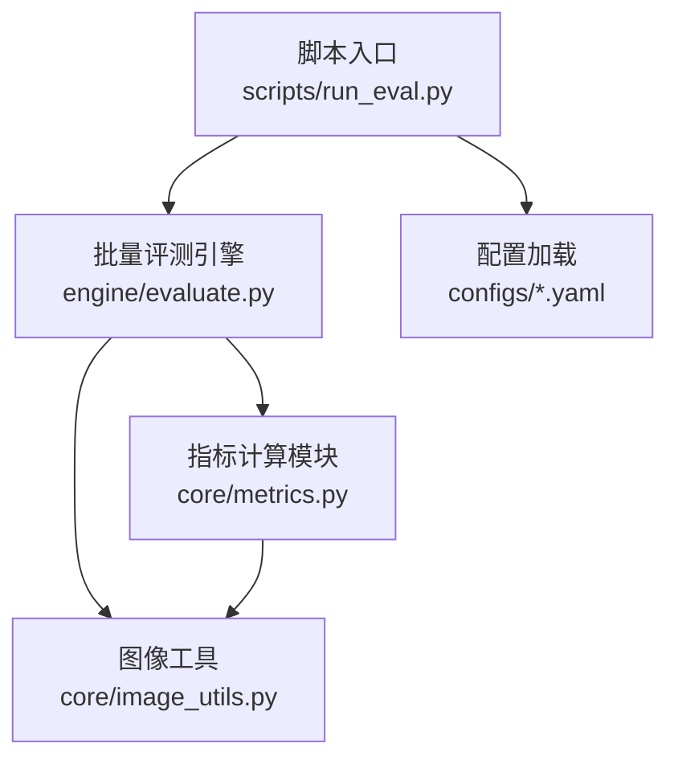
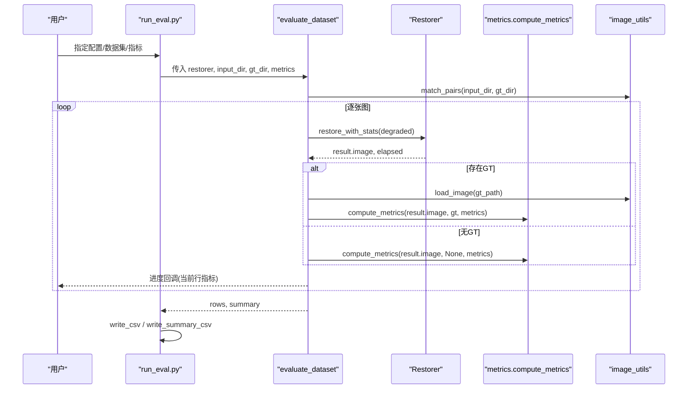
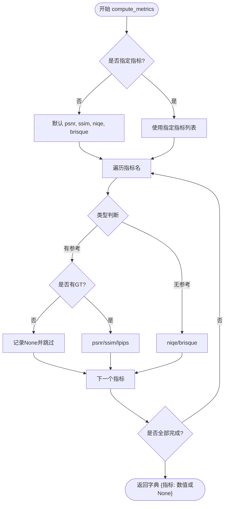
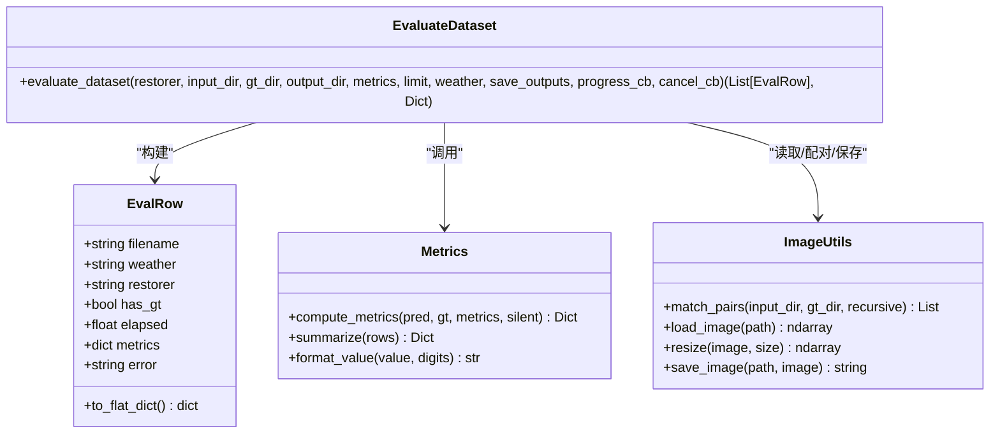
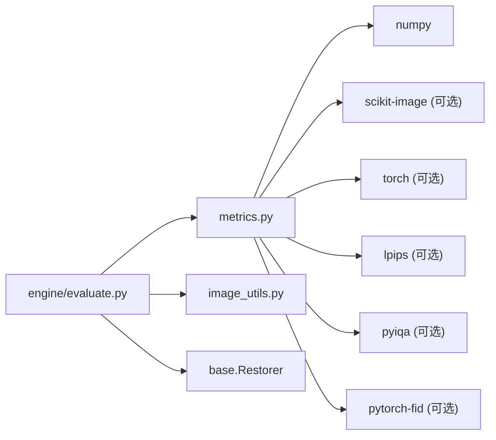

# 评估指标

<cite>
**本文引用的文件**
- [core/metrics.py](file://core/metrics.py)
- [engine/evaluate.py](file://engine/evaluate.py)
- [scripts/run_eval.py](file://scripts/run_eval.py)
- [core/image_utils.py](file://core/image_utils.py)
- [configs/allweather.yaml](file://configs/allweather.yaml)
- [configs/haze.yaml](file://configs/haze.yaml)
- [configs/snow.yaml](file://configs/snow.yaml)
</cite>

## 目录
1. [简介](#简介)
2. [项目结构](#项目结构)
3. [核心组件](#核心组件)
4. [架构总览](#架构总览)
5. [详细组件分析](#详细组件分析)
6. [依赖关系分析](#依赖关系分析)
7. [性能与优化](#性能与优化)
8. [故障排查指南](#故障排查指南)
9. [结论](#结论)
10. [附录：使用示例与结果解读](#附录使用示例与结果解读)

## 简介
本文件面向“图像质量评估”主题，基于仓库中的评估模块，系统梳理并解释主流有参考指标（PSNR、SSIM、LPIPS）、无参考指标（NIQE、BRISQUE）以及数据集级指标（FID）的原理、实现方式、适用场景与使用方法。文档同时说明批量评测流程、性能优化策略、常见错误处理与结果解读方法，帮助读者在不同任务中选择合适的指标组合。

## 项目结构
本项目将评估相关代码集中在 core/metrics.py，并通过 engine/evaluate.py 提供批量评测入口，scripts/run_eval.py 提供命令行一键评测。image_utils.py 提供统一的图像读写、尺寸对齐与预处理工具，configs/*.yaml 描述不同天气场景的模型配置。

图表来源
- [scripts/run_eval.py:32-91](file://scripts/run_eval.py#L32-L91)
- [engine/evaluate.py:51-116](file://engine/evaluate.py#L51-L116)
- [core/metrics.py:134-193](file://core/metrics.py#L134-L193)
- [core/image_utils.py:22-78](file://core/image_utils.py#L22-L78)

章节来源
- [scripts/run_eval.py:32-91](file://scripts/run_eval.py#L32-L91)
- [engine/evaluate.py:51-116](file://engine/evaluate.py#L51-L116)
- [core/metrics.py:134-193](file://core/metrics.py#L134-L193)
- [core/image_utils.py:22-78](file://core/image_utils.py#L22-L78)

## 核心组件
- 指标定义与可用性管理：统一声明有参考/无参考指标、方向性（越大越好/越小越好）、界面标签等。
- 单图指标计算：PSNR、SSIM、LPIPS、NIQE、BRISQUE、FID。
- 批量评测：遍历数据集、调用复原器、计算指标、汇总均值、导出CSV。
- 图像预处理：统一输入格式（RGB uint8）、尺寸对齐、配对匹配。

章节来源
- [core/metrics.py:26-47](file://core/metrics.py#L26-L47)
- [core/metrics.py:57-128](file://core/metrics.py#L57-L128)
- [engine/evaluate.py:24-116](file://engine/evaluate.py#L24-L116)
- [core/image_utils.py:22-78](file://core/image_utils.py#L22-L78)

## 架构总览
下图展示从命令行到指标计算的完整数据流与控制流。

图表来源
- [scripts/run_eval.py:32-91](file://scripts/run_eval.py#L32-L91)
- [engine/evaluate.py:51-116](file://engine/evaluate.py#L51-L116)
- [core/metrics.py:134-193](file://core/metrics.py#L134-L193)
- [core/image_utils.py:45-78](file://core/image_utils.py#L45-L78)

## 详细组件分析

### 指标模块（core/metrics.py）
- 设计原则
  - 输入统一为 RGB uint8 (H, W, 3)。
  - 第三方库延迟导入，缺失时抛出 MetricUnavailable，上层可选择跳过或提示。
  - 提供 HIGHER_IS_BETTER 与 METRIC_LABELS 用于排序与显示。
- 有参考指标
  - PSNR：纯 numpy 实现，计算 MSE 后转换为 dB；若 MSE 极小返回 inf。
  - SSIM：优先使用 scikit-image 的 structural_similarity；未安装时使用内置兜底实现（box_filter 均值窗口）。
  - LPIPS：基于预训练网络（默认 alex），将图像归一化到 [-1, 1] 并送入模型；支持 GPU 加速与模型缓存。
- 无参考指标
  - NIQE、BRISQUE：通过 pyiqa 创建度量对象，输入需为 float [0,1] 的通道前置张量；支持 GPU 与度量对象缓存。
- 数据集级指标
  - FID：比较预测与 GT 分布差异，需要 pytorch-fid；自动选择设备（cuda/cpu），可设置 batch_size 与特征维度。
- 组合入口
  - compute_metrics：按名称分发计算，支持仅无参考模式（gt=None）。
  - summarize：对多张图的指标求均值，忽略 None 与 inf。
  - available_metrics：探测各指标是否可用。

图表来源
- [core/metrics.py:134-177](file://core/metrics.py#L134-L177)

章节来源
- [core/metrics.py:26-47](file://core/metrics.py#L26-L47)
- [core/metrics.py:57-128](file://core/metrics.py#L57-L128)
- [core/metrics.py:134-193](file://core/metrics.py#L134-L193)
- [core/metrics.py:205-219](file://core/metrics.py#L205-L219)

### 批量评测引擎（engine/evaluate.py）
- EvalRow：封装单图评测结果（文件名、天气、恢复器、耗时、指标、错误信息），并提供摊平为 CSV 行的方法。
- evaluate_dataset：
  - 使用 image_utils.match_pairs 将退化图与 GT 按文件名主干配对，允许扩展名不同及多种后缀约定。
  - 对每张图调用 restorer.restore_with_stats 得到复原结果与耗时。
  - 若有 GT，则加载并对齐尺寸（必要时 resize），然后调用 compute_metrics。
  - 可选保存输出图像。
  - 收集每行结果并回调进度。
  - 最终汇总均值（summarize）与平均耗时。
- 导出：write_csv 与 write_summary_csv 分别输出逐行指标与对比汇总表（UTF-8-SIG 编码，避免中文乱码）。
- better_of：根据 HIGHER_IS_BETTER 的方向性比较两个值，用于高亮最优方法。

图表来源
- [engine/evaluate.py:24-116](file://engine/evaluate.py#L24-L116)
- [core/metrics.py:134-193](file://core/metrics.py#L134-L193)
- [core/image_utils.py:45-78](file://core/image_utils.py#L45-L78)

章节来源
- [engine/evaluate.py:24-116](file://engine/evaluate.py#L24-L116)
- [engine/evaluate.py:119-166](file://engine/evaluate.py#L119-L166)

### 命令行入口（scripts/run_eval.py）
- 参数解析：支持 --config（可逗号分隔多个配置）、--input、--gt、--out、--metrics、--limit、--steps、--grid-r、--fid。
- 流程：
  - 加载配置并构建恢复器。
  - 调用 evaluate_dataset 进行批量评测。
  - 导出逐图 CSV。
  - 可选计算 FID（需要 GT 目录且安装 pytorch-fid）。
  - 生成对比汇总表并打印表格。
- 进度与格式化：使用 format_value 与 METRIC_LABELS 统一显示。

章节来源
- [scripts/run_eval.py:32-91](file://scripts/run_eval.py#L32-L91)
- [scripts/run_eval.py:94-121](file://scripts/run_eval.py#L94-L121)

### 图像工具（core/image_utils.py）
- 统一输入格式：所有函数假设输入为 RGB uint8 (H, W, 3)。
- 配对匹配：match_pairs 支持多种命名约定（如 _clean/_gt/_target/_norain/_free 等），便于不同数据集的 GT 配对。
- 尺寸处理：resize、limit_long_side、resize_to_multiple、pad_to_min_size、preprocess_for_model、postprocess_to_origin。
- 基础滤波：box_filter（积分图均值滤波），用于 SSIM 兜底实现。

章节来源
- [core/image_utils.py:22-78](file://core/image_utils.py#L22-L78)
- [core/image_utils.py:84-167](file://core/image_utils.py#L84-L167)
- [core/image_utils.py:173-187](file://core/image_utils.py#L173-L187)

## 依赖关系分析
- 指标模块依赖：
  - numpy（数组操作）
  - skimage.metrics（SSIM，可选，有兜底实现）
  - torch、lpips（LPIPS，可选）
  - pyiqa（NIQE/BRISQUE，可选）
  - pytorch-fid（FID，可选）
- 批量评测依赖：
  - core.base.BaseRestorer（恢复器接口）
  - core.image_utils（图像IO与几何处理）
  - core.metrics（指标计算与汇总）
- 配置：
  - configs/*.yaml 描述模型与采样参数，影响恢复器行为与推理速度。

图表来源
- [core/metrics.py:57-128](file://core/metrics.py#L57-L128)
- [engine/evaluate.py:16-18](file://engine/evaluate.py#L16-L18)

章节来源
- [core/metrics.py:57-128](file://core/metrics.py#L57-L128)
- [engine/evaluate.py:16-18](file://engine/evaluate.py#L16-L18)

## 性能与优化
- 指标计算优化
  - 延迟导入：仅在需要时导入第三方库，降低启动开销。
  - 模型缓存：LPIPS 模型与 pyiqa 度量对象全局缓存，避免重复初始化。
  - 设备选择：自动检测 CUDA 并迁移到 GPU，减少 CPU 计算压力。
  - 尺寸对齐：在批量评测中对 GT 进行 resize 以匹配复原结果尺寸，避免额外插值开销。
- 批量评测优化
  - 进度回调：实时反馈进度与指标，便于监控长任务。
  - 失败隔离：单张图异常不影响整批运行，错误信息记录在 row.error。
  - 导出优化：CSV 使用 UTF-8-SIG 编码，避免中文乱码；汇总 CSV 自动生成列顺序。
- 配置优化
  - sampling.timesteps 与 grid_r 控制扩散步数与滑窗步长，影响速度与质量平衡。
  - max_side 限制最大边长，控制显存与耗时。
  - patch_batch_size 控制分块批大小，平衡吞吐与内存占用。

章节来源
- [core/metrics.py:241-276](file://core/metrics.py#L241-L276)
- [engine/evaluate.py:51-116](file://engine/evaluate.py#L51-L116)
- [configs/allweather.yaml:41-46](file://configs/allweather.yaml#L41-L46)
- [configs/haze.yaml:40-45](file://configs/haze.yaml#L40-L45)
- [configs/snow.yaml:40-45](file://configs/snow.yaml#L40-L45)

## 故障排查指南
- 指标不可用
  - 现象：compute_metrics 返回 None 或抛出 MetricUnavailable。
  - 原因：缺少第三方库（如 lpips、pyiqa、pytorch-fid）。
  - 解决：按提示安装对应包；或使用 available_metrics 检查当前可用状态。
- 尺寸不一致
  - 现象：计算 PSNR/SSIM/LPIPS 时报错。
  - 原因：预测与 GT 尺寸不一致。
  - 解决：确保在批量评测中已执行 resize 对齐；或在预处理阶段统一尺寸。
- FID 计算失败
  - 现象：命令行添加 --fid 后报错。
  - 原因：未安装 pytorch-fid 或 GT 图片数量不足导致统计不可靠。
  - 解决：安装依赖并确保每个目录至少 50 张图。
- 中文乱码
  - 现象：CSV 打开后中文显示异常。
  - 原因：编码问题。
  - 解决：使用 UTF-8-SIG 编码导出（已内置）。

章节来源
- [core/metrics.py:50-52](file://core/metrics.py#L50-L52)
- [core/metrics.py:205-219](file://core/metrics.py#L205-L219)
- [engine/evaluate.py:100-106](file://engine/evaluate.py#L100-L106)
- [scripts/run_eval.py:74-81](file://scripts/run_eval.py#L74-L81)

## 结论
该项目的评估体系以 core/metrics.py 为核心，提供有参考、无参考与数据集级指标的完整实现，并通过 engine/evaluate.py 与 scripts/run_eval.py 形成端到端的批量评测流程。其设计强调鲁棒性（延迟导入、异常隔离）、易用性（统一输入格式、自动设备选择）与可扩展性（指标注册与配置驱动）。在实际应用中，建议根据任务需求与资源条件选择合适的指标组合，并结合配置参数调优速度与质量的平衡。

## 附录：使用示例与结果解读

### 常用命令
- 快速验证流程（无需权重/GPU）：
  - python scripts/run_eval.py --config mock --input data/raindrop/test_a/data --gt data/raindrop/test_a/gt --limit 10
- 真实模型与三类天气：
  - python scripts/run_eval.py --config rain --input data/raindrop/test_a/data --gt data/raindrop/test_a/gt
- 一次跑多个方法做对照：
  - python scripts/run_eval.py --config rain,dcp --input data/rainfog/input --gt data/rainfog/gt --metrics psnr,ssim,niqe
- 额外计算 FID：
  - python scripts/run_eval.py --config rain --input ... --gt ... --fid

章节来源
- [scripts/run_eval.py:1-16](file://scripts/run_eval.py#L1-L16)
- [scripts/run_eval.py:32-91](file://scripts/run_eval.py#L32-L91)

### 指标选择建议
- 有参考场景（有 GT）
  - PSNR：像素级误差敏感，适合评估重建保真度；对噪声与细节不敏感。
  - SSIM：感知结构相似性，更贴近人眼对结构保持的评价；适合纹理与边缘保留评估。
  - LPIPS：学习感知相似度，基于深度特征，更能反映感知质量；适合主观一致性评估。
- 无参考场景（无 GT）
  - NIQE：自然图像统计特性度量，适合评估去噪/复原后的自然度。
  - BRISQUE：盲/无参考图像质量评估，适合整体失真程度评估。
- 数据集级
  - FID：衡量生成/复原结果与真实分布的差异；适合大规模样本的质量与多样性评估。

### 结果解读指南
- 方向性
  - 越大越好：PSNR、SSIM。
  - 越小越好：LPIPS、NIQE、BRISQUE、FID。
- 数值范围与含义
  - PSNR：dB，越高表示像素误差越小；接近无穷大表示几乎完全一致。
  - SSIM：[0,1]，越接近 1 表示结构越相似。
  - LPIPS：[0,1]，越低表示感知越相似。
  - NIQE/BRISQUE：越低表示质量越好。
  - FID：越低表示分布越接近真实数据。
- 汇总与对比
  - 使用 write_summary_csv 生成“方法 x 指标”对比表，便于横向比较。
  - 使用 better_of 结合 HIGHER_IS_BETTER 自动高亮最优方法。

章节来源
- [core/metrics.py:31-47](file://core/metrics.py#L31-L47)
- [engine/evaluate.py:135-166](file://engine/evaluate.py#L135-L166)
- [scripts/run_eval.py:103-121](file://scripts/run_eval.py#L103-L121)