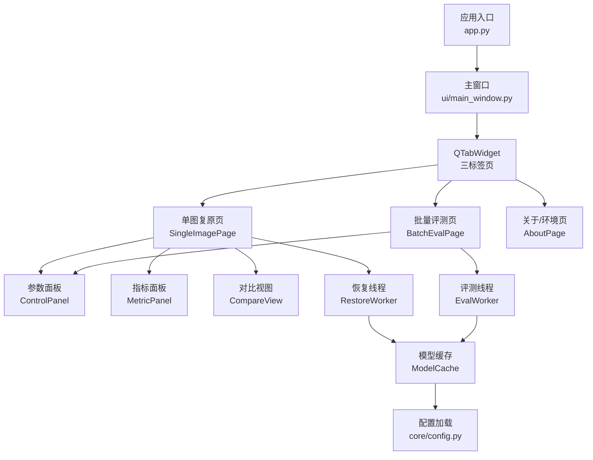
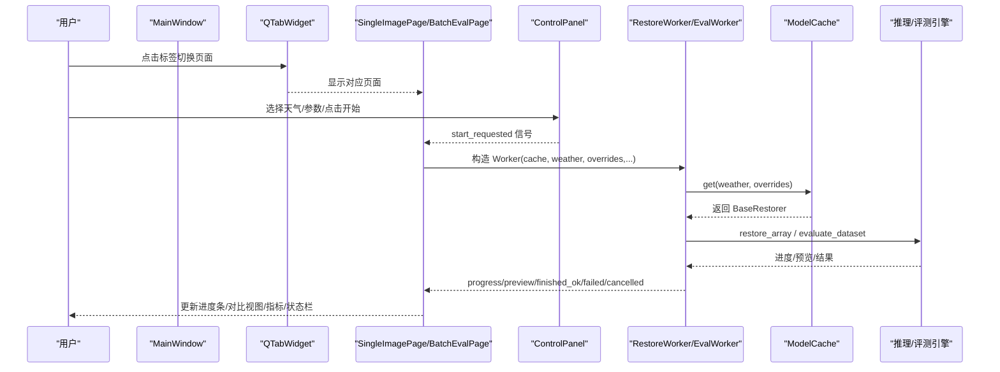
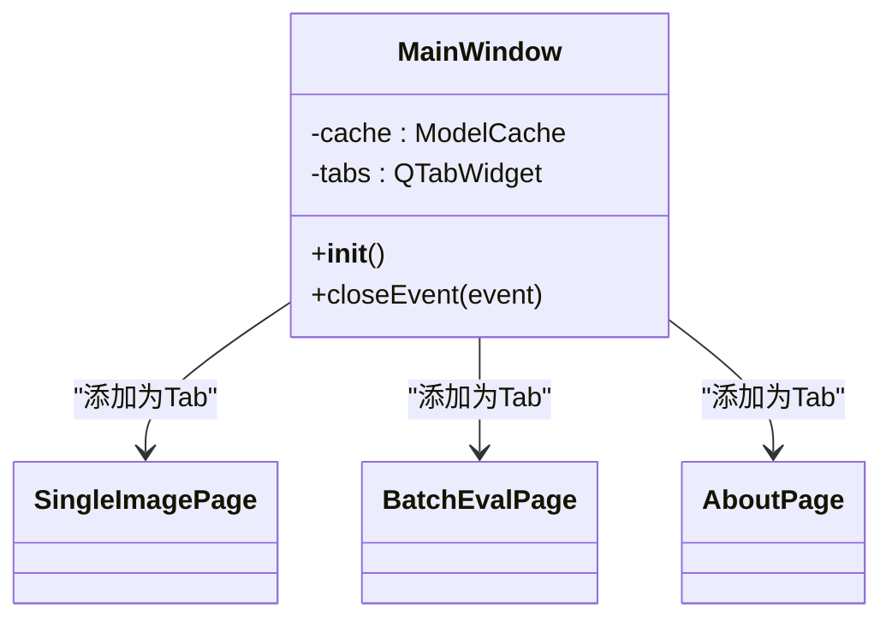
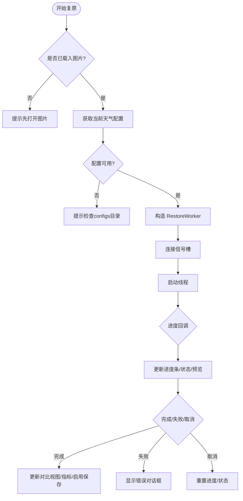
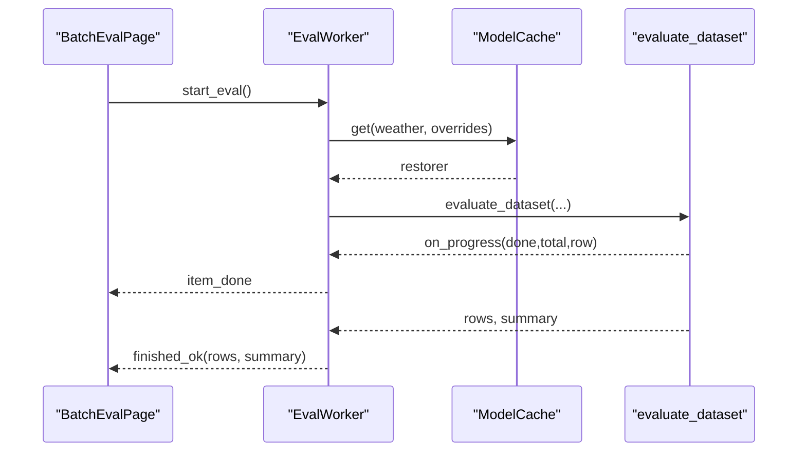
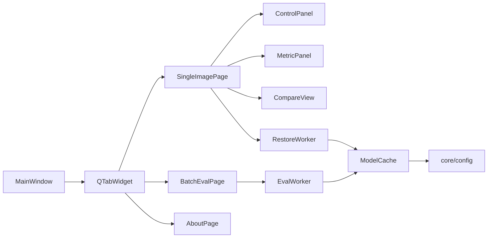

# 主窗口架构设计

<cite>
**本文引用的文件**
- [app.py](file://app.py)
- [ui/main_window.py](file://ui/main_window.py)
- [ui/panels.py](file://ui/panels.py)
- [ui/compare_view.py](file://ui/compare_view.py)
- [ui/qt_utils.py](file://ui/qt_utils.py)
- [ui/worker.py](file://ui/worker.py)
- [engine/inference.py](file://engine/inference.py)
- [core/config.py](file://core/config.py)
</cite>

## 目录
1. [简介](#简介)
2. [项目结构](#项目结构)
3. [核心组件](#核心组件)
4. [架构总览](#架构总览)
5. [详细组件分析](#详细组件分析)
6. [依赖关系分析](#依赖关系分析)
7. [性能考虑](#性能考虑)
8. [故障排查指南](#故障排查指南)
9. [结论](#结论)
10. [附录](#附录)

## 简介
本文件围绕 MainWindow 及其三标签页布局，系统性阐述主窗口的整体架构与设计理念。重点包括：
- QTabWidget 的三标签页组织与页面切换机制
- 资源管理策略（模型缓存、显存控制）
- 组件通信机制（信号槽、事件传递、状态同步）
- ModelCache 集成（生命周期与内存优化）
- 窗口生命周期管理（初始化、关闭清理）
- UI 响应式设计（尺寸自适应、控件自适应、交互体验）
- 多线程安全、异常处理与调试支持

## 项目结构
UI 层采用“主窗口 + 多页面 + 通用面板 + 后台线程”的分层组织：
- app.py：应用启动入口，创建 QApplication 并展示 MainWindow
- ui/main_window.py：MainWindow 及三个 Tab 页面（单图复原、批量评测、关于/环境）
- ui/panels.py：ControlPanel（参数面板）、MetricPanel（指标面板）
- ui/compare_view.py：双图对比控件 CompareView
- ui/worker.py：RestoreWorker/EvalWorker 后台线程，负责推理与评测
- engine/inference.py：ModelCache 权重缓存与推理编排
- core/config.py：配置加载、路径解析、输出目录等

图表来源
- [app.py:19-32](file://app.py#L19-L32)
- [ui/main_window.py:499-515](file://ui/main_window.py#L499-L515)
- [ui/worker.py:32-89](file://ui/worker.py#L32-L89)
- [engine/inference.py:22-67](file://engine/inference.py#L22-L67)
- [core/config.py:25-79](file://core/config.py#L25-L79)

章节来源
- [app.py:19-32](file://app.py#L19-L32)
- [ui/main_window.py:499-515](file://ui/main_window.py#L499-L515)

## 核心组件
- MainWindow：应用主窗口，持有 ModelCache，构建 QTabWidget 并注册三个页面；在 closeEvent 中释放缓存资源
- SingleImagePage：单图复原页面，封装打开图片、拖拽、参数设置、进度显示、结果保存、指标计算
- BatchEvalPage：批量评测页面，封装目录选择、指标勾选、表格展示、CSV 导出
- AboutPage：环境自检页，汇总依赖、指标可用性、GPU 信息、权重目录状态
- ControlPanel：参数面板，提供天气类型、质量预设、采样步数、滑窗步长，以及开始/取消按钮
- MetricPanel：指标面板，展示 PSNR/SSIM/NIQE/BRISQUE 与耗时、设备信息
- CompareView：双图对比控件，支持擦除对比与并排模式切换
- RestoreWorker/EvalWorker：后台线程，执行推理与评测，通过信号将进度、预览、结果回传到 UI
- ModelCache：按配置名缓存已加载的复原器实例，避免重复加载，支持 release_others/clear 控制显存

章节来源
- [ui/main_window.py:61-515](file://ui/main_window.py#L61-L515)
- [ui/panels.py:42-203](file://ui/panels.py#L42-L203)
- [ui/compare_view.py:30-191](file://ui/compare_view.py#L30-L191)
- [ui/worker.py:32-162](file://ui/worker.py#L32-L162)
- [engine/inference.py:22-67](file://engine/inference.py#L22-L67)

## 架构总览
MainWindow 作为容器，使用 QTabWidget 组织三个功能页。每个页面独立维护自身状态与 UI 控件，并通过信号槽与后台线程通信。ModelCache 贯穿所有推理流程，确保同一配置的模型只加载一次，减少 IO 与显存占用。

图表来源
- [ui/main_window.py:123-214](file://ui/main_window.py#L123-L214)
- [ui/worker.py:63-89](file://ui/worker.py#L63-L89)
- [engine/inference.py:33-52](file://engine/inference.py#L33-L52)

## 详细组件分析

### MainWindow 与三标签页布局
- 使用 QTabWidget 添加三个页面：单图复原、批量评测、关于/环境
- 页面之间通过共享的 ModelCache 实例进行资源复用
- 窗口尺寸初始化为 1280x800，状态栏显示就绪信息
- 关闭事件处理：调用 cache.clear() 释放所有已加载模型，再调用父类默认行为

图表来源
- [ui/main_window.py:499-515](file://ui/main_window.py#L499-L515)

章节来源
- [ui/main_window.py:499-515](file://ui/main_window.py#L499-L515)

### 单图复原页（SingleImagePage）
- 布局：左侧为对比视图 CompareView、进度条、状态提示；右侧为参数面板 ControlPanel 与指标面板 MetricPanel；使用 QSplitter 可调节左右宽度
- 输入：支持文件对话框打开与拖拽图片；可选 GT 用于计算 PSNR/SSIM
- 运行：点击开始后构造 RestoreWorker，连接 loading/progress/preview/finished_ok/failed/cancelled 信号
- 结果：完成后更新对比视图、指标面板、启用保存按钮；失败或取消时重置状态

图表来源
- [ui/main_window.py:188-250](file://ui/main_window.py#L188-L250)
- [ui/worker.py:63-89](file://ui/worker.py#L63-L89)

章节来源
- [ui/main_window.py:61-250](file://ui/main_window.py#L61-L250)

### 批量评测页（BatchEvalPage）
- 布局：左侧为目录选择、指标勾选、限制张数、结果表格、进度条、摘要、导出按钮；右侧为参数面板
- 运行：校验输入目录后构造 EvalWorker，连接 item_done/finished_ok/failed/cancelled 信号
- 结果：逐条更新表格与进度；完成后显示均值摘要；支持导出 CSV

图表来源
- [ui/main_window.py:356-438](file://ui/main_window.py#L356-L438)
- [ui/worker.py:128-158](file://ui/worker.py#L128-L158)

章节来源
- [ui/main_window.py:253-438](file://ui/main_window.py#L253-L438)

### 关于/环境页（AboutPage）
- 收集并展示：项目根目录、假模型开关、依赖模块版本、指标可用性、GPU 信息、权重目录内容
- 用途：快速定位环境问题（如缺少依赖、权重未下载）

章节来源
- [ui/main_window.py:441-496](file://ui/main_window.py#L441-L496)

### 参数面板（ControlPanel）
- 动态加载 configs/*.yaml 到下拉框，支持 display_name 显示
- 质量预设：快速/标准/高质量，分别设置采样步数与 grid_r
- 运行时覆盖：overrides 直接传入 ModelCache.get，实现不重新加载权重的参数调整
- 运行态锁定：开始复原/评测时禁用参数控件，避免中途修改导致状态混乱

章节来源
- [ui/panels.py:42-162](file://ui/panels.py#L42-L162)

### 指标面板（MetricPanel）
- 展示 PSNR/SSIM/NIQE/BRISQUE 与耗时、设备信息
- 根据是否有 GT 决定是否计算 PSNR/SSIM
- 提供 clear/update_metrics/update_runtime 接口供页面调用

章节来源
- [ui/panels.py:164-203](file://ui/panels.py#L164-L203)

### 对比视图（CompareView）
- 支持擦除对比（拖动中缝）与并排模式（双击切换）
- 等比缩放居中显示，自动适配窗口尺寸变化
- 内部使用 QPixmap/QImage 转换工具进行高效绘制

章节来源
- [ui/compare_view.py:30-191](file://ui/compare_view.py#L30-L191)
- [ui/qt_utils.py:9-31](file://ui/qt_utils.py#L9-L31)

### 后台线程（RestoreWorker/EvalWorker）
- 职责：在子线程执行推理/评测，避免阻塞 UI
- 信号约定：loading/progress/preview/finished_ok/failed/cancelled
- 取消机制：主线程调用 cancel()，线程内检测 _cancel 标志退出
- 异常处理：捕获特定异常（如权重缺失）与通用异常，打印堆栈并通知 UI

章节来源
- [ui/worker.py:32-162](file://ui/worker.py#L32-L162)

### ModelCache 集成
- 缓存键：基于 weather 配置名，忽略不影响权重的运行时参数（如 timesteps/grid_r）
- 首次获取：加载配置、构建复原器、加载模型并缓存
- 后续获取：若仅运行时参数变化，直接 deep_update 配置，无需重新加载权重
- 资源释放：release_others 保留指定天气的其他缓存卸载；clear 全部卸载

章节来源
- [engine/inference.py:22-67](file://engine/inference.py#L22-L67)

## 依赖关系分析
- 主窗口依赖：QTabWidget、各页面、ModelCache
- 页面依赖：ControlPanel、MetricPanel、CompareView、Worker
- Worker 依赖：ModelCache、推理/评测引擎
- 配置依赖：core/config 提供路径解析与配置列表

图表来源
- [ui/main_window.py:499-515](file://ui/main_window.py#L499-L515)
- [ui/worker.py:32-162](file://ui/worker.py#L32-L162)
- [engine/inference.py:22-67](file://engine/inference.py#L22-L67)
- [core/config.py:25-79](file://core/config.py#L25-L79)

章节来源
- [ui/main_window.py:499-515](file://ui/main_window.py#L499-L515)
- [ui/worker.py:32-162](file://ui/worker.py#L32-L162)
- [engine/inference.py:22-67](file://engine/inference.py#L22-L67)
- [core/config.py:25-79](file://core/config.py#L25-L79)

## 性能考虑
- 模型缓存：ModelCache 避免重复加载权重，显著降低 IO 与显存压力
- 运行时参数覆盖：timesteps/grid_r 等参数通过 deep_update 生效，无需重建模型
- 后台线程：推理与评测在子线程执行，保持 UI 流畅
- 图像渲染：CompareView 使用 QPixmap 等比缩放与裁剪，减少重绘开销
- 指标计算：NIQE/BRISQUE 较慢，建议在单独线程或按需计算（代码中有 TODO 标注）

[本节为通用性能建议，不直接分析具体文件]

## 故障排查指南
- 权重缺失：Worker 捕获 WeightNotFoundError 并提示；可通过“关于/环境”页检查 weights 目录
- 依赖缺失：AboutPage 列出依赖模块版本与指标可用性；缺少 PyQt5/pytorch 等会报错
- 配置问题：ControlPanel 动态加载 configs/*.yaml，读取失败时显示描述或错误信息
- 取消与异常：Worker 统一捕获异常并通知 UI；取消时重置进度与状态

章节来源
- [ui/worker.py:80-88](file://ui/worker.py#L80-L88)
- [ui/main_window.py:441-496](file://ui/main_window.py#L441-L496)
- [ui/panels.py:114-141](file://ui/panels.py#L114-L141)

## 结论
MainWindow 采用清晰的三标签页布局与模块化设计，结合 ModelCache 与后台线程，实现了高效的模型复用与流畅的用户体验。通过信号槽机制解耦 UI 与业务逻辑，便于扩展与维护。未来可在批处理页加入可视化图表、增强交互（滚轮缩放、平移、放大镜）以提升演示效果。

[本节为总结性内容，不直接分析具体文件]

## 附录
- 环境变量：AWR_MOCK（假模型开关）、AWR_DEVICE（强制 CPU/GPU）
- 启动方式：python app.py；Windows 下 set AWR_MOCK=1 && python app.py

章节来源
- [app.py:1-37](file://app.py#L1-L37)