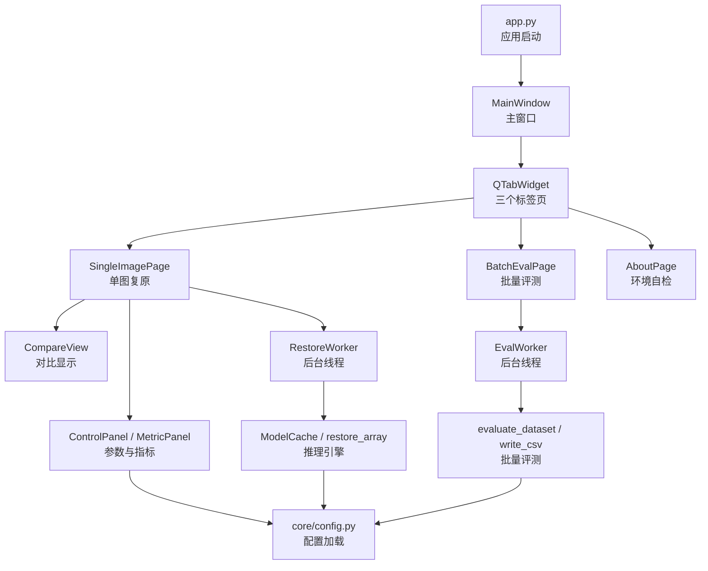
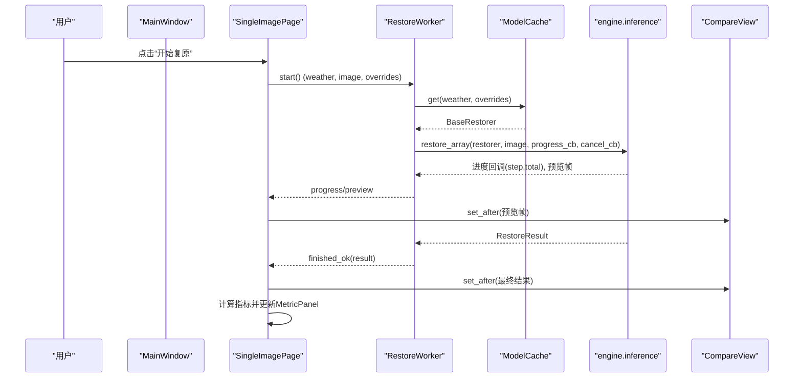
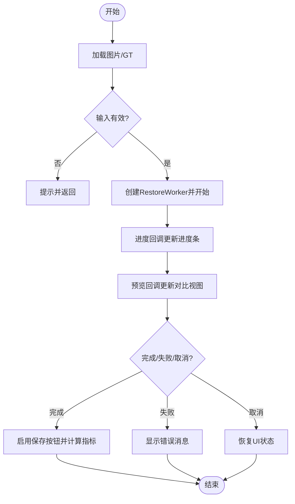
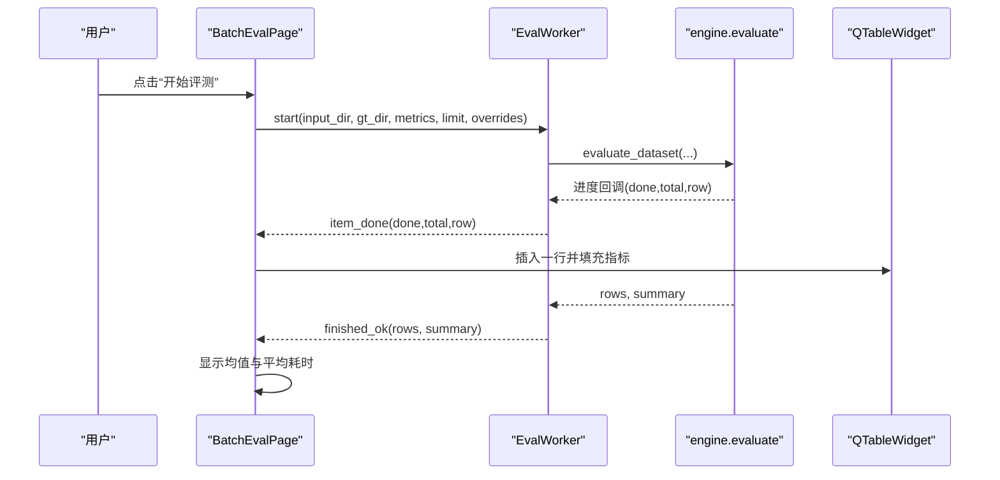
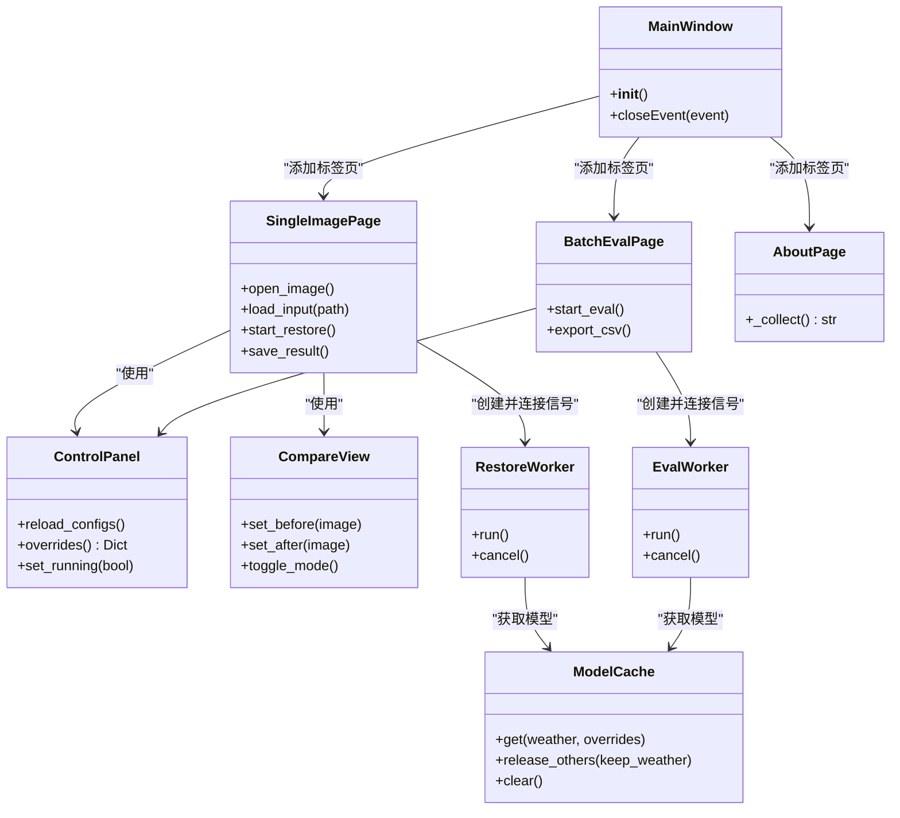

# 主窗口设计

<cite>
**本文引用的文件**
- [app.py](file://app.py)
- [ui/main_window.py](file://ui/main_window.py)
- [ui/panels.py](file://ui/panels.py)
- [ui/compare_view.py](file://ui/compare_view.py)
- [ui/worker.py](file://ui/worker.py)
- [core/config.py](file://core/config.py)
- [engine/inference.py](file://engine/inference.py)
- [engine/evaluate.py](file://engine/evaluate.py)
</cite>

## 目录
1. [简介](#简介)
2. [项目结构](#项目结构)
3. [核心组件](#核心组件)
4. [架构总览](#架构总览)
5. [详细组件分析](#详细组件分析)
6. [依赖关系分析](#依赖关系分析)
7. [性能考虑](#性能考虑)
8. [故障排查指南](#故障排查指南)
9. [结论](#结论)
10. [附录](#附录)

## 简介
本文件面向“恶劣天气图像复原系统”的图形界面层，聚焦主窗口 MainWindow 及其三个标签页：单图复原（SingleImagePage）、批量评测（BatchEvalPage）、关于/环境（AboutPage）。文档从架构、数据流、交互流程与错误处理等维度，系统性说明各页面职责、组件通信机制与生命周期管理，帮助读者快速理解并扩展界面功能。

## 项目结构
界面层位于 ui 目录，入口为 app.py；主窗口与三个标签页在 main_window.py 中实现；参数面板与指标面板在 panels.py；对比视图在 compare_view.py；后台线程在 worker.py。配置加载在 core/config.py；推理编排与缓存、批量评测逻辑分别在 engine/inference.py 与 engine/evaluate.py。

图表来源
- [app.py:19-32](file://app.py#L19-L32)
- [ui/main_window.py:499-515](file://ui/main_window.py#L499-L515)
- [ui/panels.py:42-162](file://ui/panels.py#L42-L162)
- [ui/compare_view.py:30-73](file://ui/compare_view.py#L30-L73)
- [ui/worker.py:32-89](file://ui/worker.py#L32-L89)
- [engine/inference.py:22-68](file://engine/inference.py#L22-L68)
- [engine/evaluate.py:51-116](file://engine/evaluate.py#L51-L116)
- [core/config.py:25-74](file://core/config.py#L25-L74)

章节来源
- [app.py:19-32](file://app.py#L19-L32)
- [ui/main_window.py:499-515](file://ui/main_window.py#L499-L515)

## 核心组件
- MainWindow：创建 QTabWidget，注册三个标签页，持有 ModelCache 实例并在关闭时释放资源。
- SingleImagePage：单图复原页面，负责图片加载、拖拽、参数配置、进度显示、结果保存与指标展示。
- BatchEvalPage：批量评测页面，负责目录选择、指标勾选、表格展示、CSV 导出与汇总统计。
- AboutPage：环境自检页面，输出依赖状态、指标可用性、GPU 信息与权重目录情况。
- ControlPanel：统一参数面板，封装天气类型、质量预设、采样步数、grid_r 与开始/取消按钮。
- MetricPanel：单图指标展示面板，显示 PSNR/SSIM/NIQE/BRISQUE 及耗时、设备信息。
- CompareView：双图对比控件，支持擦除对比与并排模式切换。
- RestoreWorker/EvalWorker：后台线程，封装推理与评测任务，通过信号与 UI 解耦。
- ModelCache：模型缓存，按配置名缓存已加载的复原器，避免重复加载与显存浪费。
- evaluate_dataset/write_csv：批量评测核心逻辑与 CSV 导出。

章节来源
- [ui/main_window.py:61-515](file://ui/main_window.py#L61-L515)
- [ui/panels.py:42-203](file://ui/panels.py#L42-L203)
- [ui/compare_view.py:30-191](file://ui/compare_view.py#L30-L191)
- [ui/worker.py:32-162](file://ui/worker.py#L32-L162)
- [engine/inference.py:22-68](file://engine/inference.py#L22-L68)
- [engine/evaluate.py:24-132](file://engine/evaluate.py#L24-L132)

## 架构总览
界面采用“UI + 工作线程 + 引擎”的分层架构：
- UI 层：Qt 控件负责布局与交互，不直接执行耗时操作。
- 线程层：RestoreWorker/EvalWorker 在独立线程执行推理与评测，通过 pyqtSignal 将进度、预览、完成、失败、取消事件回传到 UI。
- 引擎层：ModelCache 提供复用模型；restore_array/evaluate_dataset 提供一致的单图与批量接口；write_csv 提供导出能力。
- 配置层：core/config.py 扫描 configs/*.yaml，动态生成天气下拉项，解析权重路径，便于扩展新天气类型。

图表来源
- [ui/main_window.py:188-240](file://ui/main_window.py#L188-L240)
- [ui/worker.py:32-89](file://ui/worker.py#L32-L89)
- [engine/inference.py:70-78](file://engine/inference.py#L70-L78)
- [ui/compare_view.py:50-73](file://ui/compare_view.py#L50-L73)

## 详细组件分析

### 主窗口 MainWindow
- 职责：初始化应用标题、尺寸；创建 ModelCache；构建 QTabWidget 并添加三个标签页；设置状态栏；在 closeEvent 中释放模型缓存。
- 生命周期：应用启动后创建 MainWindow 并 show；退出时清理缓存，避免显存泄漏。
- 关键行为：
  - 使用 ModelCache 共享模型实例，减少重复加载。
  - 通过 QTabWidget 组织三个页面，保持界面简洁。

章节来源
- [ui/main_window.py:499-515](file://ui/main_window.py#L499-L515)
- [engine/inference.py:22-68](file://engine/inference.py#L22-L68)

### 单图复原页面 SingleImagePage
- 布局：左侧为对比视图 CompareView、进度条与状态提示；右侧为参数面板 ControlPanel 与指标面板 MetricPanel；顶部工具栏包含打开图片、选择 GT、保存结果、切换对比模式按钮。
- 图片加载：
  - 支持拖拽图片到页面，自动识别图片后缀并加载。
  - 支持通过文件对话框选择退化图与可选 GT。
  - 载入后清空指标、重置保存按钮状态，更新状态栏显示宽高。
- 参数配置：
  - 通过 ControlPanel 获取当前天气类型与覆盖参数（采样步数、grid_r）。
  - 质量预设可一键设置 timesteps 与 grid_r。
- 运行流程：
  - 校验输入与配置有效性，启用运行态禁用参数编辑。
  - 创建 RestoreWorker 并连接 loading/progress/preview/finished/failed/cancelled 信号。
  - 进度回调更新进度条与状态文本；预览回调实时更新对比视图。
- 结果保存：
  - 完成后启用保存按钮，默认输出文件名基于原图名称，支持 PNG/JPEG 格式。
- 指标计算：
  - 若提供了 GT，则计算 PSNR/SSIM；否则仅显示耗时与设备信息。
- 错误处理：
  - 读取失败或复原失败弹出警告/错误消息框；取消时恢复 UI 状态。

图表来源
- [ui/main_window.py:134-250](file://ui/main_window.py#L134-L250)
- [ui/worker.py:32-89](file://ui/worker.py#L32-L89)

章节来源
- [ui/main_window.py:61-250](file://ui/main_window.py#L61-L250)
- [ui/panels.py:42-162](file://ui/panels.py#L42-L162)
- [ui/compare_view.py:30-191](file://ui/compare_view.py#L30-L191)
- [ui/worker.py:32-89](file://ui/worker.py#L32-L89)

### 批量评测页面 BatchEvalPage
- 布局：左侧为目录选择（退化图目录、GT 目录可选、输出目录）、指标勾选（PSNR/SSIM/NIQE/BRISQUE）、限制张数、表格展示、进度条、汇总标签、状态栏与导出按钮；右侧为参数面板。
- 目录选择：通过浏览按钮选择目录，支持空值与无效目录校验。
- 指标配置：默认勾选 PSNR/SSIM，用户可自由勾选其他指标。
- 运行流程：
  - 校验输入目录与天气配置，清空表格并启用运行态。
  - 创建 EvalWorker，连接 item_done/finished/failed/cancelled 信号。
  - 每完成一张图，插入一行并填充文件名、天气、方法、耗时与各指标值；错误行以 tooltip 形式显示错误信息。
- 结果导出：
  - 导出 CSV，使用 utf-8-sig 编码确保 Excel 中文不乱码。
- 汇总统计：
  - 完成后显示各指标均值与平均耗时。
- 错误处理：
  - 单张失败不影响整批；整体失败弹出错误消息；取消时恢复 UI 状态。

图表来源
- [ui/main_window.py:253-438](file://ui/main_window.py#L253-L438)
- [ui/worker.py:91-162](file://ui/worker.py#L91-L162)
- [engine/evaluate.py:51-132](file://engine/evaluate.py#L51-L132)

章节来源
- [ui/main_window.py:253-438](file://ui/main_window.py#L253-L438)
- [ui/worker.py:91-162](file://ui/worker.py#L91-L162)
- [engine/evaluate.py:51-132](file://engine/evaluate.py#L51-L132)

### 环境检查页面 AboutPage
- 作用：集中展示环境诊断信息，帮助用户排查“指标算不出来/权重找不到”等问题。
- 内容：
  - 项目根目录、假模型开关环境变量。
  - 依赖模块安装状态与版本（numpy、PIL、yaml、PyQt5、torch、skimage、pyiqa、lpips、pytorch_fid）。
  - 指标可用性（available_metrics）。
  - GPU 状态（是否可用、设备名称）。
  - 权重目录内容与缺失提示。
- 使用场景：首次部署、环境迁移、问题定位。

章节来源
- [ui/main_window.py:441-496](file://ui/main_window.py#L441-L496)
- [core/config.py:14-23](file://core/config.py#L14-L23)

### 参数面板 ControlPanel
- 功能：提供天气类型下拉框（动态扫描 configs/*.yaml）、质量预设（快速/标准/高质量）、采样步数滑块、滑窗步长 spinbox、开始/取消按钮。
- 信号：start_requested、cancel_requested，供主窗口监听。
- 运行时控制：set_running 禁用参数编辑，防止中途修改导致状态混乱。
- 配置覆盖：overrides 返回 sampling.timesteps 与 sampling.grid_r，用于 ModelCache.get 的运行时覆盖。

章节来源
- [ui/panels.py:42-162](file://ui/panels.py#L42-L162)
- [core/config.py:60-74](file://core/config.py#L60-L74)

### 对比视图 CompareView
- 功能：支持擦除对比（拖动中缝）与并排模式（双击切换），等比缩放居中显示，标注退化图/复原图。
- 接口：set_before/set_after/set_images/toggle_mode/clear，供主窗口调用。
- 交互：鼠标按下/移动/释放控制擦除位置；双击切换模式。

章节来源
- [ui/compare_view.py:30-191](file://ui/compare_view.py#L30-L191)

### 后台线程 RestoreWorker/EvalWorker
- RestoreWorker：
  - 信号：loading、progress、preview、finished_ok、failed、cancelled。
  - 流程：加载模型 -> 调用 restore_array -> 回调进度与预览 -> 返回结果或异常。
  - 取消：通过 _cancel 标志在采样循环中检测并退出。
- EvalWorker：
  - 信号：loading、item_done、finished_ok、failed、cancelled。
  - 流程：加载模型 -> 调用 evaluate_dataset -> 逐条回调 -> 返回 rows 与 summary。
  - 取消：在评估循环中检测 _cancel 并提前退出。

章节来源
- [ui/worker.py:32-162](file://ui/worker.py#L32-L162)
- [engine/inference.py:70-78](file://engine/inference.py#L70-L78)
- [engine/evaluate.py:51-116](file://engine/evaluate.py#L51-L116)

## 依赖关系分析
- UI 与线程解耦：主窗口仅订阅信号，不直接调用耗时函数，保证界面流畅。
- 配置驱动：ControlPanel 动态加载 weather 配置，新增天气只需添加 yaml。
- 模型缓存：ModelCache 按配置名缓存 BaseRestorer，避免重复加载与显存占用。
- 批量评测：evaluate_dataset 统一遍历、复原、指标计算与导出，界面与命令行共用。

图表来源
- [ui/main_window.py:499-515](file://ui/main_window.py#L499-L515)
- [ui/panels.py:42-162](file://ui/panels.py#L42-L162)
- [ui/compare_view.py:30-73](file://ui/compare_view.py#L30-L73)
- [ui/worker.py:32-162](file://ui/worker.py#L32-L162)
- [engine/inference.py:22-68](file://engine/inference.py#L22-L68)

章节来源
- [ui/main_window.py:499-515](file://ui/main_window.py#L499-L515)
- [engine/inference.py:22-68](file://engine/inference.py#L22-L68)

## 性能考虑
- 模型缓存：ModelCache 避免重复加载权重，显著降低显存与时间开销。
- 后台线程：所有耗时操作（推理、评测）在独立线程执行，界面保持响应。
- 预览优化：单图复原支持中间预览帧回调，提升用户体验。
- 指标计算：NIQE/BRISQUE 较慢，建议在后续迭代中放入单独线程或按需计算。
- 批量限制：limit 参数可用于调试，限制评测数量以提升反馈速度。

[本节为通用性能建议，不直接分析具体文件]

## 故障排查指南
- 依赖缺失：
  - 缺少 PyQt5：应用启动时会提示安装命令。
  - 缺少 pyyaml：配置加载会抛出 ImportError。
- 权重缺失：
  - 运行时抛出 WeightNotFoundError，界面显示“权重缺失”并给出详细信息。
  - 环境检查页面会列出 weights/ 目录内容，若无文件需先下载权重。
- 指标不可用：
  - 环境检查页面显示 available_metrics 状态，缺失依赖会导致对应指标不可用。
- 常见问题：
  - 未选择输入目录：批量评测会提示请先选择目录。
  - 未加载图片：单图复原会提示先打开退化图。
  - 取消操作：线程检测到取消信号后恢复 UI 状态。

章节来源
- [app.py:19-32](file://app.py#L19-L32)
- [core/config.py:9-12](file://core/config.py#L9-L12)
- [ui/main_window.py:188-250](file://ui/main_window.py#L188-L250)
- [ui/main_window.py:356-438](file://ui/main_window.py#L356-L438)
- [ui/main_window.py:441-496](file://ui/main_window.py#L441-L496)
- [ui/worker.py:80-88](file://ui/worker.py#L80-L88)

## 结论
本主窗口设计通过清晰的层次划分与信号机制，实现了单图复原、批量评测与环境自检三大核心功能。ModelCache 与后台线程保障了性能与响应性；配置驱动与可扩展的页面布局便于后续功能增强。建议在后续迭代中补充快捷键、结果记忆、可视化图表与放大镜等体验优化。

[本节为总结性内容，不直接分析具体文件]

## 附录
- 启动方式：
  - 正常启动：python app.py
  - 假模型模式：设置 AWR_MOCK=1 后启动，无需权重与 GPU。
  - 强制 CPU：设置 AWR_DEVICE=cpu 后启动。
- 配置文件：
  - 新增天气类型只需在 configs/ 下添加 yaml，界面会自动发现并显示。
- 输出目录：
  - 单图结果默认保存到 outputs/ 目录下；批量评测结果可自定义输出目录。

章节来源
- [app.py:19-32](file://app.py#L19-L32)
- [core/config.py:60-74](file://core/config.py#L60-L74)
- [ui/main_window.py:178-185](file://ui/main_window.py#L178-L185)
- [engine/evaluate.py:119-132](file://engine/evaluate.py#L119-L132)