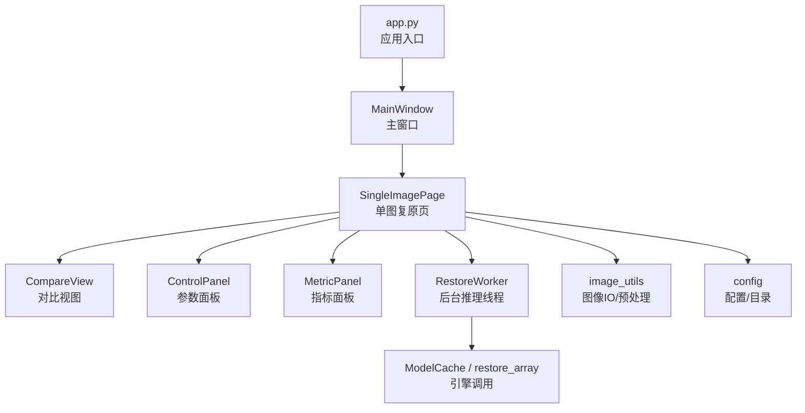
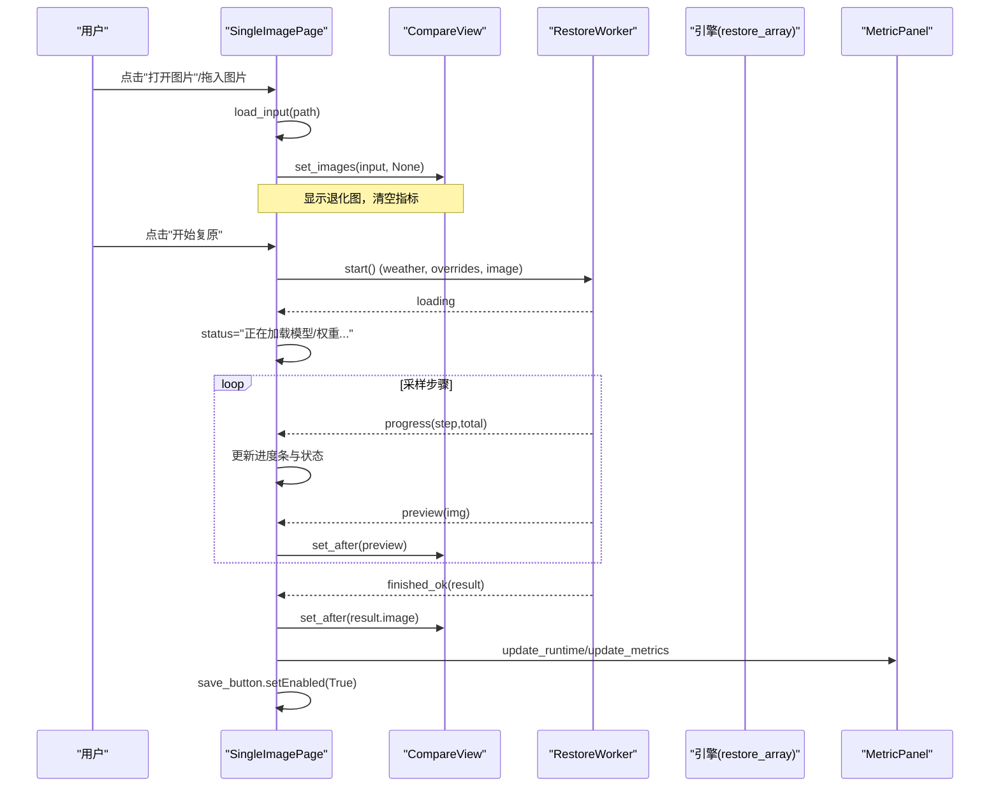
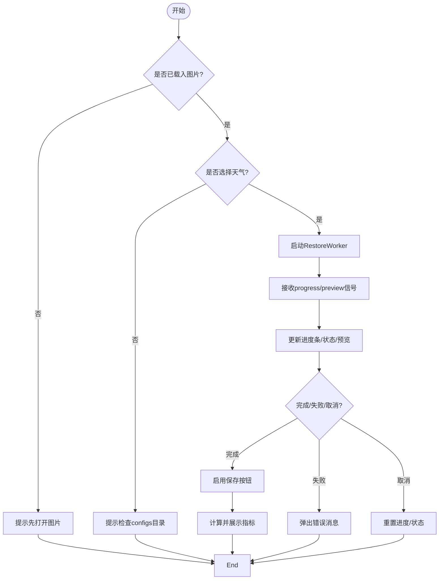
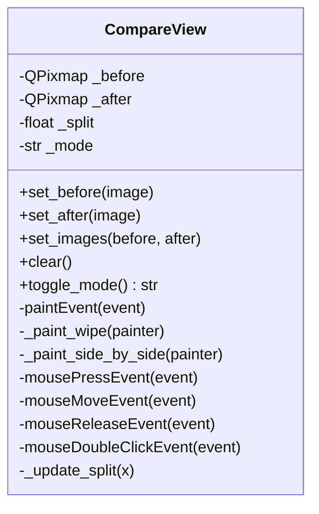
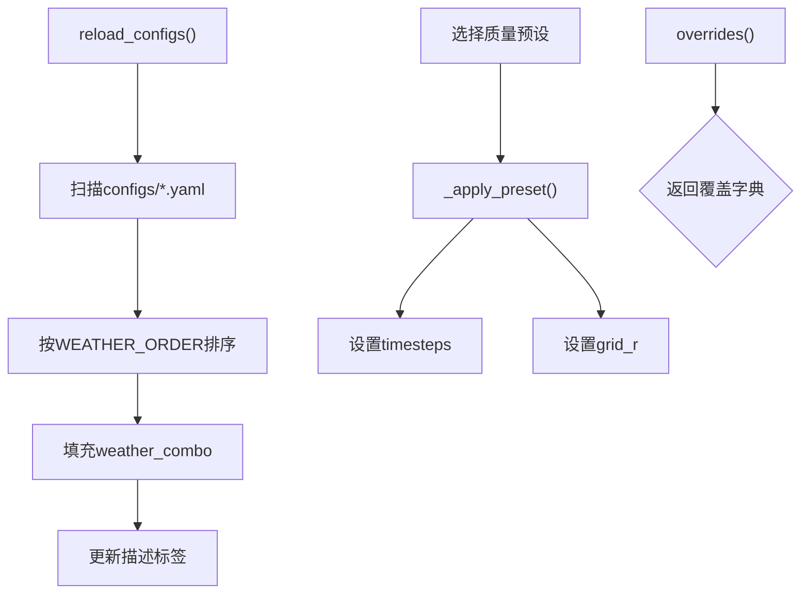
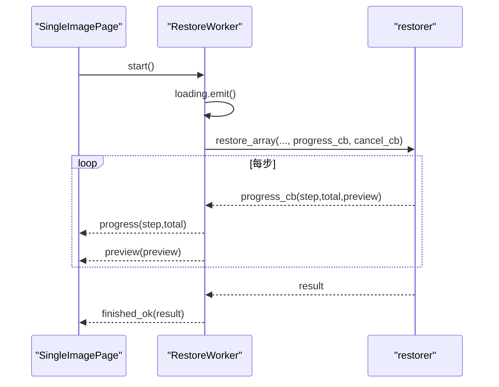
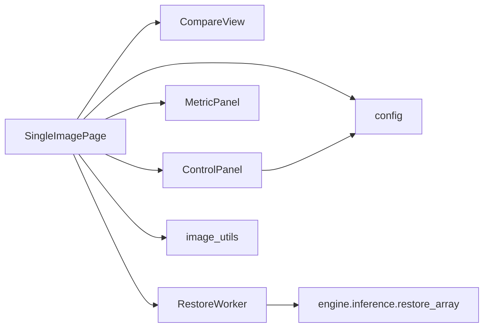

# 单图复原页面

<cite>
**本文引用的文件**
- [app.py](file://app.py)
- [ui/main_window.py](file://ui/main_window.py)
- [ui/compare_view.py](file://ui/compare_view.py)
- [ui/panels.py](file://ui/panels.py)
- [ui/worker.py](file://ui/worker.py)
- [core/image_utils.py](file://core/image_utils.py)
- [core/config.py](file://core/config.py)
- [core/base.py](file://core/base.py)
</cite>

## 目录
1. [简介](#简介)
2. [项目结构](#项目结构)
3. [核心组件](#核心组件)
4. [架构总览](#架构总览)
5. [详细组件分析](#详细组件分析)
6. [依赖关系分析](#依赖关系分析)
7. [性能考虑](#性能考虑)
8. [故障排查指南](#故障排查指南)
9. [结论](#结论)
10. [附录](#附录)

## 简介
本文件面向“单图复原”页面的完整实现，围绕 SingleImagePage 类展开，覆盖图片加载（对话框与拖拽）、图像格式验证、错误处理；对比视图集成（CompareView 的实时预览与多模式切换）；参数配置面板（ControlPanel 的天气类型选择与模型参数覆盖）；进度与状态管理（QProgressBar 与状态栏信息更新）；结果保存（输出路径选择、文件格式支持、保存确认流程）。同时给出用户交互流程设计、异常处理策略与性能优化建议。

## 项目结构
单图复原功能由 UI 层、工作线程与核心工具模块协作完成：
- UI 层：SingleImagePage 组织界面布局与交互；CompareView 负责原图/复原图对比显示；ControlPanel 提供天气类型与采样参数；MetricPanel 展示质量指标。
- 工作线程：RestoreWorker 在后台执行推理，通过信号向主线程反馈进度、预览与结果。
- 核心工具：image_utils 提供图像读写与预处理；config 提供配置加载与目录管理；base 定义统一的复原接口契约。

图表来源
- [app.py:19-32](file://app.py#L19-L32)
- [ui/main_window.py:61-121](file://ui/main_window.py#L61-L121)
- [ui/compare_view.py:30-73](file://ui/compare_view.py#L30-L73)
- [ui/panels.py:42-154](file://ui/panels.py#L42-L154)
- [ui/worker.py:32-79](file://ui/worker.py#L32-L79)
- [core/image_utils.py:22-33](file://core/image_utils.py#L22-L33)
- [core/config.py:25-74](file://core/config.py#L25-L74)

章节来源
- [app.py:19-32](file://app.py#L19-L32)
- [ui/main_window.py:61-121](file://ui/main_window.py#L61-L121)

## 核心组件
- SingleImagePage：承载单图复原的全部交互逻辑，包括打开图片、可选 GT、启动恢复、保存结果、进度与状态更新。
- CompareView：双图对比控件，支持擦除滑块对比与并排模式，支持鼠标拖动中缝与双击切换模式。
- ControlPanel：天气类型下拉框、质量预设、采样步数与滑窗步长 grid_r 等参数，以及开始/取消按钮。
- MetricPanel：展示 PSNR/SSIM/NIQE/BRISQUE 及耗时、设备信息。
- RestoreWorker：后台线程封装推理过程，发射 loading/progress/preview/finished_ok/failed/cancelled 信号。
- image_utils：统一图像 IO（load_image/save_image）、扩展名白名单、尺寸限制与对齐等。
- config：扫描 configs/*.yaml，动态填充天气类型，解析权重绝对路径，提供 OUTPUT_DIR 等目录常量。

章节来源
- [ui/main_window.py:61-250](file://ui/main_window.py#L61-L250)
- [ui/compare_view.py:30-151](file://ui/compare_view.py#L30-L151)
- [ui/panels.py:42-154](file://ui/panels.py#L42-L154)
- [ui/worker.py:32-89](file://ui/worker.py#L32-L89)
- [core/image_utils.py:16-33](file://core/image_utils.py#L16-L33)
- [core/config.py:25-74](file://core/config.py#L25-L74)

## 架构总览
下图展示了从用户操作到结果输出的完整数据流与控制流。

图表来源
- [ui/main_window.py:188-240](file://ui/main_window.py#L188-L240)
- [ui/worker.py:63-79](file://ui/worker.py#L63-L79)
- [ui/compare_view.py:50-73](file://ui/compare_view.py#L50-L73)
- [ui/panels.py:189-199](file://ui/panels.py#L189-L199)

## 详细组件分析

### SingleImagePage：图片加载、对比视图、参数面板、进度状态、结果保存
- 图片加载
  - 支持 QFileDialog 选择图片，过滤 IMAGE_EXTS 支持的扩展名。
  - 支持拖拽进入，dropEvent 校验后缀后调用 load_input。
  - load_input 使用 load_image 读取为 RGB uint8 数组，设置输入路径，清空输出与 GT，更新对比视图与指标面板，禁用保存按钮，状态栏显示尺寸信息。
- 对比视图集成
  - 初始化 CompareView，并在载入输入时调用 set_images(before=input, after=None)。
  - 运行过程中通过 worker.preview 信号实时更新 after 预览。
  - 支持 mode 切换（擦除/并排），通过按钮或双击触发 toggle_mode。
- 参数配置面板
  - ControlPanel 提供天气类型下拉框（动态扫描 configs/*.yaml），质量预设（快速/标准/高质量），采样步数与 grid_r 覆盖项。
  - 点击“开始复原”时，获取 weather 与 overrides，构造 RestoreWorker 并启动。
- 进度与状态管理
  - QProgressBar 范围根据 total 动态调整，progress 信号驱动进度与状态文本。
  - 状态栏 QLabel 显示“就绪/已载入/正在加载/采样中/完成/失败/已取消”等。
- 结果保存
  - 完成后 enable 保存按钮，默认输出路径为 outputs/restored_原文件名。
  - 支持 PNG/JPEG 保存，save_image 自动创建父目录并返回实际路径。
- 异常处理
  - 打开图片/GT 失败弹出警告。
  - 无输入或未选择天气时提示。
  - 推理失败弹出错误消息，取消时重置进度与状态。

图表来源
- [ui/main_window.py:134-176](file://ui/main_window.py#L134-L176)
- [ui/main_window.py:188-250](file://ui/main_window.py#L188-L250)
- [core/image_utils.py:22-33](file://core/image_utils.py#L22-L33)

章节来源
- [ui/main_window.py:61-250](file://ui/main_window.py#L61-L250)
- [core/image_utils.py:16-33](file://core/image_utils.py#L16-L33)

### CompareView：对比视图与多模式显示
- 模式
  - MODE_WIPE：擦除滑块对比，支持鼠标拖动中缝调整 split。
  - MODE_SIDE_BY_SIDE：并排显示左右两图，中间分割线标注“退化图/复原图”。
- 实时预览
  - set_before/set_after 将 numpy 数组转换为 QPixmap 并刷新绘制。
  - 运行中通过 preview 信号持续调用 set_after 更新复原预览。
- 交互
  - 左键按下+移动更新 split；双击切换模式。
  - 空态提示“把图片拖到这里，或点击左上角『打开图片』”。

图表来源
- [ui/compare_view.py:30-151](file://ui/compare_view.py#L30-L151)

章节来源
- [ui/compare_view.py:30-151](file://ui/compare_view.py#L30-L151)

### ControlPanel：参数配置与天气类型选择
- 天气类型
  - reload_configs 扫描 configs/*.yaml，按 WEATHER_ORDER 排序填充下拉框，支持 display_name 显示。
- 质量预设
  - 三档预设映射到 timesteps 与 grid_r，改变预设会同步更新滑块与 spinbox。
- 参数覆盖
  - overrides 返回 {"sampling": {"timesteps": ..., "grid_r": ...}}，直接传给 ModelCache.get。
- 运行态控制
  - set_running 禁用参数控件，启用/禁用开始/取消按钮，避免推理中途修改参数。

图表来源
- [ui/panels.py:114-154](file://ui/panels.py#L114-L154)
- [core/config.py:60-74](file://core/config.py#L60-L74)

章节来源
- [ui/panels.py:42-154](file://ui/panels.py#L42-L154)
- [core/config.py:60-74](file://core/config.py#L60-L74)

### RestoreWorker：后台推理与信号通信
- 职责
  - 在独立线程中加载 restorer，调用 restore_array，回调 progress_cb 与 cancel_cb。
  - 发射 loading/progress/preview/finished_ok/failed/cancelled 信号供主线程更新 UI。
- 取消机制
  - 主线程调用 cancel() 设置标志，内部每步检测并抛出 RestoreCancelled，UI 收到 cancelled 信号后重置状态。
- 异常处理
  - 捕获 WeightNotFoundError 与通用异常，打印堆栈并发送 failed 消息。

图表来源
- [ui/worker.py:32-89](file://ui/worker.py#L32-L89)
- [core/base.py:111-132](file://core/base.py#L111-L132)

章节来源
- [ui/worker.py:32-89](file://ui/worker.py#L32-L89)
- [core/base.py:111-132](file://core/base.py#L111-L132)

### 图像 IO 与格式验证
- 支持扩展名：IMAGE_EXTS = (.png, .jpg, .jpeg, .bmp, .tif, .tiff, .webp)
- 读取：load_image 使用 Pillow 转为 RGB uint8，支持中文路径。
- 保存：save_image 自动创建父目录，返回实际路径。
- 预处理：limit_long_side 控制长边上限以节省显存与时间；resize_to_multiple 对齐到 16 倍数以满足模型要求。

章节来源
- [core/image_utils.py:16-33](file://core/image_utils.py#L16-L33)
- [core/image_utils.py:109-130](file://core/image_utils.py#L109-L130)

## 依赖关系分析
- SingleImagePage 依赖：
  - CompareView：用于对比显示与模式切换。
  - ControlPanel：用于参数配置与启停控制。
  - MetricPanel：用于指标展示。
  - RestoreWorker：用于后台推理与信号通信。
  - image_utils：用于图像读取/保存与扩展名校验。
  - config：用于目录常量与配置扫描。
- 耦合与内聚：
  - UI 与推理解耦：通过 RestoreWorker 的信号机制，主线程仅负责 UI 更新。
  - 配置与界面解耦：ControlPanel 通过 list_weather_configs 动态加载，新增天气无需改界面代码。
  - 图像格式统一：所有图像以 RGB uint8 传递，降低跨模块转换成本。

图表来源
- [ui/main_window.py:61-121](file://ui/main_window.py#L61-L121)
- [ui/worker.py:32-79](file://ui/worker.py#L32-L79)
- [ui/panels.py:114-154](file://ui/panels.py#L114-L154)

章节来源
- [ui/main_window.py:61-121](file://ui/main_window.py#L61-L121)
- [ui/worker.py:32-79](file://ui/worker.py#L32-L79)
- [ui/panels.py:114-154](file://ui/panels.py#L114-L154)

## 性能考虑
- 大图像处理
  - 使用 limit_long_side 限制长边，减少显存占用与推理时间。
  - resize_to_multiple 对齐到 16 倍数，避免额外裁剪带来的开销。
- 预览频率
  - 预览图仅在 progress_cb 有非空 preview 时更新，避免频繁 UI 重绘导致卡顿。
- 指标计算
  - NIQE/BRISQUE 计算较慢，建议在后续版本移至独立线程或按需计算。
- 资源释放
  - MainWindow 关闭时清理 ModelCache，避免权重常驻内存。

[本节为通用性能建议，不直接分析具体文件]

## 故障排查指南
- 无法加载图片
  - 检查文件扩展名是否在 IMAGE_EXTS 中；确认路径可访问且非损坏文件。
  - 参考：[ui/main_window.py:134-176](file://ui/main_window.py#L134-L176)、[core/image_utils.py:22-33](file://core/image_utils.py#L22-L33)
- 没有可用配置
  - 确保 configs/ 目录下存在 yaml 配置文件；检查 list_weather_configs 是否能扫描到。
  - 参考：[ui/panels.py:114-124](file://ui/panels.py#L114-L124)、[core/config.py:60-74](file://core/config.py#L60-L74)
- 权重缺失
  - 若出现 WeightNotFoundError，请确认 weights 目录与配置中的权重路径正确。
  - 参考：[ui/worker.py:82-83](file://ui/worker.py#L82-L83)
- 推理失败
  - 查看 failed 消息与堆栈；确认输入图像尺寸与模型要求一致。
  - 参考：[ui/worker.py:84-88](file://ui/worker.py#L84-L88)
- 取消无效
  - 确认 cancel 已被调用且 worker 处于运行状态；检查 cancel_cb 是否正确传递。
  - 参考：[ui/worker.py:59-61](file://ui/worker.py#L59-L61)、[ui/main_window.py:216-219](file://ui/main_window.py#L216-L219)

章节来源
- [ui/main_window.py:134-176](file://ui/main_window.py#L134-L176)
- [ui/worker.py:59-88](file://ui/worker.py#L59-L88)
- [ui/panels.py:114-124](file://ui/panels.py#L114-L124)
- [core/config.py:60-74](file://core/config.py#L60-L74)

## 结论
SingleImagePage 提供了完整的单图复原工作流：从图片加载（对话框与拖拽）、格式验证、错误处理，到对比视图的实时预览与多模式切换，再到参数面板的天气类型选择与模型参数覆盖，最后通过进度条与状态栏反馈，并支持结果保存。整体采用信号-槽与线程解耦的设计，保证 UI 流畅与可维护性。后续可在预览缩放/平移、局部放大镜、指标异步计算等方面继续优化。

[本节为总结性内容，不直接分析具体文件]

## 附录
- 用户交互流程要点
  - 打开/拖入图片 → 显示退化图 → 选择天气与参数 → 开始复原 → 实时预览与进度 → 完成后可保存 → 指标面板更新。
- 关键 API 路径参考
  - 图片加载与保存：[core/image_utils.py:22-33](file://core/image_utils.py#L22-L33)
  - 对比视图模式切换：[ui/compare_view.py:71-73](file://ui/compare_view.py#L71-L73)
  - 参数覆盖生成：[ui/panels.py:147-154](file://ui/panels.py#L147-L154)
  - 后台推理与信号：[ui/worker.py:63-79](file://ui/worker.py#L63-L79)
  - 配置扫描与顺序：[core/config.py:60-74](file://core/config.py#L60-L74)

[本节为补充说明，不直接分析具体文件]