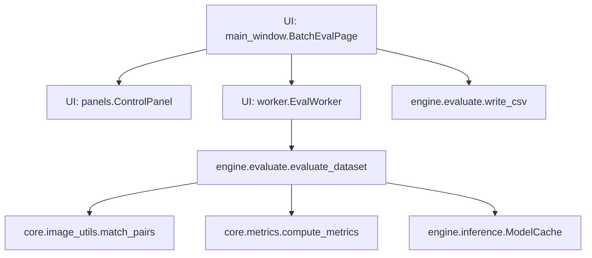
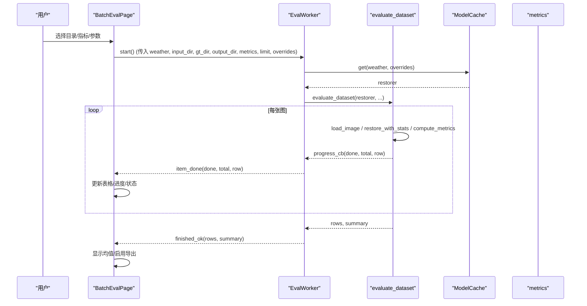
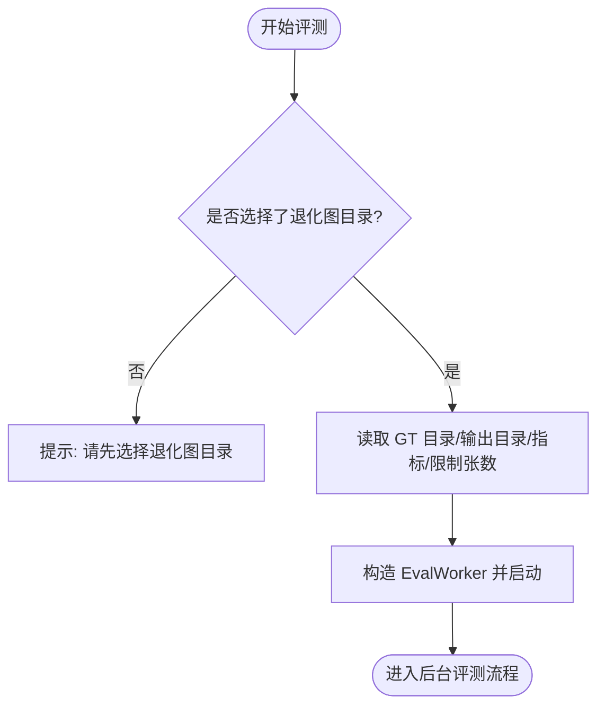
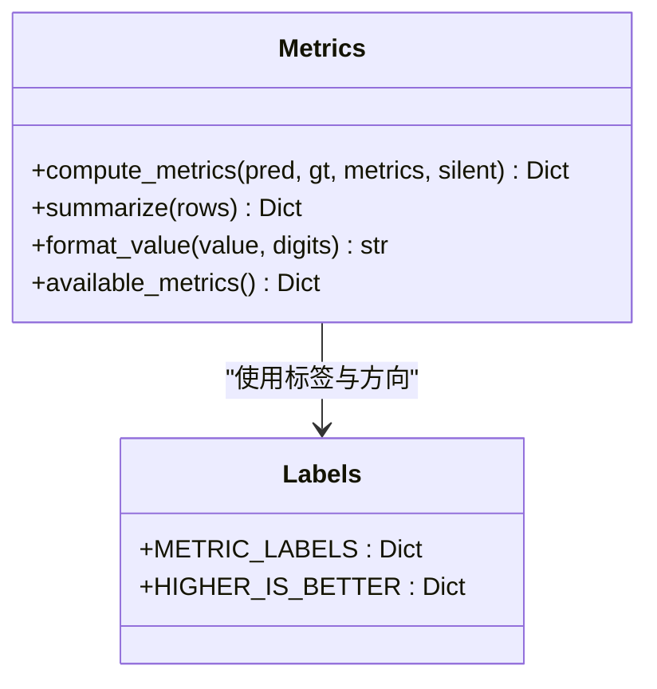
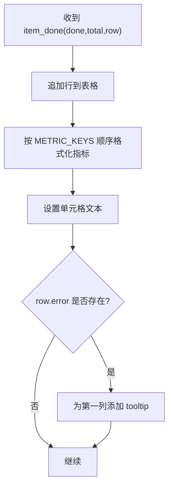
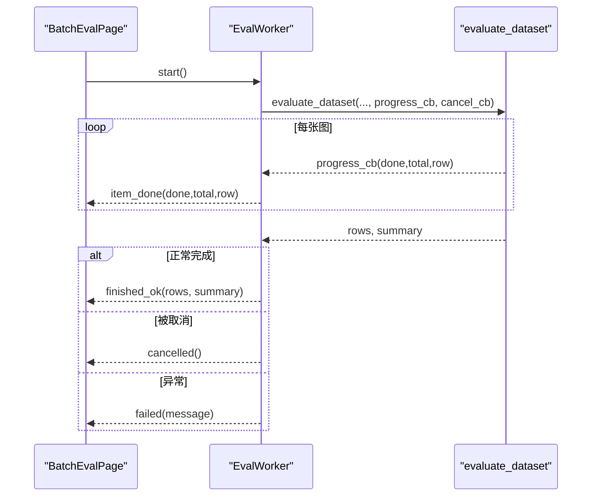
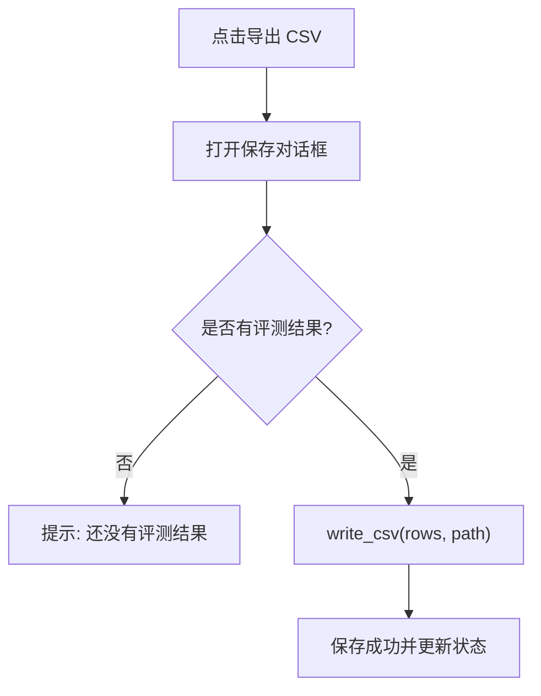
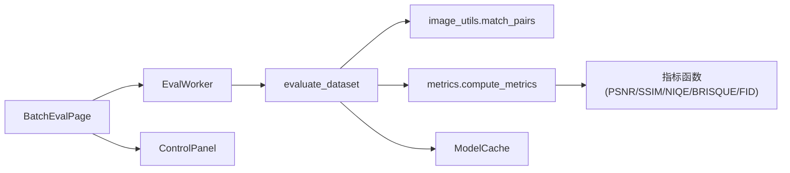
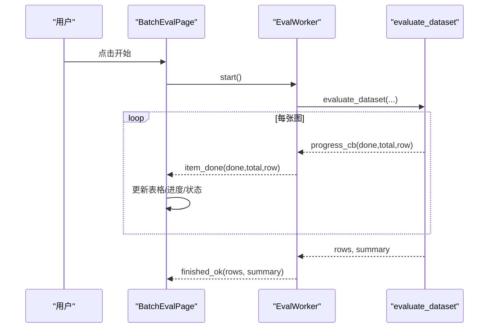
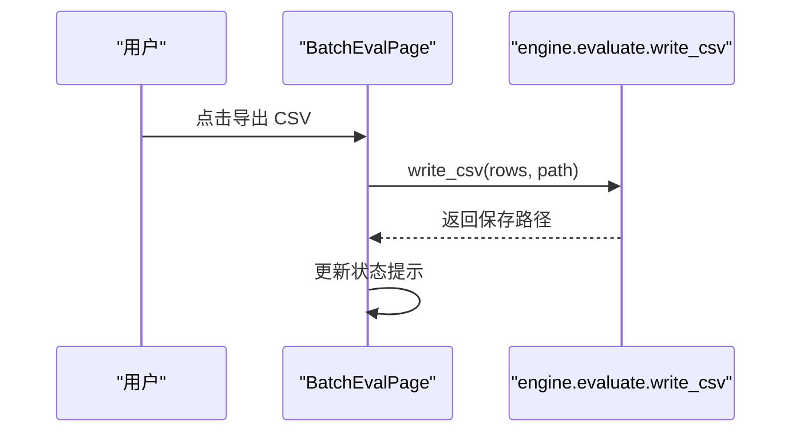

# 批量评测页面

<cite>
**本文引用的文件**
- [main_window.py](file://ui/main_window.py)
- [panels.py](file://ui/panels.py)
- [worker.py](file://ui/worker.py)
- [evaluate.py](file://engine/evaluate.py)
- [metrics.py](file://core/metrics.py)
- [image_utils.py](file://core/image_utils.py)
- [config.py](file://core/config.py)
- [inference.py](file://engine/inference.py)
- [run_eval.py](file://scripts/run_eval.py)
</cite>

## 目录
1. [简介](#简介)
2. [项目结构](#项目结构)
3. [核心组件](#核心组件)
4. [架构总览](#架构总览)
5. [详细组件分析](#详细组件分析)
6. [依赖关系分析](#依赖关系分析)
7. [性能与内存管理](#性能与内存管理)
8. [故障排查指南](#故障排查指南)
9. [结论](#结论)
10. [附录：关键流程时序图](#附录关键流程时序图)

## 简介
本文件面向“批量评测”页面的完整实现，围绕 BatchEvalPage 类展开，系统说明以下能力：
- 目录选择与管理：退化图目录、GT 目录、输出目录的选择与校验。
- 指标配置系统：PSNR、SSIM、NIQE、BRISQUE 等指标的选择控制与可用性检测。
- 表格展示：基于 QTableWidget 的动态列设置与数据格式化显示。
- 批量处理流程：EvalWorker 集成、任务调度、进度跟踪、错误处理。
- CSV 导出：write_csv 的使用、结果格式与保存路径。
- 批处理性能优化、内存管理与大规模数据处理策略。

## 项目结构
批量评测功能横跨 UI 层（PyQt5）、工作线程、引擎评估模块与指标计算模块，整体组织如下：
- UI 层：主窗口与 Tab 页、参数面板、批量评测页、工作线程封装。
- 引擎层：批量评测入口 evaluate_dataset、CSV 导出 write_csv、数据配对 match_pairs。
- 指标层：compute_metrics、available_metrics、format_value 等。
- 配置与推理：ModelCache 权重缓存、图像预处理与 IO。

图表来源
- [main_window.py:253-439](file://ui/main_window.py#L253-L439)
- [worker.py:91-158](file://ui/worker.py#L91-L158)
- [evaluate.py:51-132](file://engine/evaluate.py#L51-L132)
- [image_utils.py:45-78](file://core/image_utils.py#L45-L78)
- [metrics.py:134-177](file://core/metrics.py#L134-L177)
- [inference.py:22-67](file://engine/inference.py#L22-L67)

章节来源
- [main_window.py:253-439](file://ui/main_window.py#L253-L439)
- [worker.py:91-158](file://ui/worker.py#L91-L158)
- [evaluate.py:51-132](file://engine/evaluate.py#L51-L132)

## 核心组件
- BatchEvalPage：批量评测页面，负责目录选择、指标勾选、表格渲染、启动/取消评测、导出 CSV。
- ControlPanel：右侧参数面板，提供天气类型、质量预设、采样步数、滑窗步长等，并生成 overrides 传入模型缓存。
- EvalWorker：后台线程，调用 evaluate_dataset 进行批量评测，逐条回调进度，统一异常捕获与取消支持。
- evaluate_dataset：遍历数据集、复原、计算指标、汇总统计、可选保存输出。
- metrics：指标计算与可用性探测、数值格式化、均值汇总。
- image_utils：图像读取、配对、尺寸处理等工具。
- ModelCache：按配置名缓存已加载的复原器，避免重复加载，支持运行时参数覆盖与显存释放。

章节来源
- [main_window.py:253-439](file://ui/main_window.py#L253-L439)
- [panels.py:42-162](file://ui/panels.py#L42-L162)
- [worker.py:91-158](file://ui/worker.py#L91-L158)
- [evaluate.py:24-132](file://engine/evaluate.py#L24-L132)
- [metrics.py:134-219](file://core/metrics.py#L134-L219)
- [image_utils.py:22-78](file://core/image_utils.py#L22-L78)
- [inference.py:22-67](file://engine/inference.py#L22-L67)

## 架构总览
批量评测的整体调用链如下：
- 用户在界面选择目录与指标，点击“开始复原”。
- BatchEvalPage 构造 EvalWorker 并启动线程。
- EvalWorker 获取 restorer（来自 ModelCache），调用 evaluate_dataset。
- evaluate_dataset 使用 match_pairs 配对输入与 GT，循环执行复原与指标计算。
- 每完成一张图，通过 item_done 信号回传进度与行数据，界面更新表格与状态。
- 全部完成后，界面汇总均值并允许导出 CSV。

图表来源
- [main_window.py:356-439](file://ui/main_window.py#L356-L439)
- [worker.py:128-158](file://ui/worker.py#L128-L158)
- [evaluate.py:51-116](file://engine/evaluate.py#L51-L116)
- [inference.py:33-52](file://engine/inference.py#L33-L52)
- [metrics.py:134-177](file://core/metrics.py#L134-L177)

## 详细组件分析

### 目录选择与管理
- 退化图目录：必填，通过 QFileDialog.getExistingDirectory 选择，并在 start_eval 中校验存在性。
- GT 目录：可选，用于有参考指标（PSNR/SSIM/LPIPS）；若未提供，仅计算无参考指标（NIQE/BRISQUE）。
- 输出目录：可选，用于保存复原结果；当提供时，evaluate_dataset 会写入该目录。
- 限制张数：limit_spin 控制只跑前 N 张，便于调试与快速验证。

图表来源
- [main_window.py:356-384](file://ui/main_window.py#L356-L384)
- [evaluate.py:51-79](file://engine/evaluate.py#L51-L79)

章节来源
- [main_window.py:280-353](file://ui/main_window.py#L280-L353)
- [main_window.py:356-384](file://ui/main_window.py#L356-L384)
- [image_utils.py:45-78](file://core/image_utils.py#L45-L78)

### 指标配置系统与可用性检测
- 指标选择：界面提供 PSNR、SSIM、NIQE、BRISQUE 复选框，默认勾选 PSNR/SSIM。
- 指标分类：
  - 有参考指标：PSNR、SSIM、LPIPS（需要 GT）。
  - 无参考指标：NIQE、BRISQUE（不需要 GT）。
- 可用性检测：available_metrics 动态探测依赖库是否安装，界面“关于”页可展示。
- 数值格式化：format_value 统一处理 None、inf 与小数位数。

图表来源
- [metrics.py:134-219](file://core/metrics.py#L134-L219)
- [metrics.py:26-47](file://core/metrics.py#L26-L47)

章节来源
- [main_window.py:256-310](file://ui/main_window.py#L256-L310)
- [metrics.py:134-219](file://core/metrics.py#L134-L219)

### 表格展示功能（QTableWidget）
- 动态列设置：表头包含文件名、天气、方法、耗时(s)，以及所选指标的列。
- 数据填充：每收到一条 item_done，插入一行，按指标键顺序填充格式化后的值。
- 交互设置：禁止编辑、整行选择、自动拉伸列宽。
- 错误提示：若单张图失败，将错误信息作为 tooltip 附加到第一列。

图表来源
- [main_window.py:402-416](file://ui/main_window.py#L402-L416)
- [evaluate.py:24-48](file://engine/evaluate.py#L24-L48)

章节来源
- [main_window.py:306-313](file://ui/main_window.py#L306-L313)
- [main_window.py:402-416](file://ui/main_window.py#L402-L416)

### 批量处理流程（EvalWorker 集成、任务调度、进度跟踪、错误处理）
- 任务调度：start_eval 构建 EvalWorker 并连接信号槽，启动线程。
- 进度跟踪：item_done 信号携带已完成数、总数与当前行数据，界面更新进度条与状态栏。
- 错误处理：单张图异常不会中断整批，记录 error 字段；线程内异常统一捕获并通过 failed 信号上报。
- 取消机制：支持 cancel，内部在循环中检查 cancel_cb，退出后发出 cancelled 信号。

图表来源
- [main_window.py:356-384](file://ui/main_window.py#L356-L384)
- [worker.py:128-158](file://ui/worker.py#L128-L158)
- [evaluate.py:82-116](file://engine/evaluate.py#L82-L116)

章节来源
- [worker.py:91-158](file://ui/worker.py#L91-L158)
- [evaluate.py:82-116](file://engine/evaluate.py#L82-L116)

### CSV 导出功能（write_csv）
- 触发方式：export_csv 打开保存对话框，调用 write_csv 将 rows 写入 CSV。
- 数据格式：每行包含 filename、weather、restorer、has_gt、elapsed_s、各指标值、error。
- 编码与兼容：使用 utf-8-sig 编码，确保 Excel 打开中文不乱码。
- 空结果处理：若无数据，仍创建空文件。

图表来源
- [main_window.py:391-399](file://ui/main_window.py#L391-L399)
- [evaluate.py:119-132](file://engine/evaluate.py#L119-L132)

章节来源
- [main_window.py:391-399](file://ui/main_window.py#L391-L399)
- [evaluate.py:119-132](file://engine/evaluate.py#L119-L132)

### 指标计算与汇总
- 单图指标：compute_metrics 根据 metrics 列表计算，缺失 GT 时跳过有参考指标。
- 汇总统计：summarize 对多行指标求均值，忽略 None 与 inf。
- 方向标识：HIGHER_IS_BETTER 指示指标优劣方向，用于排序或高亮。

章节来源
- [metrics.py:134-193](file://core/metrics.py#L134-L193)
- [evaluate.py:114-116](file://engine/evaluate.py#L114-L116)

### 图像配对与尺寸处理
- 配对规则：match_pairs 按文件名主干匹配输入与 GT，支持常见后缀变体（如 _clean、_gt、_target 等）。
- 尺寸对齐：若 GT 与复原结果尺寸不一致，自动缩放到一致尺寸后再计算指标。
- 预处理：preprocess_for_model 限制长边、对齐倍数、最小尺寸填充，保证模型输入稳定。

章节来源
- [image_utils.py:45-78](file://core/image_utils.py#L45-L78)
- [evaluate.py:100-106](file://engine/evaluate.py#L100-L106)
- [image_utils.py:145-167](file://core/image_utils.py#L145-L167)

### 配置与模型缓存
- 配置加载：load_config 解析 yaml，注入绝对路径与元信息；list_weather_configs 扫描 configs/*.yaml。
- 模型缓存：ModelCache 按 weather+overrides 缓存 restorer，避免重复加载；支持 release_others/clear 释放显存。
- 运行时覆盖：sampling.timesteps、grid_r 等参数可通过 overrides 直接更新，无需重新加载权重。

章节来源
- [config.py:25-79](file://core/config.py#L25-L79)
- [inference.py:22-67](file://engine/inference.py#L22-L67)
- [panels.py:147-154](file://ui/panels.py#L147-L154)

## 依赖关系分析
- UI 层依赖：
  - main_window.BatchEvalPage 依赖 panels.ControlPanel、worker.EvalWorker、engine.evaluate、core.metrics。
  - ControlPanel 依赖 core.config 与 core.metrics。
- 引擎层依赖：
  - evaluate_dataset 依赖 image_utils.match_pairs、core.metrics.compute_metrics、engine.inference.BaseRestorer。
- 指标层依赖：
  - compute_metrics 依赖具体指标函数（psnr/ssim/lpips/niqe/brisque/fid）与 format_value/summarize。
- 外部依赖：
  - pyiqa（NIQE/BRISQUE）、lpips（LPIPS）、pytorch-fid（FID）、scikit-image（SSIM 加速）。

图表来源
- [main_window.py:253-439](file://ui/main_window.py#L253-L439)
- [worker.py:91-158](file://ui/worker.py#L91-L158)
- [evaluate.py:51-116](file://engine/evaluate.py#L51-L116)
- [metrics.py:134-219](file://core/metrics.py#L134-L219)
- [inference.py:22-67](file://engine/inference.py#L22-L67)

章节来源
- [main_window.py:253-439](file://ui/main_window.py#L253-L439)
- [worker.py:91-158](file://ui/worker.py#L91-L158)
- [evaluate.py:51-116](file://engine/evaluate.py#L51-L116)
- [metrics.py:134-219](file://core/metrics.py#L134-L219)
- [inference.py:22-67](file://engine/inference.py#L22-L67)

## 性能与内存管理
- 权重缓存：ModelCache 避免重复加载权重，减少磁盘 IO 与显存占用；切换天气时可 release_others 保留当前模型。
- 运行时参数覆盖：sampling.timesteps、grid_r 等参数通过 overrides 更新，无需重建 restorer。
- 单图失败不中断：evaluate_dataset 捕获异常并记录 error，保证大批量处理的鲁棒性。
- 限制张数：limit 参数用于快速验证与调试，降低大数据集测试成本。
- 指标延迟导入：NIQE/BRISQUE/LPIPS/FID 等第三方库按需导入，提升启动速度并降低依赖耦合。
- 图像预处理：limit_long_side、resize_to_multiple、pad_to_min_size 控制输入尺寸，平衡显存与精度。
- 建议：
  - 大批量评测时优先关闭不必要的指标（如 LPIPS/FID），减少计算开销。
  - 合理设置 timesteps 与 grid_r，权衡速度与质量。
  - 使用 limit 先小样本验证，再全量运行。
  - 定期调用 ModelCache.release_others 或 clear 释放显存。

章节来源
- [inference.py:22-67](file://engine/inference.py#L22-L67)
- [evaluate.py:82-116](file://engine/evaluate.py#L82-L116)
- [image_utils.py:109-167](file://core/image_utils.py#L109-L167)
- [metrics.py:205-219](file://core/metrics.py#L205-L219)

## 故障排查指南
- 指标不可用：
  - 现象：NIQE/BRISQUE/LPIPS/FID 显示不可用或计算失败。
  - 原因：缺少依赖库（pyiqa、lpips、pytorch-fid）。
  - 解决：安装对应依赖；或在界面“关于/环境”页查看 available_metrics 状态。
- 权重缺失：
  - 现象：报错提示权重缺失。
  - 原因：weights 目录不存在或路径不正确。
  - 解决：运行下载脚本或手动放置权重；检查 config 中的 weights.path。
- 单图失败：
  - 现象：某张图指标为空或错误信息出现。
  - 原因：图像损坏、尺寸不一致、指标依赖缺失。
  - 解决：检查图像完整性；确认 GT 与结果尺寸一致；必要时跳过该图。
- 取消无效：
  - 现象：点击取消后仍在运行。
  - 原因：cancel_cb 未在正确位置检查。
  - 解决：确认 evaluate_dataset 循环中调用 cancel_cb；检查 EvalWorker.cancel 设置标志。

章节来源
- [metrics.py:205-219](file://core/metrics.py#L205-L219)
- [worker.py:128-158](file://ui/worker.py#L128-L158)
- [evaluate.py:82-116](file://engine/evaluate.py#L82-L116)
- [config.py:25-57](file://core/config.py#L25-L57)

## 结论
批量评测页面以 BatchEvalPage 为核心，结合 EvalWorker、evaluate_dataset 与 metrics 模块，实现了从目录选择、指标配置、表格展示到 CSV 导出的完整流程。通过 ModelCache 与图像预处理策略，系统在大规模数据处理中兼顾性能与稳定性。未来可扩展可视化对比（柱状图）、记忆上次目录与参数等功能，进一步提升用户体验。

## 附录：关键流程时序图

### 批量评测启动与进度回调

图表来源
- [main_window.py:356-439](file://ui/main_window.py#L356-L439)
- [worker.py:128-158](file://ui/worker.py#L128-L158)
- [evaluate.py:51-116](file://engine/evaluate.py#L51-L116)

### CSV 导出流程

图表来源
- [main_window.py:391-399](file://ui/main_window.py#L391-L399)
- [evaluate.py:119-132](file://engine/evaluate.py#L119-L132)