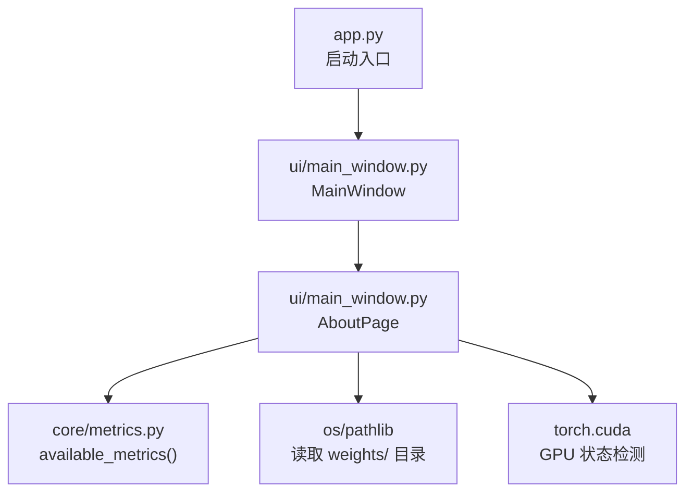
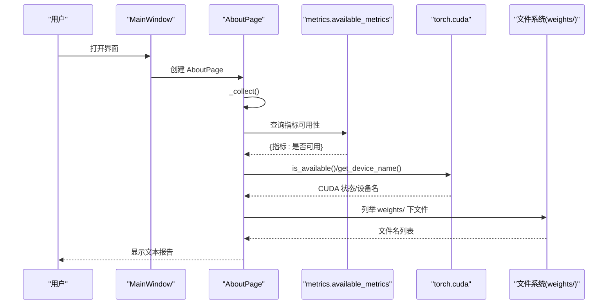
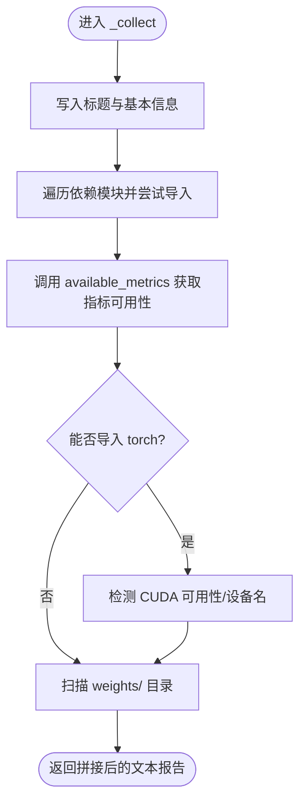
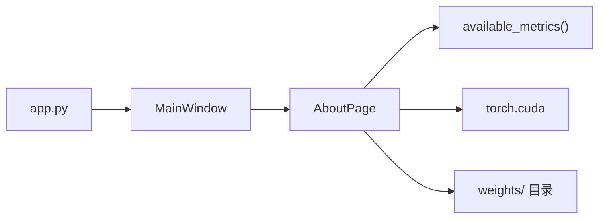

# 环境检查页面

<cite>
**本文引用的文件**
- [ui/main_window.py](file://ui/main_window.py)
- [core/metrics.py](file://core/metrics.py)
- [scripts/download_weights.py](file://scripts/download_weights.py)
- [scripts/check_weights.py](file://scripts/check_weights.py)
- [weights/README.md](file://weights/README.md)
- [app.py](file://app.py)
</cite>

## 目录
1. [简介](#简介)
2. [项目结构](#项目结构)
3. [核心组件](#核心组件)
4. [架构总览](#架构总览)
5. [详细组件分析](#详细组件分析)
6. [依赖关系分析](#依赖关系分析)
7. [性能考虑](#性能考虑)
8. [故障排查指南](#故障排查指南)
9. [结论](#结论)
10. [附录](#附录)

## 简介
本章节面向“关于 / 环境”页（AboutPage），系统化说明其实现与环境诊断能力。该页面用于快速定位环境问题，包括：
- 依赖检测：Python 模块导入测试、版本信息获取、缺失依赖识别
- GPU 状态检查：CUDA 可用性检测、设备信息获取
- 权重文件检查：weights 目录扫描、是否存在权重文件、下载提示
- 环境诊断报告：文本格式输出、问题定位指导、解决方案建议
- 故障排查流程：常见问题识别、环境修复指导、调试信息收集
- 兼容性检查与跨平台适配：环境变量控制、CPU/GPU 选择、假模型模式

## 项目结构
“关于 / 环境”页位于 UI 主窗口中，作为第三个 Tab 展示。它通过静态方法收集系统信息并渲染为只读文本。

图表来源
- [ui/main_window.py:441-496](file://ui/main_window.py#L441-L496)
- [core/metrics.py:205-219](file://core/metrics.py#L205-L219)
- [app.py:19-32](file://app.py#L19-L32)

章节来源
- [ui/main_window.py:441-496](file://ui/main_window.py#L441-L496)
- [app.py:19-32](file://app.py#L19-L32)

## 核心组件
- AboutPage：负责收集并展示环境信息，包含依赖、指标可用性、GPU 状态、权重目录情况。
- available_metrics：探测各指标是否可用（PSNR、SSIM、LPIPS、NIQE、BRISQUE、FID）。
- 权重工具脚本：download_weights.py 与 check_weights.py 辅助下载与校验权重。
- app.py：应用启动入口，支持 AWR_MOCK、AWR_DEVICE 等环境变量控制运行模式。

章节来源
- [ui/main_window.py:441-496](file://ui/main_window.py#L441-L496)
- [core/metrics.py:205-219](file://core/metrics.py#L205-L219)
- [scripts/download_weights.py:82-116](file://scripts/download_weights.py#L82-L116)
- [scripts/check_weights.py:24-72](file://scripts/check_weights.py#L24-L72)
- [app.py:19-32](file://app.py#L19-L32)

## 架构总览
AboutPage 的“环境自检”流程如下：
- 构建标题与基本信息（项目根目录、假模型开关）
- 遍历关键依赖模块，尝试导入并记录版本或“未安装”
- 调用 available_metrics 汇总指标可用性
- 尝试导入 torch 并检测 CUDA 可用性、设备名
- 扫描 weights/ 目录，列出权重文件或提示下载

图表来源
- [ui/main_window.py:441-496](file://ui/main_window.py#L441-L496)
- [core/metrics.py:205-219](file://core/metrics.py#L205-L219)

## 详细组件分析

### AboutPage 类与 _collect 方法
- 职责：生成一份可读的环境诊断报告，便于快速定位问题。
- 行为要点：
  - 打印项目根目录与 AWR_MOCK 环境变量值
  - 依赖检测：对 numpy、PIL、yaml、PyQt5、torch、skimage、pyiqa、lpips、pytorch_fid 逐一导入，记录版本或“未安装”
  - 指标可用性：调用 available_metrics 输出每项指标是否可用
  - GPU 检查：仅在可导入 torch 时执行；输出 CUDA 是否可用及首设备名称
  - 权重目录：列出 weights/ 下的非 .md 文件；若不存在则提示先运行下载脚本

图表来源
- [ui/main_window.py:452-496](file://ui/main_window.py#L452-L496)

章节来源
- [ui/main_window.py:441-496](file://ui/main_window.py#L441-L496)

### 依赖检测功能
- 模块导入测试：通过动态导入目标模块，捕获 ImportError 标记“未安装”。
- 版本信息获取：从模块的 __version__ 属性读取版本号，无法获取时记录“ok”。
- 缺失依赖识别：在报告中以“未安装”明确标识，便于用户补装。

章节来源
- [ui/main_window.py:464-470](file://ui/main_window.py#L464-L470)

### 指标可用性检测
- 使用 available_metrics 统一探测 PSNR、SSIM、LPIPS、NIQE、BRISQUE、FID 的可用性。
- 内部采用延迟导入策略，避免缺少依赖影响启动；不可用时返回 False。

章节来源
- [core/metrics.py:205-219](file://core/metrics.py#L205-L219)

### GPU 状态检查
- CUDA 可用性：通过 torch.cuda.is_available() 判断。
- 设备信息：当 CUDA 可用时，读取第一个设备的名称。
- 容错处理：若 torch 未安装，跳过 GPU 相关输出，不影响整体报告生成。

章节来源
- [ui/main_window.py:477-486](file://ui/main_window.py#L477-L486)

### 权重文件检查
- 目录扫描：读取 PROJECT_ROOT/weights，列出所有非 .md 的文件名。
- 完整性提示：若目录为空或不存在，提示先运行 download_weights.py。
- 配套工具：
  - download_weights.py：提供一键下载、列出可选权重、断点续传、失败时给出直链备选方案。
  - check_weights.py：加载 checkpoint，打印顶层键、参数字典位置、前 N 个参数名与形状，辅助确认 state_dict 结构。

章节来源
- [ui/main_window.py:488-496](file://ui/main_window.py#L488-L496)
- [scripts/download_weights.py:82-116](file://scripts/download_weights.py#L82-L116)
- [scripts/check_weights.py:24-72](file://scripts/check_weights.py#L24-L72)
- [weights/README.md:1-40](file://weights/README.md#L1-L40)

### 环境诊断报告
- 输出格式：纯文本，分节清晰（依赖状态、指标可用性、GPU、权重目录）。
- 问题定位：通过“未安装”“不可用(缺依赖)”“空 —— 请先运行...”等文案直接指出问题。
- 解决方案建议：
  - 缺失依赖：根据模块名 pip 安装对应包
  - 指标不可用：安装相应第三方库（如 pyiqa、lpips、pytorch-fid）
  - 权重缺失：运行 download_weights.py 或使用 README 中的直链手动下载
  - GPU 不可用：检查驱动/CUDA 安装或设置 AWR_DEVICE=cpu

章节来源
- [ui/main_window.py:452-496](file://ui/main_window.py#L452-L496)
- [weights/README.md:1-40](file://weights/README.md#L1-L40)

### 故障排查流程
- 常见问题识别：
  - 指标算不出来：查看“指标可用性”，按需安装依赖
  - 权重找不到：查看“权重目录”，按提示下载
  - 界面无法启动：检查 PyQt5 是否安装
- 环境修复指导：
  - 安装依赖：pip install 对应包
  - 下载权重：python scripts/download_weights.py 或 --all
  - 验证权重：python scripts/check_weights.py
- 调试信息收集：
  - 复制“关于 / 环境”页的全部文本
  - 记录 AWR_MOCK、AWR_DEVICE 环境变量值
  - 必要时附加 download_weights.py 与 check_weights.py 的输出

章节来源
- [ui/main_window.py:452-496](file://ui/main_window.py#L452-L496)
- [scripts/download_weights.py:82-116](file://scripts/download_weights.py#L82-L116)
- [scripts/check_weights.py:24-72](file://scripts/check_weights.py#L24-L72)

### 环境兼容性与跨平台适配
- 环境变量：
  - AWR_MOCK：启用假模型模式，无需权重/GPU 即可跑通界面
  - AWR_DEVICE：强制指定运行设备（如 cpu/cuda）
- 启动入口：
  - app.py 在缺少 PyQt5 时给出安装提示
  - 支持 Windows 与 Linux/macOS 的常见路径与命令行方式
- 指标与后端：
  - 指标计算优先使用 CPU，若检测到 CUDA 可用则自动使用 GPU 加速（如 LPIPS、NIQE/BRISQUE、FID）

章节来源
- [app.py:1-8](file://app.py#L1-L8)
- [app.py:19-32](file://app.py#L19-L32)
- [core/metrics.py:241-247](file://core/metrics.py#L241-L247)

## 依赖关系分析
- AboutPage 依赖 core.metrics.available_metrics 进行指标可用性探测。
- 运行时可能依赖 torch（GPU 检测）、PyQt5（界面）、numpy/PIL/yaml/skimage/pyiqa/lpips/pytorch_fid（指标与图像处理）。
- 权重管理依赖 download_weights.py 与 check_weights.py。

图表来源
- [ui/main_window.py:441-496](file://ui/main_window.py#L441-L496)
- [core/metrics.py:205-219](file://core/metrics.py#L205-L219)
- [app.py:19-32](file://app.py#L19-L32)

章节来源
- [ui/main_window.py:441-496](file://ui/main_window.py#L441-L496)
- [core/metrics.py:205-219](file://core/metrics.py#L205-L219)
- [app.py:19-32](file://app.py#L19-L32)

## 性能考虑
- 延迟导入：指标模块采用延迟导入，避免启动时因缺失依赖导致失败。
- 轻量级检测：AboutPage 仅做导入与目录扫描，不加载大模型或进行重计算。
- GPU 检测开销：仅在需要时调用 torch.cuda 接口，且只在可导入 torch 的情况下执行。

[本节为通用性能讨论，不直接分析具体代码行]

## 故障排查指南
- 指标不可用：
  - 现象：指标显示“不可用(缺依赖)”
  - 处理：安装对应库（如 pyiqa、lpips、pytorch-fid），重新打开“关于 / 环境”页确认
- 权重缺失：
  - 现象：权重目录为空或不存在
  - 处理：运行 python scripts/download_weights.py 或 --all；如需自定义权重，使用 --url 与 --out
- 权重结构异常：
  - 处理：运行 python scripts/check_weights.py 查看 checkpoint 结构与参数名
- 界面无法启动：
  - 现象：缺少 PyQt5
  - 处理：pip install PyQt5，再运行 app.py
- GPU 不可用：
  - 现象：CUDA 不可用
  - 处理：检查驱动/CUDA 安装；或设置 AWR_DEVICE=cpu 使用 CPU 运行

章节来源
- [ui/main_window.py:452-496](file://ui/main_window.py#L452-L496)
- [scripts/download_weights.py:82-116](file://scripts/download_weights.py#L82-L116)
- [scripts/check_weights.py:24-72](file://scripts/check_weights.py#L24-L72)
- [app.py:19-32](file://app.py#L19-L32)

## 结论
AboutPage 提供了开箱即用的环境自检能力，覆盖依赖、指标、GPU 与权重四大维度，配合 download_weights.py 与 check_weights.py，形成完整的“检测—下载—验证”闭环。通过环境变量与延迟导入机制，系统在跨平台与不同硬件环境下具备良好鲁棒性。

[本节为总结性内容，不直接分析具体代码行]

## 附录
- 常用命令
  - 下载权重：python scripts/download_weights.py 或 --all
  - 列出权重：python scripts/download_weights.py --list
  - 验证权重：python scripts/check_weights.py
  - 启动界面：python app.py
- 环境变量
  - AWR_MOCK=1：启用假模型模式
  - AWR_DEVICE=cpu：强制使用 CPU

章节来源
- [scripts/download_weights.py:82-116](file://scripts/download_weights.py#L82-L116)
- [scripts/check_weights.py:24-72](file://scripts/check_weights.py#L24-L72)
- [app.py:1-8](file://app.py#L1-L8)