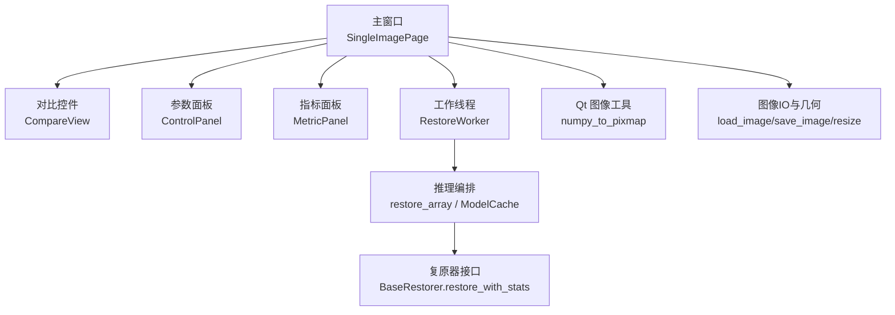
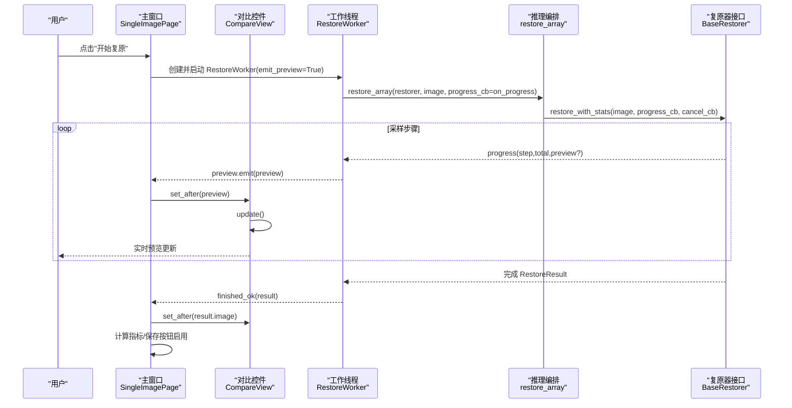
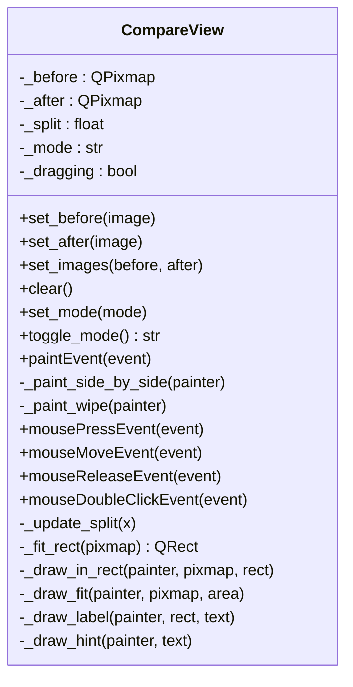
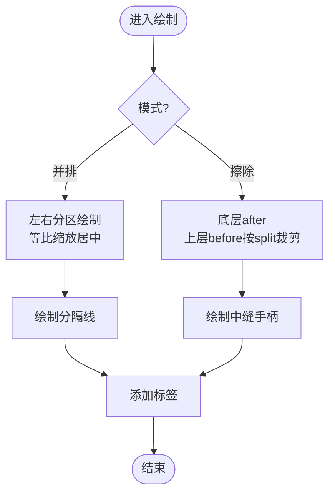
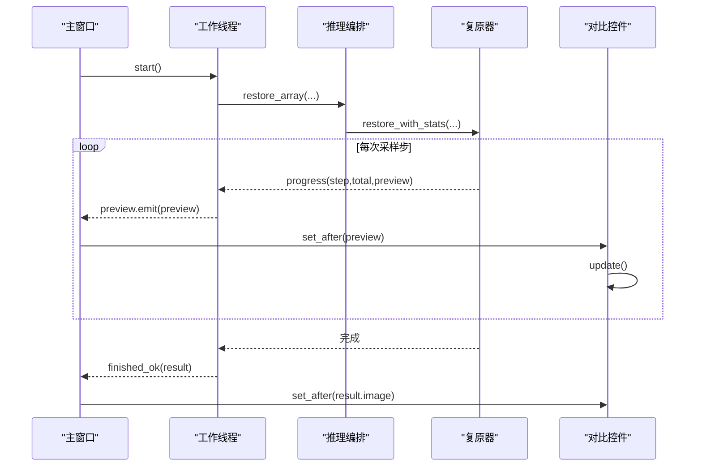
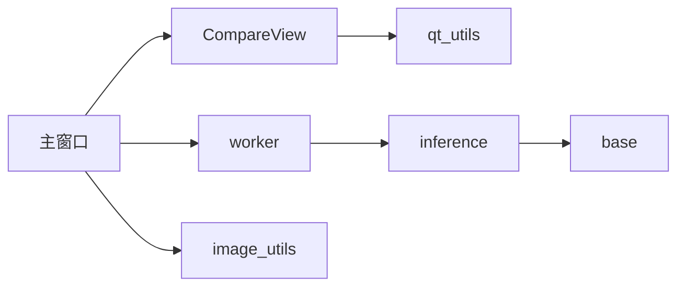

# 图像对比视图

<cite>
**本文引用的文件**
- [compare_view.py](file://ui/compare_view.py)
- [main_window.py](file://ui/main_window.py)
- [qt_utils.py](file://ui/qt_utils.py)
- [image_utils.py](file://core/image_utils.py)
- [worker.py](file://ui/worker.py)
- [base.py](file://core/base.py)
- [inference.py](file://engine/inference.py)
</cite>

## 目录
1. [简介](#简介)
2. [项目结构](#项目结构)
3. [核心组件](#核心组件)
4. [架构总览](#架构总览)
5. [详细组件分析](#详细组件分析)
6. [依赖关系分析](#依赖关系分析)
7. [性能考量](#性能考量)
8. [故障排查指南](#故障排查指南)
9. [结论](#结论)
10. [附录](#附录)

## 简介
本文件围绕 CompareView 类，系统化说明其在“恶劣天气图像复原系统”中的设计与实现：原图（退化图）、复原图的并排与擦除对比显示；图像缩放、对齐与交互；对比模式切换（并排、叠加/擦除）；扩散模型采样过程中的实时预览更新机制；图像格式转换、颜色空间处理与性能优化策略；以及可扩展的自定义样式与交互行为。

## 项目结构
UI 层以 CompareView 为核心对比控件，主窗口负责编排用户操作与后台推理线程，Worker 将采样进度与中间预览通过信号回传到 UI，图像工具提供统一的 RGB uint8 数据约定与转换能力。

图表来源
- [main_window.py:61-127](file://ui/main_window.py#L61-L127)
- [compare_view.py:30-73](file://ui/compare_view.py#L30-L73)
- [worker.py:32-89](file://ui/worker.py#L32-L89)
- [inference.py:22-77](file://engine/inference.py#L22-L77)
- [base.py:61-138](file://core/base.py#L61-L138)
- [qt_utils.py:9-21](file://ui/qt_utils.py#L9-L21)
- [image_utils.py:22-33](file://core/image_utils.py#L22-L33)

章节来源
- [main_window.py:61-127](file://ui/main_window.py#L61-L127)
- [compare_view.py:30-73](file://ui/compare_view.py#L30-L73)
- [worker.py:32-89](file://ui/worker.py#L32-L89)
- [inference.py:22-77](file://engine/inference.py#L22-L77)
- [base.py:61-138](file://core/base.py#L61-L138)
- [qt_utils.py:9-21](file://ui/qt_utils.py#L9-L21)
- [image_utils.py:22-33](file://core/image_utils.py#L22-L33)

## 核心组件
- CompareView：双图对比控件，支持并排与擦除两种模式，提供等比缩放居中显示、中缝滑块拖拽、双击切换模式等交互。
- SingleImagePage：单图复原页面，集成 CompareView、ControlPanel、MetricPanel，负责打开图片、启动推理、保存结果与状态提示。
- RestoreWorker：后台线程，封装扩散模型采样过程，按步上报进度与中间预览图。
- Qt 图像工具：在 numpy 数组与 QPixmap/QImage 之间高效转换，保证内存安全与正确色彩通道。
- 图像工具：统一 RGB uint8 约定，提供加载、保存、尺寸限制、倍数对齐、填充、锐化、拼接等能力。

章节来源
- [compare_view.py:30-191](file://ui/compare_view.py#L30-L191)
- [main_window.py:61-250](file://ui/main_window.py#L61-L250)
- [worker.py:32-89](file://ui/worker.py#L32-L89)
- [qt_utils.py:9-31](file://ui/qt_utils.py#L9-L31)
- [image_utils.py:22-167](file://core/image_utils.py#L22-L167)

## 架构总览
下图展示了从用户操作到对比视图更新的完整流程，包括模式切换、预览更新与最终结果展示。

图表来源
- [main_window.py:188-240](file://ui/main_window.py#L188-L240)
- [worker.py:63-89](file://ui/worker.py#L63-L89)
- [inference.py:70-77](file://engine/inference.py#L70-L77)
- [base.py:111-138](file://core/base.py#L111-L138)
- [compare_view.py:50-73](file://ui/compare_view.py#L50-L73)

## 详细组件分析

### CompareView 设计与实现
- 数据与状态
  - 存储两张图：before（退化图）与 after（复原图），均为 QPixmap。
  - 模式：MODE_WIPE（擦除/叠加对比）与 MODE_SIDE_BY_SIDE（并排）。
  - 分割位置 split：0~1，控制擦除分界线。
  - 鼠标拖拽标记 dragging。
- 对外接口
  - set_before/set_after/set_images：接收 numpy RGB uint8，内部转换为 QPixmap 并触发重绘。
  - clear：清空两图并重绘。
  - set_mode/toggle_mode：设置或切换对比模式。
- 绘制逻辑
  - paintEvent：根据模式选择并排或擦除绘制。
  - _paint_side_by_side：左右各半区域，分别等比缩放居中绘制，添加分隔线与标签。
  - _paint_wipe：底层绘制 after，上层按 split 裁剪 before，绘制中缝手柄与标签。
- 交互
  - 鼠标按下/移动/释放：在擦除模式下拖动 split。
  - 双击：切换对比模式。
  - TODO：滚轮缩放+平移同步、放大镜、导出当前视图为图片。
- 工具方法
  - _fit_rect/_draw_fit/_draw_in_rect：等比缩放与居中绘制。
  - _draw_label/_draw_hint：标签与提示文本绘制。

图表来源
- [compare_view.py:30-191](file://ui/compare_view.py#L30-L191)

章节来源
- [compare_view.py:30-191](file://ui/compare_view.py#L30-L191)

### 并排显示与叠加（擦除）对比机制
- 并排显示
  - 将控件宽度平分，左侧显示 before，右侧显示 after。
  - 各自独立等比缩放并居中，确保不拉伸变形。
  - 绘制分隔线与“退化图/复原图”标签。
- 叠加（擦除）对比
  - 底层绘制 after，上层按 split 裁剪 before。
  - 使用 clipRect 实现局部覆盖，绘制中缝手柄便于拖拽调整。
  - 标签分别标注左右区域。

图表来源
- [compare_view.py:86-123](file://ui/compare_view.py#L86-L123)

章节来源
- [compare_view.py:86-123](file://ui/compare_view.py#L86-L123)

### 图像缩放、对齐与同步
- 等比缩放
  - _fit_rect/_draw_fit 基于目标区域宽高与图像宽高计算缩放比例，保持纵横比不变。
  - 居中定位：根据目标区域计算左上角坐标，使图像在区域内居中。
- 对齐
  - 并排模式下左右两侧分别计算 fit_rect，保证各自对齐。
  - 擦除模式下统一 target 矩形，确保前后图在同一区域对齐。
- 同步
  - 当前实现未实现滚轮缩放与平移同步（TODO），但已预留扩展点：可在 mouseWheelEvent/mouseMoveEvent 中增加缩放和平移状态，并在两个图像上应用相同的变换矩阵以实现同步。

章节来源
- [compare_view.py:156-177](file://ui/compare_view.py#L156-L177)

### 对比模式切换与交互
- 模式常量：MODE_WIPE（擦除）、MODE_SIDE_BY_SIDE（并排）。
- 切换方式：
  - 按钮：主窗口“切换对比模式”按钮调用 compare.toggle_mode。
  - 双击：在 CompareView 上双击切换模式。
- 擦除交互：
  - 鼠标左键按下并拖动时更新 split，实时重绘。
  - 中缝手柄可视化，便于精确控制对比边界。

章节来源
- [compare_view.py:33-73](file://ui/compare_view.py#L33-L73)
- [compare_view.py:128-151](file://ui/compare_view.py#L128-L151)
- [main_window.py:123-127](file://ui/main_window.py#L123-L127)

### 实时预览更新机制（扩散模型采样）
- 工作线程
  - RestoreWorker 在 run 中调用 restore_array，传入 on_progress 回调。
  - on_progress 将 step/total 与可选 preview 通过信号 emit 回主线程。
- 主窗口绑定
  - worker.preview.connect(compare.set_after)：每收到一个中间预览图，立即更新对比视图的 after 图。
  - worker.progress.connect(_on_progress)：更新进度条与状态文本。
- 复原器接口
  - BaseRestorer.restore_with_stats 在采样过程中定期调用 progress_cb(step, total, preview)，允许 UI 动态刷新。
- 效果
  - 用户在采样过程中可看到逐步恢复的中间结果，提升交互体验。

图表来源
- [worker.py:63-89](file://ui/worker.py#L63-L89)
- [inference.py:70-77](file://engine/inference.py#L70-L77)
- [base.py:111-138](file://core/base.py#L111-L138)
- [main_window.py:188-240](file://ui/main_window.py#L188-L240)
- [compare_view.py:50-73](file://ui/compare_view.py#L50-L73)

章节来源
- [worker.py:63-89](file://ui/worker.py#L63-L89)
- [inference.py:70-77](file://engine/inference.py#L70-L77)
- [base.py:111-138](file://core/base.py#L111-L138)
- [main_window.py:188-240](file://ui/main_window.py#L188-L240)
- [compare_view.py:50-73](file://ui/compare_view.py#L50-L73)

### 图像格式转换与颜色空间处理
- 统一约定
  - 内存图像统一为 RGB uint8 (H, W, 3)。
  - load_image 读取后强制转为 RGB，save_image 输出前转回 uint8。
- Qt 转换
  - numpy_to_qimage/numpy_to_pixmap：将 numpy 数组转换为 QImage/Pixmap，注意 copy 避免内存回收导致花屏。
  - qimage_to_numpy：界面粘贴/拖入图像时转回 numpy，确保 RGB 通道顺序。
- 几何处理
  - resize/limit_long_side/resize_to_multiple/pad_to_min_size：控制输入尺寸以满足模型要求（如 16 倍数对齐），减少显存占用与耗时。
  - postprocess_to_origin：将模型输出还原至原始尺寸，保证对比视图显示一致性。

章节来源
- [image_utils.py:22-167](file://core/image_utils.py#L22-L167)
- [qt_utils.py:9-31](file://ui/qt_utils.py#L9-L31)

### 性能优化策略
- 长边限制
  - limit_long_side：当图像长边超过阈值时等比缩小，降低显存与推理时间。
- 尺寸对齐
  - resize_to_multiple：向上取整到指定倍数（默认 16），适配模型预处理要求。
- 最小尺寸填充
  - pad_to_min_size：对小于最小尺寸的图像进行反射填充，避免 patch 过小导致的异常。
- 缓存与复用
  - ModelCache：同一配置只加载一次权重，切换天气类型时避免重复读盘与显存占用。
- UI 渲染
  - 使用 QPixmap 缓存图像，减少重复转换开销。
  - 仅在必要时调用 update()，避免频繁重绘。

章节来源
- [image_utils.py:109-167](file://core/image_utils.py#L109-L167)
- [inference.py:22-67](file://engine/inference.py#L22-L67)
- [compare_view.py:50-73](file://ui/compare_view.py#L50-L73)

### 自定义样式与交互扩展
- 样式
  - 背景色、分隔线颜色、标签字体与颜色均可通过 QPainter 的 Pen/Brush 定制。
  - 提示文本与标签可通过 _draw_hint/_draw_label 扩展。
- 交互
  - 当前支持拖拽擦除与双击切换模式。
  - 可扩展：
    - 滚轮缩放：记录缩放因子，在 _fit_rect 中应用，并在两图间同步。
    - 平移：记录偏移量，在 drawPixmap 时应用平移。
    - 放大镜：在鼠标位置绘制放大框，提高细节观察能力。
    - 导出视图：将当前对比视图渲染为图片，便于答辩配图。

章节来源
- [compare_view.py:78-123](file://ui/compare_view.py#L78-L123)
- [compare_view.py:143-151](file://ui/compare_view.py#L143-L151)

## 依赖关系分析
- CompareView 依赖 qt_utils 进行图像转换，依赖 PyQt5 的绘图与事件系统。
- 主窗口依赖 CompareView、ControlPanel、MetricPanel、RestoreWorker 与图像工具。
- Worker 依赖推理编排与复原器接口，负责线程安全地执行任务并通过信号通知 UI。
- 图像工具提供统一的 IO 与几何处理，确保跨模块一致性与可维护性。

图表来源
- [compare_view.py:27-28](file://ui/compare_view.py#L27-L28)
- [main_window.py:49-56](file://ui/main_window.py#L49-L56)
- [worker.py:27-29](file://ui/worker.py#L27-L29)
- [inference.py:16-19](file://engine/inference.py#L16-L19)
- [base.py:61-138](file://core/base.py#L61-L138)
- [image_utils.py:22-33](file://core/image_utils.py#L22-L33)

章节来源
- [compare_view.py:27-28](file://ui/compare_view.py#L27-L28)
- [main_window.py:49-56](file://ui/main_window.py#L49-L56)
- [worker.py:27-29](file://ui/worker.py#L27-L29)
- [inference.py:16-19](file://engine/inference.py#L16-L19)
- [base.py:61-138](file://core/base.py#L61-L138)
- [image_utils.py:22-33](file://core/image_utils.py#L22-L33)

## 性能考量
- 图像尺寸控制：通过 limit_long_side 与 resize_to_multiple 平衡质量与性能。
- 渲染效率：使用 QPixmap 缓存，避免重复转换；仅在状态变化时调用 update。
- 线程隔离：推理在后台线程执行，UI 仅响应信号，避免卡顿。
- 内存管理：Qt 图像转换时使用 copy 防止底层内存被回收；ModelCache 控制权重实例生命周期。

[本节为通用指导，无需特定文件引用]

## 故障排查指南
- 无法显示图像
  - 检查是否成功加载图像并转换为 QPixmap；确认 numpy_to_pixmap 调用路径。
  - 确认图像为 RGB uint8，否则可能花屏或显示异常。
- 预览不更新
  - 检查 RestoreWorker 是否正确 emit preview 信号；确认主窗口已连接 compare.set_after。
  - 确认采样过程中 progress_cb 是否返回中间预览图。
- 模式切换无效
  - 检查 toggle_mode 是否被调用；确认 paintEvent 根据 mode 分支绘制。
- 性能问题
  - 调整 limit_long_side 与 grid_r/timesteps 等参数；考虑关闭实时预览以提升速度。

章节来源
- [qt_utils.py:9-21](file://ui/qt_utils.py#L9-L21)
- [worker.py:63-89](file://ui/worker.py#L63-L89)
- [main_window.py:188-240](file://ui/main_window.py#L188-L240)
- [compare_view.py:67-73](file://ui/compare_view.py#L67-L73)

## 结论
CompareView 提供了直观的双图对比能力，支持并排与擦除两种模式，结合主窗口的实时预览更新机制，能够在扩散模型采样过程中动态显示中间结果。通过统一的图像格式约定与工具函数，系统在颜色空间、尺寸对齐与性能优化方面具备良好基础。未来可扩展滚轮缩放、平移同步、放大镜与导出功能，进一步提升用户体验。

[本节为总结，无需特定文件引用]

## 附录
- 关键扩展点
  - 滚轮缩放与平移同步：在 CompareView 中新增缩放因子与偏移量，并在绘制时应用到两图。
  - 放大镜：在鼠标位置绘制放大框，显示局部细节。
  - 导出视图：将当前对比视图渲染为 PNG/JPG，便于分享与存档。
- 参考实现路径
  - 缩放与对齐：参考 _fit_rect/_draw_fit 的实现思路。
  - 实时预览：参考 worker.preview 与 compare.set_after 的连接方式。
  - 图像转换：参考 qt_utils 与 image_utils 的转换与几何处理函数。

[本节为补充信息，无需特定文件引用]