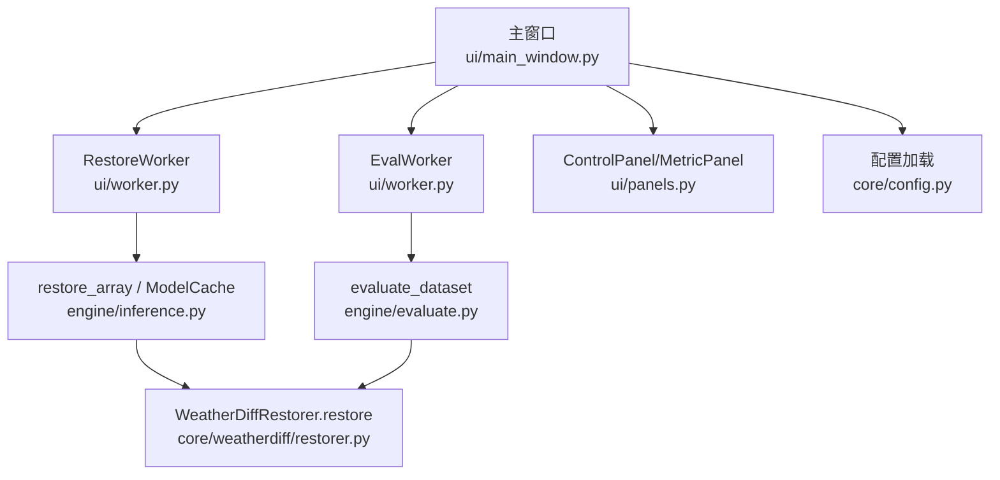
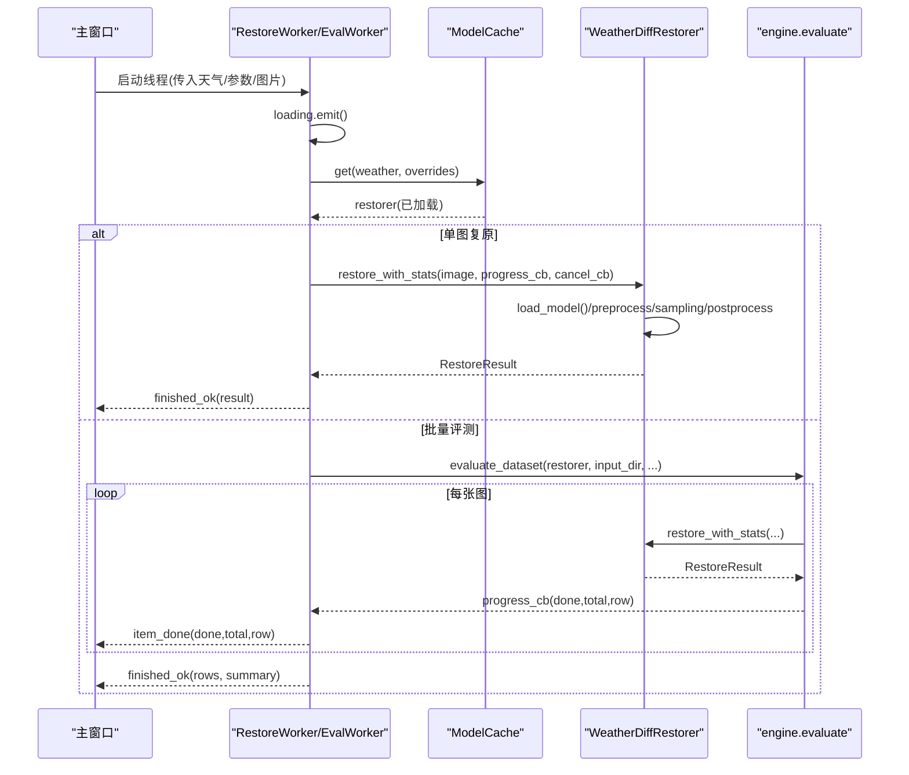
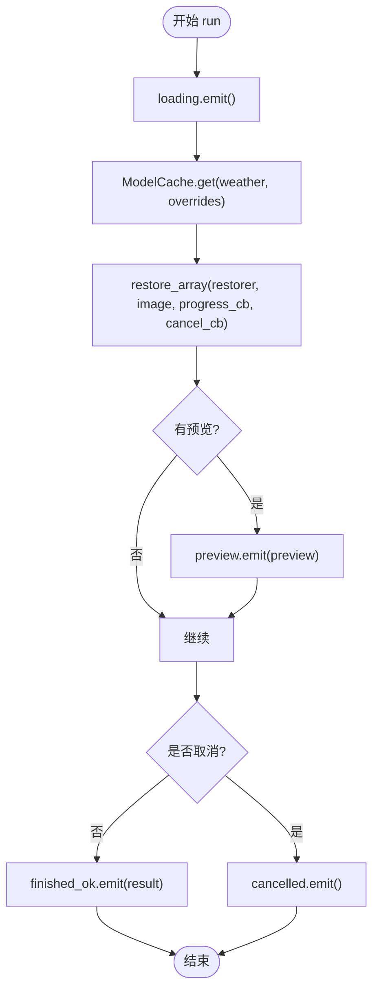
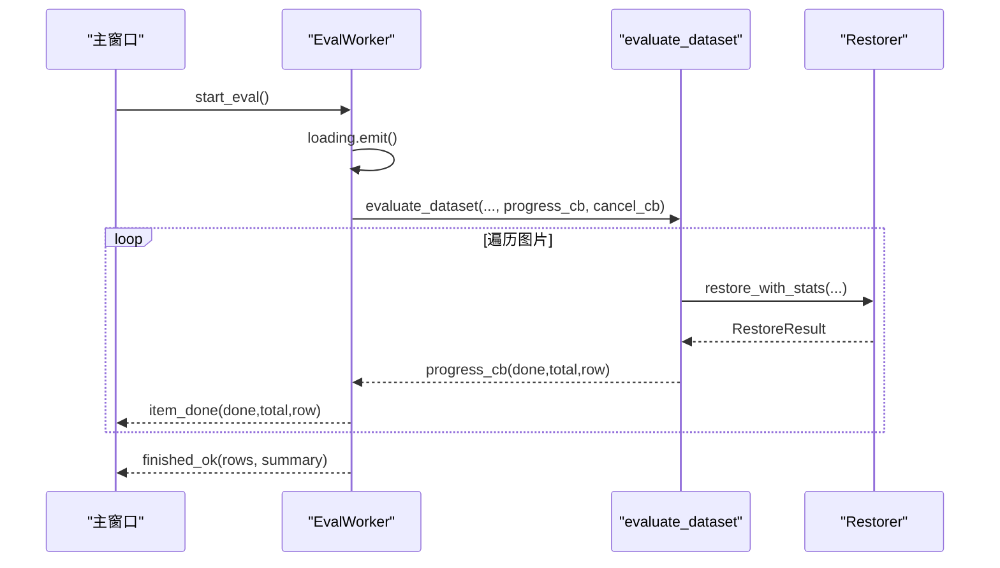
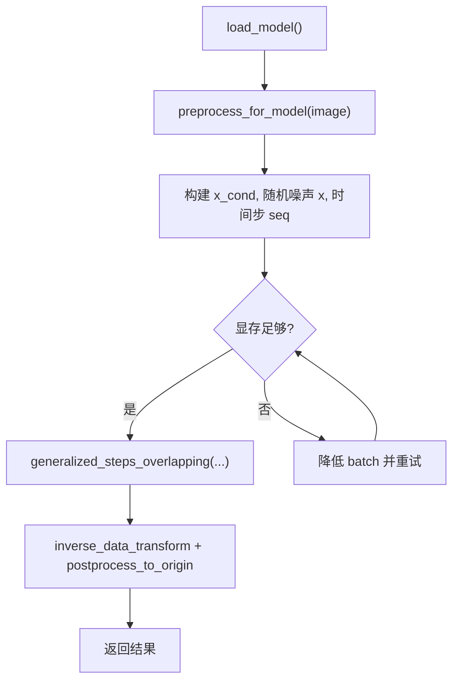
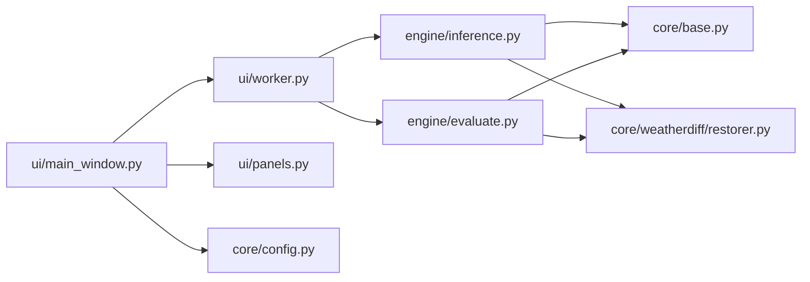

# 工作线程管理

<cite>
**本文引用的文件**
- [ui/worker.py](file://ui/worker.py)
- [ui/main_window.py](file://ui/main_window.py)
- [core/base.py](file://core/base.py)
- [engine/inference.py](file://engine/inference.py)
- [engine/evaluate.py](file://engine/evaluate.py)
- [core/weatherdiff/restorer.py](file://core/weatherdiff/restorer.py)
- [ui/panels.py](file://ui/panels.py)
- [core/config.py](file://core/config.py)
</cite>

## 目录
1. [简介](#简介)
2. [项目结构](#项目结构)
3. [核心组件](#核心组件)
4. [架构总览](#架构总览)
5. [详细组件分析](#详细组件分析)
6. [依赖关系分析](#依赖关系分析)
7. [性能考虑](#性能考虑)
8. [故障排查指南](#故障排查指南)
9. [结论](#结论)
10. [附录](#附录)

## 简介
本文件围绕“工作线程管理”展开，聚焦于界面与后台推理的解耦：通过 PyQt5 的信号槽机制，将 GUI 主线程与耗时任务（模型加载、扩散模型推理、批量评测）分离，确保界面响应性。文档重点说明两类工作线程：
- RestoreWorker：单图复原工作线程，负责模型加载、图像预处理、扩散采样、结果后处理，并通过信号向 UI 反馈进度、预览、完成和错误。
- EvalWorker：批量评测工作线程，负责遍历数据集、逐图恢复、指标计算、进度回调、错误隔离、取消机制与 CSV 导出。

同时，文档梳理了线程安全与资源管理策略（权重缓存、显存释放、异常兜底），以及用户反馈机制（状态栏、进度条、消息框）。

## 项目结构
本项目采用分层组织：UI 层（PyQt5）、引擎层（推理编排与评测）、核心算法层（WeatherDiffusion 复原器）、配置与工具模块。工作线程位于 ui/worker.py，由主窗口 ui/main_window.py 创建并订阅其信号；底层推理与评测逻辑在 engine/inference.py 与 engine/evaluate.py；具体复原实现位于 core/weatherdiff/restorer.py。

图表来源
- [ui/main_window.py:188-214](file://ui/main_window.py#L188-L214)
- [ui/worker.py:32-89](file://ui/worker.py#L32-L89)
- [engine/inference.py:22-77](file://engine/inference.py#L22-L77)
- [engine/evaluate.py:51-116](file://engine/evaluate.py#L51-L116)
- [core/weatherdiff/restorer.py:102-167](file://core/weatherdiff/restorer.py#L102-L167)
- [ui/panels.py:42-159](file://ui/panels.py#L42-L159)
- [core/config.py:25-79](file://core/config.py#L25-L79)

章节来源
- [ui/main_window.py:1-519](file://ui/main_window.py#L1-L519)
- [ui/worker.py:1-162](file://ui/worker.py#L1-L162)
- [engine/inference.py:1-153](file://engine/inference.py#L1-L153)
- [engine/evaluate.py:1-181](file://engine/evaluate.py#L1-L181)
- [core/weatherdiff/restorer.py:1-244](file://core/weatherdiff/restorer.py#L1-L244)
- [ui/panels.py:1-203](file://ui/panels.py#L1-L203)
- [core/config.py:1-98](file://core/config.py#L1-L98)

## 核心组件
- RestoreWorker：继承 QThread，封装单图复原流程。对外暴露 loading、progress、preview、finished_ok、failed、cancelled 信号。内部调用 engine.inference.restore_array，并将进度与预览转发给 UI。
- EvalWorker：继承 QThread，封装批量评测流程。对外暴露 loading、item_done、finished_ok、failed、cancelled 信号。内部调用 engine.evaluate.evaluate_dataset，逐图回调 item_done，并在结束时输出汇总或 CSV。
- ModelCache：按配置名缓存已加载的复原器实例，避免重复加载权重与显存占用；支持 release_others/clear 控制显存。
- WeatherDiffRestorer：实现具体的扩散模型复原流程，包括设备选择、权重加载、预处理、patch-based DDIM 采样、显存不足自动降批重试、后处理还原到原始尺寸。
- BaseRestorer：统一接口契约，定义 restore_with_stats、进度上报、取消检查等通用能力。

章节来源
- [ui/worker.py:32-159](file://ui/worker.py#L32-L159)
- [engine/inference.py:22-77](file://engine/inference.py#L22-L77)
- [core/weatherdiff/restorer.py:32-167](file://core/weatherdiff/restorer.py#L32-L167)
- [core/base.py:37-185](file://core/base.py#L37-L185)

## 架构总览
下图展示从 UI 触发到后台线程执行、再到模型推理与结果回传的完整时序。

图表来源
- [ui/main_window.py:188-214](file://ui/main_window.py#L188-L214)
- [ui/worker.py:63-89](file://ui/worker.py#L63-L89)
- [engine/inference.py:70-77](file://engine/inference.py#L70-L77)
- [engine/evaluate.py:51-116](file://engine/evaluate.py#L51-L116)
- [core/weatherdiff/restorer.py:102-167](file://core/weatherdiff/restorer.py#L102-L167)

## 详细组件分析

### RestoreWorker：单图复原工作线程
- 职责
  - 接收输入图像与天气配置，获取对应复原器。
  - 调用 engine.inference.restore_array 执行恢复，传递进度与取消回调。
  - 将进度、中间预览、完成、失败、取消等事件以信号形式通知 UI。
- 关键流程
  - 启动时发出 loading 信号，UI 显示“正在加载模型/权重”。
  - 通过 ModelCache.get 获取复用复原器，避免重复加载。
  - 使用 progress_cb 将采样步数与可选预览图转发至 UI。
  - 捕获特定异常：WeightNotFoundError 提示缺失权重；RestoreCancelled 转为 cancelled 信号；其他异常打印堆栈并 failed。
- 线程安全
  - 仅在主线程连接信号；线程内不直接操作 UI。
  - 取消通过 _cancel 标志位 + cancel_cb 传递，采样循环中可中断。
- 资源管理
  - 复原器由 ModelCache 统一管理生命周期；关闭主窗口时清理缓存释放显存。

图表来源
- [ui/worker.py:63-89](file://ui/worker.py#L63-L89)
- [engine/inference.py:70-77](file://engine/inference.py#L70-L77)

章节来源
- [ui/worker.py:32-89](file://ui/worker.py#L32-L89)
- [engine/inference.py:22-77](file://engine/inference.py#L22-L77)
- [core/base.py:111-138](file://core/base.py#L111-L138)

### EvalWorker：批量评测工作线程
- 职责
  - 遍历数据集，对每张图进行复原与指标计算。
  - 每完成一张图，通过 item_done 信号返回当前行数据，供 UI 表格增量更新。
  - 全部完成后，返回 rows 与 summary；若指定 csv_path，则导出 CSV。
- 任务队列与进度
  - 无显式队列，按匹配顺序迭代 pairs；limit 限制最大数量。
  - 进度回调 on_progress 将 (done, total, row) 推送给 UI。
- 错误处理
  - 单张图异常被捕获并记录到 row.error，不影响后续图片处理。
  - 整体异常捕获并 failed 信号通知 UI。
- 取消机制
  - 每次迭代前检查 cancel_cb；若取消，终止循环并发出 cancelled 信号。
- 资源管理
  - 同样依赖 ModelCache 复用复原器；CSV 写入在子线程外由主线程触发（write_csv 在 worker 内调用，但为纯 I/O，风险较低）。

图表来源
- [ui/worker.py:128-158](file://ui/worker.py#L128-L158)
- [engine/evaluate.py:51-116](file://engine/evaluate.py#L51-L116)

章节来源
- [ui/worker.py:91-159](file://ui/worker.py#L91-L159)
- [engine/evaluate.py:24-116](file://engine/evaluate.py#L24-L116)

### WeatherDiffRestorer：扩散模型复原流程
- 权重加载
  - 根据配置定位权重路径，不存在抛出 WeightNotFoundError。
  - 构建 UNet，加载 state_dict，兼容 DataParallel 前缀与 EMA 权重覆盖。
  - 设备选择优先 CUDA，可通过环境变量强制。
- 预处理
  - 长边限制、尺寸对齐到 16 的倍数、小图反射填充，保证 patch 划分合理。
- 推理
  - 构造条件输入 x_cond，生成随机噪声 x，设置时间步序列 seq。
  - 使用 generalized_steps_overlapping 进行重叠 patch 采样，支持进度与取消回调。
  - 显存不足时自动降低 patch_batch_size 并重试，直至成功或达到最小值。
- 后处理
  - 反归一化、裁剪/还原到原始尺寸，输出 RGB uint8。
- 进度预览
  - 将中间 tensor 转换为 UI 可用的 RGB uint8，并报告进度。

图表来源
- [core/weatherdiff/restorer.py:47-98](file://core/weatherdiff/restorer.py#L47-L98)
- [core/weatherdiff/restorer.py:102-167](file://core/weatherdiff/restorer.py#L102-L167)

章节来源
- [core/weatherdiff/restorer.py:32-167](file://core/weatherdiff/restorer.py#L32-L167)

### 信号槽模式与 UI 解耦
- 线程间通信
  - 工作线程通过 pyqtSignal 发送 loading、progress、preview、finished_ok、failed、cancelled 等信号。
  - 主窗口通过 connect 将这些信号绑定到 UI 更新函数，避免跨线程直接操作控件。
- 响应性与后台分离
  - 所有耗时操作在 QThread.run 中执行，主线程保持空闲用于渲染与事件循环。
  - 进度与预览通过信号异步投递，UI 实时更新而不阻塞。
- 取消与错误反馈
  - 取消通过 cancel_cb 在工作线程内检测，触发 cancelled 信号。
  - 错误通过 failed 信号携带文本信息，主窗口弹出 QMessageBox 提示。

章节来源
- [ui/worker.py:32-89](file://ui/worker.py#L32-L89)
- [ui/main_window.py:188-250](file://ui/main_window.py#L188-L250)
- [ui/panels.py:42-159](file://ui/panels.py#L42-L159)

## 依赖关系分析
- 耦合与内聚
  - ui/worker.py 仅依赖 engine.* 与 core.base，不直接访问模型细节，内聚良好。
  - engine/inference.py 提供统一的 restore_array/restore_batch，屏蔽底层差异。
  - core/weatherdiff/restorer.py 专注单一算法实现，符合单一职责。
- 外部依赖
  - PyTorch：用于模型加载与推理，缺省时给出明确错误提示。
  - PyQt5：信号槽机制与 UI 框架。
  - NumPy/PIL/YAML：图像处理与配置读取。
- 潜在循环依赖
  - 未发现循环 import；模块边界清晰。

图表来源
- [ui/worker.py:27-29](file://ui/worker.py#L27-L29)
- [engine/inference.py:16-19](file://engine/inference.py#L16-L19)
- [engine/evaluate.py:16-18](file://engine/evaluate.py#L16-L18)
- [core/weatherdiff/restorer.py:24-29](file://core/weatherdiff/restorer.py#L24-L29)

章节来源
- [ui/worker.py:1-162](file://ui/worker.py#L1-L162)
- [engine/inference.py:1-153](file://engine/inference.py#L1-L153)
- [engine/evaluate.py:1-181](file://engine/evaluate.py#L1-L181)
- [core/weatherdiff/restorer.py:1-244](file://core/weatherdiff/restorer.py#L1-L244)

## 性能考虑
- 权重缓存
  - ModelCache 按配置名缓存复原器，切换天气类型不重复加载权重，显著减少 I/O 与显存占用。
  - 支持 release_others/clear 在应用退出或切换时释放显存。
- 显存自适应
  - 扩散采样遇到 OOM 时自动降低 patch_batch_size 重试，提升鲁棒性。
- 进度与预览
  - 预览仅在 emit_preview=True 时发送，避免频繁拷贝大图像导致 UI 卡顿。
- 批量评测
  - 单张失败不中断整批，保证吞吐；limit 参数便于快速调试。
- 设备选择
  - 默认使用 CUDA，可通过环境变量强制 CPU/CUDA，便于测试与部署。

[本节为通用性能建议，不直接分析具体代码]

## 故障排查指南
- 权重缺失
  - 现象：failed 信号携带“权重缺失”信息。
  - 处理：运行下载脚本或手动放置权重至 weights/ 目录，并检查 configs 中的 weights.path。
  - 参考位置：[core/weatherdiff/restorer.py:47-56](file://core/weatherdiff/restorer.py#L47-L56)、[ui/worker.py:82-84](file://ui/worker.py#L82-L84)
- 取消任务
  - 现象：cancelled 信号触发，UI 显示“已取消”。
  - 处理：确认 cancel_cb 正确传递；检查采样循环是否定期调用 check_cancel。
  - 参考位置：[core/base.py:163-166](file://core/base.py#L163-L166)、[ui/worker.py:59-61](file://ui/worker.py#L59-L61)
- 指标不可用
  - 现象：About 页显示某些指标“不可用(缺依赖)”。
  - 处理：安装对应依赖（如 pyiqa、lpips、pytorch_fid）。
  - 参考位置：[ui/main_window.py:452-496](file://ui/main_window.py#L452-L496)
- 显存不足
  - 现象：日志提示“显存不足，patch_batch_size 降为 X 后重试”。
  - 处理：调整 sampling.patch_batch_size 或减小图像尺寸；必要时切换到 CPU。
  - 参考位置：[core/weatherdiff/restorer.py:138-162](file://core/weatherdiff/restorer.py#L138-L162)
- 批量评测部分失败
  - 现象：表格某行 error 字段非空，但不影响其他图片。
  - 处理：查看错误信息，修正输入或 GT 路径；必要时跳过该图。
  - 参考位置：[engine/evaluate.py:107-109](file://engine/evaluate.py#L107-L109)

章节来源
- [core/weatherdiff/restorer.py:47-56](file://core/weatherdiff/restorer.py#L47-L56)
- [ui/worker.py:82-84](file://ui/worker.py#L82-L84)
- [core/base.py:163-166](file://core/base.py#L163-L166)
- [ui/main_window.py:452-496](file://ui/main_window.py#L452-L496)
- [core/weatherdiff/restorer.py:138-162](file://core/weatherdiff/restorer.py#L138-L162)
- [engine/evaluate.py:107-109](file://engine/evaluate.py#L107-L109)

## 结论
本项目通过 QThread + 信号槽实现了 GUI 与后台任务的强解耦，RestoreWorker 与 EvalWorker 分别承担单图复原与批量评测职责，配合 ModelCache 与 WeatherDiffRestorer 的高效实现，保证了良好的用户体验与系统稳定性。线程安全方面，严格遵循“线程内不操作 UI”的原则，并通过异常兜底与取消机制保障健壮性。资源管理方面，权重缓存与显存自适应策略有效降低了内存与显存压力。建议在后续迭代中继续优化预览频率、增加可视化图表与更丰富的质量预设。

[本节为总结性内容，不直接分析具体代码]

## 附录
- 配置与环境
  - 配置文件位于 configs/*.yaml，支持动态加载与显示名称映射。
  - 权重目录 weights/，需提前下载或放置模型文件。
  - 输出目录 outputs/，保存复原结果与评测 CSV。
- 常用入口
  - 单图复原：主窗口“单图复原”页，选择图片与天气类型后点击“开始复原”。
  - 批量评测：主窗口“批量评测”页，选择退化图目录与可选 GT，勾选指标后开始。
- 扩展点
  - 新增复原器：继承 BaseRestorer，实现 load_model 与 restore，并在 registry 注册。
  - 新增天气类型：在 configs/ 添加 yaml，界面下拉框自动发现。

[本节为补充信息，不直接分析具体代码]