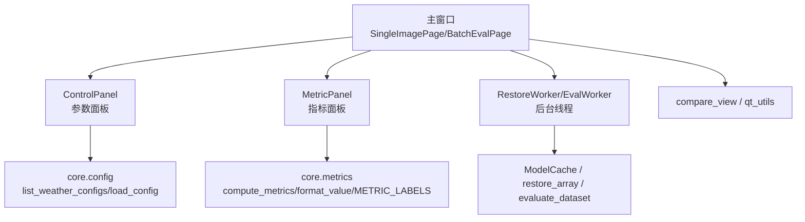
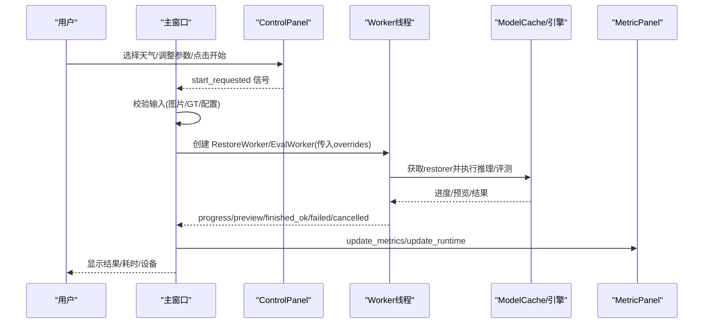
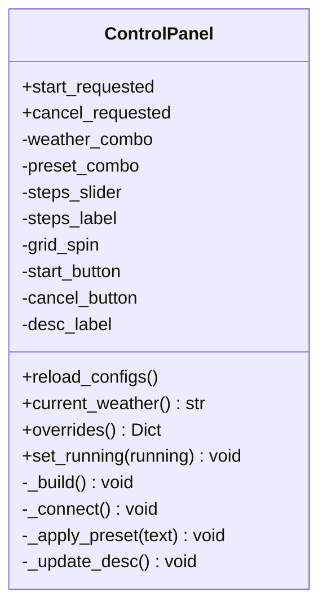
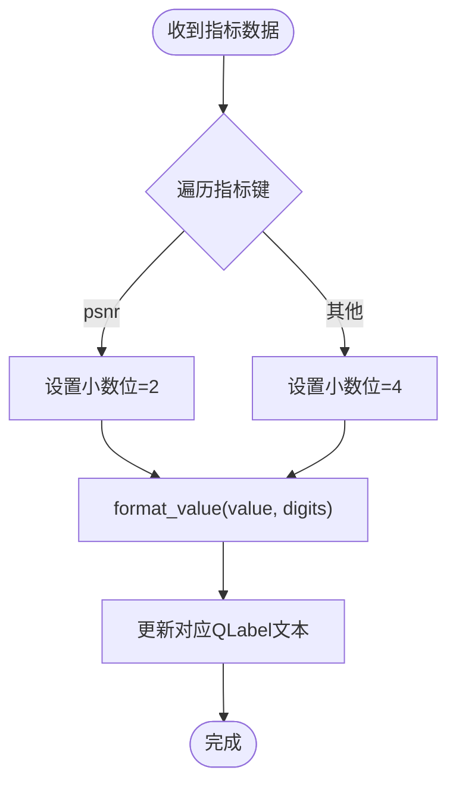
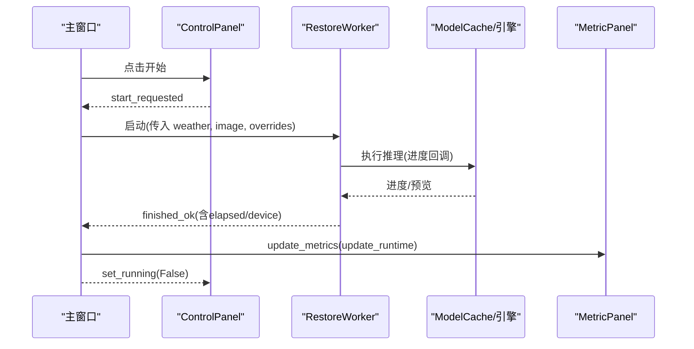
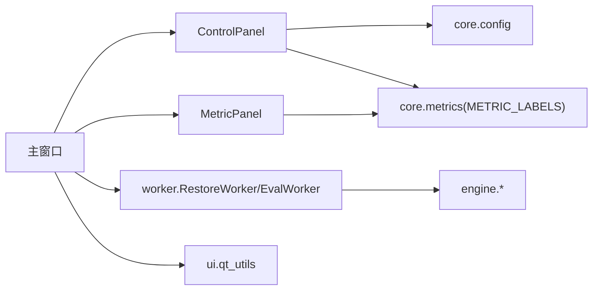

# 控制面板

<cite>
**本文引用的文件**
- [panels.py](file://ui/panels.py)
- [main_window.py](file://ui/main_window.py)
- [worker.py](file://ui/worker.py)
- [metrics.py](file://core/metrics.py)
- [config.py](file://core/config.py)
- [allweather.yaml](file://configs/allweather.yaml)
- [qt_utils.py](file://ui/qt_utils.py)
</cite>

## 目录
1. [简介](#简介)
2. [项目结构](#项目结构)
3. [核心组件](#核心组件)
4. [架构总览](#架构总览)
5. [详细组件分析](#详细组件分析)
6. [依赖关系分析](#依赖关系分析)
7. [性能考量](#性能考量)
8. [故障排查指南](#故障排查指南)
9. [结论](#结论)
10. [附录：扩展指南](#附录扩展指南)

## 简介
本章节面向“控制面板”与“指标面板”，系统性说明 ControlPanel 与 MetricPanel 的设计目标、功能范围、状态管理、信号槽机制，以及与业务逻辑的解耦方式。重点覆盖：
- 模型选择下拉框（天气类型）
- 质量预设（快速/标准/高质量）
- 采样步数调节（滑块+数值显示）
- 滑窗步长 grid_r（步进微调）
- 开始/取消按钮的状态切换
- 指标面板对 PSNR、SSIM、NIQE、BRISQUE 等指标的实时展示与格式化输出
- 控件启用/禁用、输入验证、默认值设置
- 通过信号槽将 UI 与推理/评测线程解耦
- 如何扩展新的参数选项或指标显示

## 项目结构
UI 层由主窗口、参数面板、指标面板、工作线程组成；核心计算与配置在 core 与 engine 层。控制面板位于 ui/panels.py，主窗口编排交互流程于 ui/main_window.py，后台任务在 ui/worker.py，指标计算与格式化在 core/metrics.py，配置文件加载在 core/config.py。

图表来源
- [main_window.py:61-122](file://ui/main_window.py#L61-L122)
- [panels.py:42-162](file://ui/panels.py#L42-L162)
- [worker.py:32-89](file://ui/worker.py#L32-L89)
- [metrics.py:134-203](file://core/metrics.py#L134-L203)
- [config.py:25-74](file://core/config.py#L25-L74)

章节来源
- [main_window.py:61-122](file://ui/main_window.py#L61-L122)
- [panels.py:42-162](file://ui/panels.py#L42-L162)
- [worker.py:32-89](file://ui/worker.py#L32-L89)
- [metrics.py:134-203](file://core/metrics.py#L134-L203)
- [config.py:25-74](file://core/config.py#L25-L74)

## 核心组件
- ControlPanel：封装天气类型、质量预设、采样步数、grid_r、开始/取消等控件，对外仅暴露 start_requested/cancel_requested 两个信号和 overrides() 方法，用于向业务层传递当前参数。
- MetricPanel：以 QFormLayout 组织指标标签，支持更新指标值、运行耗时和设备信息，提供 clear() 重置能力。
- 主窗口 SingleImagePage/BatchEvalPage：负责组装 UI、连接信号槽、驱动 Worker、接收结果并刷新界面。
- Worker 线程：RestoreWorker/EvalWorker 在独立线程执行推理/评测，通过信号回传进度、预览图、完成/失败/取消事件，避免阻塞 UI。
- 指标模块：compute_metrics 统一计算单图指标，format_value 统一格式化输出，METRIC_LABELS 提供表头显示名。
- 配置模块：list_weather_configs/load_config 动态发现 configs/*.yaml，注入 display_name/description 等元信息。

章节来源
- [panels.py:42-162](file://ui/panels.py#L42-L162)
- [panels.py:164-202](file://ui/panels.py#L164-L202)
- [main_window.py:61-251](file://ui/main_window.py#L61-L251)
- [worker.py:32-162](file://ui/worker.py#L32-L162)
- [metrics.py:134-203](file://core/metrics.py#L134-L203)
- [config.py:25-74](file://core/config.py#L25-L74)

## 架构总览
下图展示了从用户操作到结果展示的完整数据流与控制流，体现 UI 与业务逻辑的解耦。

图表来源
- [main_window.py:188-251](file://ui/main_window.py#L188-L251)
- [worker.py:63-89](file://ui/worker.py#L63-L89)
- [panels.py:106-162](file://ui/panels.py#L106-L162)
- [metrics.py:134-203](file://core/metrics.py#L134-L203)

## 详细组件分析

### ControlPanel：参数面板
- 功能要点
  - 天气类型下拉框：动态扫描 configs/*.yaml，读取 display_name 作为显示文本，userData 存储配置名。新增 yaml 即自动生效。
  - 质量预设：三档预设（快速/标准/高质量），选择后联动设置采样步数与 grid_r。
  - 采样步数：水平滑块，范围 2–50，默认 25，右侧实时显示当前值。
  - grid_r：步进为 2，范围 2–64，默认 16。
  - 开始/取消：推理中禁用参数控件，避免中途修改导致状态不一致。
  - 描述标签：根据所选天气加载配置 description，便于用户理解。
- 状态管理
  - set_running(running)：控制按钮与控件的启用/禁用状态。
  - overrides()：返回 sampling.timesteps 与 sampling.grid_r 的覆盖字典，直接传给 ModelCache.get()。
  - current_weather()：返回当前选择的天气配置名。
- 信号槽
  - start_requested/cancel_requested：与主窗口连接，实现 UI 与业务解耦。
  - 内部信号：preset_combo 变化触发 _apply_preset；steps_slider 变化更新 steps_label；weather_combo 变化更新描述。
- 默认值与验证
  - 默认选择“标准 (推荐)”预设。
  - 滑块与 SpinBox 使用 Qt 内置范围限制，无需额外校验。
  - 若配置缺失或读取失败，描述标签会提示错误信息。

图表来源
- [panels.py:42-162](file://ui/panels.py#L42-L162)

章节来源
- [panels.py:42-162](file://ui/panels.py#L42-L162)
- [config.py:25-74](file://core/config.py#L25-L74)

### MetricPanel：指标面板
- 功能要点
  - 指标项：PSNR、SSIM、NIQE、BRISQUE，分别绑定 QLabel，初始显示“-”。
  - 运行时信息：耗时（秒）、设备（如 CPU/CUDA）。
  - 提示信息：PSNR/SSIM 需要 GT 才能计算。
- 显示逻辑
  - update_metrics(metrics)：遍历指标键，按 key 决定小数位数（PSNR 两位，其他四位），调用 format_value 统一格式化。
  - update_runtime(elapsed, device)：格式化耗时字符串，设置设备信息。
  - clear()：将所有指标与运行时信息重置为“-”。
- 数据来源
  - 单图模式：主窗口在恢复完成后调用 compute_metrics(result.image, gt_image, metrics=...) 并传入 MetricPanel。
  - 批量模式：表格行中的指标同样通过 format_value 格式化显示。

图表来源
- [panels.py:189-199](file://ui/panels.py#L189-L199)
- [metrics.py:196-203](file://core/metrics.py#L196-L203)

章节来源
- [panels.py:164-202](file://ui/panels.py#L164-L202)
- [metrics.py:134-203](file://core/metrics.py#L134-L203)

### 主窗口与信号槽：UI 与业务解耦
- 单图复原页
  - 打开图片/选择 GT：加载图像，清空指标，准备就绪。
  - 开始复原：校验输入，设置 running 状态，创建 RestoreWorker，连接 loading/progress/preview/finished_ok/failed/cancelled 信号。
  - 完成回调：设置输出图、刷新对比视图、计算指标、更新 MetricPanel、恢复控件状态。
- 批量评测页
  - 选择目录/勾选指标/限制数量：构建 EvalWorker，连接 item_done/finished_ok/failed/cancelled 信号。
  - 进度回调：更新表格行、汇总摘要、导出 CSV。
- 解耦设计
  - ControlPanel 不关心具体推理过程，只发出开始/取消信号。
  - Worker 线程屏蔽底层异常，统一通过 failed/cancelled 通知 UI。
  - 指标计算与显示分离：compute_metrics 负责计算，MetricPanel 负责展示。

图表来源
- [main_window.py:188-251](file://ui/main_window.py#L188-L251)
- [worker.py:63-89](file://ui/worker.py#L63-L89)
- [panels.py:106-162](file://ui/panels.py#L106-L162)

章节来源
- [main_window.py:188-251](file://ui/main_window.py#L188-L251)
- [worker.py:63-89](file://ui/worker.py#L63-L89)
- [panels.py:106-162](file://ui/panels.py#L106-L162)

### 配置与天气类型：动态发现与显示
- 动态发现：list_weather_configs 扫描 configs/*.y*ml，按 WEATHER_ORDER 排序，确保常用天气优先显示。
- 显示名称：load_config 读取 display_name，若无则回退到 name；description 用于界面提示。
- 权重路径：解析相对路径为绝对路径，便于后续加载。
- 示例配置：allweather.yaml 展示了一个统一模型的配置结构，包含 restorer、weights、data、model、diffusion、sampling 等字段。

章节来源
- [config.py:25-74](file://core/config.py#L25-L74)
- [allweather.yaml:1-47](file://configs/allweather.yaml#L1-L47)

## 依赖关系分析
- 组件耦合
  - ControlPanel 依赖 core.config 进行配置加载，依赖 core.metrics 的 METRIC_LABELS 用于提示文案。
  - MetricPanel 依赖 core.metrics 的 format_value 与 METRIC_LABELS。
  - 主窗口依赖 panels、worker、engine.inference、engine.evaluate、core.metrics、core.config。
  - Worker 依赖 engine.inference/engine.evaluate 与 core.base 的异常类型。
- 外部依赖
  - 指标可用性探测：available_metrics 检测 skimage/lpips/pyiqa/pytorch-fid 等依赖是否安装。
  - 图像转换：ui/qt_utils 提供 numpy 与 QImage/Pixmap 互转工具。

图表来源
- [panels.py:31-33](file://ui/panels.py#L31-L33)
- [main_window.py:49-57](file://ui/main_window.py#L49-L57)
- [worker.py:27-29](file://ui/worker.py#L27-L29)
- [metrics.py:205-219](file://core/metrics.py#L205-L219)
- [qt_utils.py:9-31](file://ui/qt_utils.py#L9-L31)

章节来源
- [panels.py:31-33](file://ui/panels.py#L31-L33)
- [main_window.py:49-57](file://ui/main_window.py#L49-L57)
- [worker.py:27-29](file://ui/worker.py#L27-L29)
- [metrics.py:205-219](file://core/metrics.py#L205-L219)
- [qt_utils.py:9-31](file://ui/qt_utils.py#L9-L31)

## 性能考量
- 指标计算延迟导入：lpips、pyiqa、pytorch-fid 等第三方库采用延迟导入，未安装不影响启动，仅在需要时抛出 MetricUnavailable。
- 缓存策略：LPIPS 模型与 pyiqa 指标对象存在内存缓存，减少重复初始化开销。
- 线程隔离：所有耗时推理/评测在 Worker 线程执行，避免阻塞 UI。
- 进度反馈：通过 progress/preview 信号实时更新 UI，提升用户体验。
- 资源释放：主窗口关闭时清理 ModelCache，避免权重占用。

[本节为通用性能建议，不直接分析具体代码]

## 故障排查指南
- 指标不可用
  - 现象：PSNR/SSIM/LPIPS/NIQE/BRISQUE/FID 显示“-”或报错。
  - 原因：缺少依赖（如 lpips、pyiqa、pytorch-fid）。
  - 处理：安装对应依赖或使用 available_metrics 查看可用性。
- 权重缺失
  - 现象：推理失败，提示权重缺失。
  - 原因：weights 目录不存在或路径错误。
  - 处理：运行脚本下载权重，检查 configs/*.yaml 中 weights.path。
- 配置读取失败
  - 现象：描述标签显示“配置读取失败: ...”。
  - 原因：yaml 格式错误或字段缺失。
  - 处理：修正 yaml 格式，确保包含必要的 display_name/description。
- 尺寸不一致
  - 现象：指标计算抛错“预测与 GT 尺寸不一致”。
  - 原因：GT 与预测图尺寸不同。
  - 处理：对齐尺寸后再计算。

章节来源
- [metrics.py:50-52](file://core/metrics.py#L50-L52)
- [metrics.py:205-219](file://core/metrics.py#L205-L219)
- [worker.py:80-88](file://ui/worker.py#L80-L88)
- [panels.py:133-141](file://ui/panels.py#L133-L141)
- [metrics.py:236-239](file://core/metrics.py#L236-L239)

## 结论
ControlPanel 与 MetricPanel 通过清晰的职责划分与信号槽机制，实现了 UI 与业务逻辑的良好解耦。参数面板提供直观的参数调节与状态管理，指标面板提供统一的指标展示与格式化。配合 Worker 线程与指标模块，系统具备可扩展性、健壮性与良好的用户体验。

[本节为总结性内容，不直接分析具体代码]

## 附录：扩展指南

### 添加新的参数选项
- 在 ControlPanel 中添加新控件（例如 QSpinBox/QComboBox），并在 _build 中布局。
- 在 _connect 中连接 valueChanged/currentIndexChanged 等信号，实现联动或校验。
- 在 overrides() 中返回新参数的覆盖字典，供 ModelCache.get() 使用。
- 如需默认值与范围，参考现有 steps_slider/grid_spin 的设置方式。

章节来源
- [panels.py:63-104](file://ui/panels.py#L63-L104)
- [panels.py:147-154](file://ui/panels.py#L147-L154)

### 添加新的指标显示
- 在 MetricPanel.__init__ 中为新指标添加 QLabel，并使用 METRIC_LABELS 获取显示名。
- 在 update_metrics 中为该指标设定合适的小数位，并调用 format_value 格式化。
- 若该指标需要 GT，可在 hint 中提示用户。
- 在主窗口计算指标时，将新指标加入 compute_metrics 的 metrics 列表。

章节来源
- [panels.py:167-181](file://ui/panels.py#L167-L181)
- [panels.py:189-199](file://ui/panels.py#L189-L199)
- [metrics.py:134-177](file://core/metrics.py#L134-L177)

### 接入新的天气类型
- 在 configs/ 目录下新增 yaml 文件，填写 display_name、description、restorer、weights、sampling 等必要字段。
- 重启应用后，ControlPanel 会自动发现并显示新天气类型。
- 可通过 load_config 读取 description 用于界面提示。

章节来源
- [config.py:60-74](file://core/config.py#L60-L74)
- [panels.py:114-124](file://ui/panels.py#L114-L124)
- [allweather.yaml:1-47](file://configs/allweather.yaml#L1-L47)