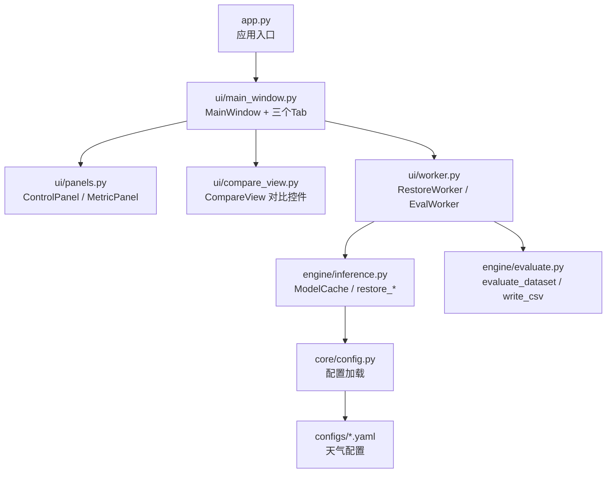
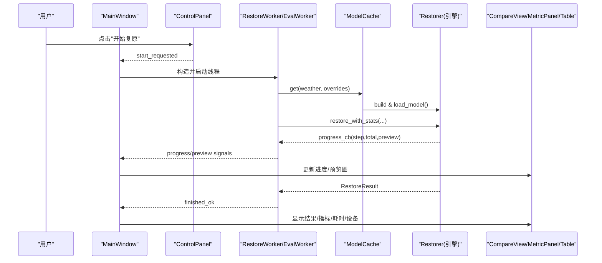
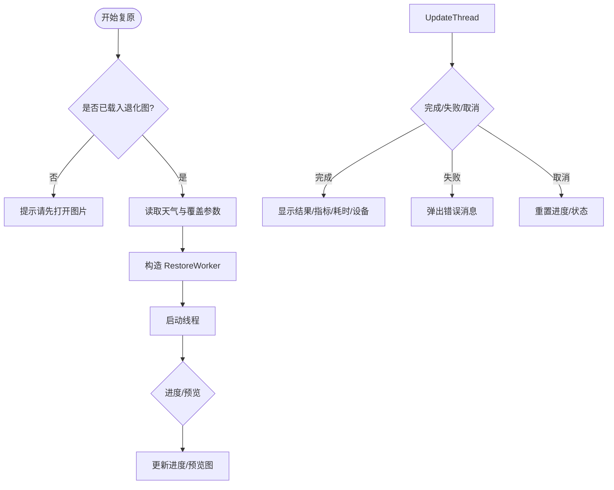
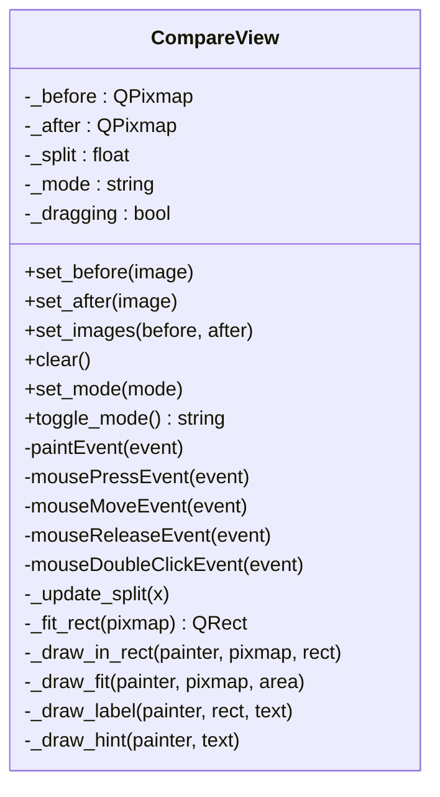
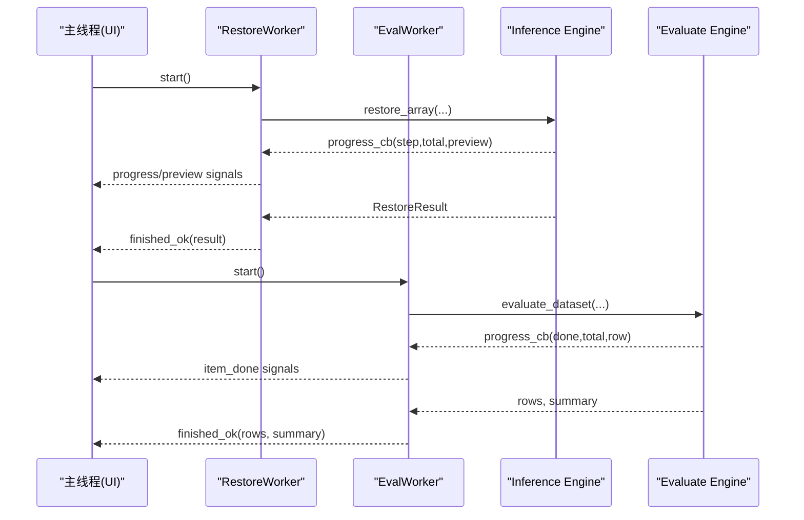
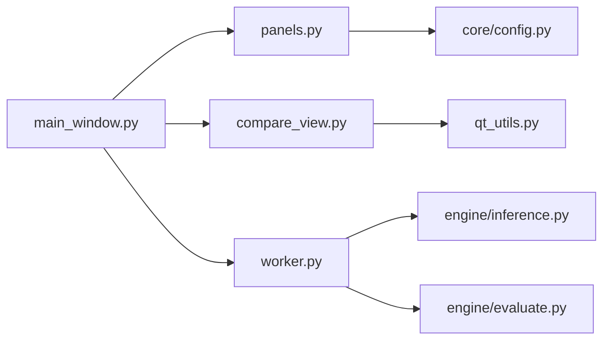

# 用户界面

<cite>
**本文引用的文件**
- [app.py](file://app.py)
- [ui/main_window.py](file://ui/main_window.py)
- [ui/compare_view.py](file://ui/compare_view.py)
- [ui/panels.py](file://ui/panels.py)
- [ui/worker.py](file://ui/worker.py)
- [ui/qt_utils.py](file://ui/qt_utils.py)
- [engine/inference.py](file://engine/inference.py)
- [engine/evaluate.py](file://engine/evaluate.py)
- [core/config.py](file://core/config.py)
- [configs/allweather.yaml](file://configs/allweather.yaml)
</cite>

## 目录
1. [简介](#简介)
2. [项目结构](#项目结构)
3. [核心组件](#核心组件)
4. [架构总览](#架构总览)
5. [详细组件分析](#详细组件分析)
6. [依赖关系分析](#依赖关系分析)
7. [性能与响应性](#性能与响应性)
8. [故障排查指南](#故障排查指南)
9. [结论](#结论)
10. [附录：定制与扩展指南](#附录：定制与扩展指南)

## 简介
本文件面向基于 PyQt5 的图形用户界面，系统化说明主窗口的三标签页布局（单图复原、批量评测、环境检查），图像对比视图的实现方式（原图、退化图、复原图的并排显示与同步操作），控制面板的功能（模型选择、参数调节、进度显示等交互元素），以及工作线程的设计（保证界面响应性与后台任务处理）。同时提供界面定制与扩展建议、用户操作流程与最佳实践。

## 项目结构
界面相关代码集中在 ui 目录下，入口为 app.py，启动后创建 MainWindow，内部包含三个 Tab：
- 单图复原：打开/拖入图片、选择 GT、参数设置、开始/取消、结果保存、指标展示
- 批量评测：选择输入/GT/输出目录、勾选指标、限制数量、表格实时刷新、导出 CSV
- 关于/环境：显示依赖状态、指标可用性、GPU 信息、权重目录情况

图表来源
- [app.py:19-32](file://app.py#L19-L32)
- [ui/main_window.py:499-515](file://ui/main_window.py#L499-L515)
- [ui/panels.py:42-162](file://ui/panels.py#L42-L162)
- [ui/compare_view.py:30-73](file://ui/compare_view.py#L30-L73)
- [ui/worker.py:32-162](file://ui/worker.py#L32-L162)
- [engine/inference.py:22-68](file://engine/inference.py#L22-L68)
- [engine/evaluate.py:51-116](file://engine/evaluate.py#L51-L116)
- [core/config.py:25-79](file://core/config.py#L25-L79)
- [configs/allweather.yaml:1-47](file://configs/allweather.yaml#L1-L47)

章节来源
- [app.py:19-32](file://app.py#L19-L32)
- [ui/main_window.py:499-515](file://ui/main_window.py#L499-L515)

## 核心组件
- 主窗口与标签页：MainWindow 负责创建 QTabWidget，并添加“单图复原”、“批量评测”、“关于/环境”三个页面。
- 单图复原页：SingleImagePage 集成 CompareView、ControlPanel、MetricPanel，支持拖拽/打开图片、选择 GT、开始/取消复原、保存结果、显示指标。
- 批量评测页：BatchEvalPage 提供目录选择、指标勾选、限制张数、表格实时更新、导出 CSV。
- 对比视图：CompareView 支持擦除模式（滑动条）和并排模式（左右两图），可双击切换模式，支持鼠标拖动中缝。
- 控制面板：ControlPanel 提供天气类型下拉框、质量预设、采样步数滑块、滑窗步长 grid_r、开始/取消按钮，运行时禁用参数避免状态混乱。
- 指标面板：MetricPanel 展示 PSNR/SSIM/NIQE/BRISQUE 及耗时、设备信息。
- 工作线程：RestoreWorker 用于单图复原，EvalWorker 用于批量评测；两者通过信号与主线程通信，确保 UI 不阻塞。
- 工具函数：qt_utils 提供 numpy 图像与 Qt 对象转换。

章节来源
- [ui/main_window.py:61-251](file://ui/main_window.py#L61-L251)
- [ui/main_window.py:253-439](file://ui/main_window.py#L253-L439)
- [ui/compare_view.py:30-191](file://ui/compare_view.py#L30-L191)
- [ui/panels.py:42-203](file://ui/panels.py#L42-L203)
- [ui/worker.py:32-162](file://ui/worker.py#L32-L162)
- [ui/qt_utils.py:9-31](file://ui/qt_utils.py#L9-L31)

## 架构总览
界面层通过信号槽与后台线程解耦，线程执行推理与评测逻辑，完成后回调更新 UI。模型权重通过 ModelCache 缓存，减少重复加载。

图表来源
- [ui/main_window.py:188-240](file://ui/main_window.py#L188-L240)
- [ui/worker.py:63-89](file://ui/worker.py#L63-L89)
- [engine/inference.py:33-52](file://engine/inference.py#L33-L52)

## 详细组件分析

### 主窗口与三标签页
- MainWindow 初始化时创建 ModelCache，构建 QTabWidget，依次添加 SingleImagePage、BatchEvalPage、AboutPage。
- 关闭事件清理模型缓存，释放显存。

章节来源
- [ui/main_window.py:499-515](file://ui/main_window.py#L499-L515)

### 单图复原页（SingleImagePage）
- 布局：左侧为对比视图+进度+状态，右侧为控制面板+指标面板。使用 QSplitter 可调整比例。
- 交互：支持拖拽图片到视图区域；打开图片/选择 GT；保存结果；切换对比模式。
- 流程：点击“开始复原”后，读取当前天气与覆盖参数，构造 RestoreWorker 并启动；监听 loading/progress/preview/finished/failed/cancelled 信号更新 UI。
- 指标：若提供了 GT，计算 PSNR/SSIM；否则仅显示耗时与设备。

图表来源
- [ui/main_window.py:188-240](file://ui/main_window.py#L188-L240)
- [ui/worker.py:63-89](file://ui/worker.py#L63-L89)

章节来源
- [ui/main_window.py:61-251](file://ui/main_window.py#L61-L251)

### 批量评测页（BatchEvalPage）
- 布局：左侧为目录选择、指标勾选、限制张数、表格、进度、摘要、导出按钮；右侧为控制面板。
- 流程：校验输入目录，读取天气与覆盖参数，构造 EvalWorker；每完成一张图通过 item_done 信号更新表格与进度；完成后汇总均值并显示。
- 导出：将 EvalRow 列表写入 CSV，便于后续分析与答辩展示。

章节来源
- [ui/main_window.py:253-439](file://ui/main_window.py#L253-L439)
- [engine/evaluate.py:51-116](file://engine/evaluate.py#L51-L116)
- [engine/evaluate.py:119-132](file://engine/evaluate.py#L119-L132)

### 图像对比视图（CompareView）
- 模式：擦除模式（wipe）与并排模式（side-by-side），双击或按钮切换。
- 绘制：等比缩放居中显示；擦除模式下按 split 位置裁剪显示退化图，右侧显示复原图，中间有手柄可拖动。
- 交互：鼠标按下/移动/释放控制 split；双击切换模式；支持最小尺寸与自适应大小策略。

图表来源
- [ui/compare_view.py:30-191](file://ui/compare_view.py#L30-L191)

章节来源
- [ui/compare_view.py:30-191](file://ui/compare_view.py#L30-L191)

### 控制面板（ControlPanel）
- 功能：天气类型下拉框（动态扫描 configs/*.yaml）、质量预设（快速/标准/高质量）、采样步数滑块、grid_r 步进器、开始/取消按钮。
- 行为：选择预设自动填充 timesteps/grid_r；选择天气后显示描述；运行中禁用参数避免状态混乱。
- 输出：current_weather() 返回当前配置名；overrides() 打包覆盖参数供 ModelCache.get() 使用。

章节来源
- [ui/panels.py:42-162](file://ui/panels.py#L42-L162)
- [core/config.py:60-79](file://core/config.py#L60-L79)

### 指标面板（MetricPanel）
- 展示：PSNR/SSIM/NIQE/BRISQUE 四项指标，耗时与设备信息，提示信息（需要 GT 才能计算 PSNR/SSIM）。
- 更新：update_metrics() 格式化数值；update_runtime() 显示耗时与设备。

章节来源
- [ui/panels.py:164-203](file://ui/panels.py#L164-L203)

### 工作线程（RestoreWorker / EvalWorker）
- 设计原则：所有耗时操作在 QThread 中执行，通过 pyqtSignal 与主线程通信，避免阻塞 UI。
- 信号约定：loading、progress/preview、finished_ok、failed、cancelled。
- 取消机制：主线程调用 cancel() 设置标志位，线程在下一个采样步检测并退出。
- 异常处理：捕获特定异常（如权重缺失）与通用异常，打印堆栈并通过 failed 信号上报。

图表来源
- [ui/worker.py:32-162](file://ui/worker.py#L32-L162)
- [engine/inference.py:70-78](file://engine/inference.py#L70-L78)
- [engine/evaluate.py:51-116](file://engine/evaluate.py#L51-L116)

章节来源
- [ui/worker.py:32-162](file://ui/worker.py#L32-L162)

### 工具与数据流
- qt_utils：numpy_to_qimage/numpy_to_pixmap/qimage_to_numpy，确保内存连续与格式正确，避免花屏。
- 配置加载：list_weather_configs 扫描 configs/*.yaml，按顺序填充下拉框；load_config 解析相对路径并注入绝对路径。
- 模型缓存：ModelCache.get 根据 weather 与 overrides 获取 restorer，避免重复加载权重；release_others/clear 管理显存。

章节来源
- [ui/qt_utils.py:9-31](file://ui/qt_utils.py#L9-L31)
- [core/config.py:25-79](file://core/config.py#L25-L79)
- [engine/inference.py:22-68](file://engine/inference.py#L22-L68)

## 依赖关系分析
- 界面层依赖：
  - main_window 依赖 panels、compare_view、worker、engine、core。
  - compare_view 依赖 qt_utils。
  - worker 依赖 engine/inference、engine/evaluate、core/base。
  - panels 依赖 core/config、core/metrics。
- 外部依赖：PyQt5、numpy、torch、pyyaml、PIL、skimage、pyiqa、lpips、pytorch_fid（部分可选）。

图表来源
- [ui/main_window.py:49-56](file://ui/main_window.py#L49-L56)
- [ui/compare_view.py:27-27](file://ui/compare_view.py#L27-L27)
- [ui/worker.py:27-29](file://ui/worker.py#L27-L29)
- [ui/panels.py:31-32](file://ui/panels.py#L31-L32)

章节来源
- [ui/main_window.py:49-56](file://ui/main_window.py#L49-L56)
- [ui/compare_view.py:27-27](file://ui/compare_view.py#L27-L27)
- [ui/worker.py:27-29](file://ui/worker.py#L27-L29)
- [ui/panels.py:31-32](file://ui/panels.py#L31-L32)

## 性能与响应性
- 线程化：所有耗时推理与评测在 QThread 中执行，通过信号异步更新 UI，保证界面流畅。
- 模型缓存：ModelCache 避免重复加载权重，降低显存占用与启动时间。
- 预览更新：单图复原支持 preview 信号，逐步渲染中间结果，提升交互体验。
- 指标计算：NIQE/BRISQUE 较慢，建议在必要时单独线程或延迟计算（已有 TODO 注释）。
- 资源释放：关闭窗口时清理模型缓存，避免显存泄漏。

[本节为通用性能建议，无需具体文件引用]

## 故障排查指南
- 权重缺失：线程捕获 WeightNotFoundError，弹出提示并显示缺失路径；请确认 weights 目录存在对应权重文件。
- 依赖缺失：About 页面列出依赖模块与版本，未安装会显示“未安装”；请按需安装依赖。
- 指标不可用：About 页面显示指标可用性；某些指标依赖第三方库，需安装对应包。
- GPU 信息：About 页面显示 CUDA 可用性与设备名称；若不可用，检查驱动与环境变量。
- 配置文件：新增天气只需在 configs 下添加 yaml，界面会自动识别；若读取失败，检查 YAML 语法与字段。

章节来源
- [ui/worker.py:80-88](file://ui/worker.py#L80-L88)
- [ui/main_window.py:441-496](file://ui/main_window.py#L441-L496)
- [core/config.py:25-57](file://core/config.py#L25-L57)

## 结论
该界面以清晰的三标签页组织功能，结合线程化与模型缓存实现高效、响应的用户体验。对比视图支持擦除与并排两种模式，便于直观评估复原效果。控制面板提供灵活的参数调节与预设，批量评测支持指标勾选与 CSV 导出。整体架构模块化良好，易于扩展与维护。

[本节为总结性内容，无需具体文件引用]

## 附录：定制与扩展指南

### 样式修改
- 主题色与字体：可在 QApplication 级别设置全局样式表，或在各控件上设置局部样式。
- 控件外观：通过 setStyleSheet 调整按钮、滑块、表格等样式；注意保持可读性与一致性。
- 布局优化：使用 QSplitter 调整左右面板比例；对大分辨率屏幕适配最小尺寸与拉伸策略。

### 新功能添加
- 新天气类型：在 configs 目录新增 yaml 文件，界面会自动扫描并加入下拉框。
- 新指标：在 core/metrics 中添加指标计算与标签映射，并在 MetricPanel 中注册显示。
- 新对比模式：在 CompareView 中扩展 mode 与绘制逻辑，并提供切换入口。
- 新导出格式：在 engine/evaluate.py 中扩展导出函数，并在 BatchEvalPage 增加按钮与回调。

### 用户操作流程与最佳实践
- 单图复原：
  1) 打开或拖入退化图；2) 可选地选择 GT；3) 选择天气与质量预设；4) 点击“开始复原”；5) 查看进度与预览；6) 保存结果；7) 查看指标。
- 批量评测：
  1) 选择输入/GT/输出目录；2) 勾选需要的指标；3) 设置限制张数；4) 点击“开始评测”；5) 观察表格与进度；6) 导出 CSV。
- 环境检查：
  1) 切换到“关于/环境”页；2) 查看依赖与指标可用性；3) 根据提示安装缺失依赖或下载权重。
- 最佳实践：
  - 首次运行建议先下载权重或使用假模型开关验证界面。
  - 大批量评测时合理设置 limit，避免长时间等待。
  - 如需更高精度，选择“高质量”预设并适当增加采样步数。
  - 定期清理模型缓存以释放显存（关闭窗口会自动清理）。

[本节为通用指导，无需具体文件引用]