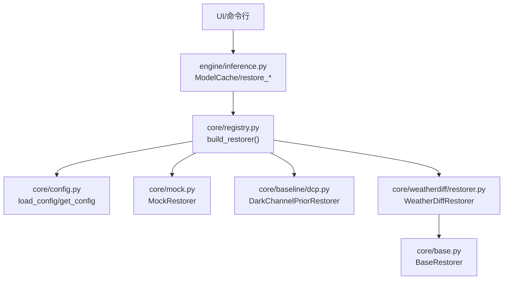
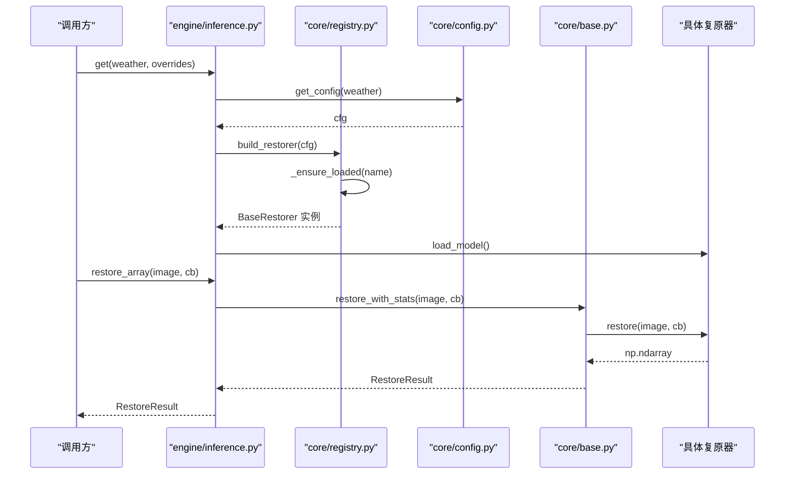
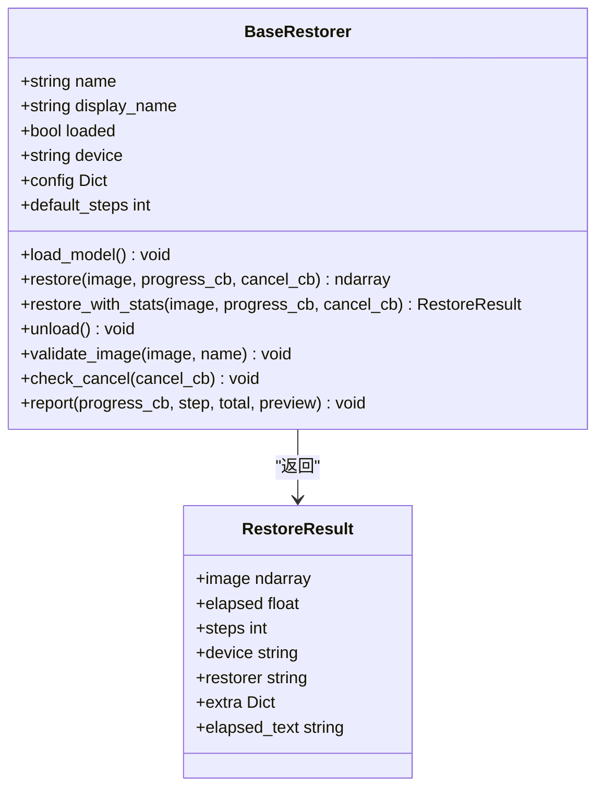
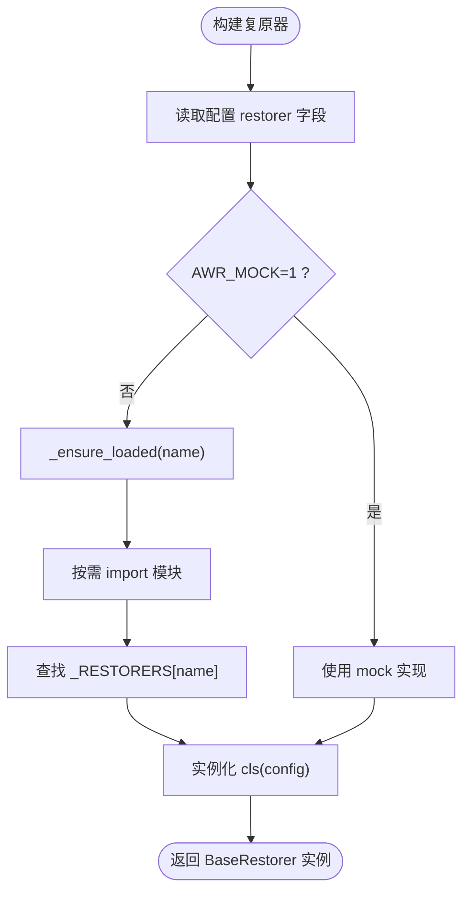
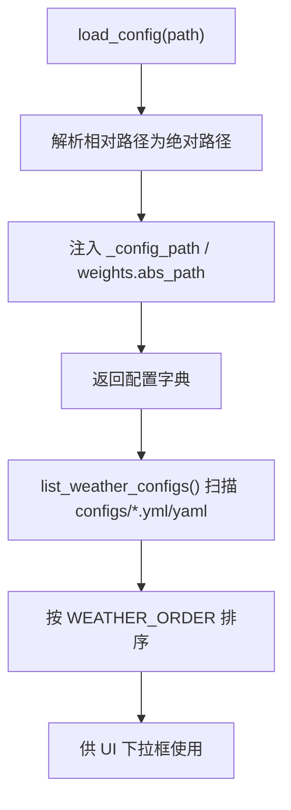
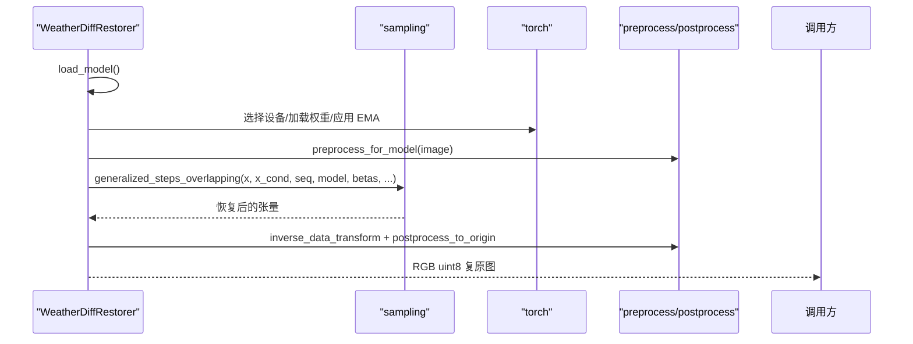
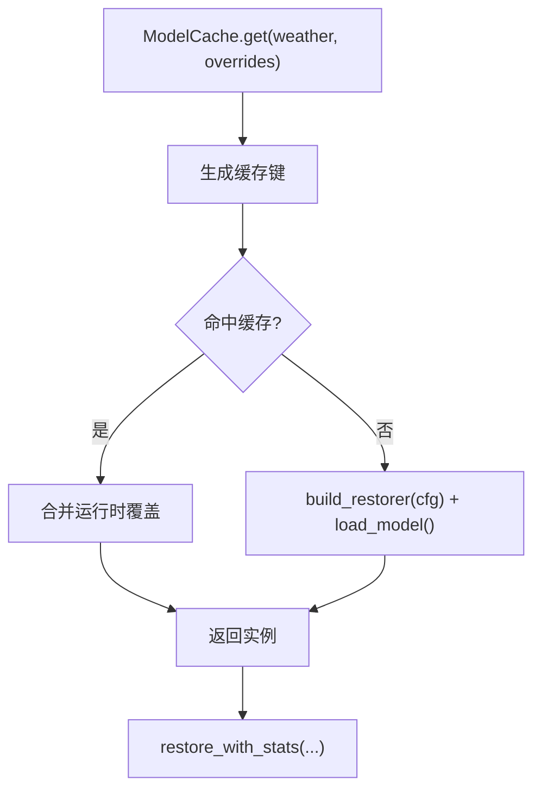
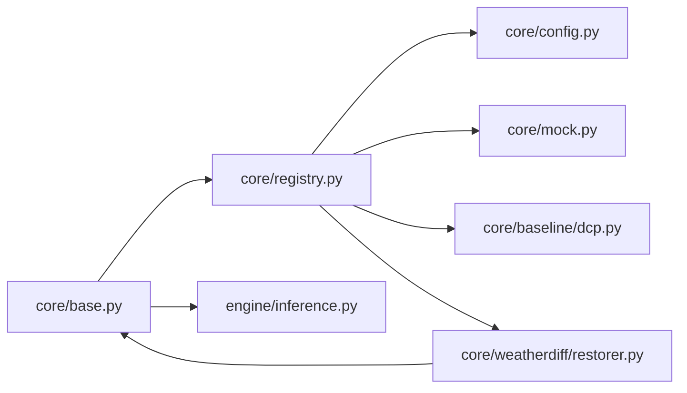

# 扩展点设计

<cite>
**本文引用的文件**
- [core/base.py](file://core/base.py)
- [core/registry.py](file://core/registry.py)
- [core/config.py](file://core/config.py)
- [core/mock.py](file://core/mock.py)
- [core/baseline/dcp.py](file://core/baseline/dcp.py)
- [core/weatherdiff/restorer.py](file://core/weatherdiff/restorer.py)
- [engine/inference.py](file://engine/inference.py)
- [configs/allweather.yaml](file://configs/allweather.yaml)
- [configs/haze.yaml](file://configs/haze.yaml)
- [configs/snow.yaml](file://configs/snow.yaml)
- [configs/dcp.yaml](file://configs/dcp.yaml)
- [configs/mock.yaml](file://configs/mock.yaml)
- [app.py](file://app.py)
</cite>

## 目录
1. [简介](#简介)
2. [项目结构](#项目结构)
3. [核心组件](#核心组件)
4. [架构总览](#架构总览)
5. [详细组件分析](#详细组件分析)
6. [依赖关系分析](#依赖关系分析)
7. [性能考量](#性能考量)
8. [故障排查指南](#故障排查指南)
9. [结论](#结论)
10. [附录：扩展示例与最佳实践](#附录扩展示例与最佳实践)

## 简介
本设计文档面向“可扩展性设计与插件机制”，围绕统一复原接口契约、注册表机制、配置系统与推理编排，说明如何以最小改动集成新算法或新天气类型。重点包括：
- BaseRestorer 抽象类的设计与契约
- 通过装饰器与注册表动态加载复原器
- 基于 YAML 的配置系统扩展
- 新增天气类型或复原算法的完整流程
- 版本兼容性与向后兼容性策略
- 常见陷阱与最佳实践

## 项目结构
本项目采用分层组织：
- core：定义统一接口契约（BaseRestorer）、配置加载、模型注册表、具体复原器实现（mock、dcp、weatherdiff）
- engine：推理编排、权重缓存、批量处理
- configs：按天气/方法划分的 YAML 配置
- ui/app：界面与启动入口

图表来源
- [core/registry.py:29-84](file://core/registry.py#L29-L84)
- [engine/inference.py:22-67](file://engine/inference.py#L22-L67)
- [core/config.py:25-91](file://core/config.py#L25-L91)
- [core/base.py:61-185](file://core/base.py#L61-L185)

章节来源
- [core/base.py:1-185](file://core/base.py#L1-L185)
- [core/registry.py:1-85](file://core/registry.py#L1-L85)
- [core/config.py:1-98](file://core/config.py#L1-L98)
- [engine/inference.py:1-153](file://engine/inference.py#L1-L153)

## 核心组件
- BaseRestorer：统一复原接口契约，规定输入输出格式、进度回调、取消回调、结果封装、默认步骤等。所有复原器必须继承并实现 load_model 与 restore。
- 注册表 registry：通过 @register_restorer 装饰器将复原器类登记到名称映射；build_restorer 根据配置中的 restorer 字段动态构造实例，支持延迟导入与 AWR_MOCK 降级。
- 配置系统 config：读取 YAML，解析相对路径为绝对路径，提供 list_weather_configs、get_config、weight_path 等工具。
- 推理引擎 engine/inference：ModelCache 负责按配置名缓存已加载的复原器实例；提供 restore_array/restore_file/restore_batch 等统一入口。

章节来源
- [core/base.py:45-185](file://core/base.py#L45-L185)
- [core/registry.py:18-84](file://core/registry.py#L18-L84)
- [core/config.py:25-91](file://core/config.py#L25-L91)
- [engine/inference.py:22-67](file://engine/inference.py#L22-L67)

## 架构总览
下图展示了从配置到复原执行的端到端流程，以及各扩展点的位置。

图表来源
- [engine/inference.py:33-77](file://engine/inference.py#L33-L77)
- [core/registry.py:49-84](file://core/registry.py#L49-L84)
- [core/config.py:77-91](file://core/config.py#L77-L91)
- [core/base.py:111-138](file://core/base.py#L111-L138)

## 详细组件分析

### BaseRestorer 抽象类与接口契约
- 契约要点
  - 输入图像：numpy.ndarray，dtype=uint8，shape=(H, W, 3)，RGB
  - 输出图像：与输入尺寸一致
  - 进度回调：progress_cb(step, total, preview)
  - 取消回调：cancel_cb() -> bool，返回 True 时应尽快抛出 RestoreCancelled
- 关键能力
  - restore_with_stats：统一计时、校验、封装 RestoreResult
  - default_steps：用于 UI 进度条预估步数
  - validate_image/check_cancel/report：通用校验与回调安全上报
- 异常约定
  - WeightNotFoundError：权重缺失
  - RestoreCancelled：用户取消

图表来源
- [core/base.py:45-185](file://core/base.py#L45-L185)

章节来源
- [core/base.py:61-185](file://core/base.py#L61-L185)

### 注册表与动态加载
- 装饰器 @register_restorer(name)：将子类登记到全局映射，同时设置类属性 name
- 延迟导入：_LAZY_MODULES 维护内置实现模块，避免启动即导入 torch
- build_restorer(config)：根据配置中 restorer 字段构建实例；AWR_MOCK=1 时强制降级为 mock
- available_restorers()：列出可用复原器（含未加载的）

图表来源
- [core/registry.py:29-84](file://core/registry.py#L29-L84)

章节来源
- [core/registry.py:1-85](file://core/registry.py#L1-L85)

### 配置系统与扩展机制
- 配置文件位置：configs/*.yaml
- 自动发现：list_weather_configs() 扫描 configs 目录，按 WEATHER_ORDER 排序显示
- 路径解析：load_config 将 weights.path 解析为绝对路径，注入 abs_path
- 运行时覆盖：engine.inference._deep_update 支持合并采样参数等运行时覆盖，无需重新加载权重
- 权重路径：weight_path(cfg) 返回绝对路径或 None（如 DCP 无权重）

图表来源
- [core/config.py:25-91](file://core/config.py#L25-L91)
- [core/config.py:60-74](file://core/config.py#L60-L74)

章节来源
- [core/config.py:1-98](file://core/config.py#L1-L98)

### WeatherDiffusion 复原器（示例实现）
- 职责：设备选择、权重加载（兼容 DataParallel 前缀、EMA）、预处理、patch-based DDIM 采样、显存不足自适应降批、后处理还原原始尺寸
- 配置项：data/model/diffusion/sampling/weights
- 进度与取消：通过 sampling 层回调包装，将张量预览转为 RGB uint8 上报
- 错误处理：显存不足时自动减半 patch_batch_size 重试；找不到权重抛 WeightNotFoundError

图表来源
- [core/weatherdiff/restorer.py:47-167](file://core/weatherdiff/restorer.py#L47-L167)

章节来源
- [core/weatherdiff/restorer.py:1-244](file://core/weatherdiff/restorer.py#L1-L244)

### Mock 与 DCP 复原器（对照与兜底）
- MockRestorer：纯 numpy，模拟逐步去噪过程，便于联调与演示
- DarkChannelPriorRestorer：传统暗通道先验去雾，无需权重/GPU，作为非扩散方法对照

章节来源
- [core/mock.py:27-81](file://core/mock.py#L27-L81)
- [core/baseline/dcp.py:23-126](file://core/baseline/dcp.py#L23-L126)

### 推理编排与权重缓存
- ModelCache：按 weather 键缓存已加载的复原器实例；支持 release_others/clear 控制显存
- restore_array/restore_file/restore_batch：统一入口，封装进度与错误处理
- 运行时覆盖：_deep_update 可合并 sampling 等参数，避免重复加载权重

图表来源
- [engine/inference.py:22-67](file://engine/inference.py#L22-L67)
- [engine/inference.py:70-143](file://engine/inference.py#L70-L143)

章节来源
- [engine/inference.py:1-153](file://engine/inference.py#L1-L153)

## 依赖关系分析
- 耦合与内聚
  - base.py 仅暴露接口契约，被 UI/评测/各复原器共同依赖，内聚高、耦合低
  - registry.py 解耦上层与具体实现，通过名称映射与延迟导入降低启动开销
  - config.py 集中管理配置与路径解析，减少散落的路径逻辑
  - engine/inference.py 聚合推理流程与缓存，屏蔽底层差异
- 外部依赖
  - PyTorch：仅在 weatherdiff 实现中引入，且延迟导入
  - PyYAML：用于配置加载
  - PyQt5：仅在 app.py 启动 UI 时引入

图表来源
- [core/base.py:1-185](file://core/base.py#L1-L185)
- [core/registry.py:1-85](file://core/registry.py#L1-L85)
- [engine/inference.py:1-153](file://engine/inference.py#L1-L153)

章节来源
- [core/base.py:1-185](file://core/base.py#L1-L185)
- [core/registry.py:1-85](file://core/registry.py#L1-L85)
- [engine/inference.py:1-153](file://engine/inference.py#L1-L153)

## 性能考量
- 延迟导入：避免在无 torch 环境启动时报错，提升 UI 启动速度
- 权重缓存：ModelCache 避免重复加载权重与显存占用
- 显存自适应：weatherdiff 在 OOM 时自动降低 patch_batch_size 并重试
- 进度与取消：在耗时循环中定期 check_cancel，保障交互响应
- 配置覆盖：运行时修改 sampling 参数无需重新加载权重

[本节为通用指导，不直接分析具体文件]

## 故障排查指南
- 找不到权重文件
  - 现象：WeightNotFoundError
  - 处理：执行下载脚本或手动放置权重至 weights/，检查 configs 中 weights.path
  - 参考：[core/weatherdiff/restorer.py:47-56](file://core/weatherdiff/restorer.py#L47-L56)
- 未知 restorer
  - 现象：KeyError/RuntimeError
  - 处理：确认 configs 中 restorer 字段与注册表匹配；必要时在 registry 中添加延迟模块
  - 参考：[core/registry.py:49-61](file://core/registry.py#L49-L61)
- 输出尺寸不一致
  - 现象：ValueError
  - 处理：确保 restore 输出与输入尺寸一致，或在内部恢复到原始尺寸
  - 参考：[core/base.py:127-131](file://core/base.py#L127-L131)
- 取消无效
  - 现象：无法中断推理
  - 处理：在耗时循环中调用 check_cancel，并在适当时机抛出 RestoreCancelled
  - 参考：[core/base.py:163-166](file://core/base.py#L163-L166)

章节来源
- [core/weatherdiff/restorer.py:47-56](file://core/weatherdiff/restorer.py#L47-L56)
- [core/registry.py:49-61](file://core/registry.py#L49-L61)
- [core/base.py:127-131](file://core/base.py#L127-L131)
- [core/base.py:163-166](file://core/base.py#L163-L166)

## 结论
本项目通过 BaseRestorer 统一接口契约、registry 动态注册、config 配置系统与 engine 推理编排，构建了高内聚、低耦合的可扩展架构。新增算法或天气类型只需实现基类、注册名称、编写配置即可接入，UI 与评测层无需改动。该设计在保证性能与稳定性的同时，提供了清晰的扩展路径与完善的错误处理。

[本节为总结性内容，不直接分析具体文件]

## 附录：扩展示例与最佳实践

### 新增一种天气类型的完整流程
- 目标：新增“rain”天气类型，复用现有扩散模型权重
- 步骤
  1) 新建配置文件：configs/rain.yaml，参照 haze/snow/allweather 的结构，设置 restorer=weatherdiff、weights.path、data/model/diffusion/sampling 等
  2) 可选：在 configs 列表顺序中调整显示顺序（WEATHER_ORDER）
  3) 验证：通过 UI 下拉框或命令行选择 rain 配置进行推理
- 参考文件
  - [configs/haze.yaml:1-46](file://configs/haze.yaml#L1-L46)
  - [configs/snow.yaml:1-46](file://configs/snow.yaml#L1-L46)
  - [configs/allweather.yaml:1-47](file://configs/allweather.yaml#L1-L47)
  - [core/config.py:60-74](file://core/config.py#L60-L74)

章节来源
- [configs/haze.yaml:1-46](file://configs/haze.yaml#L1-L46)
- [configs/snow.yaml:1-46](file://configs/snow.yaml#L1-L46)
- [configs/allweather.yaml:1-47](file://configs/allweather.yaml#L1-L47)
- [core/config.py:60-74](file://core/config.py#L60-L74)

### 新增一个复原算法（插件）的完整流程
- 目标：实现自定义复原器 MyRestorer，并通过配置启用
- 步骤
  1) 创建实现：新建模块（例如 core/myrestorer.py），继承 BaseRestorer，实现 load_model 与 restore，遵守输入输出与回调契约
  2) 注册：使用 @register_restorer("myrestorer") 装饰器，将类登记到注册表
  3) 配置：新建 configs/myrestorer.yaml，设置 restorer=myrestorer，并按需配置 data/model/sampling/weights 等
  4) 运行：通过 engine 或 UI 选择 myrestorer 配置进行推理
- 参考实现
  - MockRestorer：纯 numpy 示例，展示进度与取消
  - DarkChannelPriorRestorer：传统算法示例，无需权重
  - WeatherDiffRestorer：深度学习示例，展示复杂工程细节
- 参考文件
  - [core/mock.py:27-81](file://core/mock.py#L27-L81)
  - [core/baseline/dcp.py:23-126](file://core/baseline/dcp.py#L23-L126)
  - [core/weatherdiff/restorer.py:32-167](file://core/weatherdiff/restorer.py#L32-L167)
  - [core/registry.py:29-46](file://core/registry.py#L29-L46)

章节来源
- [core/mock.py:27-81](file://core/mock.py#L27-L81)
- [core/baseline/dcp.py:23-126](file://core/baseline/dcp.py#L23-L126)
- [core/weatherdiff/restorer.py:32-167](file://core/weatherdiff/restorer.py#L32-L167)
- [core/registry.py:29-46](file://core/registry.py#L29-L46)

### 配置系统的扩展机制
- 通过 YAML 自定义模型参数与行为
  - data：图像尺寸、通道、条件输入、最大边长、对齐倍数
  - model：网络结构参数（如 openai 风格 UNet）
  - diffusion：噪声调度（beta_schedule、timesteps）
  - sampling：采样步数、网格大小、eta、批次大小、随机种子
  - weights：权重路径（相对或绝对）
- 运行时覆盖：通过 overrides 合并 sampling 等参数，无需重新加载权重
- 参考文件
  - [configs/allweather.yaml:15-47](file://configs/allweather.yaml#L15-L47)
  - [configs/dcp.yaml:11-21](file://configs/dcp.yaml#L11-L21)
  - [configs/mock.yaml:12-22](file://configs/mock.yaml#L12-L22)
  - [engine/inference.py:135-143](file://engine/inference.py#L135-L143)

章节来源
- [configs/allweather.yaml:15-47](file://configs/allweather.yaml#L15-L47)
- [configs/dcp.yaml:11-21](file://configs/dcp.yaml#L11-L21)
- [configs/mock.yaml:12-22](file://configs/mock.yaml#L12-L22)
- [engine/inference.py:135-143](file://engine/inference.py#L135-L143)

### 版本兼容性与向后兼容性保证
- 接口契约稳定：BaseRestorer 签名变更需团队同步确认，避免破坏上层
- 权重格式兼容：weatherdiff 支持多种 checkpoint 结构（state_dict/model/net/params/list），并兼容 module. 前缀
- 延迟导入：避免旧环境或缺少依赖导致启动失败
- 降级机制：AWR_MOCK=1 可将任意配置降级为 mock，便于联调与回归测试
- 参考文件
  - [core/base.py:1-10](file://core/base.py#L1-L10)
  - [core/weatherdiff/restorer.py:211-244](file://core/weatherdiff/restorer.py#L211-L244)
  - [core/registry.py:21-26](file://core/registry.py#L21-L26)
  - [core/registry.py:74-84](file://core/registry.py#L74-L84)

章节来源
- [core/base.py:1-10](file://core/base.py#L1-L10)
- [core/weatherdiff/restorer.py:211-244](file://core/weatherdiff/restorer.py#L211-L244)
- [core/registry.py:21-26](file://core/registry.py#L21-L26)
- [core/registry.py:74-84](file://core/registry.py#L74-L84)

### 最佳实践
- 始终通过 restore_with_stats 进行推理，以获得统一的结果结构与统计信息
- 在耗时循环中定期调用 check_cancel，及时响应取消
- 使用 report 上报进度，避免回调异常影响主流程
- 保持输入输出图像格式一致（RGB uint8，尺寸不变）
- 合理设置 sampling.patch_batch_size，结合显存自适应重试
- 使用 ModelCache 管理实例生命周期，避免重复加载与显存泄漏

[本节为通用指导，不直接分析具体文件]

### 常见陷阱
- 忘记实现 load_model 或 restore 导致抽象方法报错
- 输出图像尺寸与输入不一致引发校验失败
- 未在循环中检查取消导致无法中断任务
- 配置中 restorer 字段与实际实现不匹配导致 KeyError
- 权重路径错误或未下载导致 WeightNotFoundError

章节来源
- [core/base.py:87-106](file://core/base.py#L87-L106)
- [core/base.py:127-131](file://core/base.py#L127-L131)
- [core/base.py:163-166](file://core/base.py#L163-L166)
- [core/registry.py:49-61](file://core/registry.py#L49-L61)
- [core/weatherdiff/restorer.py:47-56](file://core/weatherdiff/restorer.py#L47-L56)