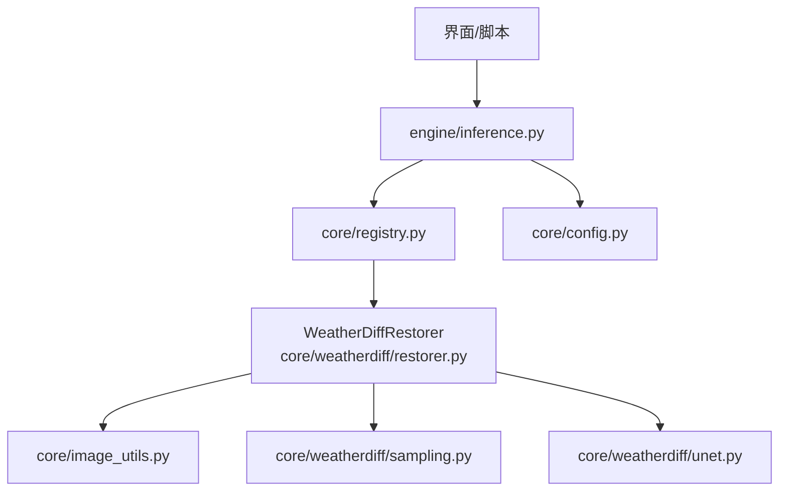
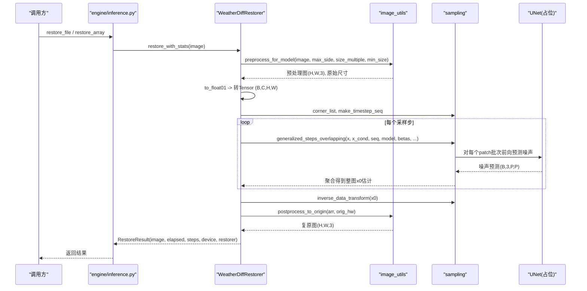
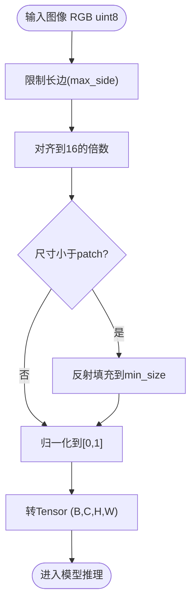
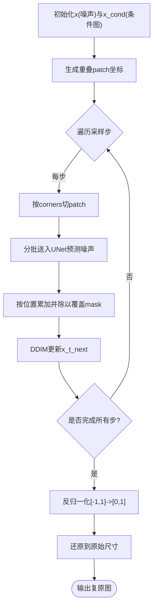
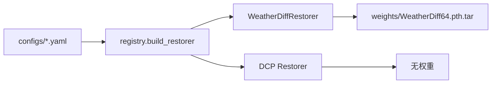
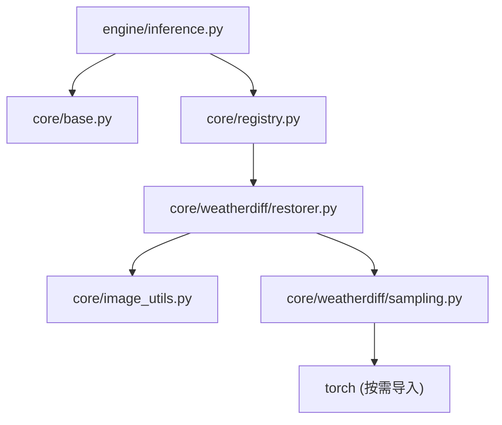

# 数据流设计

<cite>
**本文引用的文件**
- [core/base.py](file://core/base.py)
- [core/config.py](file://core/config.py)
- [core/registry.py](file://core/registry.py)
- [core/image_utils.py](file://core/image_utils.py)
- [engine/inference.py](file://engine/inference.py)
- [core/weatherdiff/restorer.py](file://core/weatherdiff/restorer.py)
- [core/weatherdiff/sampling.py](file://core/weatherdiff/sampling.py)
- [core/weatherdiff/unet.py](file://core/weatherdiff/unet.py)
- [configs/allweather.yaml](file://configs/allweather.yaml)
- [configs/haze.yaml](file://configs/haze.yaml)
- [configs/snow.yaml](file://configs/snow.yaml)
- [configs/dcp.yaml](file://configs/dcp.yaml)
</cite>

## 目录
1. [引言](#引言)
2. [项目结构](#项目结构)
3. [核心组件](#核心组件)
4. [架构总览](#架构总览)
5. [详细组件分析](#详细组件分析)
6. [依赖关系分析](#依赖关系分析)
7. [性能与内存考量](#性能与内存考量)
8. [故障排查指南](#故障排查指南)
9. [结论](#结论)
10. [附录](#附录)

## 引言
本数据流设计文档聚焦图像在系统中的完整流转过程：从原始图像输入到最终复原结果，覆盖预处理、归一化、模型推理（含 Patch-based 扩散采样）、后处理等关键步骤。同时说明不同天气类型（雨、雾、雪）的数据处理差异与统一策略，解释 Patch-based 推理如何实现大图像的内存优化，并给出中间数据的格式转换、张量操作、数据验证、错误检测与恢复机制，以及数据流图与内存使用分析。

## 项目结构
系统采用“配置驱动 + 注册表动态构建”的架构：
- 配置层：通过 configs/*.yaml 描述不同天气场景与模型参数（如 allweather、haze、snow、dcp）。
- 引擎层：engine/inference.py 提供统一的单图/批量推理入口，并维护 ModelCache 以复用已加载模型。
- 复原器抽象：core/base.py 定义 BaseRestorer 接口契约，所有复原器必须遵循。
- 具体实现：core/weatherdiff/restorer.py 实现 WeatherDiffRestorer；core/weatherdiff/sampling.py 提供 Patch-based DDIM 采样骨架；core/weatherdiff/unet.py 为 UNet 占位，待移植官方实现。
- 工具层：core/image_utils.py 提供图像 IO、尺寸对齐、归一化、前后处理等通用能力。
- 注册与配置：core/registry.py 负责按 restorer 字段延迟加载具体实现；core/config.py 负责 YAML 配置加载与路径解析。

**图表来源**
- [engine/inference.py:22-68](file://engine/inference.py#L22-L68)
- [core/registry.py:68-84](file://core/registry.py#L68-L84)
- [core/weatherdiff/restorer.py:32-167](file://core/weatherdiff/restorer.py#L32-L167)
- [core/weatherdiff/sampling.py:115-162](file://core/weatherdiff/sampling.py#L115-L162)
- [core/weatherdiff/unet.py:51-71](file://core/weatherdiff/unet.py#L51-L71)
- [core/image_utils.py:145-167](file://core/image_utils.py#L145-L167)
- [core/config.py:77-91](file://core/config.py#L77-L91)

**章节来源**
- [engine/inference.py:22-68](file://engine/inference.py#L22-L68)
- [core/registry.py:68-84](file://core/registry.py#L68-L84)
- [core/config.py:77-91](file://core/config.py#L77-L91)

## 核心组件
- BaseRestorer：定义统一接口与通用流程（校验、计时、输出一致性检查、进度上报、取消支持）。
- WeatherDiffRestorer：封装权重加载、设备选择、预处理、Patch-based 扩散采样、显存自适应重试、后处理还原。
- sampling：提供 beta 调度、时间步压缩、重叠网格生成、数据归一化/反归一化，以及待实现的 generalized_steps_overlapping。
- image_utils：统一图像格式（RGB uint8），提供预处理（长边限制、16 倍数对齐、最小尺寸反射填充）与后处理（还原至原尺寸）。
- engine/inference：ModelCache 缓存模型实例，提供 restore_array/restore_file/restore_batch 统一入口。
- config/registry：配置加载与动态构建复原器，支持 AWR_MOCK 降级。

**章节来源**
- [core/base.py:61-185](file://core/base.py#L61-L185)
- [core/weatherdiff/restorer.py:32-167](file://core/weatherdiff/restorer.py#L32-L167)
- [core/weatherdiff/sampling.py:31-162](file://core/weatherdiff/sampling.py#L31-L162)
- [core/image_utils.py:22-167](file://core/image_utils.py#L22-L167)
- [engine/inference.py:22-153](file://engine/inference.py#L22-L153)
- [core/config.py:25-91](file://core/config.py#L25-L91)
- [core/registry.py:21-84](file://core/registry.py#L21-L84)

## 架构总览
下图展示从输入图像到复原输出的端到端数据流，包括预处理、条件扩散采样、后处理与结果封装。

**图表来源**
- [engine/inference.py:70-96](file://engine/inference.py#L70-L96)
- [core/base.py:111-138](file://core/base.py#L111-L138)
- [core/weatherdiff/restorer.py:102-167](file://core/weatherdiff/restorer.py#L102-L167)
- [core/weatherdiff/sampling.py:115-162](file://core/weatherdiff/sampling.py#L115-L162)
- [core/image_utils.py:145-167](file://core/image_utils.py#L145-L167)

## 详细组件分析

### 预处理与数据格式
- 输入约定：RGB uint8 (H, W, 3)。
- 预处理流程：
  - 长边限制：limit_long_side 控制最大边长，避免显存爆炸。
  - 尺寸对齐：resize_to_multiple 向上取整到 16 的倍数，满足 UNet 下采样要求。
  - 最小尺寸填充：pad_to_min_size 对小图进行反射填充，确保 patch 可切分。
  - 归一化：to_float01 将 uint8 转为 float32 [0,1]，后续再转换为 [-1,1] 供模型使用。
- 输出还原：postprocess_to_origin 裁剪并缩放回原始尺寸。

**图表来源**
- [core/image_utils.py:109-167](file://core/image_utils.py#L109-L167)
- [core/weatherdiff/restorer.py:116-125](file://core/weatherdiff/restorer.py#L116-L125)

**章节来源**
- [core/image_utils.py:84-167](file://core/image_utils.py#L84-L167)
- [core/weatherdiff/restorer.py:116-125](file://core/weatherdiff/restorer.py#L116-L125)

### 模型推理与 Patch-based 扩散采样
- 设备选择：优先 CUDA，可通过环境变量强制指定。
- 权重加载：支持 DataParallel 前缀剥离、EMA 权重覆盖，提升质量。
- Patch 策略：
  - 将整图切分为重叠的 patch（size=64，步长 grid_r=16），生成 corners 列表。
  - 在每个去噪步中，对所有 patch 分别预测噪声，按位置累加到整图 buffer，并用覆盖次数 mask 做平均，得到整图噪声估计。
  - 使用 DDIM 更新公式推进到下一步，循环 sampling_timesteps 次。
- 显存自适应：若遇到 out of memory，自动将 patch_batch_size 减半并重试，直至成功或降至 1。
- 时间步压缩：make_timestep_seq 将 1000 步压缩为 25 步，加速采样。

**图表来源**
- [core/weatherdiff/restorer.py:127-167](file://core/weatherdiff/restorer.py#L127-L167)
- [core/weatherdiff/sampling.py:54-81](file://core/weatherdiff/sampling.py#L54-L81)
- [core/weatherdiff/sampling.py:115-162](file://core/weatherdiff/sampling.py#L115-L162)

**章节来源**
- [core/weatherdiff/restorer.py:47-167](file://core/weatherdiff/restorer.py#L47-L167)
- [core/weatherdiff/sampling.py:31-162](file://core/weatherdiff/sampling.py#L31-L162)

### 不同天气类型的处理差异
- 统一权重策略：rain、haze、snow 均使用同一份 WeatherDiff64.pth.tar 权重，区别仅在于配置与数据集对应场景（如 haze 对应 rainfog，snow 对应 snow test_set）。
- All-in-One：allweather 配置不区分天气类型，直接处理叠加退化，适合演示真实场景。
- DCP 基线：纯传统算法（暗通道先验），无需权重，用于定量对照。

**图表来源**
- [configs/allweather.yaml:1-47](file://configs/allweather.yaml#L1-L47)
- [configs/haze.yaml:1-46](file://configs/haze.yaml#L1-L46)
- [configs/snow.yaml:1-46](file://configs/snow.yaml#L1-L46)
- [configs/dcp.yaml:1-21](file://configs/dcp.yaml#L1-L21)
- [core/registry.py:21-84](file://core/registry.py#L21-L84)

**章节来源**
- [configs/allweather.yaml:1-47](file://configs/allweather.yaml#L1-L47)
- [configs/haze.yaml:1-46](file://configs/haze.yaml#L1-L46)
- [configs/snow.yaml:1-46](file://configs/snow.yaml#L1-L46)
- [configs/dcp.yaml:1-21](file://configs/dcp.yaml#L1-L21)

### 中间数据格式与张量操作
- 预处理阶段：
  - numpy RGB uint8 -> float32 [0,1] -> Tensor (B,C,H,W)。
- 模型输入：
  - 条件图 x_cond 与噪声 x 拼接（UNet 输入通道为 in_channels*2）。
- 采样阶段：
  - beta 调度生成 T 维序列，compute_alpha 计算 alpha_bar。
  - 每个 patch 预测噪声 et，聚合得到整图噪声估计。
  - DDIM 更新：x0_t = (xt - et * sqrt(1-at)) / sqrt(at)，然后 xt_next = sqrt(at_next)*x0_t + c1*randn + c2*et。
- 后处理阶段：
  - 反归一化 [-1,1] -> [0,1]，裁剪并缩放到原始尺寸。

**章节来源**
- [core/weatherdiff/restorer.py:123-167](file://core/weatherdiff/restorer.py#L123-L167)
- [core/weatherdiff/sampling.py:84-109](file://core/weatherdiff/sampling.py#L84-L109)
- [core/weatherdiff/unet.py:16-20](file://core/weatherdiff/unet.py#L16-L20)

### 数据验证、错误检测与恢复
- 输入验证：BaseRestorer.validate_image 检查 dtype、shape、通道数。
- 输出验证：restore_with_stats 确保输出尺寸与输入一致。
- 权重缺失：WeightNotFoundError 提示下载或放置权重。
- 显存不足：捕获 RuntimeError 中的 out of memory，自动降低 patch_batch_size 重试。
- 取消机制：check_cancel 支持用户中断任务。
- 回调健壮性：report 包裹 progress_cb，异常不影响主流程。

**章节来源**
- [core/base.py:153-181](file://core/base.py#L153-L181)
- [core/weatherdiff/restorer.py:51-56](file://core/weatherdiff/restorer.py#L51-L56)
- [core/weatherdiff/restorer.py:156-161](file://core/weatherdiff/restorer.py#L156-L161)

## 依赖关系分析
- 模块耦合：
  - engine/inference 依赖 registry 和 base，解耦具体模型实现。
  - WeatherDiffRestorer 依赖 image_utils 与 sampling，屏蔽底层细节。
  - sampling 依赖 torch（仅在需要时导入），保持轻量。
- 外部依赖：
  - PyTorch（扩散模型必需，可通过 AWR_MOCK 绕过）。
  - PyYAML（配置加载）。
  - Pillow（图像 IO）。
- 潜在循环依赖：无直接循环，模块间通过接口与工厂函数解耦。

**图表来源**
- [engine/inference.py:16-19](file://engine/inference.py#L16-L19)
- [core/registry.py:21-26](file://core/registry.py#L21-L26)
- [core/weatherdiff/restorer.py:24-29](file://core/weatherdiff/restorer.py#L24-L29)
- [core/weatherdiff/sampling.py:92-109](file://core/weatherdiff/sampling.py#L92-L109)

**章节来源**
- [core/registry.py:21-84](file://core/registry.py#L21-L84)
- [core/weatherdiff/restorer.py:24-29](file://core/weatherdiff/restorer.py#L24-L29)

## 性能与内存考量
- Patch-based 内存优化：
  - 显存占用与 patch 大小和 batch 数量相关，与整图分辨率无关。
  - 默认 patch_size=64，grid_r=16，patch_batch_size=32，可根据显存调整。
- 自适应重试：
  - 检测到 out of memory 时自动减半 patch_batch_size，直至成功。
- 时间步压缩：
  - 1000 步压缩为 25 步，显著减少推理时间。
- 模型缓存：
  - ModelCache 避免重复加载权重，切换天气类型时快速响应。
- 建议：
  - 低显存环境可降低 patch_batch_size 或增大 grid_r。
  - 大图像优先启用 max_side 限制，避免过长边导致显存峰值过高。

**章节来源**
- [core/weatherdiff/restorer.py:137-161](file://core/weatherdiff/restorer.py#L137-L161)
- [core/weatherdiff/sampling.py:54-81](file://core/weatherdiff/sampling.py#L54-L81)
- [engine/inference.py:22-68](file://engine/inference.py#L22-L68)

## 故障排查指南
- 权重文件缺失：
  - 现象：加载时报 WeightNotFoundError。
  - 解决：执行 download_weights.py 或手动放置权重到 weights/ 目录。
- 未实现 UNet：
  - 现象：DiffusionUNet 抛出 NotImplementedError。
  - 解决：移植官方 UNet 实现，或使用 AWR_MOCK=1 运行假模型。
- 显存不足：
  - 现象：RuntimeError out of memory。
  - 解决：系统自动降低 patch_batch_size；也可手动调小或增大 grid_r。
- 输入格式错误：
  - 现象：validate_image 报错。
  - 解决：确保输入为 RGB uint8 (H, W, 3)。
- 输出尺寸不一致：
  - 现象：restore_with_stats 报尺寸不一致。
  - 解决：检查预处理/后处理是否正确还原原始尺寸。

**章节来源**
- [core/weatherdiff/restorer.py:51-56](file://core/weatherdiff/restorer.py#L51-L56)
- [core/weatherdiff/unet.py:64-71](file://core/weatherdiff/unet.py#L64-L71)
- [core/base.py:153-181](file://core/base.py#L153-L181)

## 结论
本系统通过配置驱动与注册表机制，实现了可扩展的恶劣天气复原流水线。WeatherDiffRestorer 结合 Patch-based DDIM 采样，有效解决了大图像处理的内存瓶颈，并通过显存自适应重试提升鲁棒性。不同天气类型共享统一权重，简化部署与维护。数据流清晰、模块化程度高，便于后续扩展新模型与新天气场景。

## 附录
- 配置示例：
  - allweather：统一模型，处理叠加退化。
  - haze/snow：针对特定天气场景，对应官方测试集。
  - dcp：传统基线，无需权重。
- 数据集组织：
  - data/ 目录下按天气分类存放 input/gt，文件名主干匹配，支持多种后缀。

**章节来源**
- [configs/allweather.yaml:1-47](file://configs/allweather.yaml#L1-L47)
- [configs/haze.yaml:1-46](file://configs/haze.yaml#L1-L46)
- [configs/snow.yaml:1-46](file://configs/snow.yaml#L1-L46)
- [configs/dcp.yaml:1-21](file://configs/dcp.yaml#L1-L21)
- [data/README.md:1-45](file://data/README.md#L1-L45)