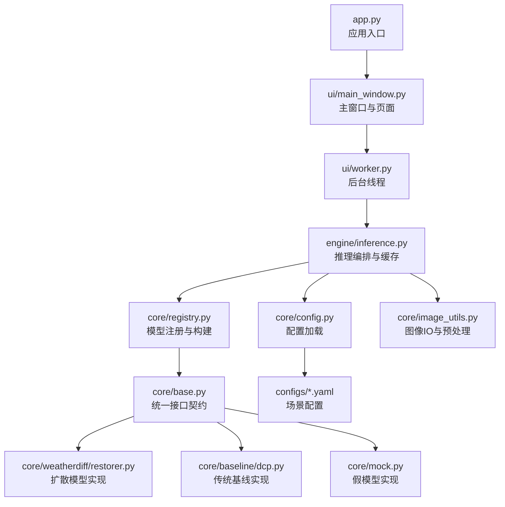
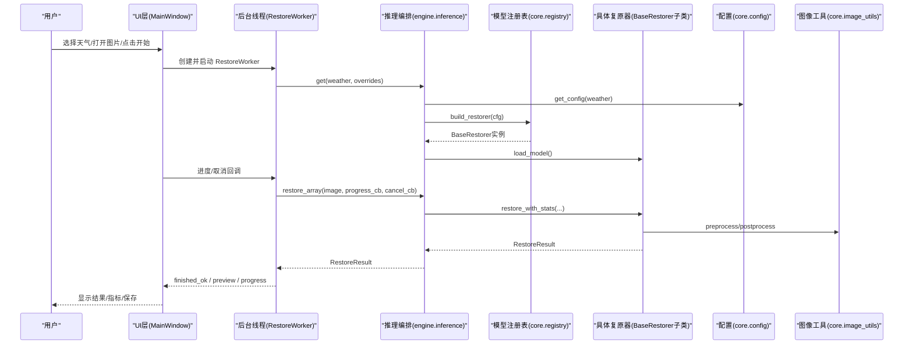
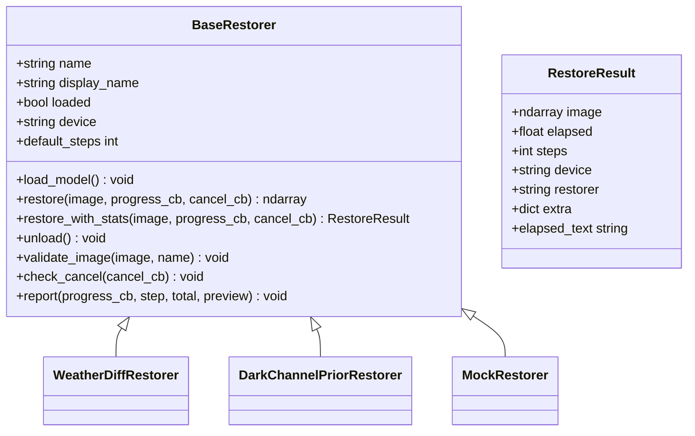
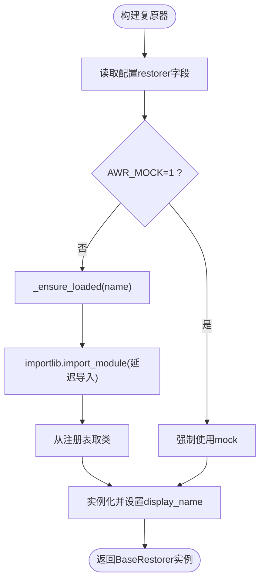
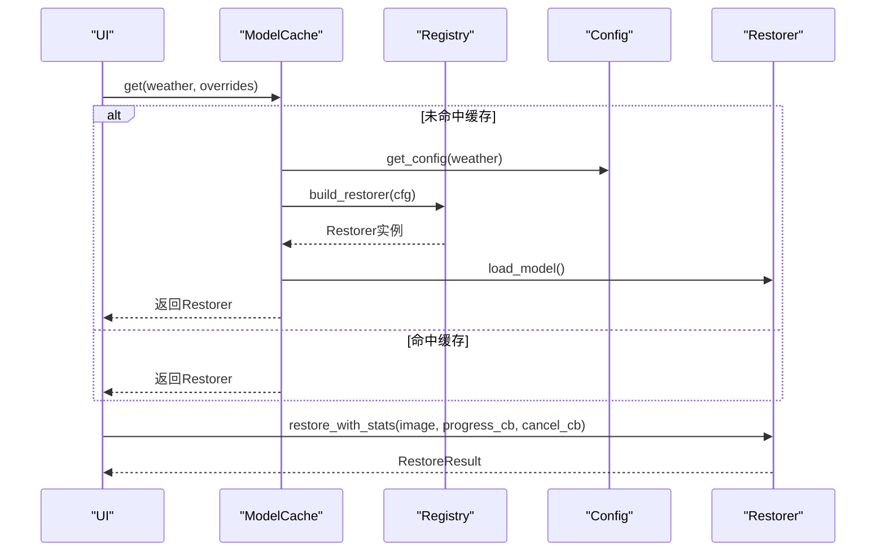
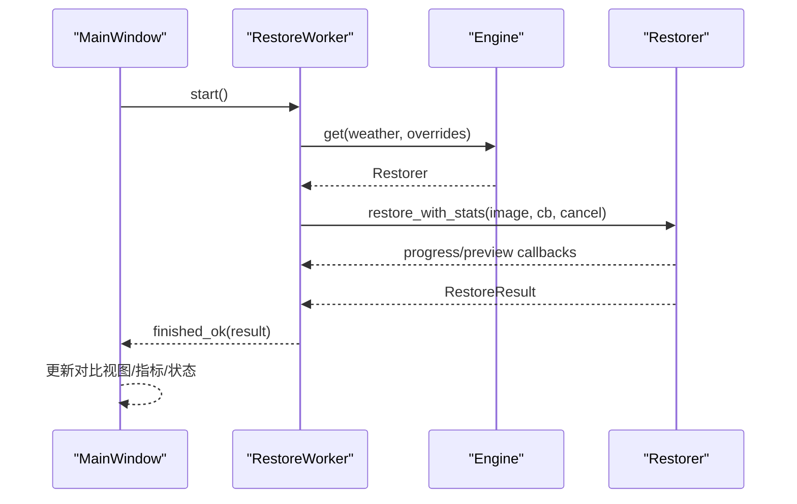
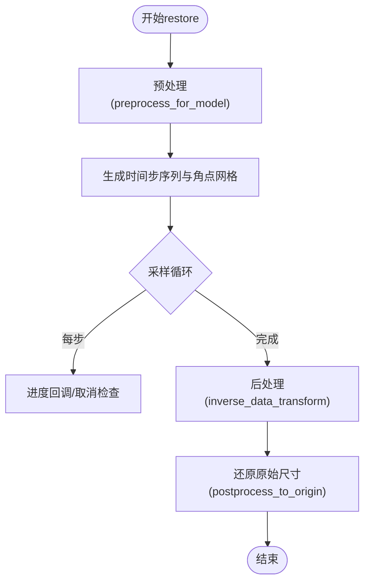
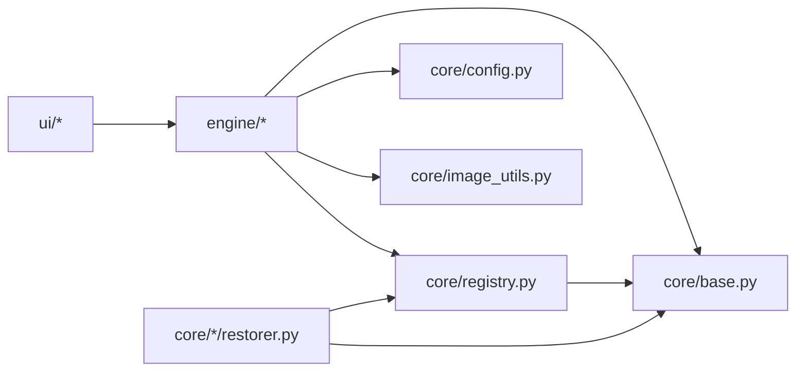

# 架构概览

<cite>
**本文引用的文件**
- [app.py](file://app.py)
- [core/base.py](file://core/base.py)
- [core/registry.py](file://core/registry.py)
- [core/config.py](file://core/config.py)
- [engine/inference.py](file://engine/inference.py)
- [ui/main_window.py](file://ui/main_window.py)
- [ui/worker.py](file://ui/worker.py)
- [core/weatherdiff/restorer.py](file://core/weatherdiff/restorer.py)
- [core/baseline/dcp.py](file://core/baseline/dcp.py)
- [core/mock.py](file://core/mock.py)
- [core/image_utils.py](file://core/image_utils.py)
- [configs/allweather.yaml](file://configs/allweather.yaml)
- [configs/haze.yaml](file://configs/haze.yaml)
- [requirements.txt](file://requirements.txt)
</cite>

## 目录
1. [简介](#简介)
2. [项目结构](#项目结构)
3. [核心组件](#核心组件)
4. [架构总览](#架构总览)
5. [详细组件分析](#详细组件分析)
6. [依赖关系分析](#依赖关系分析)
7. [性能与资源管理](#性能与资源管理)
8. [故障排查指南](#故障排查指南)
9. [结论](#结论)
10. [附录：技术选型与设计决策](#附录技术选型与设计决策)

## 简介
本系统面向“恶劣天气图像复原”，提供统一的界面、评测与推理能力，支持扩散模型与传统基线方法。整体采用分层架构与插件化设计：UI层负责交互与可视化；业务逻辑层负责编排推理、缓存与批处理；核心算法层通过统一接口契约实现多模型共存与热插拔。配置驱动与注册表机制使新增模型无需改动上层代码即可接入。

## 项目结构
- 入口与启动：app.py 启动 PyQt5 主窗口，初始化应用并展示 MainWindow。
- UI层：ui/main_window.py 提供单图复原、批量评测与环境信息页；ui/worker.py 将耗时任务放入后台线程，避免阻塞界面。
- 业务逻辑层：engine/inference.py 提供 ModelCache、restore_array/restore_file/restore_batch 等编排函数；engine/evaluate.py（由 UI 引用）用于批量评测与指标计算。
- 核心算法层：core/base.py 定义统一接口 BaseRestorer 与结果对象 RestoreResult；core/registry.py 提供模型注册与动态构建；core/config.py 负责 YAML 配置加载与路径解析；core/image_utils.py 提供图像 IO、预处理与后处理工具。
- 具体实现：core/weatherdiff/restorer.py（扩散模型）、core/baseline/dcp.py（暗通道先验去雾）、core/mock.py（假模型）。
- 配置：configs/*.yaml 描述不同天气场景或统一模型的参数、权重路径与采样设置。
- 依赖：requirements.txt 声明最小依赖与可选扩展。

**图表来源**
- [app.py:19-32](file://app.py#L19-L32)
- [ui/main_window.py:499-515](file://ui/main_window.py#L499-L515)
- [ui/worker.py:32-89](file://ui/worker.py#L32-L89)
- [engine/inference.py:22-67](file://engine/inference.py#L22-L67)
- [core/registry.py:29-84](file://core/registry.py#L29-L84)
- [core/base.py:61-148](file://core/base.py#L61-L148)
- [core/config.py:25-57](file://core/config.py#L25-L57)
- [core/image_utils.py:145-167](file://core/image_utils.py#L145-L167)
- [core/weatherdiff/restorer.py:32-90](file://core/weatherdiff/restorer.py#L32-L90)
- [core/baseline/dcp.py:23-85](file://core/baseline/dcp.py#L23-L85)
- [core/mock.py:27-66](file://core/mock.py#L27-L66)
- [configs/allweather.yaml:1-47](file://configs/allweather.yaml#L1-L47)

**章节来源**
- [app.py:19-32](file://app.py#L19-L32)
- [ui/main_window.py:499-515](file://ui/main_window.py#L499-L515)
- [engine/inference.py:22-67](file://engine/inference.py#L22-L67)
- [core/registry.py:29-84](file://core/registry.py#L29-L84)
- [core/base.py:61-148](file://core/base.py#L61-L148)
- [core/config.py:25-57](file://core/config.py#L25-L57)
- [core/image_utils.py:145-167](file://core/image_utils.py#L145-L167)
- [configs/allweather.yaml:1-47](file://configs/allweather.yaml#L1-L47)

## 核心组件
- 统一接口契约：BaseRestorer 定义了 load_model、restore、unload、默认步数与进度/取消回调协议；RestoreResult 统一返回结果结构，便于 UI 与评测共用。
- 模型注册表：通过装饰器 @register_restorer 将具体实现登记到全局映射；build_restorer 根据配置中的 restorer 字段动态构造实例，支持环境变量降级为 mock。
- 配置管理：load_config 读取 YAML 并解析相对路径为绝对路径；list_weather_configs 列出可用配置；weight_path 提取权重路径。
- 推理编排：ModelCache 按配置名缓存已加载的复原器，避免重复读盘与显存占用；restore_array/file/batch 封装单图、文件与批量流程，统一错误与进度上报。
- UI 与线程：MainWindow 组织三个 Tab；RestoreWorker/EvalWorker 在 QThread 中执行推理与评测，通过信号回传进度、预览与结果。

**章节来源**
- [core/base.py:45-148](file://core/base.py#L45-L148)
- [core/registry.py:29-84](file://core/registry.py#L29-L84)
- [core/config.py:25-91](file://core/config.py#L25-L91)
- [engine/inference.py:22-153](file://engine/inference.py#L22-L153)
- [ui/main_window.py:61-250](file://ui/main_window.py#L61-L250)
- [ui/worker.py:32-162](file://ui/worker.py#L32-L162)

## 架构总览
系统分为三层：
- UI 层：用户交互、参数选择、结果对比与导出。
- 业务逻辑层：推理编排、模型缓存、批量评测、指标计算。
- 核心算法层：基于统一接口的多种复原器（扩散模型、传统基线、假模型），通过注册表按需加载。

数据流向：
- 用户选择天气类型与图片 → UI 调用 Worker 发起推理 → Engine 从 ModelCache 获取或构建 Restorer → Restorer 执行 restore → 进度/预览回调至 UI → 输出结果与指标。

**图表来源**
- [ui/main_window.py:188-240](file://ui/main_window.py#L188-L240)
- [ui/worker.py:63-89](file://ui/worker.py#L63-L89)
- [engine/inference.py:33-77](file://engine/inference.py#L33-L77)
- [core/registry.py:68-84](file://core/registry.py#L68-L84)
- [core/base.py:111-148](file://core/base.py#L111-L148)
- [core/image_utils.py:145-167](file://core/image_utils.py#L145-L167)

## 详细组件分析

### 统一接口契约与结果对象
- BaseRestorer 强制所有复原器实现 load_model 与 restore，并提供 restore_with_stats 统一计时、校验与结果封装。
- RestoreResult 包含图像、耗时、步数、设备、模型标识与额外信息，供 UI 与评测统一消费。
- 进度与取消回调约定确保 UI 可实时反馈并可中断推理。

**图表来源**
- [core/base.py:45-148](file://core/base.py#L45-L148)
- [core/weatherdiff/restorer.py:32-90](file://core/weatherdiff/restorer.py#L32-L90)
- [core/baseline/dcp.py:23-85](file://core/baseline/dcp.py#L23-L85)
- [core/mock.py:27-66](file://core/mock.py#L27-L66)

**章节来源**
- [core/base.py:45-148](file://core/base.py#L45-L148)

### 模型注册与动态构建
- 使用 @register_restorer 装饰器将具体类登记到 _RESTORERS 映射，name 作为键。
- build_restorer 根据配置中的 restorer 字段查找并延迟导入对应模块，支持 AWR_MOCK=1 强制降级为 mock。
- available_restorers 暴露当前可用复原器列表，便于 UI 下拉框填充。

**图表来源**
- [core/registry.py:29-84](file://core/registry.py#L29-L84)

**章节来源**
- [core/registry.py:29-84](file://core/registry.py#L29-L84)

### 配置管理与权重路径
- load_config 支持传入短名或完整路径，自动解析为绝对路径，并注入 _config_path 便于调试。
- list_weather_configs 扫描 configs/*.yml/yaml，按 WEATHER_ORDER 排序，便于 UI 下拉框展示。
- weight_path 提取权重绝对路径，DCP 等传统方法无权重时返回 None。

**章节来源**
- [core/config.py:25-91](file://core/config.py#L25-L91)
- [configs/allweather.yaml:1-47](file://configs/allweather.yaml#L1-L47)
- [configs/haze.yaml:1-46](file://configs/haze.yaml#L1-L46)

### 推理编排与模型缓存
- ModelCache 按 weather 名称缓存已加载的复原器实例，支持运行时覆盖 sampling 等参数而不重新加载权重。
- restore_array 统一调用 BaseRestorer.restore_with_stats，保证尺寸一致性与计时。
- restore_file 与 restore_batch 封装文件读写与批量流程，单张失败不影响整批。

**图表来源**
- [engine/inference.py:22-77](file://engine/inference.py#L22-L77)
- [core/registry.py:68-84](file://core/registry.py#L68-L84)
- [core/config.py:77-79](file://core/config.py#L77-L79)
- [core/base.py:111-148](file://core/base.py#L111-L148)

**章节来源**
- [engine/inference.py:22-153](file://engine/inference.py#L22-L153)

### UI 与线程协作
- MainWindow 组织单图复原、批量评测与环境信息页，持有 ModelCache 实例并在关闭时释放。
- RestoreWorker 在 QThread 中执行推理，通过信号发送 loading、progress、preview、finished_ok、failed、cancelled。
- EvalWorker 负责批量评测，逐条回调 item_done，完成后输出汇总与 CSV。

**图表来源**
- [ui/main_window.py:188-240](file://ui/main_window.py#L188-L240)
- [ui/worker.py:32-89](file://ui/worker.py#L32-L89)
- [engine/inference.py:70-77](file://engine/inference.py#L70-L77)
- [core/base.py:111-148](file://core/base.py#L111-L148)

**章节来源**
- [ui/main_window.py:61-250](file://ui/main_window.py#L61-L250)
- [ui/worker.py:32-162](file://ui/worker.py#L32-L162)

### 核心算法实现要点
- WeatherDiffRestorer：负责设备选择、权重加载（兼容 module. 前缀与 EMA）、预处理（长边限制、尺寸对齐、小图反射填充）、patch-based DDIM 采样、显存不足自动降 batch 重试、后处理还原原始尺寸。
- DarkChannelPriorRestorer：纯 numpy 实现，分阶段计算暗通道、大气光、透射率与复原成像方程，提供进度回调与取消检查。
- MockRestorer：模拟逐步去噪过程，支持进度预览与取消，便于无 GPU/无权重环境联调。

**图表来源**
- [core/weatherdiff/restorer.py:102-167](file://core/weatherdiff/restorer.py#L102-L167)
- [core/image_utils.py:145-167](file://core/image_utils.py#L145-L167)

**章节来源**
- [core/weatherdiff/restorer.py:32-244](file://core/weatherdiff/restorer.py#L32-L244)
- [core/baseline/dcp.py:23-126](file://core/baseline/dcp.py#L23-L126)
- [core/mock.py:27-81](file://core/mock.py#L27-L81)

## 依赖关系分析
- UI 层依赖 engine 与 core 抽象，不直接 import 具体模型类，降低耦合。
- engine 依赖 core.base、core.config、core.registry、core.image_utils，解耦于具体实现。
- 具体复原器通过 @register_restorer 注册，被 registry 发现与构建。
- 配置与权重路径由 config 统一管理，避免硬编码。

**图表来源**
- [ui/main_window.py:49-56](file://ui/main_window.py#L49-L56)
- [engine/inference.py:16-19](file://engine/inference.py#L16-L19)
- [core/registry.py:16-26](file://core/registry.py#L16-L26)
- [core/base.py:61-148](file://core/base.py#L61-L148)

**章节来源**
- [ui/main_window.py:49-56](file://ui/main_window.py#L49-L56)
- [engine/inference.py:16-19](file://engine/inference.py#L16-L19)
- [core/registry.py:16-26](file://core/registry.py#L16-L26)

## 性能与资源管理
- 模型缓存：ModelCache 按配置名缓存实例，切换天气时不重复加载权重，减少 IO 与显存占用；release_others/clear 支持释放非活跃模型。
- 显存自适应：WeatherDiffRestorer 在 out of memory 时自动降低 patch_batch_size 并重试，提升鲁棒性。
- 设备选择：优先 CUDA，可通过 AWR_DEVICE 强制 CPU/CUDA；mock 模式无需 torch/GPU。
- 预处理优化：长边限制与尺寸对齐控制显存与耗时；小图反射填充避免边界效应。

[本节为通用指导，不直接分析具体文件]

## 故障排查指南
- 权重缺失：WeightNotFoundError 提示缺少权重文件，需下载或放置到 weights/ 目录并检查配置路径。
- 依赖缺失：缺少 pyyaml 或 torch 时会抛出 ImportError；requirements.txt 提供安装指引。
- 指标不可用：AboutPage 会检测依赖与指标可用性，帮助定位环境问题。
- 取消与异常：UI 捕获 RestoreCancelled 与 WeightNotFoundError 并友好提示；线程内异常统一捕获并通过 failed 信号上报。

**章节来源**
- [core/base.py:37-43](file://core/base.py#L37-L43)
- [core/config.py:9-12](file://core/config.py#L9-L12)
- [ui/main_window.py:441-496](file://ui/main_window.py#L441-L496)
- [ui/worker.py:80-88](file://ui/worker.py#L80-L88)

## 结论
本系统通过统一接口契约、注册表与配置驱动实现了高内聚、低耦合的分层架构。UI 层专注交互与可视化，业务逻辑层负责编排与资源管理，核心算法层以插件化方式扩展模型。该设计使得新增模型只需实现 BaseRestorer 并注册，即可无缝接入现有流程，同时保障界面与评测的稳定性和一致性。

[本节为总结，不直接分析具体文件]

## 附录：技术选型与设计决策
- PyQt5 作为 GUI 框架，提供稳定的桌面端交互能力。
- NumPy + Pillow 作为图像处理基础，避免强依赖 OpenCV，提升跨平台兼容性。
- PyTorch 用于扩散模型推理，按需导入以减少启动开销；mock 模式允许无 GPU 环境开发。
- YAML 配置驱动模型行为与权重路径，便于场景切换与实验对比。
- 注册表模式实现模块解耦，UI 与引擎不感知具体模型实现细节。
- 线程化推理避免界面卡顿，信号机制保证 UI 与后台安全通信。

**章节来源**
- [requirements.txt:14-34](file://requirements.txt#L14-L34)
- [core/registry.py:21-26](file://core/registry.py#L21-L26)
- [core/weatherdiff/restorer.py:192-209](file://core/weatherdiff/restorer.py#L192-L209)
- [ui/worker.py:32-162](file://ui/worker.py#L32-L162)