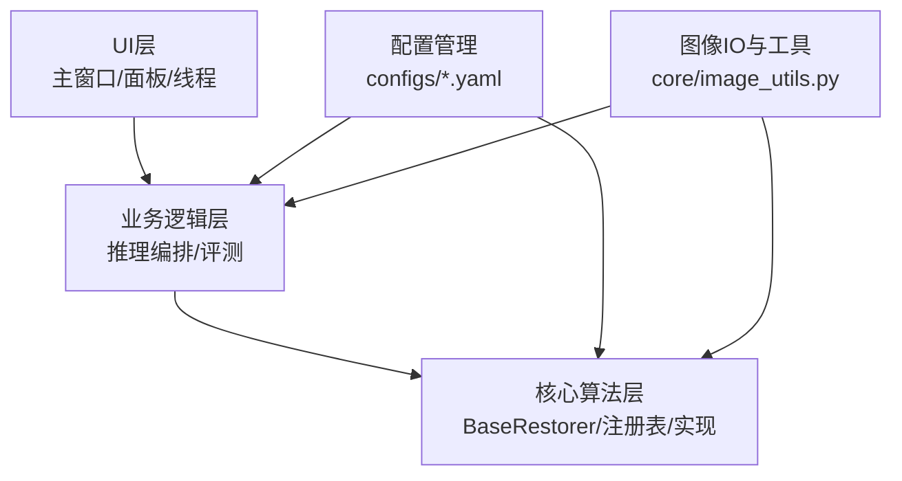
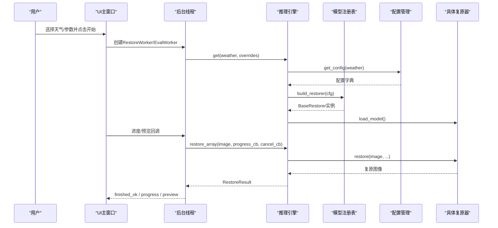
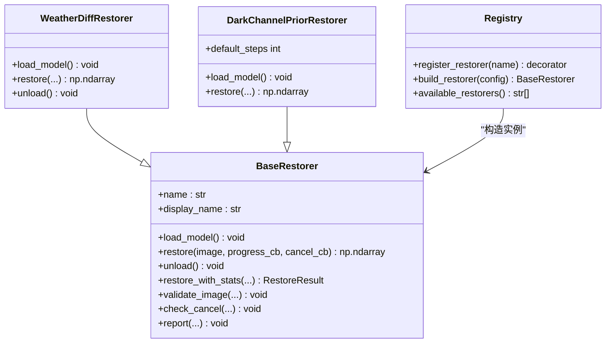
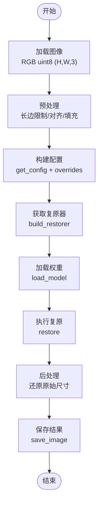
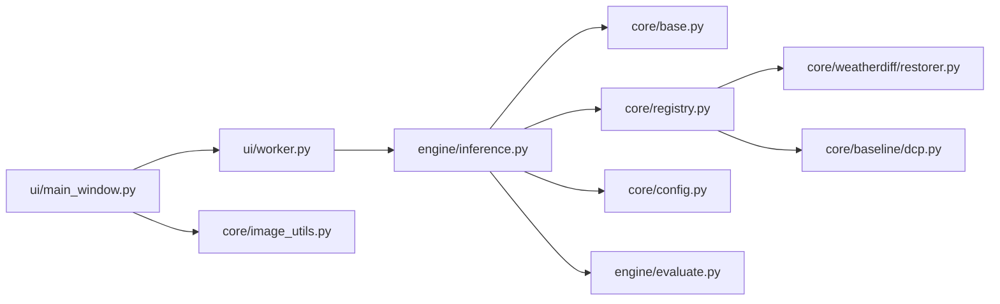

# 系统架构

<cite>
**本文引用的文件**
- [app.py](file://app.py)
- [core/base.py](file://core/base.py)
- [core/registry.py](file://core/registry.py)
- [core/config.py](file://core/config.py)
- [engine/inference.py](file://engine/inference.py)
- [engine/evaluate.py](file://engine/evaluate.py)
- [ui/main_window.py](file://ui/main_window.py)
- [ui/worker.py](file://ui/worker.py)
- [core/weatherdiff/restorer.py](file://core/weatherdiff/restorer.py)
- [core/baseline/dcp.py](file://core/baseline/dcp.py)
- [configs/allweather.yaml](file://configs/allweather.yaml)
- [configs/haze.yaml](file://configs/haze.yaml)
- [scripts/run_eval.py](file://scripts/run_eval.py)
</cite>

## 目录
1. [简介](#简介)
2. [项目结构](#项目结构)
3. [核心组件](#核心组件)
4. [架构总览](#架构总览)
5. [详细组件分析](#详细组件分析)
6. [依赖关系分析](#依赖关系分析)
7. [性能考虑](#性能考虑)
8. [故障排查指南](#故障排查指南)
9. [结论](#结论)
10. [附录](#附录)

## 简介
本系统为“恶劣天气图像复原系统”，采用分层架构与插件化设计，提供统一的复原接口、可插拔的算法实现、图形界面与命令行评测工具。系统支持扩散模型（WeatherDiffusion）与传统基线（DCP暗通道先验），并通过配置驱动选择不同天气场景与推理参数。整体目标：从退化图像输入到复原结果输出，提供稳定、可扩展、可评测的工程化流程。

## 项目结构
- UI层：PyQt5主窗口、单图复原页、批量评测页、后台工作线程，负责用户交互、进度展示与错误提示。
- 业务逻辑层：推理编排与缓存、批量评测流水线、指标计算与导出。
- 核心算法层：统一复原器抽象、模型注册表、具体复原器实现（扩散模型、传统方法）、图像预处理/后处理工具。
- 配置管理：YAML配置文件集中管理模型类型、权重路径、采样参数等。
- 脚本入口：应用启动入口与命令行评测脚本。

**图表来源**
- [app.py:19-32](file://app.py#L19-L32)
- [ui/main_window.py:499-518](file://ui/main_window.py#L499-L518)
- [engine/inference.py:22-68](file://engine/inference.py#L22-L68)
- [core/registry.py:18-26](file://core/registry.py#L18-L26)
- [core/config.py:25-57](file://core/config.py#L25-L57)

**章节来源**
- [app.py:19-32](file://app.py#L19-L32)
- [ui/main_window.py:499-518](file://ui/main_window.py#L499-L518)
- [engine/inference.py:22-68](file://engine/inference.py#L22-L68)
- [core/registry.py:18-26](file://core/registry.py#L18-L26)
- [core/config.py:25-57](file://core/config.py#L25-L57)

## 核心组件
- BaseRestorer：统一复原接口契约，定义load_model、restore、unload、进度与取消回调、尺寸校验等。
- 模型注册表：按配置中的restorer字段动态构造复原器，支持延迟加载与强制降级（AWR_MOCK）。
- 配置管理：读取并解析YAML，注入绝对路径与显示名，列出可用配置。
- 推理引擎：ModelCache权重缓存、单图/批量恢复函数、进度与取消透传。
- 评测引擎：数据集遍历、配对GT、指标计算、CSV导出与汇总。
- UI层：主窗口、单图复原页、批量评测页、后台线程封装信号槽。
- 算法实现：WeatherDiffRestorer（扩散模型）、DarkChannelPriorRestorer（DCP基线）。

**章节来源**
- [core/base.py:61-185](file://core/base.py#L61-L185)
- [core/registry.py:29-85](file://core/registry.py#L29-L85)
- [core/config.py:25-98](file://core/config.py#L25-L98)
- [engine/inference.py:22-153](file://engine/inference.py#L22-L153)
- [engine/evaluate.py:24-181](file://engine/evaluate.py#L24-L181)
- [ui/main_window.py:61-518](file://ui/main_window.py#L61-L518)
- [core/weatherdiff/restorer.py:32-244](file://core/weatherdiff/restorer.py#L32-L244)
- [core/baseline/dcp.py:23-126](file://core/baseline/dcp.py#L23-L126)

## 架构总览
系统采用分层架构与插件化模式：
- UI层通过QThread调用业务逻辑层的推理与评测函数，避免阻塞主线程。
- 业务逻辑层通过ModelCache复用已加载的复原器实例，减少重复加载与显存占用。
- 核心算法层通过BaseRestorer统一接口，使用注册表按需加载具体实现；扩散模型与传统方法均遵循同一契约。
- 配置管理以YAML为中心，控制模型类型、权重路径、采样参数等，支持运行时覆盖。
- 数据流从图像输入到复原输出，贯穿预处理、推理、后处理与保存。

**图表来源**
- [ui/main_window.py:188-214](file://ui/main_window.py#L188-L214)
- [ui/worker.py:32-89](file://ui/worker.py#L32-L89)
- [engine/inference.py:33-77](file://engine/inference.py#L33-L77)
- [core/registry.py:68-85](file://core/registry.py#L68-L85)
- [core/config.py:77-84](file://core/config.py#L77-L84)
- [core/weatherdiff/restorer.py:47-90](file://core/weatherdiff/restorer.py#L47-L90)

## 详细组件分析

### 分层职责与协作
- UI层：负责用户交互、参数收集、进度与预览展示、错误提示；通过QThread将耗时任务移出主线程。
- 业务逻辑层：负责推理编排（单图/批量）、权重缓存、指标计算与导出；屏蔽底层模型差异。
- 核心算法层：提供统一接口与注册机制，具体算法实现关注自身推理流程与资源管理。
- 配置管理：集中管理模型类型、权重路径、采样参数；支持运行时覆盖与显示名注入。
- 外部依赖：PyQt5用于UI；torch用于扩散模型；numpy/PIL用于图像处理；pyyaml用于配置解析。

**章节来源**
- [ui/main_window.py:61-518](file://ui/main_window.py#L61-L518)
- [ui/worker.py:32-162](file://ui/worker.py#L32-L162)
- [engine/inference.py:22-153](file://engine/inference.py#L22-L153)
- [engine/evaluate.py:51-181](file://engine/evaluate.py#L51-L181)
- [core/config.py:25-98](file://core/config.py#L25-L98)
- [core/weatherdiff/restorer.py:47-90](file://core/weatherdiff/restorer.py#L47-L90)

### 模型注册机制
- 所有复原器继承BaseRestorer并使用@register_restorer装饰器注册。
- 注册表维护内置实现的模块映射，按需导入触发注册，避免启动时加载torch。
- build_restorer根据配置中的restorer字段构造实例，支持AWR_MOCK环境变量强制降级为假模型。
- 新增算法只需在对应模块中实现BaseRestorer并注册，无需修改上层代码。

**图表来源**
- [core/base.py:61-185](file://core/base.py#L61-L185)
- [core/weatherdiff/restorer.py:32-244](file://core/weatherdiff/restorer.py#L32-L244)
- [core/baseline/dcp.py:23-126](file://core/baseline/dcp.py#L23-L126)
- [core/registry.py:29-85](file://core/registry.py#L29-L85)

**章节来源**
- [core/registry.py:29-85](file://core/registry.py#L29-L85)
- [core/base.py:61-185](file://core/base.py#L61-L185)
- [core/weatherdiff/restorer.py:32-244](file://core/weatherdiff/restorer.py#L32-L244)
- [core/baseline/dcp.py:23-126](file://core/baseline/dcp.py#L23-L126)

### 配置管理系统
- 支持多种配置名（rain/haze/snow/allweather/dcp/mock），自动解析相对路径为绝对路径。
- 注入_config_path便于问题定位；weights.path解析为abs_path供模型加载。
- list_weather_configs列出可用配置，界面下拉框直接填充；get_config按天气名获取配置。
- 运行时可通过overrides覆盖sampling等参数，不影响权重加载key。

**章节来源**
- [core/config.py:25-98](file://core/config.py#L25-L98)
- [configs/allweather.yaml:1-47](file://configs/allweather.yaml#L1-L47)
- [configs/haze.yaml:1-46](file://configs/haze.yaml#L1-L46)

### 推理引擎与权重缓存
- ModelCache按配置名缓存已加载的复原器实例，切换天气不重复读盘与占显存。
- release_others可释放非当前使用的模型，控制显存；clear清空全部。
- restore_array/restore_file/restore_batch提供单图、文件、批量恢复能力，统一进度与取消回调。
- _deep_update递归合并配置，支持运行时参数覆盖。

**章节来源**
- [engine/inference.py:22-153](file://engine/inference.py#L22-L153)

### 评测引擎与指标
- evaluate_dataset遍历数据集，匹配GT，执行复原并计算指标；支持限制数量与保存输出。
- EvalRow记录单张评测结果，to_flat_dict摊平为CSV行。
- write_csv/write_summary_csv导出逐图与汇总结果；better_of按指标方向取更优值。
- 支持无参考指标（NIQE/BRISQUE）与有参考指标（PSNR/SSIM/LPIPS/FID）。

**章节来源**
- [engine/evaluate.py:24-181](file://engine/evaluate.py#L24-L181)
- [scripts/run_eval.py:32-91](file://scripts/run_eval.py#L32-L91)

### UI层与后台线程
- MainWindow组织三个Tab：单图复原、批量评测、关于/环境自检。
- SingleImagePage/BatchEvalPage分别封装单图与批量流程，使用ControlPanel/MetricPanel进行参数与指标展示。
- RestoreWorker/EvalWorker封装QThread，发射loading/progress/preview/finished/failed/cancelled信号，保证UI响应性。
- 拖拽打开图片、GT选择、结果保存、CSV导出等功能完善用户体验。

**章节来源**
- [ui/main_window.py:61-518](file://ui/main_window.py#L61-L518)
- [ui/worker.py:32-162](file://ui/worker.py#L32-L162)
- [app.py:19-32](file://app.py#L19-L32)

### 数据流向（从输入到输出）

**图表来源**
- [core/image_utils.py:145-167](file://core/image_utils.py#L145-L167)
- [engine/inference.py:70-96](file://engine/inference.py#L70-L96)
- [core/weatherdiff/restorer.py:102-167](file://core/weatherdiff/restorer.py#L102-L167)
- [core/config.py:77-84](file://core/config.py#L77-L84)

**章节来源**
- [core/image_utils.py:145-167](file://core/image_utils.py#L145-L167)
- [engine/inference.py:70-96](file://engine/inference.py#L70-L96)
- [core/weatherdiff/restorer.py:102-167](file://core/weatherdiff/restorer.py#L102-L167)
- [core/config.py:77-84](file://core/config.py#L77-L84)

### 插件化架构设计
- 新算法集成步骤：
  1. 在core目录下新建模块，实现继承BaseRestorer的具体类。
  2. 使用@register_restorer("xxx")注册名称。
  3. 在configs下添加对应YAML配置，指定restorer字段与权重路径。
  4. 无需修改UI与评测代码，即可通过配置选择新算法。
- 支持强制降级：设置AWR_MOCK=1可将任何配置降级为mock，便于无权重/GPU环境测试。

**章节来源**
- [core/registry.py:29-85](file://core/registry.py#L29-L85)
- [core/base.py:61-185](file://core/base.py#L61-L185)
- [configs/allweather.yaml:1-47](file://configs/allweather.yaml#L1-L47)

### 系统边界与外部依赖
- 外部依赖：
  - PyQt5：UI框架。
  - torch：扩散模型推理与EMA权重应用。
  - numpy/PIL：图像处理与IO。
  - pyyaml：配置解析。
  - skimage/pyiqa/lpips/pytorch-fid：可选指标计算。
- 接口设计：
  - BaseRestorer统一接口，屏蔽模型差异。
  - 配置YAML作为模型与参数的契约。
  - 环境变量AWR_DEVICE/AWR_MOCK控制设备与降级行为。

**章节来源**
- [core/weatherdiff/restorer.py:192-209](file://core/weatherdiff/restorer.py#L192-L209)
- [core/base.py:37-55](file://core/base.py#L37-L55)
- [core/config.py:25-57](file://core/config.py#L25-L57)

## 依赖关系分析

**图表来源**
- [ui/main_window.py:49-56](file://ui/main_window.py#L49-L56)
- [ui/worker.py:27-29](file://ui/worker.py#L27-L29)
- [engine/inference.py:16-19](file://engine/inference.py#L16-L19)
- [core/registry.py:16-26](file://core/registry.py#L16-L26)
- [core/weatherdiff/restorer.py:24-29](file://core/weatherdiff/restorer.py#L24-L29)
- [core/baseline/dcp.py:18-20](file://core/baseline/dcp.py#L18-L20)
- [engine/evaluate.py:16-18](file://engine/evaluate.py#L16-L18)

**章节来源**
- [ui/main_window.py:49-56](file://ui/main_window.py#L49-L56)
- [ui/worker.py:27-29](file://ui/worker.py#L27-L29)
- [engine/inference.py:16-19](file://engine/inference.py#L16-L19)
- [core/registry.py:16-26](file://core/registry.py#L16-L26)
- [core/weatherdiff/restorer.py:24-29](file://core/weatherdiff/restorer.py#L24-L29)
- [core/baseline/dcp.py:18-20](file://core/baseline/dcp.py#L18-L20)
- [engine/evaluate.py:16-18](file://engine/evaluate.py#L16-L18)

## 性能考虑
- 权重缓存：ModelCache避免重复加载，降低I/O与显存压力。
- 显存自适应：扩散模型推理时若OOM，自动减半patch_batch_size重试。
- 设备选择：支持AWR_DEVICE强制CPU或GPU，默认优先CUDA。
- 预处理优化：长边限制与尺寸对齐减少不必要计算；小图反射填充避免过小输入。
- 批量处理：单张失败不中断整批，提升鲁棒性与吞吐。

[本节为通用指导，不直接分析具体文件]

## 故障排查指南
- 权重缺失：WeightNotFoundError提示检查weights目录与配置路径；运行download_weights脚本下载。
- 依赖缺失：缺少PyQt5/torch/pyyaml时，安装对应包或使用AWR_MOCK=1跳过扩散模型。
- 设备不可用：AWR_DEVICE=cpu强制CPU；检查torch.cuda.is_available。
- 指标不可用：部分指标依赖skimage/pyiqa/lpips/pytorch-fid，未安装则跳过或报错。
- 界面卡顿：确保推理在QThread中运行，避免主线程阻塞。

**章节来源**
- [core/base.py:37-55](file://core/base.py#L37-L55)
- [core/weatherdiff/restorer.py:47-90](file://core/weatherdiff/restorer.py#L47-L90)
- [ui/main_window.py:441-496](file://ui/main_window.py#L441-L496)
- [ui/worker.py:80-88](file://ui/worker.py#L80-L88)

## 结论
本系统通过分层架构与插件化设计，实现了恶劣天气图像复原的统一接口、可配置推理流程与可扩展算法生态。UI层与业务逻辑层解耦，核心算法层通过注册表与配置管理实现灵活切换。数据流清晰，支持单图与批量处理，具备完善的进度反馈与错误处理机制。未来可继续扩展更多算法与指标，保持向后兼容与低耦合。

[本节为总结，不直接分析具体文件]

## 附录
- 常用命令：
  - 启动界面：python app.py
  - 假模型模式：set AWR_MOCK=1 && python app.py
  - 强制CPU：AWR_DEVICE=cpu python app.py
  - 批量评测：python scripts/run_eval.py --config rain --input ... --gt ...
- 配置示例：
  - allweather.yaml：统一模型，支持多退化叠加。
  - haze.yaml：去雾场景，与rain共用权重。

**章节来源**
- [app.py:19-32](file://app.py#L19-L32)
- [scripts/run_eval.py:32-91](file://scripts/run_eval.py#L32-L91)
- [configs/allweather.yaml:1-47](file://configs/allweather.yaml#L1-L47)
- [configs/haze.yaml:1-46](file://configs/haze.yaml#L1-L46)