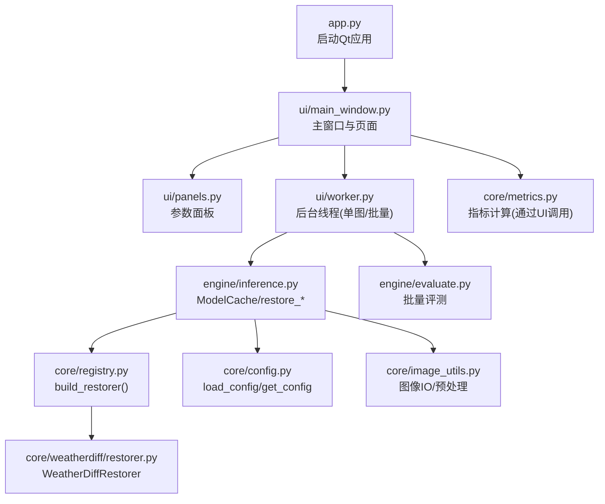
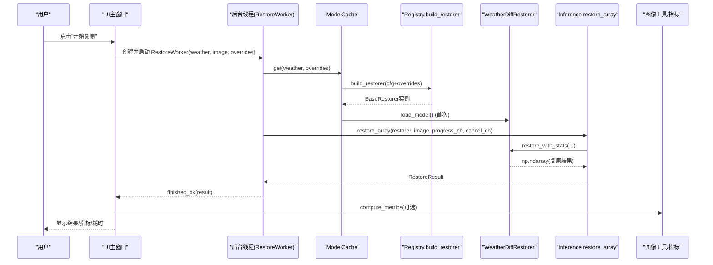
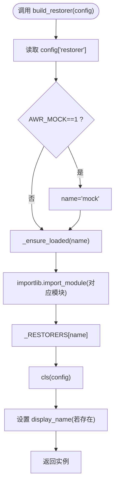
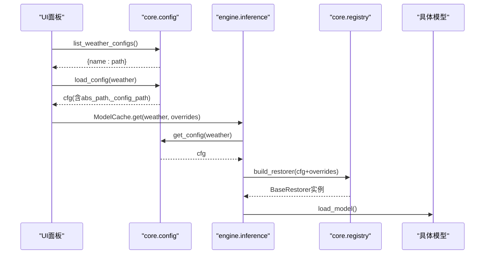
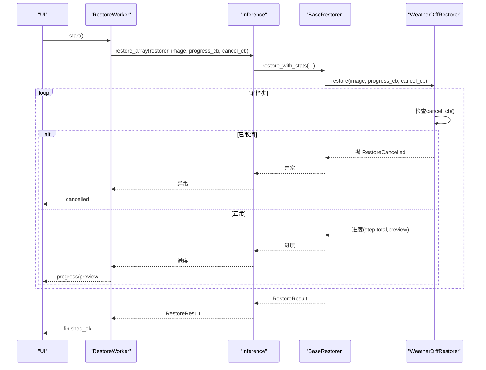
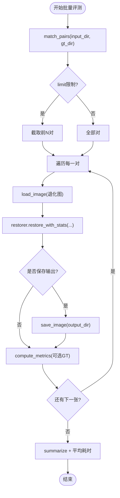
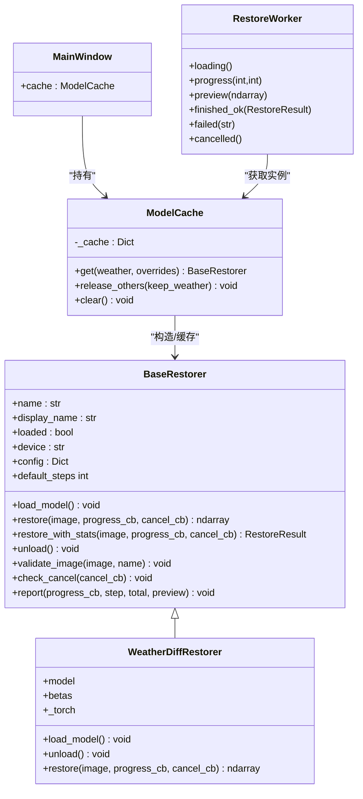
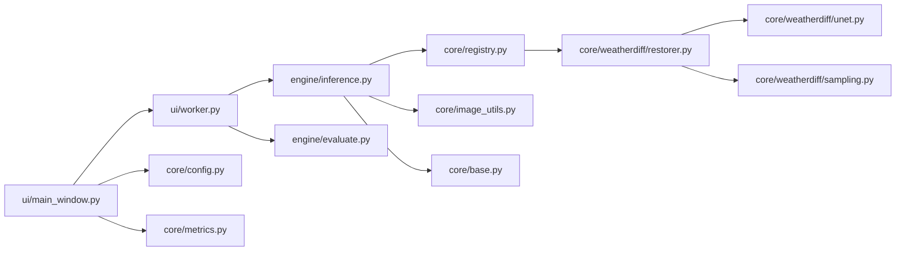

# 组件交互

<cite>
**本文引用的文件**
- [app.py](file://app.py)
- [core/base.py](file://core/base.py)
- [core/config.py](file://core/config.py)
- [core/registry.py](file://core/registry.py)
- [core/image_utils.py](file://core/image_utils.py)
- [core/weatherdiff/restorer.py](file://core/weatherdiff/restorer.py)
- [engine/inference.py](file://engine/inference.py)
- [engine/evaluate.py](file://engine/evaluate.py)
- [ui/main_window.py](file://ui/main_window.py)
- [ui/worker.py](file://ui/worker.py)
- [ui/panels.py](file://ui/panels.py)
- [configs/allweather.yaml](file://configs/allweather.yaml)
- [configs/haze.yaml](file://configs/haze.yaml)
</cite>

## 目录
1. [简介](#简介)
2. [项目结构](#项目结构)
3. [核心组件](#核心组件)
4. [架构总览](#架构总览)
5. [详细组件分析](#详细组件分析)
6. [依赖关系分析](#依赖关系分析)
7. [性能与资源管理](#性能与资源管理)
8. [故障排查指南](#故障排查指南)
9. [结论](#结论)
10. [附录：配置与扩展](#附录：配置与扩展)

## 简介
本文件面向“恶劣天气图像复原系统”的组件交互，重点说明：
- UI 层、推理编排层、模型注册表与具体复原器之间的通信机制与协作模式
- 基于 @register_restorer 的动态模型加载与发现
- YAML 配置的解析与应用流程
- 推理引擎如何协调 UI 与算法层（进度回调、取消、错误处理）
- 从用户操作到结果输出的完整时序
- 异常处理与资源管理机制

## 项目结构
系统按职责分层组织：
- 入口与界面：app.py、ui/*
- 核心接口与工具：core/base.py、core/config.py、core/image_utils.py、core/metrics.py
- 模型注册与实现：core/registry.py、core/weatherdiff/restorer.py、core/baseline/*
- 推理与评测：engine/inference.py、engine/evaluate.py
- 配置：configs/*.yaml

图表来源
- [app.py:19-32](file://app.py#L19-L32)
- [ui/main_window.py:499-515](file://ui/main_window.py#L499-L515)
- [ui/worker.py:32-89](file://ui/worker.py#L32-L89)
- [engine/inference.py:22-68](file://engine/inference.py#L22-L68)
- [core/registry.py:68-84](file://core/registry.py#L68-L84)
- [core/weatherdiff/restorer.py:32-90](file://core/weatherdiff/restorer.py#L32-L90)
- [core/config.py:25-57](file://core/config.py#L25-L57)
- [core/image_utils.py:22-33](file://core/image_utils.py#L22-L33)
- [engine/evaluate.py:51-116](file://engine/evaluate.py#L51-L116)

章节来源
- [app.py:19-32](file://app.py#L19-L32)
- [ui/main_window.py:499-515](file://ui/main_window.py#L499-L515)

## 核心组件
- BaseRestorer：统一复原接口契约，定义 load_model、restore、unload、restore_with_stats、进度/取消回调约定、RestoreResult 等。
- Registry：动态注册与发现模型，支持延迟导入避免启动时加载 torch；提供 build_restorer(config)。
- Config：读取 configs/*.yaml，解析相对路径为绝对路径，注入 _config_path，暴露 get_config/list_weather_configs。
- Inference：ModelCache 权重缓存、restore_array/restore_file/restore_batch 编排；深度合并运行时覆盖参数。
- UI：MainWindow/SingleImagePage/BatchEvalPage 负责交互；ControlPanel 收集参数；RestoreWorker/EvalWorker 在 QThread 中执行并回传信号。
- WeatherDiffRestorer：扩散模型实现，封装设备选择、权重加载、预处理、patch-based 采样、显存自适应、后处理还原尺寸。
- Evaluate：批量评测管线，配对 GT、计算指标、汇总导出 CSV。

章节来源
- [core/base.py:61-185](file://core/base.py#L61-L185)
- [core/registry.py:18-84](file://core/registry.py#L18-L84)
- [core/config.py:25-98](file://core/config.py#L25-L98)
- [engine/inference.py:22-153](file://engine/inference.py#L22-L153)
- [ui/main_window.py:61-251](file://ui/main_window.py#L61-L251)
- [ui/worker.py:32-162](file://ui/worker.py#L32-L162)
- [core/weatherdiff/restorer.py:32-244](file://core/weatherdiff/restorer.py#L32-L244)
- [engine/evaluate.py:24-116](file://engine/evaluate.py#L24-L116)

## 架构总览
系统采用“UI 事件 -> 后台线程 -> 推理编排 -> 模型实例 -> 数据/指标”的分层架构。关键特性：
- 解耦：UI 不直接依赖具体模型，仅通过 BaseRestorer 接口和 ModelCache 获取实例。
- 动态加载：通过 registry 的 @register_restorer 装饰器将模型类登记到注册表，按需 import 模块。
- 配置驱动：YAML 决定 restorer 类型、权重路径、采样参数等；运行时可覆盖 sampling.*。
- 线程安全：所有耗时任务在 QThread 中运行，通过 pyqtSignal 与 UI 通信。
- 资源管理：ModelCache 缓存已加载模型，支持 release_others/clear；WeatherDiffRestorer 显式释放显存。

图表来源
- [ui/main_window.py:188-214](file://ui/main_window.py#L188-L214)
- [ui/worker.py:63-89](file://ui/worker.py#L63-L89)
- [engine/inference.py:70-78](file://engine/inference.py#L70-L78)
- [core/registry.py:68-84](file://core/registry.py#L68-L84)
- [core/weatherdiff/restorer.py:47-90](file://core/weatherdiff/restorer.py#L47-L90)
- [core/base.py:111-138](file://core/base.py#L111-L138)

## 详细组件分析

### 模型注册与发现（@register_restorer）
- 设计要点：
  - 使用类装饰器 register_restorer(name) 将子类注册到全局字典 _RESTORERS。
  - 通过 _LAZY_MODULES 映射名称到模块路径，仅在需要时 import_module，避免启动即加载 torch。
  - build_restorer(config) 根据 config.restorer 选择实现，支持 AWR_MOCK=1 强制降级为 mock。
  - available_restorers() 返回当前可用模型名集合，供 UI 下拉框展示。

图表来源
- [core/registry.py:29-84](file://core/registry.py#L29-L84)

章节来源
- [core/registry.py:18-84](file://core/registry.py#L18-L84)

### 配置管理系统（YAML -> 组件）
- 加载流程：
  - load_config(path) 支持多种传入形式，自动定位 configs/*.yaml。
  - 解析 yaml.safe_load，注入 _config_path 便于追踪。
  - 将 weights.path 解析为绝对路径 abs_path，供后续权重加载使用。
  - list_weather_configs() 扫描 configs 目录并按 WEATHER_ORDER 排序，供 UI 填充下拉框。
  - get_config(weather) 便捷取配置；weight_path(cfg) 取权重绝对路径。

- 应用方式：
  - UI 的 ControlPanel 读取配置描述用于提示，并将 sampling.timesteps/grid_r 作为 overrides 传递给 ModelCache.get。
  - Engine 通过 get_config 获取基础配置，再与 overrides 深度合并，最终传给 build_restorer。

图表来源
- [core/config.py:25-98](file://core/config.py#L25-L98)
- [ui/panels.py:114-154](file://ui/panels.py#L114-L154)
- [engine/inference.py:33-52](file://engine/inference.py#L33-L52)
- [core/registry.py:68-84](file://core/registry.py#L68-L84)

章节来源
- [core/config.py:25-98](file://core/config.py#L25-L98)
- [ui/panels.py:114-154](file://ui/panels.py#L114-L154)
- [configs/allweather.yaml:1-47](file://configs/allweather.yaml#L1-L47)
- [configs/haze.yaml:1-46](file://configs/haze.yaml#L1-L46)

### 推理引擎与UI协作（进度回调、取消、错误处理）
- 线程模型：
  - RestoreWorker/EvalWorker 继承 QThread，run() 中执行耗时逻辑，通过 pyqtSignal 向 UI 发送 loading、progress、preview、finished_ok、failed、cancelled。
  - UI 只连接信号更新状态，不直接访问模型对象。

- 进度与预览：
  - 模型内部通过 progress_cb(step, total, preview) 上报进度与中间预览图。
  - WeatherDiffRestorer 将 tensor 预览转换为 RGB uint8 并通过 BaseRestorer.report 安全上报，避免回调异常中断推理。

- 取消机制：
  - UI 调用 worker.cancel() 设置标志位；模型侧定期调用 check_cancel(cancel_cb)，抛出 RestoreCancelled。
  - Worker 捕获 RestoreCancelled 并发出 cancelled 信号，UI 重置进度与状态。

- 错误处理：
  - WeightNotFoundError 提示缺失权重；其他异常被捕获并转为 failed(message)。
  - 批量评测中单张失败不影响整体，记录 error 字段并继续。

图表来源
- [ui/worker.py:32-89](file://ui/worker.py#L32-L89)
- [engine/inference.py:70-78](file://engine/inference.py#L70-L78)
- [core/base.py:111-185](file://core/base.py#L111-L185)
- [core/weatherdiff/restorer.py:102-167](file://core/weatherdiff/restorer.py#L102-L167)

章节来源
- [ui/worker.py:32-162](file://ui/worker.py#L32-L162)
- [core/base.py:37-185](file://core/base.py#L37-L185)
- [core/weatherdiff/restorer.py:102-190](file://core/weatherdiff/restorer.py#L102-L190)

### 批量评测流程
- 配对与遍历：match_pairs 将退化图与 GT 按文件名匹配，支持常见后缀变体。
- 逐图处理：调用 restorer.restore_with_stats，保存输出（可选），计算指标（PSNR/SSIM/NIQE/BRISQUE）。
- 进度与汇总：每完成一张通过 progress_cb 通知 UI；最后汇总均值与平均耗时。
- 导出：write_csv/write_summary_csv 生成 CSV 便于对比。

图表来源
- [engine/evaluate.py:51-116](file://engine/evaluate.py#L51-L116)
- [core/image_utils.py:45-78](file://core/image_utils.py#L45-L78)

章节来源
- [engine/evaluate.py:51-116](file://engine/evaluate.py#L51-L116)
- [core/image_utils.py:45-78](file://core/image_utils.py#L45-L78)

### 类与关系图（代码级）

图表来源
- [core/base.py:61-185](file://core/base.py#L61-L185)
- [core/weatherdiff/restorer.py:32-244](file://core/weatherdiff/restorer.py#L32-L244)
- [engine/inference.py:22-68](file://engine/inference.py#L22-L68)
- [ui/main_window.py:499-515](file://ui/main_window.py#L499-L515)
- [ui/worker.py:32-89](file://ui/worker.py#L32-L89)

## 依赖关系分析
- UI 依赖：
  - ui/main_window.py 依赖 engine.inference.ModelCache、core.config、core.metrics、ui.panels、ui.worker。
  - ui/worker.py 依赖 engine.evaluate、engine.inference、core.base。
- 推理层依赖：
  - engine/inference.py 依赖 core.base、core.config、core.image_utils、core.registry。
  - engine/evaluate.py 依赖 core.base、core.image_utils、core.metrics。
- 模型实现依赖：
  - core/weatherdiff/restorer.py 依赖 core.base、core.config、core.image_utils、core.registry、.unet/.sampling。
- 配置依赖：
  - core/config.py 依赖 pyyaml、pathlib；提供路径解析与列表能力。

图表来源
- [ui/main_window.py:49-56](file://ui/main_window.py#L49-L56)
- [ui/worker.py:27-29](file://ui/worker.py#L27-L29)
- [engine/inference.py:16-19](file://engine/inference.py#L16-L19)
- [engine/evaluate.py:16-18](file://engine/evaluate.py#L16-L18)
- [core/weatherdiff/restorer.py:24-29](file://core/weatherdiff/restorer.py#L24-L29)

章节来源
- [ui/main_window.py:49-56](file://ui/main_window.py#L49-L56)
- [ui/worker.py:27-29](file://ui/worker.py#L27-L29)
- [engine/inference.py:16-19](file://engine/inference.py#L16-L19)
- [engine/evaluate.py:16-18](file://engine/evaluate.py#L16-L18)
- [core/weatherdiff/restorer.py:24-29](file://core/weatherdiff/restorer.py#L24-L29)

## 性能与资源管理
- 权重缓存：ModelCache 按 weather| 键缓存实例，避免重复加载；支持 release_others 保留指定天气并释放其余，控制显存占用。
- 运行时覆盖：sampling.timesteps/grid_r 等参数通过 _deep_update 合并到已有实例配置，无需重新加载权重。
- 显存自适应：WeatherDiffRestorer 在 OOM 时自动降低 patch_batch_size 重试，提升鲁棒性。
- 设备选择：优先使用 CUDA（可通过 AWR_DEVICE 强制 CPU/CUDA）。
- 图像预处理：长边限制、尺寸对齐 16、小图反射填充，减少不必要计算。
- 进度与预览：仅当 preview 非空且转换成功才上报，避免 UI 卡顿。

章节来源
- [engine/inference.py:22-68](file://engine/inference.py#L22-L68)
- [engine/inference.py:135-143](file://engine/inference.py#L135-L143)
- [core/weatherdiff/restorer.py:137-167](file://core/weatherdiff/restorer.py#L137-L167)
- [core/weatherdiff/restorer.py:204-209](file://core/weatherdiff/restorer.py#L204-L209)
- [core/image_utils.py:109-167](file://core/image_utils.py#L109-L167)

## 故障排查指南
- 缺少 PyQt5：app.py 启动时检测并提示安装。
- 缺少 PyYAML：core/config.py 加载时报错并提示安装。
- 权重缺失：WeatherDiffRestorer.load_model 抛出 WeightNotFoundError，UI 提示去 weights/ 放置权重或运行下载脚本。
- 未安装 torch：尝试加载扩散模型时抛出 ImportError，建议设置 AWR_MOCK=1 走假模型。
- 单张失败不影响批量：engine/evaluate 捕获异常并记录 error，继续处理后续样本。
- 环境自检：AboutPage 列出依赖版本、指标可用性、GPU 状态与权重目录内容，便于快速定位问题。

章节来源
- [app.py:20-24](file://app.py#L20-L24)
- [core/config.py:9-12](file://core/config.py#L9-L12)
- [core/weatherdiff/restorer.py:47-56](file://core/weatherdiff/restorer.py#L47-L56)
- [core/weatherdiff/restorer.py:192-201](file://core/weatherdiff/restorer.py#L192-L201)
- [engine/evaluate.py:107-108](file://engine/evaluate.py#L107-L108)
- [ui/main_window.py:441-496](file://ui/main_window.py#L441-L496)

## 结论
本系统通过清晰的层次划分与统一的接口契约，实现了 UI、推理编排与多模型的松耦合协作。基于 @register_restorer 的动态加载与 YAML 配置驱动，使得新增模型与场景只需声明式配置与装饰即可接入。推理引擎在 ModelCache 的支持下兼顾性能与体验，配合线程化与信号机制，确保 UI 流畅与可响应。完善的异常处理与资源管理策略，使系统在真实环境中具备良好鲁棒性。

## 附录：配置与扩展
- 新增天气类型：
  - 在 configs/ 下新增 *.yaml，填写 name/display_name/description/restorer/weights/data/model/diffusion/sampling 等字段。
  - 如需加入默认顺序，修改 core/config.py 中的 WEATHER_ORDER。
- 新增模型：
  - 在 core/* 下实现继承 BaseRestorer 的类，并使用 @register_restorer("your_name") 装饰。
  - 在 core/registry.py 的 _LAZY_MODULES 中添加映射，或通过模块内注册生效。
- 运行时覆盖：
  - 通过 ControlPanel.overrides() 返回 {"sampling": {...}}，传入 ModelCache.get 以调整采样步数与滑窗步长。

章节来源
- [core/config.py:21-23](file://core/config.py#L21-L23)
- [core/registry.py:21-26](file://core/registry.py#L21-L26)
- [core/weatherdiff/restorer.py:32-36](file://core/weatherdiff/restorer.py#L32-L36)
- [ui/panels.py:147-154](file://ui/panels.py#L147-L154)