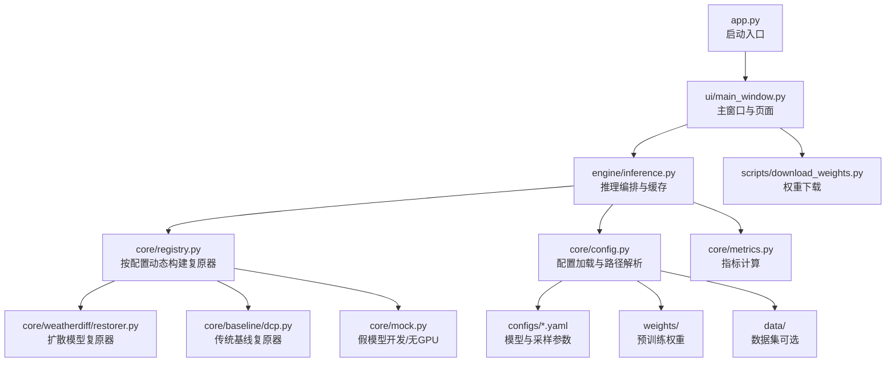
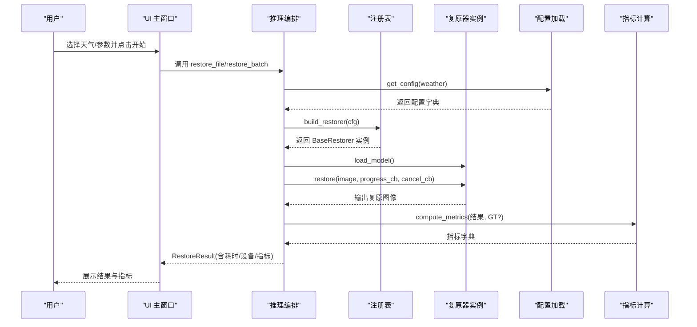
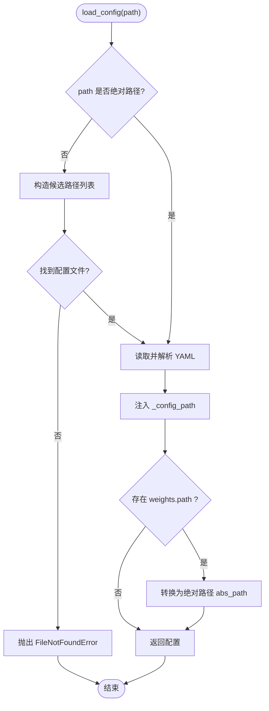
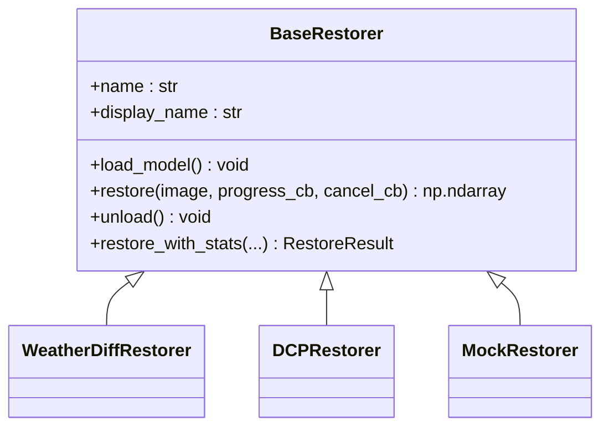
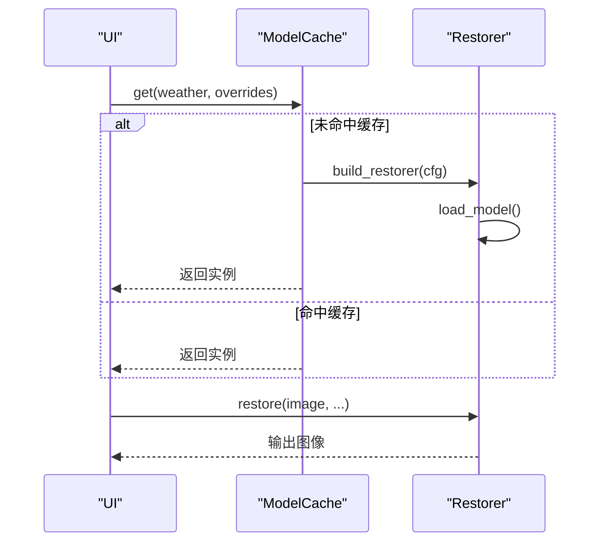

# 部署和运维

<cite>
**本文引用的文件**
- [requirements.txt](file://requirements.txt)
- [app.py](file://app.py)
- [core/config.py](file://core/config.py)
- [core/base.py](file://core/base.py)
- [core/registry.py](file://core/registry.py)
- [engine/inference.py](file://engine/inference.py)
- [ui/main_window.py](file://ui/main_window.py)
- [scripts/download_weights.py](file://scripts/download_weights.py)
- [configs/allweather.yaml](file://configs/allweather.yaml)
- [data/README.md](file://data/README.md)
- [weights/README.md](file://weights/README.md)
</cite>

## 目录
1. [简介](#简介)
2. [项目结构](#项目结构)
3. [核心组件](#核心组件)
4. [架构总览](#架构总览)
5. [详细组件分析](#详细组件分析)
6. [依赖与环境要求](#依赖与环境要求)
7. [容器化与部署](#容器化与部署)
8. [监控、日志与健康检查](#监控日志与健康检查)
9. [故障排查指南](#故障排查指南)
10. [备份与恢复策略](#备份与恢复策略)
11. [安全与权限管理](#安全与权限管理)
12. [结论](#结论)

## 简介
本文件面向生产环境的部署与运维，覆盖环境要求、依赖管理、Docker 容器化方案、监控与日志最佳实践、故障排查、备份恢复以及安全与权限建议。系统为“恶劣天气图像复原系统”，支持多种天气类型（雨、雾、雪、统一模型）的扩散模型复原与传统基线方法，并提供 PyQt5 可视化界面与批量评测能力。

## 项目结构
- 配置：configs/*.yaml 定义不同天气/模型的参数与权重路径
- 核心：core/* 提供统一接口、配置加载、指标计算、注册表等
- 引擎：engine/* 负责推理编排、缓存与批量处理
- 界面：ui/* 提供单图复原、批量评测、环境自检等 GUI
- 脚本：scripts/* 提供权重下载、冒烟测试等运维工具
- 数据与权重：data/ 与 weights/ 为运行时资源目录（不纳入版本控制）

图表来源
- [app.py:1-37](file://app.py#L1-L37)
- [ui/main_window.py:499-519](file://ui/main_window.py#L499-L519)
- [engine/inference.py:22-68](file://engine/inference.py#L22-L68)
- [core/registry.py:18-84](file://core/registry.py#L18-L84)
- [core/config.py:14-20](file://core/config.py#L14-L20)
- [scripts/download_weights.py:26-37](file://scripts/download_weights.py#L26-L37)

章节来源
- [app.py:1-37](file://app.py#L1-L37)
- [ui/main_window.py:499-519](file://ui/main_window.py#L499-L519)
- [engine/inference.py:22-68](file://engine/inference.py#L22-L68)
- [core/registry.py:18-84](file://core/registry.py#L18-L84)
- [core/config.py:14-20](file://core/config.py#L14-L20)
- [scripts/download_weights.py:26-37](file://scripts/download_weights.py#L26-L37)

## 核心组件
- 统一复原接口：BaseRestorer 定义了 load_model、restore、unload 等契约，所有复原器必须遵循；提供进度回调、取消回调、结果封装 RestoreResult。
- 配置加载：core/config.py 读取 configs/*.yaml，自动将相对权重路径解析为绝对路径，并注入配置来源路径便于排查。
- 模型注册表：core/registry.py 根据配置中的 restorer 字段延迟导入具体实现，支持 mock/weatherdiff/dcp 三种复原器，且可通过环境变量降级到 mock。
- 推理编排：engine/inference.py 提供 ModelCache 缓存已加载的复原器实例，避免重复加载；提供 restore_array/file/batch 统一入口，支持进度与取消。
- 指标计算：core/metrics.py 提供 PSNR/SSIM/LPIPS/NIQE/BRISQUE/FID 等指标，具备可用性探测与容错。
- 界面与自检：ui/main_window.py 提供单图复原、批量评测、关于/环境页（显示依赖、指标可用性、GPU 状态、权重目录）。

章节来源
- [core/base.py:61-185](file://core/base.py#L61-L185)
- [core/config.py:25-97](file://core/config.py#L25-L97)
- [core/registry.py:18-84](file://core/registry.py#L18-L84)
- [engine/inference.py:22-153](file://engine/inference.py#L22-L153)
- [core/metrics.py:1-314](file://core/metrics.py#L1-L314)
- [ui/main_window.py:441-519](file://ui/main_window.py#L441-L519)

## 架构总览
系统采用“配置驱动 + 注册表 + 缓存”的架构：
- 通过 YAML 配置选择复原器与采样参数
- 注册表按需加载具体实现，避免不必要的重型依赖
- 推理层缓存模型实例，提升交互体验与吞吐
- 指标模块可插拔，支持有参考与无参考指标

图表来源
- [ui/main_window.py:188-240](file://ui/main_window.py#L188-L240)
- [engine/inference.py:70-132](file://engine/inference.py#L70-L132)
- [core/registry.py:68-84](file://core/registry.py#L68-L84)
- [core/config.py:77-97](file://core/config.py#L77-L97)
- [core/metrics.py:139-177](file://core/metrics.py#L139-L177)

## 详细组件分析

### 配置与路径解析
- 支持传入 weather 名或 yaml 路径，自动查找并解析
- 自动将 weights.path 转为绝对路径，便于跨平台运行
- 提供 list_weather_configs 用于界面下拉框填充

图表来源
- [core/config.py:25-57](file://core/config.py#L25-L57)

章节来源
- [core/config.py:25-97](file://core/config.py#L25-L97)

### 模型注册与动态加载
- 通过 @register_restorer 装饰器将复原器注册到全局表
- 延迟导入实现模块，避免启动时加载 torch
- 支持 AWR_MOCK=1 强制降级为假模型，便于无 GPU 环境开发

图表来源
- [core/base.py:61-185](file://core/base.py#L61-L185)
- [core/registry.py:18-84](file://core/registry.py#L18-L84)

章节来源
- [core/registry.py:18-84](file://core/registry.py#L18-L84)
- [core/base.py:61-185](file://core/base.py#L61-L185)

### 推理编排与缓存
- ModelCache 按配置名缓存复原器实例，切换天气时不重复加载权重
- 支持 release_others/clear 释放显存，避免多任务并发时的资源竞争
- restore_batch 对失败项进行容错，保证整批任务不因单张图异常中断

图表来源
- [engine/inference.py:22-68](file://engine/inference.py#L22-L68)
- [engine/inference.py:70-132](file://engine/inference.py#L70-L132)

章节来源
- [engine/inference.py:22-153](file://engine/inference.py#L22-L153)

### 指标计算与可用性探测
- 支持有参考（PSNR/SSIM/LPIPS）与无参考（NIQE/BRISQUE）指标
- available_metrics 探测第三方库可用性，界面“关于”页可展示
- 批量评测汇总均值，忽略 None 与 inf

章节来源
- [core/metrics.py:1-314](file://core/metrics.py#L1-L314)
- [ui/main_window.py:441-496](file://ui/main_window.py#L441-L496)

## 依赖与环境要求
- Python 版本：建议使用 Python 3.10
- PyTorch：需先按 CUDA 版本单独安装（例如 CUDA 12.1），再安装 requirements.txt
- 最小依赖（三组均可用）：numpy、pillow、pyyaml、PyQt5、scikit-image
- 深度学习依赖（模型组）：torch、torchvision
- 指标扩展（评测组）：lpips、pyiqa、pytorch-fid
- 可视化与工具：pyqtgraph、tqdm、requests

兼容性要点
- 若未安装 torch，可通过设置环境变量 AWR_MOCK=1 使用假模型进行开发与演示
- 设备选择：AWR_DEVICE 可强制指定 cpu 或 cuda；否则优先使用可用 GPU

章节来源
- [requirements.txt:1-34](file://requirements.txt#L1-L34)
- [core/registry.py:74-77](file://core/registry.py#L74-L77)
- [core/weatherdiff/restorer.py:204-209](file://core/weatherdiff/restorer.py#L204-L209)

## 容器化与部署
说明：仓库未包含 Dockerfile 或 docker-compose 文件。以下为基于现有代码的生产部署建议，确保可复现与稳定运行。

镜像构建建议
- 基础镜像：选择与目标 CUDA 版本匹配的 nvidia/cuda 镜像（如 CUDA 12.1）
- Python 版本：固定为 3.10.x
- 依赖安装顺序：
  - 先按 CUDA 版本安装 torch/torchvision（与宿主驱动兼容）
  - 再执行 pip install -r requirements.txt
- 工作目录：/app，复制项目根目录内容
- 非 root 用户：创建专用用户运行应用，限制文件系统访问

环境变量配置
- AWR_MOCK=1：禁用真实模型，仅使用假模型（适合无 GPU 或调试）
- AWR_DEVICE=cpu|cuda：强制设备选择
- 其他：如需自定义权重/数据/输出路径，可在运行时挂载卷并修改配置

资源限制
- GPU 显存：WeatherDiff64 推荐 8~12G 显存；WeatherDiff128 更大更慢
- CPU 模式：可运行但速度较慢，适合轻量验证
- 内存：批量评测时注意输入/输出目录磁盘空间

健康检查
- 启动后执行一次冒烟测试：python scripts/smoke_test.py
- 权重校验：python scripts/check_weights.py
- 界面自检：启动 app.py 后查看“关于 / 环境”页，确认依赖、指标、GPU、权重目录

启动方式
- 直接运行：python app.py
- 后台服务：结合 systemd/supervisor/docker 进程管理，确保崩溃重启

章节来源
- [requirements.txt:1-34](file://requirements.txt#L1-L34)
- [scripts/download_weights.py:26-37](file://scripts/download_weights.py#L26-L37)
- [ui/main_window.py:441-496](file://ui/main_window.py#L441-L496)

## 监控、日志与健康检查
- 性能指标收集
  - 单次复原耗时与设备信息：RestoreResult.elapsed、RestoreResult.device
  - 批量评测平均耗时与指标均值：engine.evaluate 汇总
- 错误追踪
  - 界面捕获异常并提示（如读取失败、复原失败）
  - 指标不可用时记录警告并跳过对应指标
- 健康检查
  - 冒烟测试：scripts/smoke_test.py 验证依赖、配置、假模型、DCP、指标、批量导出
  - 权重检查：scripts/check_weights.py 打印 checkpoint 结构或尝试构建模型
  - 界面“关于 / 环境”页：显示依赖版本、指标可用性、GPU 状态、权重目录

建议
- 在容器内将 stdout/stderr 输出到标准流，由容器日志系统收集
- 对关键步骤（权重加载、批量任务开始/结束、异常）添加结构化日志（JSON）
- 暴露健康端点（如 HTTP GET /health）返回依赖与指标可用性摘要

章节来源
- [core/base.py:45-58](file://core/base.py#L45-L58)
- [core/metrics.py:205-214](file://core/metrics.py#L205-L214)
- [ui/main_window.py:441-496](file://ui/main_window.py#L441-L496)
- [scripts/smoke_test.py:1-46](file://scripts/smoke_test.py#L1-L46)

## 故障排查指南
常见问题与解决
- 缺少 PyQt5：启动时报 ImportError，执行 pip install PyQt5
- 缺少 pyyaml：配置加载时报 ImportError，执行 pip install pyyaml
- 权重缺失：加载模型时报 WeightNotFoundError，运行 python scripts/download_weights.py 下载
- 设备不可用：CUDA 不可用或未安装驱动，设置 AWR_DEVICE=cpu 或使用 AWR_MOCK=1
- 指标不可用：缺少第三方库（如 skimage/pyiqa/lpips），安装对应依赖或跳过该指标
- 批量任务部分失败：restore_batch 会记录错误并继续后续任务，查看 on_item 回调或 CSV 输出定位问题

诊断步骤
- 运行冒烟测试：python scripts/smoke_test.py
- 检查权重：python scripts/check_weights.py
- 查看“关于 / 环境”页，确认依赖、指标、GPU、权重目录
- 检查环境变量：AWR_MOCK、AWR_DEVICE

章节来源
- [app.py:19-32](file://app.py#L19-L32)
- [core/config.py:25-57](file://core/config.py#L25-L57)
- [scripts/download_weights.py:82-116](file://scripts/download_weights.py#L82-L116)
- [core/base.py:41-43](file://core/base.py#L41-L43)
- [core/weatherdiff/restorer.py:192-209](file://core/weatherdiff/restorer.py#L192-L209)
- [ui/main_window.py:441-496](file://ui/main_window.py#L441-L496)

## 备份与恢复策略
- 权重备份：定期备份 weights/ 目录（尤其是 .pth.tar 文件）
- 配置备份：configs/*.yaml 纳入版本控制，保留变更历史
- 数据备份：data/ 目录（测试集/数据集）按约定结构归档，避免误删
- 输出备份：outputs/ 目录保存复原结果与评测 CSV，便于审计与回溯
- 恢复流程：从备份恢复权重与数据，重新安装依赖，运行冒烟测试验证

注意事项
- 权重与数据不纳入 Git，需在 CI/CD 中提供下载或挂载机制
- 批量评测前校验输入目录结构与文件名配对规则

章节来源
- [data/README.md:1-51](file://data/README.md#L1-L51)
- [weights/README.md:1-40](file://weights/README.md#L1-L40)
- [core/config.py:14-20](file://core/config.py#L14-L20)

## 安全与权限管理
- 最小权限原则：以非 root 用户运行应用，仅授予必要目录读写权限
- 网络访问：权重下载依赖外部服务器，确保防火墙允许 HTTPS 出站
- 敏感信息：不在配置中硬编码密钥或路径，使用环境变量或挂载卷
- 依赖安全：定期更新依赖，扫描已知漏洞
- 容器安全：使用精简基础镜像，移除不必要工具，启用只读根文件系统（除必要写入目录）

章节来源
- [scripts/download_weights.py:48-79](file://scripts/download_weights.py#L48-L79)
- [core/config.py:14-20](file://core/config.py#L14-L20)

## 结论
本系统通过配置驱动与注册表实现了灵活的复原器接入，配合推理缓存与指标模块，提供了稳定的单图与批量处理能力。生产部署应重点关注依赖版本一致性、权重与数据管理、资源限制与健康检查。通过冒烟测试与界面自检，可快速定位环境问题。建议在容器化环境中固化依赖与配置，结合日志与监控实现可观测性与可维护性。