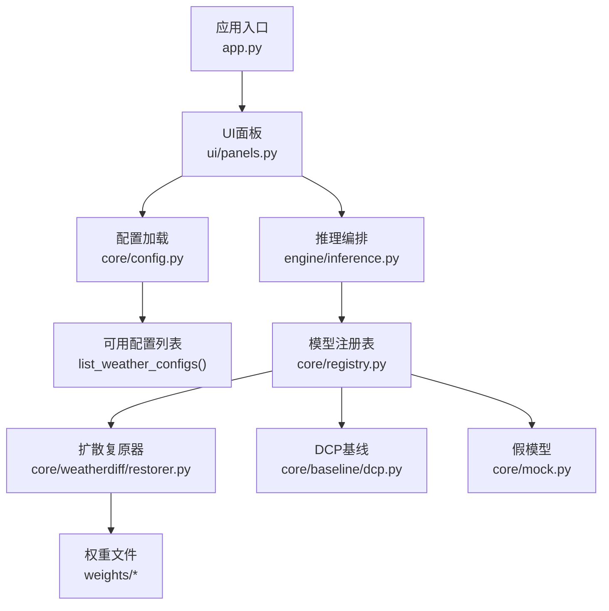
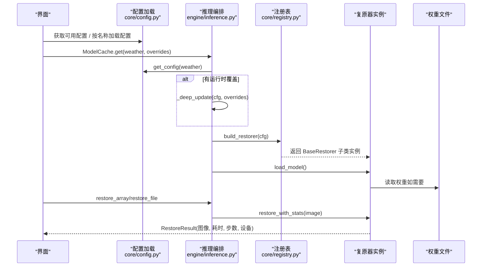
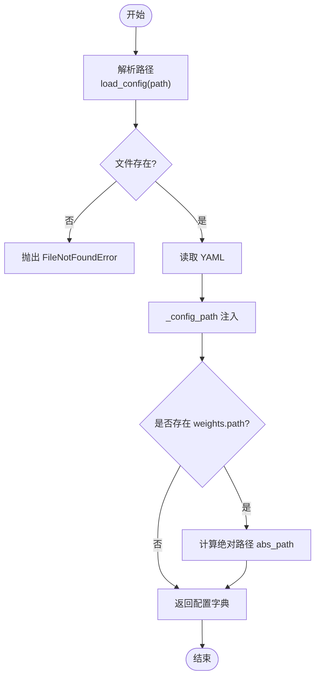
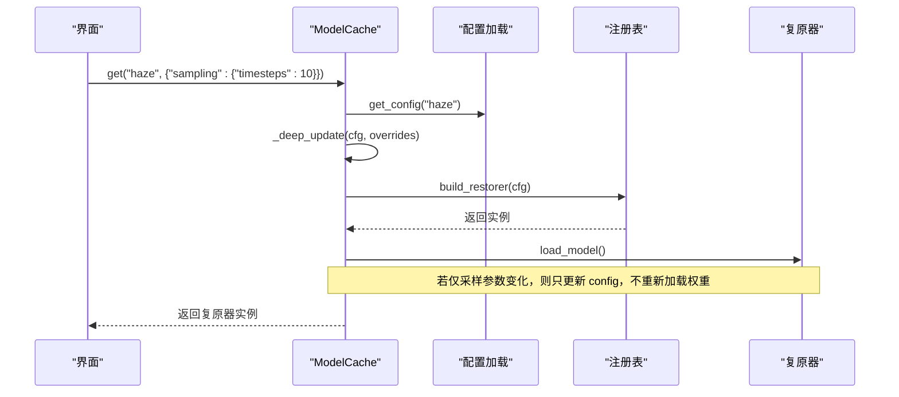
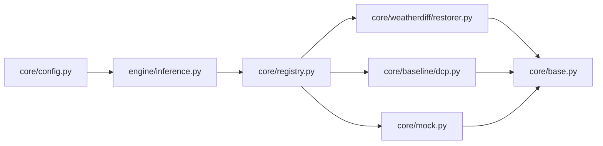

# 配置系统

<cite>
**本文引用的文件**
- [core/config.py](file://core/config.py)
- [configs/allweather.yaml](file://configs/allweather.yaml)
- [configs/haze.yaml](file://configs/haze.yaml)
- [configs/snow.yaml](file://configs/snow.yaml)
- [configs/dcp.yaml](file://configs/dcp.yaml)
- [configs/mock.yaml](file://configs/mock.yaml)
- [core/registry.py](file://core/registry.py)
- [core/base.py](file://core/base.py)
- [core/weatherdiff/restorer.py](file://core/weatherdiff/restorer.py)
- [core/baseline/dcp.py](file://core/baseline/dcp.py)
- [core/mock.py](file://core/mock.py)
- [engine/inference.py](file://engine/inference.py)
- [ui/panels.py](file://ui/panels.py)
- [app.py](file://app.py)
</cite>

## 目录
1. [简介](#简介)
2. [项目结构](#项目结构)
3. [核心组件](#核心组件)
4. [架构总览](#架构总览)
5. [详细组件分析](#详细组件分析)
6. [依赖关系分析](#依赖关系分析)
7. [性能与内存管理](#性能与内存管理)
8. [故障排查指南](#故障排查指南)
9. [结论](#结论)
10. [附录：配置参数参考](#附录：配置参数参考)

## 简介
本仓库采用“YAML 配置文件 + 运行时覆盖”的配置体系，用于统一管理不同天气类型（去雾、去雪、统一模型）与基线算法（暗通道先验 DCP）、以及开发联调用的假模型（Mock）。配置系统负责：
- 加载并解析 YAML 配置，自动将相对路径转换为绝对路径
- 提供按名称获取配置的便捷接口
- 支持运行时对采样步数等参数进行动态覆盖
- 通过环境变量实现设备选择与降级策略
- 为 UI 下拉框与评测流程提供可枚举的可用配置列表

该设计使新增一种天气或算法只需添加一个 YAML 文件，无需改动界面与评测代码。

## 项目结构
配置相关的关键位置与职责如下：
- configs/*.yaml：各场景的具体配置（统一模型、去雾、去雪、DCP、Mock）
- core/config.py：配置加载、路径解析、可用配置枚举
- engine/inference.py：推理编排与权重缓存，支持运行时参数覆盖
- core/registry.py：根据 restorer 字段动态构建复原器实例
- core/base.py：统一的复原器接口契约（输入输出、进度、取消、结果封装）
- core/weatherdiff/restorer.py：扩散模型复原器（读取 diffusion/sampling/data/model 等配置）
- core/baseline/dcp.py：传统基线（读取 dcp.* 参数）
- core/mock.py：假模型（读取 mock.* 与 sampling.timesteps）
- ui/panels.py：UI 侧扫描并展示可用配置
- app.py：启动入口与环境变量说明

图表来源
- [app.py:1-37](file://app.py#L1-L37)
- [ui/panels.py:109-142](file://ui/panels.py#L109-L142)
- [core/config.py:25-78](file://core/config.py#L25-L78)
- [engine/inference.py:22-68](file://engine/inference.py#L22-L68)
- [core/registry.py:1-85](file://core/registry.py#L1-L85)
- [core/weatherdiff/restorer.py:47-90](file://core/weatherdiff/restorer.py#L47-L90)
- [core/baseline/dcp.py:33-85](file://core/baseline/dcp.py#L33-L85)
- [core/mock.py:33-66](file://core/mock.py#L33-L66)

章节来源
- [core/config.py:25-78](file://core/config.py#L25-L78)
- [engine/inference.py:22-68](file://engine/inference.py#L22-L68)
- [core/registry.py:1-85](file://core/registry.py#L1-L85)
- [ui/panels.py:109-142](file://ui/panels.py#L109-L142)
- [app.py:1-37](file://app.py#L1-L37)

## 核心组件
- 配置加载器（core/config.py）
  - load_config：读取 YAML，注入 _config_path，解析 weights.path 为绝对路径
  - list_weather_configs：扫描 configs/*.y*ml，按 WEATHER_ORDER 排序返回可用配置
  - get_config：按名称快速取配置
  - weight_path：安全提取权重绝对路径（无权重时返回 None）
  - ensure_dir：确保输出目录存在
- 模型注册表（core/registry.py）
  - register_restorer：装饰器注册复原器类
  - build_restorer：根据配置中的 restorer 字段构造实例；当 AWR_MOCK=1 时强制降级为 mock
  - available_restorers：列出所有已注册与可延迟加载的复原器名
- 统一接口（core/base.py）
  - BaseRestorer：定义 load_model、restore、unload、default_steps、validate_image、report 等
  - RestoreResult：统一的结果数据结构（图像、耗时、步数、设备、restorer 标识等）
- 具体复原器
  - WeatherDiffRestorer：读取 data/model/diffusion/sampling 配置，处理预处理、采样、显存自适应
  - DarkChannelPriorRestorer：读取 dcp.* 参数，纯 numpy 实现去雾
  - MockRestorer：读取 mock.* 与 sampling.timesteps，模拟逐步去噪过程

章节来源
- [core/config.py:25-98](file://core/config.py#L25-L98)
- [core/registry.py:1-85](file://core/registry.py#L1-L85)
- [core/base.py:61-185](file://core/base.py#L61-L185)
- [core/weatherdiff/restorer.py:32-167](file://core/weatherdiff/restorer.py#L32-L167)
- [core/baseline/dcp.py:23-85](file://core/baseline/dcp.py#L23-L85)
- [core/mock.py:27-66](file://core/mock.py#L27-L66)

## 架构总览
配置到推理的整体调用链如下：

图表来源
- [core/config.py:25-78](file://core/config.py#L25-L78)
- [engine/inference.py:22-68](file://engine/inference.py#L22-L68)
- [core/registry.py:68-84](file://core/registry.py#L68-L84)
- [core/weatherdiff/restorer.py:47-90](file://core/weatherdiff/restorer.py#L47-L90)
- [core/base.py:111-138](file://core/base.py#L111-L138)

## 详细组件分析

### 配置加载与路径解析（core/config.py）
- 支持多种传入形式：直接文件名、带扩展名、相对路径、绝对路径
- 自动将 weights.path 解析为绝对路径，便于后续校验与加载
- 注入 _config_path 便于问题定位
- 提供 list_weather_configs 供 UI 动态填充下拉框，新增 YAML 即自动生效

图表来源
- [core/config.py:25-57](file://core/config.py#L25-L57)

章节来源
- [core/config.py:25-98](file://core/config.py#L25-L98)

### 运行时参数覆盖与热重载（engine/inference.py）
- ModelCache.get：按 weather 与可选 overrides 获取复原器实例
  - 首次访问：加载配置 -> 合并覆盖 -> 构建复原器 -> 加载权重
  - 后续访问：若仅采样参数变化（如 timesteps、grid_r），不重新加载权重，直接更新 cached.config
- _deep_update：递归合并字典，避免修改原配置
- release_others/clear：释放其他模型以控制显存占用

图表来源
- [engine/inference.py:22-68](file://engine/inference.py#L22-L68)
- [engine/inference.py:135-143](file://engine/inference.py#L135-L143)

章节来源
- [engine/inference.py:22-68](file://engine/inference.py#L22-L68)
- [engine/inference.py:135-143](file://engine/inference.py#L135-L143)

### 环境变量的作用域与优先级
- AWR_DEVICE：强制指定运行设备（如 cpu 或 cuda），在扩散复原器中优先于自动检测
- AWR_MOCK：设置为 1 时，任何非 mock 的 restorer 会被降级为假模型，便于无 GPU/无 torch 环境联调
- 这些环境变量在 registry 与 weatherdiff restorer 中被读取并影响行为

章节来源
- [core/registry.py:68-84](file://core/registry.py#L68-L84)
- [core/weatherdiff/restorer.py:204-209](file://core/weatherdiff/restorer.py#L204-L209)
- [app.py:1-37](file://app.py#L1-L37)

### 配置验证与默认值处理
- 输入图像校验：BaseRestorer.validate_image 要求 RGB uint8 (H,W,3)
- 输出尺寸校验：restore_with_stats 会检查输出与输入尺寸一致
- 默认值来源：
  - base.default_steps：从 sampling.timesteps 取值作为进度条预估步数
  - 各复原器内部对缺失参数提供合理默认（如 patch_size、omega、guided_radius 等）
- 权重校验：WeatherDiffRestorer.load_model 在找不到权重时抛出 WeightNotFoundError

章节来源
- [core/base.py:111-138](file://core/base.py#L111-L138)
- [core/base.py:153-166](file://core/base.py#L153-L166)
- [core/weatherdiff/restorer.py:47-56](file://core/weatherdiff/restorer.py#L47-L56)
- [core/baseline/dcp.py:46-51](file://core/baseline/dcp.py#L46-L51)

### 配置项详解与示例

#### 统一模型配置（allweather.yaml）
- 用途：单一扩散模型同时处理雨、雾、雪等多种退化，适合演示叠加退化场景
- 关键配置段：
  - name/display_name/description：元信息
  - restorer：weatherdiff
  - weights.path：权重文件路径（将被解析为绝对路径）
  - data.image_size/channels/conditional/max_side/size_multiple：数据预处理与尺寸约束
  - model.type/in_channels/out_ch/ch/ch_mult/num_res_blocks/attn_resolutions/dropout/resamp_with_conv/ema/ema_rate：UNet 结构与 EMA 开关
  - diffusion.beta_schedule/beta_start/beta_end/num_diffusion_timesteps：扩散噪声调度
  - sampling.timesteps/grid_r/eta/patch_batch_size/seed：采样步数、网格分辨率、随机种子等

章节来源
- [configs/allweather.yaml:1-47](file://configs/allweather.yaml#L1-L47)
- [core/config.py:25-57](file://core/config.py#L25-L57)
- [core/weatherdiff/restorer.py:112-137](file://core/weatherdiff/restorer.py#L112-L137)

#### 特定天气类型配置（haze.yaml / snow.yaml）
- 与 allweather.yaml 结构相同，对应官方 test_set 场景（rainfog / snow）
- 共享同一份权重，但语义上区分目标退化类型
- 可通过 sampling 调整速度与质量平衡（如 timesteps、grid_r）

章节来源
- [configs/haze.yaml:1-46](file://configs/haze.yaml#L1-L46)
- [configs/snow.yaml:1-46](file://configs/snow.yaml#L1-L46)

#### 基线算法配置（dcp.yaml）
- 用途：经典暗通道先验去雾，无需权重，作为非扩散方法对照
- 关键配置段：
  - restorer：dcp
  - data.max_side/size_multiple：输入尺寸限制
  - dcp.patch_size/omega/t0/guided_radius/guided_eps：暗通道窗口、透射率下限、引导滤波参数

章节来源
- [configs/dcp.yaml:1-21](file://configs/dcp.yaml#L1-L21)
- [core/baseline/dcp.py:46-85](file://core/baseline/dcp.py#L46-L85)

#### 假模型配置（mock.yaml）
- 用途：联调用阶段无需权重/GPU/Torch，模拟逐步去噪过程
- 关键配置段：
  - restorer：mock
  - sampling.timesteps：模拟步数（驱动进度条）
  - mock.load_delay/step_delay：模拟加载与每步耗时

章节来源
- [configs/mock.yaml:1-22](file://configs/mock.yaml#L1-L22)
- [core/mock.py:33-66](file://core/mock.py#L33-L66)

### 配置热重载与动态参数调整
- 动态覆盖：通过 ModelCache.get 的 overrides 参数，可在不重启程序的情况下调整采样步数、网格分辨率等
- 权重缓存：同一配置名仅加载一次权重；切换天气时不会重复读盘与占显存
- 资源释放：release_others 可保留当前使用的模型，释放其他模型以节省显存

章节来源
- [engine/inference.py:22-68](file://engine/inference.py#L22-L68)
- [engine/inference.py:54-68](file://engine/inference.py#L54-L68)

### 配置最佳实践
- 新增天气或算法：
  - 在 configs/ 下新增 YAML，设置 name/restorer/data/model/diffusion/sampling 等必要字段
  - 在 core/registry.py 的 _LAZY_MODULES 中注册模块（如需新复原器）
- 权重管理：
  - 使用相对路径指向 weights/ 下的文件，由配置加载器自动转为绝对路径
  - 确保权重文件存在，否则会在 load_model 时报错
- 开发与生产：
  - 开发调试：AWR_MOCK=1 快速打通流程；适当增大 step_delay 观察进度动画
  - 生产部署：关闭 AWR_MOCK，按需设置 AWR_DEVICE 为 cpu 或 cuda；调整 sampling.timesteps 平衡速度/质量
- 参数调优：
  - 扩散模型：增大 timesteps 提升质量但增加耗时；降低 grid_r 提高速度但可能拼接痕迹更明显
  - DCP：调节 omega 与 guided_radius 控制去雾强度与边缘保持

[本节为通用指导，不直接分析具体文件]

### 常见问题解决方案
- 找不到配置文件：检查传入名称是否正确（支持 rain / haze / snow / allweather / dcp / mock）
- 找不到权重文件：执行下载脚本或手动放置至 weights/，并确认 configs 中的 weights.path
- 缺少依赖：
  - 缺少 pyyaml：安装后重试
  - 缺少 torch：安装或使用 AWR_MOCK=1 绕过
  - 缺少 PyQt5：安装后启动界面
- 显存不足：扩散复原器会自动降低 patch_batch_size 重试；也可在配置中减小 timesteps 或 grid_r

章节来源
- [core/config.py:25-57](file://core/config.py#L25-L57)
- [core/weatherdiff/restorer.py:156-161](file://core/weatherdiff/restorer.py#L156-L161)
- [core/registry.py:68-84](file://core/registry.py#L68-L84)
- [app.py:1-37](file://app.py#L1-L37)

## 依赖关系分析
配置系统与复原器的耦合关系如下：

图表来源
- [core/config.py:25-78](file://core/config.py#L25-L78)
- [engine/inference.py:22-68](file://engine/inference.py#L22-L68)
- [core/registry.py:1-85](file://core/registry.py#L1-L85)
- [core/weatherdiff/restorer.py:32-167](file://core/weatherdiff/restorer.py#L32-L167)
- [core/baseline/dcp.py:23-85](file://core/baseline/dcp.py#L23-L85)
- [core/mock.py:27-66](file://core/mock.py#L27-L66)
- [core/base.py:61-185](file://core/base.py#L61-L185)

章节来源
- [core/config.py:25-78](file://core/config.py#L25-L78)
- [engine/inference.py:22-68](file://engine/inference.py#L22-L68)
- [core/registry.py:1-85](file://core/registry.py#L1-L85)
- [core/base.py:61-185](file://core/base.py#L61-L185)

## 性能与内存管理
- 权重缓存：ModelCache 保证同一配置名只加载一次权重，减少 IO 与显存占用
- 显存自适应：扩散复原器在 OOM 时自动减半 patch_batch_size 并重试
- 资源释放：release_others 可释放非当前使用的模型，clear 清空全部缓存
- 采样参数：timesteps 与 grid_r 直接影响速度与质量，建议按场景调优

章节来源
- [engine/inference.py:22-68](file://engine/inference.py#L22-L68)
- [core/weatherdiff/restorer.py:156-161](file://core/weatherdiff/restorer.py#L156-L161)

## 故障排查指南
- 启动失败提示缺少依赖：
  - 缺少 PyQt5/pyyaml/torch：按提示安装相应包
- 界面无法显示可用配置：
  - 检查 configs/ 目录下是否有 *.y*ml 文件
  - 查看 list_weather_configs 是否返回空字典
- 权重未找到：
  - 确认 weights/ 目录存在且包含所需 .pth.tar 文件
  - 检查 configs 中 weights.path 是否正确
- 设备选择异常：
  - 设置 AWR_DEVICE=cpu 强制 CPU 运行
  - 在无 CUDA 环境下，AWR_MOCK=1 可跳过 torch 依赖

章节来源
- [app.py:1-37](file://app.py#L1-L37)
- [core/config.py:60-74](file://core/config.py#L60-L74)
- [core/weatherdiff/restorer.py:47-56](file://core/weatherdiff/restorer.py#L47-L56)
- [core/weatherdiff/restorer.py:204-209](file://core/weatherdiff/restorer.py#L204-L209)

## 结论
本配置系统通过 YAML 集中管理不同天气与算法的参数，结合运行时覆盖与环境变量，实现了灵活、可扩展且易维护的工程化方案。配合权重缓存与显存自适应，既满足开发联调的高效性，也兼顾生产部署的性能与稳定性。新增配置仅需添加 YAML 与必要的复原器实现，即可无缝接入 UI 与评测流程。

## 附录：配置参数参考
- 通用字段
  - name：配置名（用于 get_config 与缓存键）
  - display_name：界面显示名
  - description：配置描述
  - restorer：复原器标识（weatherdiff / dcp / mock）
- 数据与模型（扩散）
  - data.image_size/channels/conditional/max_side/size_multiple
  - model.type/in_channels/out_ch/ch/ch_mult/num_res_blocks/attn_resolutions/dropout/resamp_with_conv/ema/ema_rate
  - diffusion.beta_schedule/beta_start/beta_end/num_diffusion_timesteps
  - sampling.timesteps/grid_r/eta/patch_batch_size/seed
- 基线（DCP）
  - dcp.patch_size/omega/t0/guided_radius/guided_eps
- 假模型（Mock）
  - sampling.timesteps
  - mock.load_delay/step_delay
- 权重
  - weights.path：相对或绝对路径（自动解析为绝对路径并存入 weights.abs_path）

章节来源
- [configs/allweather.yaml:1-47](file://configs/allweather.yaml#L1-L47)
- [configs/haze.yaml:1-46](file://configs/haze.yaml#L1-L46)
- [configs/snow.yaml:1-46](file://configs/snow.yaml#L1-L46)
- [configs/dcp.yaml:1-21](file://configs/dcp.yaml#L1-L21)
- [configs/mock.yaml:1-22](file://configs/mock.yaml#L1-L22)
- [core/config.py:25-57](file://core/config.py#L25-L57)
- [core/weatherdiff/restorer.py:112-137](file://core/weatherdiff/restorer.py#L112-L137)
- [core/baseline/dcp.py:46-85](file://core/baseline/dcp.py#L46-L85)
- [core/mock.py:33-66](file://core/mock.py#L33-L66)