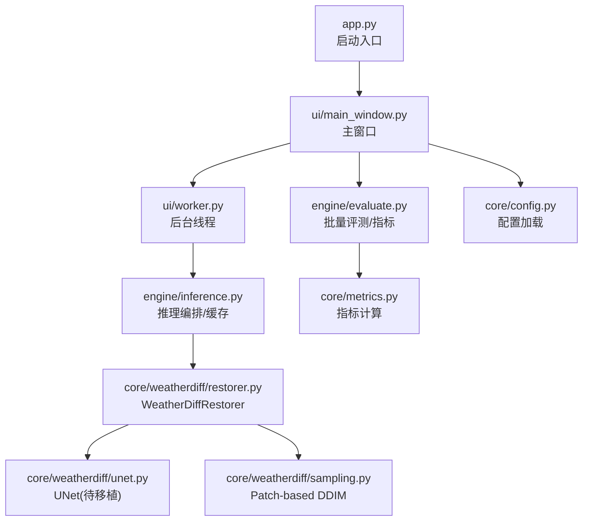
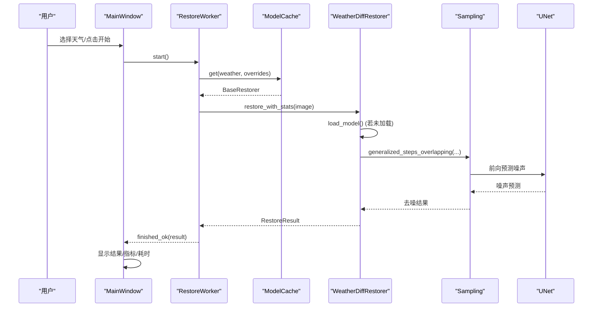
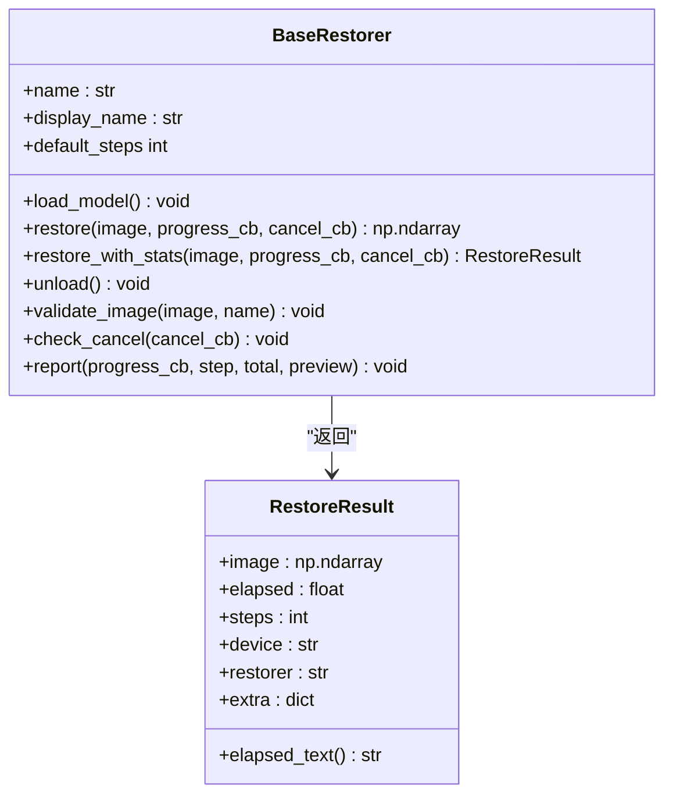
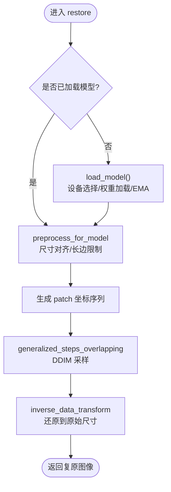
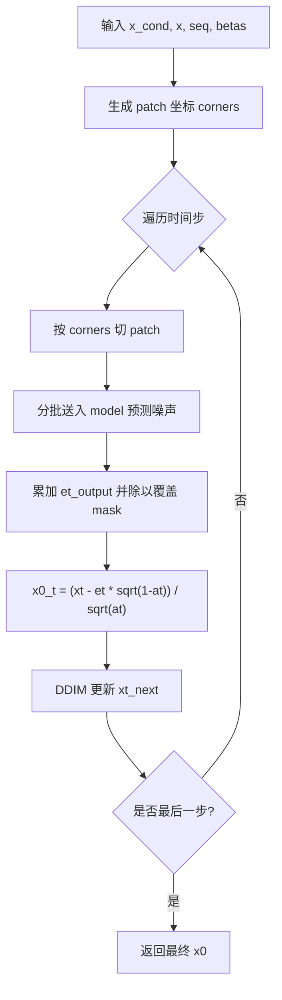
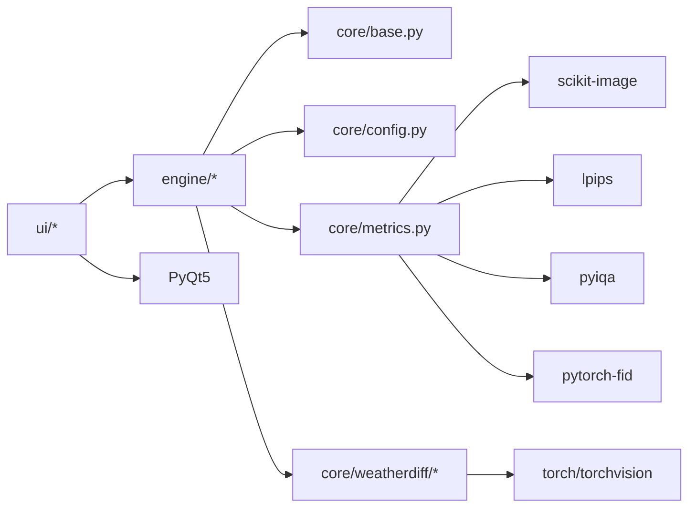

# 项目概述

<cite>
**本文引用的文件**   
- [app.py](file://app.py)
- [requirements.txt](file://requirements.txt)
- [core/base.py](file://core/base.py)
- [core/config.py](file://core/config.py)
- [core/metrics.py](file://core/metrics.py)
- [core/weatherdiff/restorer.py](file://core/weatherdiff/restorer.py)
- [core/weatherdiff/unet.py](file://core/weatherdiff/unet.py)
- [core/weatherdiff/sampling.py](file://core/weatherdiff/sampling.py)
- [engine/inference.py](file://engine/inference.py)
- [engine/evaluate.py](file://engine/evaluate.py)
- [ui/main_window.py](file://ui/main_window.py)
- [ui/worker.py](file://ui/worker.py)
- [configs/rain.yaml](file://configs/rain.yaml)
- [configs/allweather.yaml](file://configs/allweather.yaml)
</cite>

## 目录
1. [简介](#简介)
2. [项目结构](#项目结构)
3. [核心组件](#核心组件)
4. [架构总览](#架构总览)
5. [详细组件分析](#详细组件分析)
6. [依赖关系分析](#依赖关系分析)
7. [性能考量](#性能考量)
8. [故障排查指南](#故障排查指南)
9. [结论](#结论)
10. [附录](#附录)

## 简介
本项目面向“恶劣天气图像复原”任务，提供基于扩散模型的统一解决方案，支持雨、雾、雪等多种退化类型（含叠加退化）的复原与评估。系统包含：
- 图形界面（PyQt5）：单图复原、批量评测、环境自检
- 推理引擎：模型加载、缓存、批处理、进度与取消控制
- 评估系统：PSNR/SSIM/LPIPS/NIQE/BRISQUE/FID 等指标计算与导出
- 配置管理：通过 YAML 配置不同天气场景与采样参数

目标用户包括研究人员（算法对比、指标评测）、开发者（集成与二次开发）、以及需要快速体验的用户（GUI一键复原）。

## 项目结构
- app.py：应用入口，启动 PyQt5 主窗口
- core：核心逻辑
  - base.py：统一复原接口契约（BaseRestorer、RestoreResult、回调约定）
  - config.py：YAML 配置加载、路径解析、天气配置枚举
  - metrics.py：指标计算与汇总
  - weatherdiff：扩散模型复原器实现（restorer.py、unet.py、sampling.py）
- engine：推理编排与评测
  - inference.py：ModelCache、restore_file/restore_batch
  - evaluate.py：批量评测、CSV 导出、结果汇总
- ui：图形界面
  - main_window.py：主窗口与三个 Tab（单图复原、批量评测、关于/环境）
  - worker.py：后台线程（QThread），避免 UI 卡顿
- configs：各天气场景与统一模型的 YAML 配置
- weights：权重目录（需下载）
- scripts：辅助脚本（权重下载、权重校验、评测脚本、冒烟测试）

图表来源
- [app.py:19-32](file://app.py#L19-L32)
- [ui/main_window.py:499-515](file://ui/main_window.py#L499-L515)
- [ui/worker.py:32-89](file://ui/worker.py#L32-L89)
- [engine/inference.py:22-67](file://engine/inference.py#L22-L67)
- [core/weatherdiff/restorer.py:32-90](file://core/weatherdiff/restorer.py#L32-L90)
- [core/weatherdiff/unet.py:51-72](file://core/weatherdiff/unet.py#L51-L72)
- [core/weatherdiff/sampling.py:115-163](file://core/weatherdiff/sampling.py#L115-L163)
- [engine/evaluate.py:51-116](file://engine/evaluate.py#L51-L116)
- [core/metrics.py:134-177](file://core/metrics.py#L134-L177)
- [core/config.py:25-79](file://core/config.py#L25-L79)

章节来源
- [app.py:19-32](file://app.py#L19-L32)
- [requirements.txt:1-34](file://requirements.txt#L1-L34)

## 核心组件
- 统一复原接口（BaseRestorer）：定义 load_model、restore、进度/取消回调、输出尺寸一致性约束；提供带计时的 restore_with_stats 与工具方法。
- 扩散复原器（WeatherDiffRestorer）：设备选择、权重加载（兼容 DataParallel 前缀与 EMA）、预处理/后处理、patch-based DDIM 采样、显存自适应重试。
- 推理编排（ModelCache）：按配置名缓存已加载的复原器实例，避免重复加载；支持运行时覆盖采样参数。
- 批量评测（evaluate_dataset）：遍历数据集、复原、计算指标、汇总均值、导出 CSV。
- 指标模块（metrics）：有参考（PSNR/SSIM/LPIPS）、无参考（NIQE/BRISQUE）、数据集级（FID）；延迟导入第三方库，不可用时优雅降级。
- GUI（MainWindow + Worker）：单图复原（打开/拖拽、参数、预览、保存）、批量评测（目录选择、表格展示、导出）、环境自检（依赖与指标可用性）。

章节来源
- [core/base.py:61-185](file://core/base.py#L61-L185)
- [core/weatherdiff/restorer.py:32-167](file://core/weatherdiff/restorer.py#L32-L167)
- [engine/inference.py:22-67](file://engine/inference.py#L22-L67)
- [engine/evaluate.py:51-116](file://engine/evaluate.py#L51-L116)
- [core/metrics.py:134-177](file://core/metrics.py#L134-L177)
- [ui/main_window.py:61-250](file://ui/main_window.py#L61-L250)
- [ui/worker.py:32-89](file://ui/worker.py#L32-L89)

## 架构总览
系统采用分层设计：UI 层负责交互与可视化；Engine 层负责推理编排与评测；Core 层提供统一接口、扩散模型实现与指标计算；Config 层集中管理多天气场景配置。

图表来源
- [ui/main_window.py:188-240](file://ui/main_window.py#L188-L240)
- [ui/worker.py:63-89](file://ui/worker.py#L63-L89)
- [engine/inference.py:70-78](file://engine/inference.py#L70-L78)
- [core/weatherdiff/restorer.py:102-167](file://core/weatherdiff/restorer.py#L102-L167)
- [core/weatherdiff/sampling.py:115-163](file://core/weatherdiff/sampling.py#L115-L163)
- [core/weatherdiff/unet.py:51-72](file://core/weatherdiff/unet.py#L51-L72)

## 详细组件分析

### 统一复原接口与结果对象
- BaseRestorer 定义了统一的复原流程与回调约定，确保 UI 与评测对底层模型透明。
- RestoreResult 封装了图像、耗时、步数、设备、模型标识等信息，供 UI 与评测统一消费。

图表来源
- [core/base.py:45-185](file://core/base.py#L45-L185)

章节来源
- [core/base.py:61-185](file://core/base.py#L61-L185)

### 扩散复原器（WeatherDiffRestorer）
- 权重加载：自动识别设备、兼容 DataParallel 前缀、应用 EMA 权重提升效果。
- 预处理/后处理：长边限制、尺寸对齐至 16 的倍数、小图反射填充、还原到原始尺寸。
- 推理：调用 patch-based DDIM 采样，显存不足时自动降低 patch_batch_size 重试。
- 进度与取消：将中间预览转换为 RGB uint8 并上报 UI，支持用户取消。

图表来源
- [core/weatherdiff/restorer.py:102-167](file://core/weatherdiff/restorer.py#L102-L167)
- [core/weatherdiff/restorer.py:47-90](file://core/weatherdiff/restorer.py#L47-L90)

章节来源
- [core/weatherdiff/restorer.py:32-167](file://core/weatherdiff/restorer.py#L32-L167)

### 条件扩散 UNet（待移植）
- 要求类名为 DiffusionUNet，构造签名 DiffusionUNet(config)，子模块属性命名必须与官方一致。
- forward(x, t)：输入为拼接的条件 patch 与噪声 patch，输出预测噪声。
- 当前为占位骨架，需从官方仓库移植以实现完整功能。

章节来源
- [core/weatherdiff/unet.py:1-72](file://core/weatherdiff/unet.py#L1-L72)

### Patch-based DDIM 采样
- 将整图切分为重叠的小块，逐块进行去噪，再按覆盖次数平均得到整图估计。
- 提供 beta 调度、时间步压缩、数据归一化等通用函数。
- 关键函数 generalized_steps_overlapping 需实现以完成采样主循环。

图表来源
- [core/weatherdiff/sampling.py:115-163](file://core/weatherdiff/sampling.py#L115-L163)
- [core/weatherdiff/sampling.py:31-109](file://core/weatherdiff/sampling.py#L31-L109)

章节来源
- [core/weatherdiff/sampling.py:1-163](file://core/weatherdiff/sampling.py#L1-L163)

### 推理编排与缓存
- ModelCache：按配置名缓存已加载的复原器，避免重复读盘与显存占用；支持 release_others/clear 控制显存。
- restore_array/restore_file/restore_batch：统一入口，支持进度与取消回调，批量处理失败不中断整体流程。

章节来源
- [engine/inference.py:22-153](file://engine/inference.py#L22-L153)

### 批量评测与指标
- evaluate_dataset：遍历数据集、复原、计算指标、汇总均值、导出 CSV。
- metrics：支持 PSNR/SSIM/LPIPS/NIQE/BRISQUE/FID，延迟导入第三方库，不可用时优雅降级。
- write_csv/write_summary_csv：导出逐行结果与方法对比汇总表。

章节来源
- [engine/evaluate.py:24-181](file://engine/evaluate.py#L24-L181)
- [core/metrics.py:134-177](file://core/metrics.py#L134-L177)
- [core/metrics.py:196-219](file://core/metrics.py#L196-L219)

### 图形界面与后台线程
- MainWindow：三个 Tab（单图复原、批量评测、关于/环境），支持拖拽图片、参数调节、实时预览、保存结果。
- RestoreWorker/EvalWorker：在 QThread 中执行推理与评测，通过信号与 UI 解耦，支持取消与错误提示。

章节来源
- [ui/main_window.py:61-515](file://ui/main_window.py#L61-L515)
- [ui/worker.py:32-162](file://ui/worker.py#L32-L162)

## 依赖关系分析
- 技术栈
  - PyTorch/TorchVision：深度学习框架与视觉工具
  - PyQt5：图形界面
  - NumPy/Pillow/YAML：图像处理与配置
  - scikit-image：PSNR/SSIM 计算
  - LPIPS/NIQE/BRISQUE/FID：感知与无参考指标、数据集级分布度量
- 模块耦合
  - UI 仅依赖 Engine 与 Core 的抽象接口，不直接访问模型细节
  - Engine 通过 Registry 构建具体 Restorer，屏蔽差异
  - Metrics 延迟导入第三方库，保证最小依赖可运行

图表来源
- [requirements.txt:14-34](file://requirements.txt#L14-L34)
- [core/metrics.py:205-219](file://core/metrics.py#L205-L219)
- [engine/inference.py:16-20](file://engine/inference.py#L16-L20)

章节来源
- [requirements.txt:1-34](file://requirements.txt#L1-L34)
- [core/metrics.py:205-219](file://core/metrics.py#L205-L219)

## 性能考量
- 显存优化
  - patch-based 推理使显存与分辨率解耦，仅与 patch 大小和并行数量相关
  - 显存不足时自动降低 patch_batch_size 并重试
  - 使用 EMA 权重提升质量，减少重采样次数
- 采样加速
  - DDIM 时间步压缩（如 1000 步压缩为 25 步）
  - 可调 grid_r 平衡速度与质量
- 资源复用
  - ModelCache 缓存已加载模型，切换天气类型无需重复加载
  - 指标计算缓存模型（LPIPS、NIQE/BRISQUE）
- 建议
  - 合理设置 max_side 与 image_size，控制内存与速度
  - 大批量评测时关闭预览以减少开销
  - 使用 GPU 加速（CUDA 可用时自动选择）

[本节为通用指导，不直接分析具体文件]

## 故障排查指南
- 权重缺失
  - 现象：加载时报 WeightNotFoundError
  - 解决：运行权重下载脚本或手动放置权重文件，检查 configs 中的 weights.path
- 依赖缺失
  - 现象：指标不可用或界面“关于”页显示未安装
  - 解决：按 requirements.txt 安装对应依赖；最小依赖即可运行界面与假模型
- 显存不足
  - 现象：推理报 out of memory
  - 解决：降低 patch_batch_size 或 grid_r，或减小 max_side/image_size
- 设备选择
  - 强制 CPU：设置环境变量 AWR_DEVICE=cpu
  - 检测 CUDA：在“关于/环境”页查看 cuda available 与设备信息

章节来源
- [core/weatherdiff/restorer.py:47-90](file://core/weatherdiff/restorer.py#L47-L90)
- [core/base.py:41-43](file://core/base.py#L41-L43)
- [ui/main_window.py:441-496](file://ui/main_window.py#L441-L496)
- [requirements.txt:1-34](file://requirements.txt#L1-L34)

## 结论
本项目提供了完整的恶劣天气图像复原解决方案：以扩散模型为核心，支持多天气类型与叠加退化；通过 GUI 与评测系统，满足从实验到落地的全链路需求。相比传统方法，扩散模型在复杂退化下具有更强的建模能力与泛化性；结合 patch-based 推理与 EMA 权重，兼顾质量与效率。项目模块化设计便于扩展新方法与指标，适合研究、开发与教学使用。

[本节为总结性内容，不直接分析具体文件]

## 附录
- 适用场景
  - 户外监控图像增强（雨雾雪）
  - 无人机航拍图像复原
  - 车载摄像头图像增强
- 目标用户
  - 研究人员：算法对比、指标评测、消融实验
  - 开发者：系统集成、二次开发、部署优化
  - 普通用户：GUI 一键复原与结果保存
- 创新点
  - 统一多天气扩散模型（All-in-One）
  - Patch-based DDIM 采样，显存友好
  - 工程化完善：权重管理、EMA、显存自适应、进度/取消、批量评测与导出

[本节为补充信息，不直接分析具体文件]